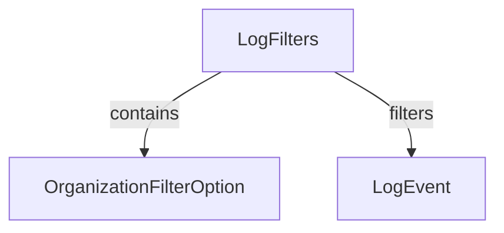

# LogFilters

## Purpose

`LogFilters` is a data transfer object (DTO) that encapsulates filter criteria for querying audit logs. It enables clients to specify which types of logs to retrieve based on tool type, event type, severity, and organization.

## Core Fields

| Field             | Type                              | Description                                      |
|-------------------|-----------------------------------|--------------------------------------------------|
| toolTypes         | List<String>                      | Types of tools to filter logs by                 |
| eventTypes        | List<String>                      | Event types to filter logs by                    |
| severities        | List<String>                      | Severity levels to filter logs by                |
| organizations     | List<OrganizationFilterOption>    | Organizations to filter logs by                  |

## Usage

- Used as input to log querying endpoints to restrict results.
- Supports multi-dimensional filtering for audit log retrieval.

## Relationships

## See Also
- [OrganizationFilterOption](OrganizationFilterOption.md)
- [LogEvent](LogEvent.md)
