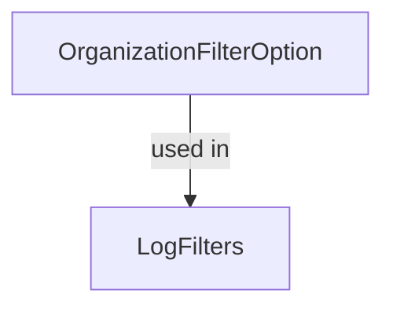

# OrganizationFilterOption

## Purpose

`OrganizationFilterOption` is a simple data transfer object (DTO) representing an organization option for filtering audit logs. It is typically used in dropdowns or selection lists for filtering logs by organization.

## Core Fields

| Field | Type   | Description                       |
|-------|--------|-----------------------------------|
| id    | String | Unique identifier for organization |
| name  | String | Human-readable name of org         |

## Usage

- Used within `LogFilters` to specify organization-based filtering.
- Supports UI components for organization selection.

## Relationships

## See Also
- [LogFilters](LogFilters.md)
