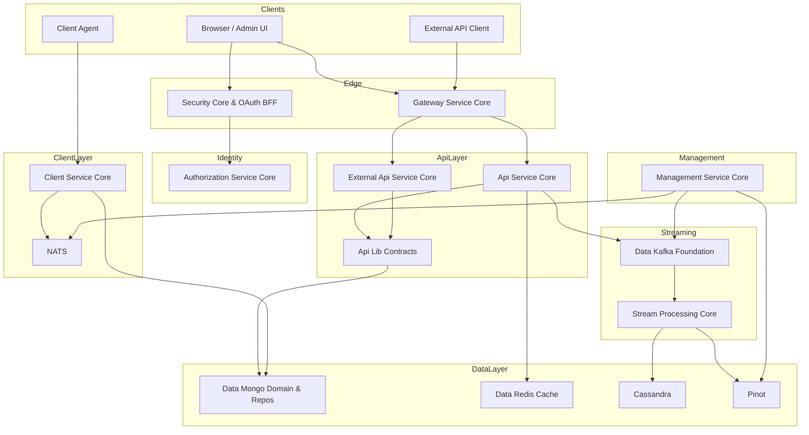
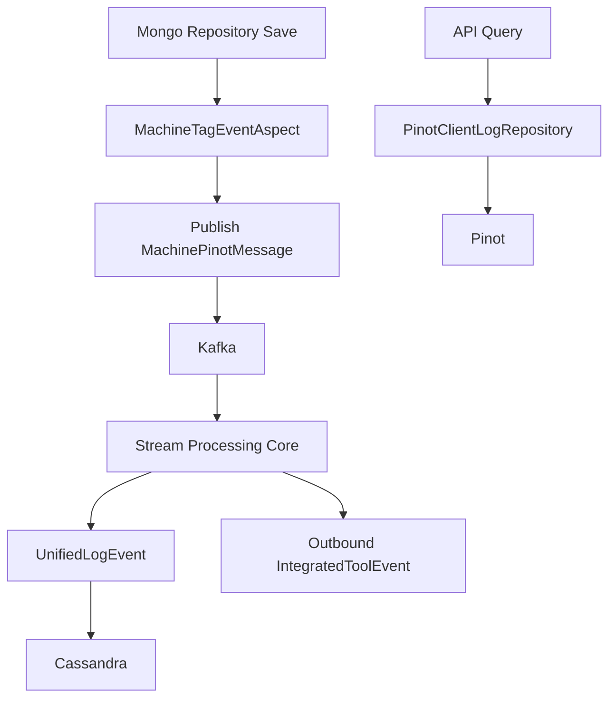
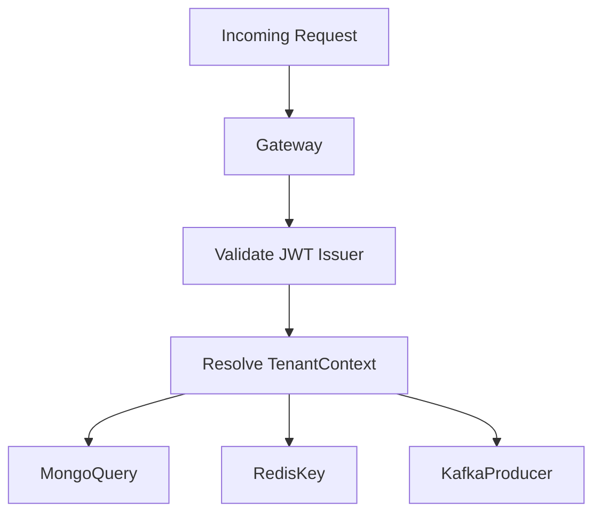

# OpenFrame OSS Lib – Repository Overview

The **openframe-oss-lib** repository contains the core backend building blocks of the OpenFrame platform. It provides a modular, multi-tenant, event-driven architecture that powers:

- ✅ Identity & Authorization (OAuth2 / OIDC)
- ✅ API orchestration (REST + GraphQL)
- ✅ Gateway security & routing
- ✅ Device & agent lifecycle management
- ✅ Streaming & real-time event processing
- ✅ Distributed data storage (Mongo, Cassandra, Pinot)
- ✅ Caching (Redis)
- ✅ Kafka-based event pipelines
- ✅ Tool integrations (Fleet MDM, Tactical RMM, MeshCentral)
- ✅ Operational bootstrapping & orchestration

It is designed as a **cleanly layered, extensible microservice foundation** for AI-driven MSP and device management platforms like OpenFrame.

---

# 1. Repository Purpose

The repository serves as:

- A **modular backend foundation** for OpenFrame
- A **multi-tenant SaaS-ready platform**
- An **event-driven architecture** for device, log, and integration data
- A **secure OAuth2-based identity system**
- A **tool-agnostic integration hub**
- A **scalable analytics pipeline** (Kafka → Stream → Cassandra/Pinot)

It separates concerns into clearly defined modules:

| Layer | Responsibility |
|-------|---------------|
| Security | OAuth2, JWT, PKCE, BFF |
| Gateway | Edge routing, JWT validation, API key enforcement |
| API Layer | REST + GraphQL orchestration |
| Domain Contracts | DTOs, filters, mappers |
| Persistence | MongoDB documents & repositories |
| Caching | Redis cache infrastructure |
| Streaming | Kafka + Kafka Streams processing |
| Analytics | Cassandra + Pinot projections |
| Management | Infrastructure bootstrap & orchestration |
| Client | Agent lifecycle & NATS integration |
| Integrations | External tool SDK contracts |
| Core Utilities | Shared pagination & validation |

---

# 2. End-to-End Architecture

Below is the full platform-level architecture implemented across modules in this repository.

---

# 3. Module Overview & Core Documentation

Below is a high-level map of all major modules in `openframe-oss-lib`.

---

## 3.1 Identity & Security

### ✅ authorization-service-core
- Multi-tenant OAuth2 Authorization Server
- Per-tenant RSA signing keys
- SSO (Google, Microsoft)
- Invitation-based onboarding
- Tenant self-registration
- JWT issuance & persistence

### ✅ security-core-and-oauth-bff
- JWT encoder/decoder configuration
- PKCE utilities
- Backend-for-Frontend (BFF) OAuth flows
- Secure HttpOnly cookie handling
- Dev ticket exchange for development

---

## 3.2 Edge & Routing

### ✅ gateway-service-core
- Reactive Spring Cloud Gateway
- Multi-issuer JWT validation
- API key enforcement
- Rate limiting
- Tool REST proxying
- WebSocket routing (tools + NATS)
- Role-based route authorization

---

## 3.3 API Orchestration

### ✅ api-service-core
- Internal REST APIs
- GraphQL (Netflix DGS)
- DataFetchers + DataLoaders
- DTO mapping
- SSO configuration management
- API key CRUD
- Force tool update operations
- Processor extension points

### ✅ external-api-service-core
- Versioned public REST API (`/api/v1/**`)
- API key–based authentication
- Filtering + sorting + cursor pagination
- Tool proxy endpoint (`/tools/{toolId}`)
- OpenAPI documentation

### ✅ api-lib-contracts
- Shared DTOs (devices, logs, events, organizations, tools)
- Filter models
- Pagination models
- Mappers
- Batch-friendly services
- Contract boundary between API and domain

---

## 3.4 Client & Agent Lifecycle

### ✅ client-service-core
- Agent authentication (`/oauth/token`)
- Agent registration
- Machine heartbeat processing
- NATS event listeners
- Tool agent ID normalization
- Tool file distribution
- Durable JetStream consumers

---

## 3.5 Persistence & Data Infrastructure

### ✅ data-mongo-domain-and-repos
- MongoDB domain documents
- Reactive + blocking repositories
- Cursor-based pagination
- Multi-tenant user storage
- OAuth client persistence
- Device, event, organization, tag models

### ✅ data-redis-cache
- Redis cache manager
- Tenant-aware key prefixing
- Reactive + blocking Redis templates
- 6-hour default TTL
- JSON serialization

### ✅ data-kafka-foundation
- Tenant-aware Kafka configuration
- Producer/consumer factory
- Topic auto-creation
- Shared message models
- Recovery handler

### ✅ data-platform-cassandra-and-pinot
- Cassandra distributed storage
- Pinot analytical queries
- Aspect-driven event publishing
- Machine tag event propagation
- Secret retrieval for integrations

---

## 3.6 Real-Time Streaming

### ✅ stream-processing-core
- Kafka listeners
- Tool-specific deserializers
- Unified event normalization
- Kafka Streams joins (5s window)
- Cassandra log persistence
- Outbound Kafka publishing
- Timestamp parsing & enrichment

---

## 3.7 Platform Orchestration

### ✅ management-service-core
- Pinot schema/table deployment
- Debezium connector initialization
- NATS stream provisioning
- Agent version publishing
- Distributed schedulers (ShedLock + Redis)
- Tool lifecycle management

---

## 3.8 Tool SDKs

### ✅ integrations-sdks
- Fleet MDM models
- Tactical RMM models
- Query result wrappers
- Registration secret parsing
- Strict external contract modeling

---

## 3.9 Core Utilities

### ✅ core-shared-utilities
- `PageResponse<T>`
- Slug generation
- Email validation

---

# 4. Data & Event Flow (Operational → Analytics)

Below is the canonical data pipeline across modules.

This ensures:

- Operational writes → Mongo
- Snapshot propagation → Kafka
- Real-time normalization → Stream Processing
- Durable storage → Cassandra
- Analytical queries → Pinot
- Unified filtering → API layer

---

# 5. Multi-Tenant Model

Multi-tenancy is enforced at multiple layers:

- ✅ Tenant-aware JWT issuer validation
- ✅ Per-tenant RSA signing keys
- ✅ Mongo compound unique indexes (`tenantId + email`)
- ✅ Redis key prefixing
- ✅ Kafka topic configuration
- ✅ Cassandra keyspace normalization
- ✅ JWT `tenant_id` claim propagation

---

# 6. Design Characteristics

The repository follows these architectural principles:

1. Clean separation of layers
2. Contract-first API design
3. Event-driven architecture
4. Multi-tenant safety by default
5. Cursor-based pagination
6. Distributed scheduling with Redis locks
7. Pluggable processor extension points
8. Reactive edge + blocking domain flexibility
9. Tool-agnostic integration normalization
10. Infrastructure self-healing (Debezium, NATS, Pinot bootstrapping)

---

# 7. Summary

The **openframe-oss-lib** repository is the foundational backend architecture of OpenFrame.

It provides:

- 🔐 Enterprise-grade OAuth2 security
- 🚪 Reactive gateway enforcement
- 🧠 GraphQL + REST orchestration
- 🖥 Device & agent lifecycle management
- 📡 Event-driven streaming pipelines
- 🗄 Distributed operational + analytical storage
- 🧰 Tool integration SDK contracts
- ⚙ Platform bootstrapping & orchestration
- 🧩 Modular, extensible design

Together, these modules form a **scalable, multi-tenant, event-driven platform core** suitable for AI-powered MSP platforms and modern infrastructure management systems.