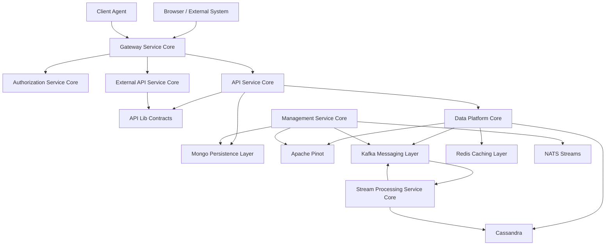
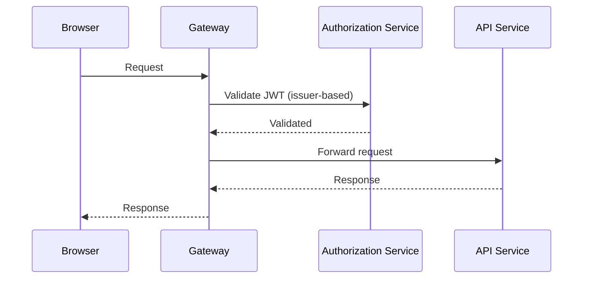
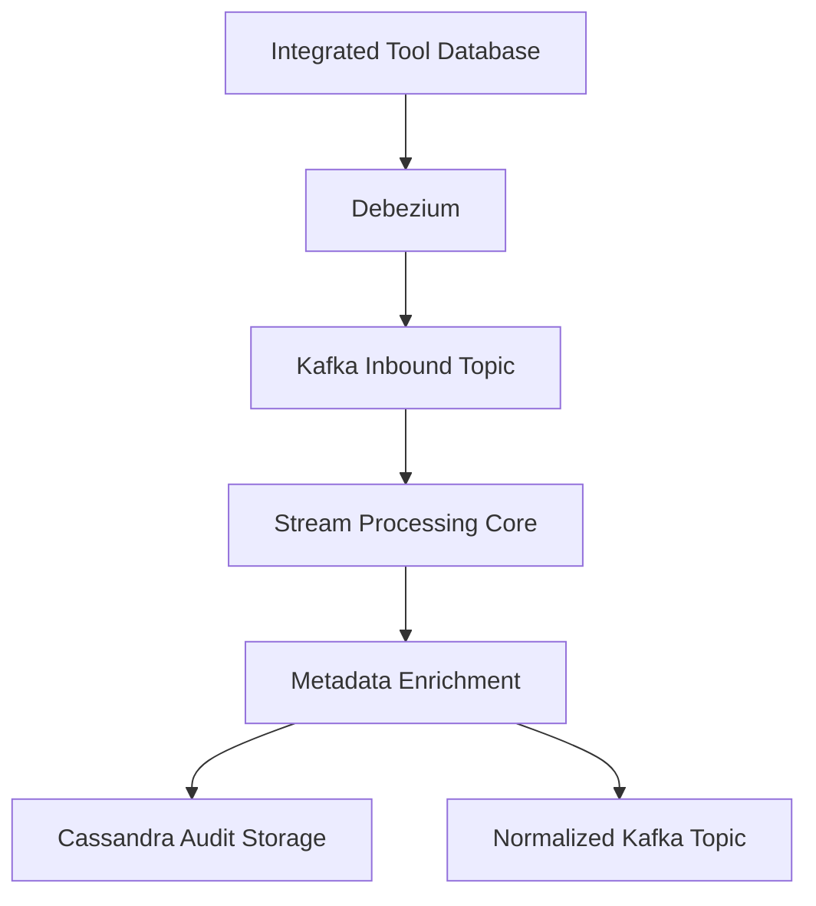
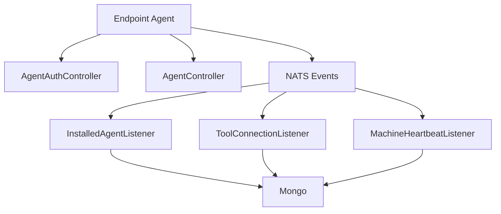
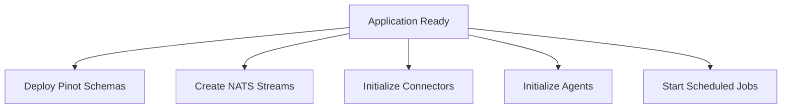
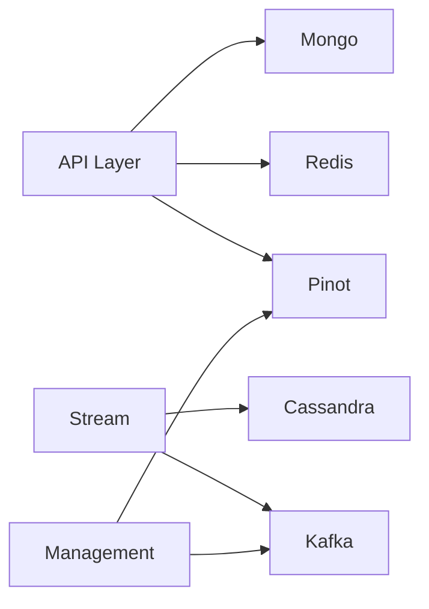

# OpenFrame OSS Lib – Repository Overview

The **`openframe-oss-lib`** repository is the core backend foundation of the OpenFrame platform. It provides all shared libraries and service cores required to run a multi-tenant, event-driven, AI-ready MSP infrastructure.

It includes:

- API contracts and DTOs
- REST + GraphQL API layers
- Multi-tenant OAuth2 Authorization Server
- Reactive Gateway
- Mongo, Cassandra, Pinot, Redis infrastructure layers
- Kafka messaging backbone
- Stream processing engine
- Client agent orchestration
- External integration APIs
- Cluster management and automation services

This repository forms the **backend runtime stack** for OpenFrame and OpenFrame-powered MSP deployments.

---

# 1. High-Level Architecture

At a system level, `openframe-oss-lib` implements a layered, event-driven, multi-tenant architecture.

### Architectural Characteristics

- ✅ Multi-tenant by design  
- ✅ OAuth2 + OIDC compliant  
- ✅ Reactive edge gateway  
- ✅ Event-driven (Kafka + Debezium)  
- ✅ Real-time enrichment via Stream Processing  
- ✅ Analytical storage (Pinot + Cassandra)  
- ✅ Redis-backed distributed locking  
- ✅ Modular service-core architecture  

---

# 2. Repository Structure

The repository is organized into **service-core and infrastructure modules**, each with a clearly defined responsibility.

## Core API & Contracts

| Module | Purpose |
|--------|----------|
| `api-lib-contracts-and-services` | Shared DTOs, filters, mappers, reusable services |
| `api-service-core-controllers-and-graphql` | REST + GraphQL API orchestration |

---

## Security & Identity

| Module | Purpose |
|--------|----------|
| `authorization-service-core` | Multi-tenant OAuth2 / OIDC Authorization Server |
| `security-core-and-oauth-bff` | JWT infrastructure + OAuth BFF flow |
| `gateway-service-core` | Reactive edge gateway with JWT + API key auth |

---

## Data & Infrastructure

| Module | Purpose |
|--------|----------|
| `mongo-persistence-layer` | Mongo document models + repositories |
| `data-platform-core` | Cassandra + Pinot configuration + analytics repos |
| `kafka-messaging-layer` | Multi-tenant Kafka infrastructure |
| `redis-caching-layer` | Redis caching + tenant-aware key management |

---

## Event & Stream Processing

| Module | Purpose |
|--------|----------|
| `stream-processing-service-core` | CDC ingestion, enrichment, normalization |
| `management-service-core` | Connector automation, Pinot deployment, scheduled jobs |

---

## Agent & External Integration

| Module | Purpose |
|--------|----------|
| `client-agent-service-core` | Agent registration + lifecycle + NATS listeners |
| `external-api-service-core` | Stable REST API for external integrations |

---

# 3. End-to-End Identity Flow

Authentication and authorization are centralized and tenant-aware.

### Key Components

- `authorization-service-core` → Issues per-tenant RSA-signed JWTs  
- `security-core-and-oauth-bff` → Handles PKCE + cookie-based login  
- `gateway-service-core` → Multi-issuer JWT validation  
- `mongo-persistence-layer` → Stores users, OAuth clients, tokens  

---

# 4. End-to-End Event Processing Flow

Integrated tools emit CDC events that are normalized and enriched.

### Key Modules

- `kafka-messaging-layer` → Producer/consumer infrastructure  
- `stream-processing-service-core` → Deserialization + normalization  
- `data-platform-core` → Analytical query repos  
- `mongo-persistence-layer` → Machine & organization metadata  

---

# 5. Agent Lifecycle Architecture

Client agents integrate via HTTP and NATS.

### Key Module

`client-agent-service-core`

Responsibilities:

- OAuth-based agent auth
- Machine registration
- Tool ID normalization
- NATS event processing
- Heartbeat tracking

---

# 6. Infrastructure Automation & Control Plane

The Management Service Core ensures the system is self-initializing.

### Key Responsibilities

- Pinot schema deployment
- Debezium connector orchestration
- Tool post-save hooks
- Version update propagation
- Distributed scheduled jobs (Redis + ShedLock)

Module: `management-service-core`

---

# 7. Data Platform Layering

### Storage Responsibilities

- **Mongo** → Operational data  
- **Cassandra** → Time-series audit logs  
- **Pinot** → Analytical queries  
- **Redis** → Caching + distributed locks  
- **Kafka** → Event backbone  

---

# 8. Core Module Documentation References

Below are the core modules and their documentation anchors within the repository:

- `api-lib-contracts-and-services` → DTOs, filters, shared services
- `api-service-core-controllers-and-graphql` → REST + GraphQL layer
- `authorization-service-core` → OAuth2 + OIDC multi-tenant IdP
- `client-agent-service-core` → Agent lifecycle + NATS ingestion
- `data-platform-core` → Cassandra, Pinot, analytics repos
- `mongo-persistence-layer` → Documents + repositories
- `kafka-messaging-layer` → Kafka infra + CDC models
- `redis-caching-layer` → Cache manager + tenant keys
- `security-core-and-oauth-bff` → JWT infra + OAuth BFF
- `gateway-service-core` → Reactive ingress + API key auth
- `external-api-service-core` → Stable REST integration layer
- `management-service-core` → Cluster automation
- `stream-processing-service-core` → Event normalization engine

Each module is self-contained, dependency-scoped, and designed for reuse across OpenFrame deployments.

---

# 9. Design Principles of openframe-oss-lib

1. **Modular Service-Core Architecture**  
   Each domain capability lives in a dedicated service module.

2. **Multi-Tenant First**  
   Tenant isolation enforced at:
   - JWT issuer level
   - Database layer
   - Cache key prefixing
   - Kafka application IDs

3. **Event-Driven by Default**  
   Kafka + Debezium power asynchronous processing.

4. **Analytics-Optimized**  
   Pinot + Cassandra separate operational and analytical workloads.

5. **Reactive Edge**  
   Gateway built on Spring WebFlux for high throughput.

6. **Self-Healing Infrastructure**  
   Management service automates connectors, schemas, streams.

---

# 10. Summary

The **`openframe-oss-lib`** repository is the complete backend foundation of the OpenFrame ecosystem.

It provides:

- Secure multi-tenant identity infrastructure  
- Reactive gateway ingress  
- REST + GraphQL API orchestration  
- Real-time CDC stream processing  
- Scalable analytics storage  
- Agent lifecycle orchestration  
- Infrastructure automation and control plane  
- Kafka-driven event backbone  

Together, these modules implement a production-grade, horizontally scalable, event-driven MSP backend platform.

---

**End of Overview – openframe-oss-lib**