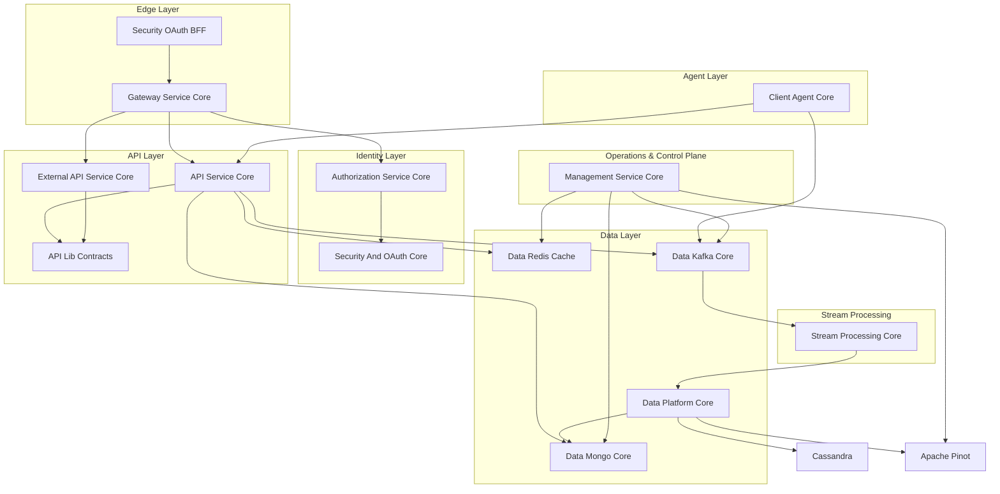
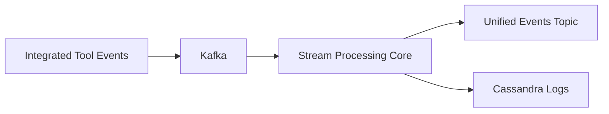
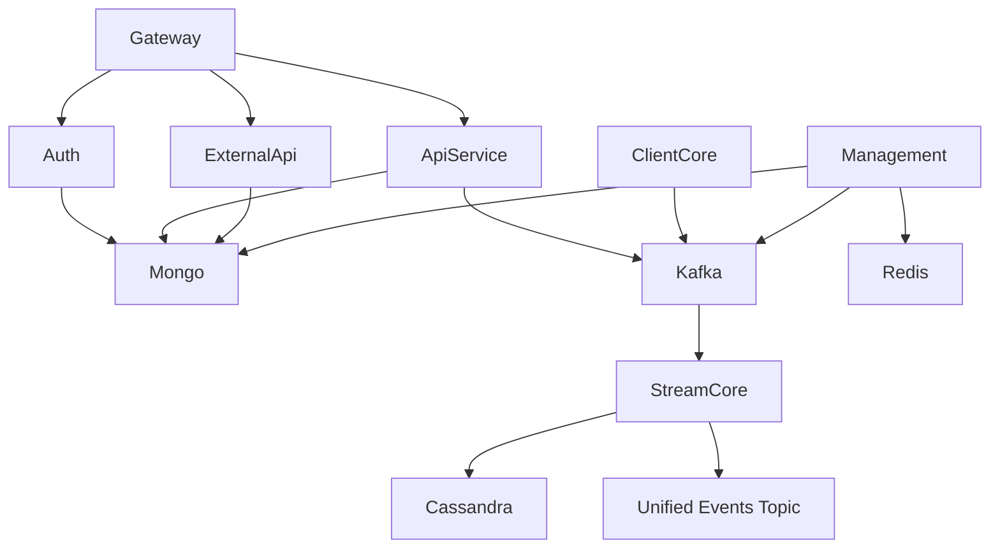

# OpenFrame OSS Lib – Repository Overview

The **`openframe-oss-lib`** repository is the modular, open-source foundation of the OpenFrame platform. It contains the core libraries and services that power:

- Multi-tenant authentication and authorization
- API orchestration (GraphQL + REST)
- Machine agent lifecycle management
- Event streaming and enrichment
- Data persistence (MongoDB, Cassandra)
- Analytics (Apache Pinot)
- Distributed caching (Redis)
- Infrastructure orchestration (Debezium, NATS, Kafka)

It is designed as a **microservice-ready, event-driven, multi-tenant architecture** optimized for scalable MSP (Managed Service Provider) environments.

---

# Repository Structure

The repository is organized into modular cores, each responsible for a distinct platform layer:

```text
openframe-oss-lib
├── api-lib-contracts
├── api-service-core
├── authorization-service-core
├── client-agent-core
├── core-utilities
├── data-kafka-core
├── data-mongo-core
├── data-redis-cache
├── data-platform-core
├── external-api-service-core
├── gateway-service-core
├── management-service-core
├── security-and-oauth-core
├── security-oauth-bff
└── stream-processing-core
```

Each module is independently reusable but designed to interoperate within a unified OpenFrame deployment.

---

# End-to-End Architecture

The repository implements a layered, event-driven system:



---

# Architectural Layers Explained

## 1️⃣ Edge & Security Layer

### `gateway-service-core`
- Reactive Spring Cloud Gateway
- Multi-tenant JWT validation
- API key enforcement + rate limiting
- WebSocket proxy for tools and agents
- Token propagation & header normalization

### `security-oauth-bff`
- OAuth2 Authorization Code + PKCE orchestration
- Cookie-based token management
- CSRF-safe state handling
- Token refresh & revocation

### `authorization-service-core`
- Multi-tenant OAuth2 Authorization Server
- OIDC support
- Per-tenant RSA key management
- SSO (Google, Microsoft)
- Invitation & tenant onboarding

### `security-and-oauth-core`
- JWT encoder/decoder infrastructure
- RSA key loading
- PKCE utilities
- OAuth constants

---

## 2️⃣ API Layer

### `api-lib-contracts`
Shared DTOs, filters, pagination models, mappers, and reusable service abstractions.

Defines:
- Device filters
- Log filters
- Tool filters
- Organization models
- Cursor-based pagination
- Shared mapping logic

### `api-service-core`
Internal GraphQL + REST API layer:
- Device management
- User management
- SSO configuration
- API key management
- Force tool updates
- Cursor-based GraphQL connections

### `external-api-service-core`
Public API key–secured REST API:
- `/api/v1/devices`
- `/api/v1/events`
- `/api/v1/logs`
- `/api/v1/organizations`
- Tool proxy endpoints

---

## 3️⃣ Agent Layer

### `client-agent-core`
Handles machine-level agents:
- Agent registration
- OAuth token issuance for agents
- Heartbeat processing
- Tool installation tracking
- NATS event listeners
- Tool-specific ID transformation

This module connects deployed agents to the backend.

---

## 4️⃣ Data Layer

### `data-mongo-core`
Primary operational persistence:
- Users
- Organizations
- Devices
- Events
- OAuth clients & tokens
- SSO configuration
- Custom MongoTemplate repositories
- Cursor-based pagination

### `data-redis-cache`
- Distributed cache layer
- Tenant-aware key prefixing
- Reactive + blocking Redis templates
- Spring Cache integration

### `data-kafka-core`
- Tenant-aware Kafka configuration
- Topic auto-registration
- Debezium message models
- Structured recovery handling

### `data-platform-core`
Data orchestration layer:
- Apache Pinot integration
- Cassandra configuration
- Tool SDK integration
- Kafka propagation
- Repository event interception (AOP)
- Secret retrieval for tool integrations

---

## 5️⃣ Stream Processing

### `stream-processing-core`
Real-time event transformation engine:

- Kafka listeners
- Tool-specific deserializers
- Event type normalization
- Redis-backed enrichment
- Debezium CRUD handling
- Kafka Streams topology
- Cassandra log persistence



---

## 6️⃣ Operations & Control Plane

### `management-service-core`
Cluster orchestration and runtime control:

- Pinot schema deployment
- Debezium connector initialization
- NATS stream creation
- Agent version propagation
- API key stat synchronization
- Distributed scheduled jobs via ShedLock

---

# Cross-Module Dependency Model



---

# Core Design Principles

✅ Multi-tenant by design  
✅ Event-driven architecture  
✅ Cursor-based pagination (no offset paging)  
✅ Asymmetric JWT cryptography (RS256)  
✅ Tool-agnostic event normalization  
✅ Infrastructure auto-bootstrap  
✅ Reactive edge gateway  
✅ Clear separation of concerns  

---

# Module Documentation References

| Module | Purpose |
|--------|----------|
| api-lib-contracts | Shared DTOs, filters, mappers |
| api-service-core | Internal GraphQL + REST APIs |
| external-api-service-core | Public API key REST API |
| authorization-service-core | Multi-tenant OAuth2 server |
| security-and-oauth-core | JWT + PKCE infrastructure |
| security-oauth-bff | OAuth BFF layer |
| gateway-service-core | Reactive edge gateway |
| client-agent-core | Agent lifecycle management |
| data-mongo-core | MongoDB persistence |
| data-redis-cache | Redis caching |
| data-kafka-core | Kafka infrastructure |
| data-platform-core | Pinot + Cassandra orchestration |
| stream-processing-core | Event ingestion & enrichment |
| management-service-core | Infrastructure control plane |
| core-utilities | Shared utilities |

Each module contains detailed internal documentation describing:
- Configuration
- Core components
- Architectural diagrams
- Extension points
- Integration boundaries

---

# Summary

`openframe-oss-lib` is a **full-stack, multi-tenant, event-driven backend foundation** for the OpenFrame platform.

It provides:

- Secure identity & OAuth infrastructure  
- Reactive API gateway  
- Internal & external API surfaces  
- Agent lifecycle management  
- Real-time stream processing  
- Analytical data pipelines  
- Distributed caching  
- Infrastructure auto-bootstrapping  
- Control-plane orchestration  

Together, these modules form a scalable, production-grade backbone for AI-powered MSP platforms and modern IT automation systems.