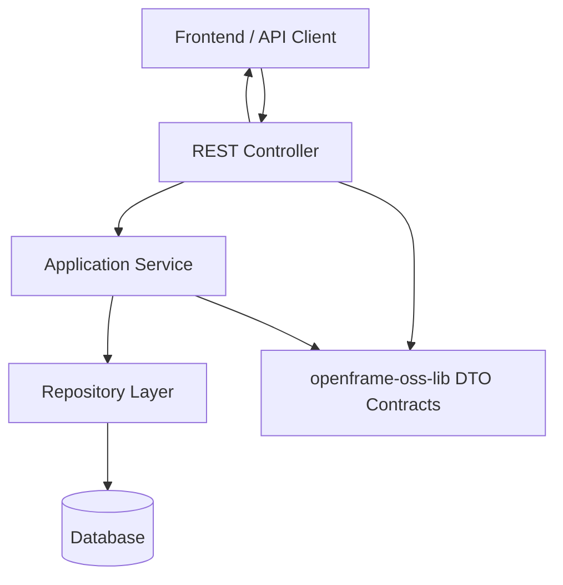
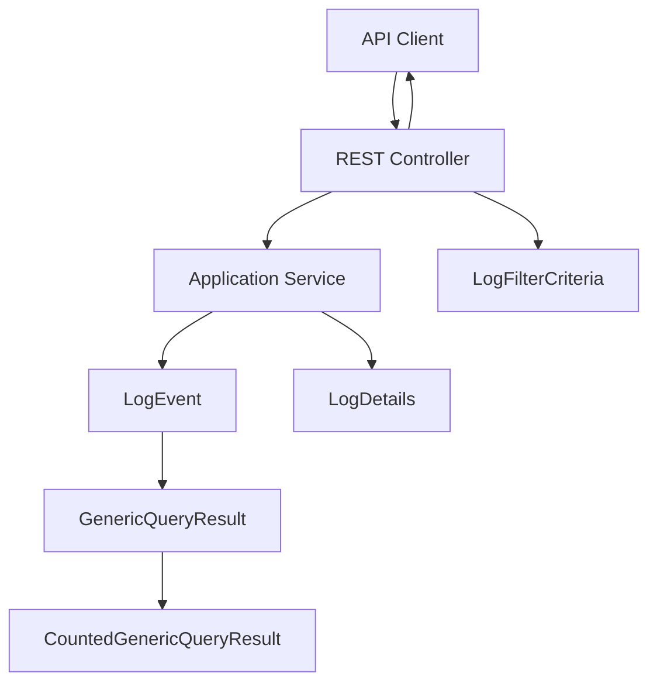
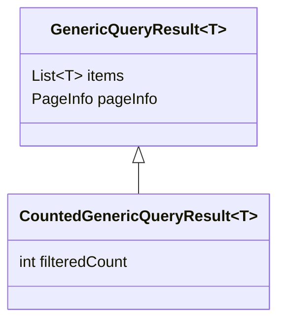
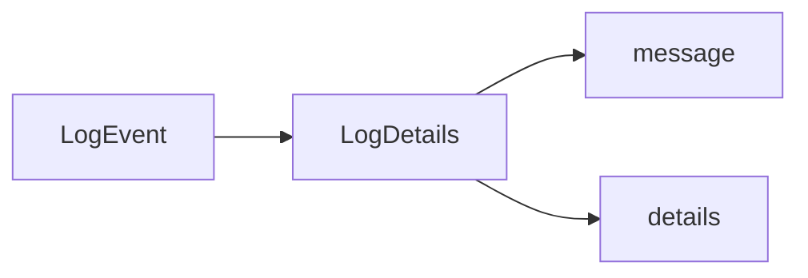
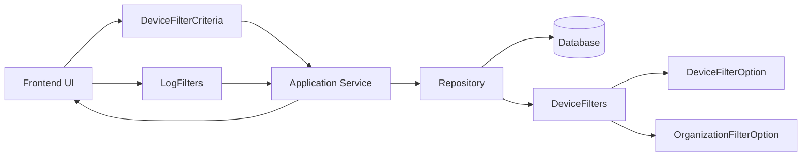
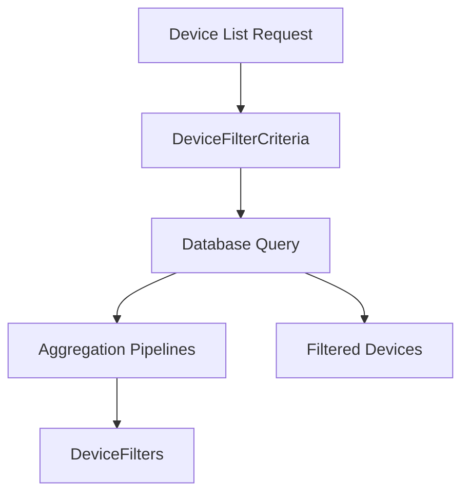
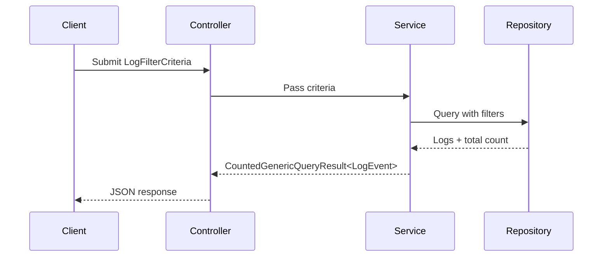

# openframe-oss-lib

## Overview

`openframe-oss-lib` is the **core API DTO library** of the OpenFrame ecosystem. It defines the standardized data contracts used across services in the Flamingo / OpenFrame stack.

The repository provides:

- ✅ Generic paginated query result wrappers  
- ✅ Count-aware result containers  
- ✅ Audit log summary and detail models  
- ✅ Structured filtering contracts for logs and devices  
- ✅ Faceted filtering option models with counts  

It acts as a **shared contract layer** between:

- REST controllers  
- Service layers  
- Repositories  
- Frontend clients  
- Audit and monitoring subsystems  

The library contains **no business logic** and **no persistence logic**. It strictly defines structured DTOs to ensure consistency across services.

---

# Repository Structure

```text
openframe-oss-lib
└── openframe-api-lib
    └── src/main/java/com/openframe/api/dto
        ├── CountedGenericQueryResult
        ├── GenericQueryResult
        ├── audit
        │   ├── LogDetails
        │   ├── LogEvent
        │   ├── LogFilterCriteria
        │   ├── LogFilters
        │   └── OrganizationFilterOption
        └── device
            ├── DeviceFilterCriteria
            ├── DeviceFilterOption
            └── DeviceFilters
```

The repository is logically divided into:

- **Module 1** → Core query wrappers + audit log DTOs  
- **Module 2** → Filtering DTOs and faceted filtering models  

---

# End-to-End Architecture

`openframe-oss-lib` sits in the **API Contract Layer** between controllers and services.

## High-Level Layered Architecture


```mermaid
flowchart TD
    Client["Frontend / API Client"]
    Controller["REST Controller"]
    Service["Application Service"]
    Repository["Repository Layer"]
    Database[("Database")]

    DTOs["openframe-oss-lib DTO Contracts"]

    Client --> Controller
    Controller --> DTOs
    Controller --> Service
    Service --> Repository
    Repository --> Database
    Service --> DTOs
    Controller --> Client
```

### Architectural Role

- Controllers deserialize request JSON into DTOs
- Services use filter DTOs to build queries
- Results are wrapped using generic result containers
- Responses are serialized back to JSON
- Frontend relies on consistent DTO structures

---

# Module Overview

---

# Module 1 – Core Query & Audit DTOs

## Purpose

Module 1 defines foundational DTOs for:

- Generic paginated query responses
- Count-aware result sets
- Audit log summaries
- Audit log details
- Log filtering criteria

It standardizes how results and logs are represented across services.

---

## Module 1 Architecture


```mermaid
flowchart TD
    Client["API Client"]
    Controller["REST Controller"]
    Service["Application Service"]

    Criteria["LogFilterCriteria"]
    Event["LogEvent"]
    Details["LogDetails"]
    Result["GenericQueryResult<T>"]
    Counted["CountedGenericQueryResult<T>"]

    Client --> Controller
    Controller --> Criteria
    Controller --> Service
    Service --> Event
    Service --> Details
    Event --> Result
    Result --> Counted
    Controller --> Client
```

---

## Core Components (Module 1)

### 1. GenericQueryResult<T>

- Wraps `List<T>`
- Includes pagination metadata
- Used across all list endpoints

### 2. CountedGenericQueryResult<T>

- Extends `GenericQueryResult<T>`
- Adds `filteredCount`
- Used for filtered search APIs


```mermaid
classDiagram
    class GenericQueryResult~T~ {
        List~T~ items
        PageInfo pageInfo
    }

    class CountedGenericQueryResult~T~ {
        int filteredCount
    }

    GenericQueryResult <|-- CountedGenericQueryResult
```

---

### 3. LogEvent

Lightweight log summary optimized for:

- Search results
- Timeline views
- High-volume pagination

---

### 4. LogDetails

Expanded log representation containing:

- Full message
- Additional metadata
- Extended context


```mermaid
flowchart LR
    Summary["LogEvent"] --> Detail["LogDetails"]
    Detail --> Message["message"]
    Detail --> Extra["details"]
```

---

### 5. LogFilterCriteria

Defines structured log filtering options:

- Date ranges
- Event types
- Tool types
- Severity
- Organization scope
- Device scope

Used as request input for log search endpoints.

---

# Module 2 – Filtering & Faceted Search DTOs

## Purpose

Module 2 defines the filtering backbone for:

- Audit logs
- Managed devices

It separates:

- ✅ Filter criteria (input DTOs)
- ✅ Filter options (output DTOs with counts)

---

## Module 2 Architecture


```mermaid
flowchart LR
    UI["Frontend UI"]

    DeviceCriteria["DeviceFilterCriteria"]
    LogFilters["LogFilters"]

    Service["Application Service"]
    Repo["Repository"]
    DB[("Database")]

    DeviceFilters["DeviceFilters"]
    DeviceOption["DeviceFilterOption"]
    OrgOption["OrganizationFilterOption"]

    UI --> DeviceCriteria
    UI --> LogFilters

    DeviceCriteria --> Service
    LogFilters --> Service

    Service --> Repo
    Repo --> DB

    Repo --> DeviceFilters
    DeviceFilters --> DeviceOption
    DeviceFilters --> OrgOption

    Service --> UI
```

---

## Core Components (Module 2)

### 1. LogFilters

Defines multi-value filtering for audit logs:

- Tool types
- Event types
- Severities
- Organizations

Extends filtering capabilities introduced in Module 1.

---

### 2. OrganizationFilterOption

Represents:

- Organization ID
- Organization name

Optimized for UI dropdown rendering without additional lookups.

---

### 3. DeviceFilterCriteria

Defines filtering constraints for device queries:

- DeviceStatus (enum)
- DeviceType (enum)
- OS types
- Organization IDs
- Tag keys
- Tag values

Enables composable, type-safe filtering.

---

### 4. DeviceFilterOption

Represents a single filter bucket:

- `value`
- `label`
- `count`

Used for faceted filtering interfaces.

---

### 5. DeviceFilters

Aggregated filter response containing:

- Status buckets
- Device type buckets
- OS buckets
- Organization buckets
- Tag buckets
- `filteredCount`

Supports real-time faceted search.

---

## Faceted Filtering Flow


```mermaid
flowchart TD
    Request["Device List Request"]
    Criteria["DeviceFilterCriteria"]
    Query["Database Query"]
    Aggregation["Aggregation Pipelines"]
    Devices["Filtered Devices"]
    Filters["DeviceFilters"]

    Request --> Criteria
    Criteria --> Query
    Query --> Devices
    Query --> Aggregation
    Aggregation --> Filters
```

This enables:

- Dynamic filter recalculation
- Dashboard-style filtering
- Efficient server-side aggregation

---

# End-to-End Example: Filtered Log Search


```mermaid
sequenceDiagram
    participant Client
    participant Controller
    participant Service
    participant Repository

    Client->>Controller: Submit LogFilterCriteria
    Controller->>Service: Pass criteria
    Service->>Repository: Query with filters
    Repository-->>Service: Logs + total count
    Service-->>Controller: CountedGenericQueryResult<LogEvent>
    Controller-->>Client: JSON response
```

---

# Design Principles

## 1. Pure DTO Layer

- No business logic  
- No persistence logic  
- No framework coupling  

## 2. Generic Reusability

`GenericQueryResult<T>` ensures reusable pagination patterns across domains.

## 3. Summary vs Detail Separation

- `LogEvent` for lists
- `LogDetails` for deep inspection

Improves performance and reduces payload size.

## 4. Faceted Search Pattern

Module 2 enables:

- Multi-dimensional filtering
- Aggregated counts
- UI-aligned filter structures

## 5. Strong Typing

- Enum-based device filtering
- Structured organization filtering
- Explicit separation of criteria vs options

---

# Core Module Documentation References

- **Module 1** → Core Query & Audit DTOs  
  - `GenericQueryResult`
  - `CountedGenericQueryResult`
  - `LogEvent`
  - `LogDetails`
  - `LogFilterCriteria`

- **Module 2** → Filtering & Faceted Search DTOs  
  - `LogFilters`
  - `OrganizationFilterOption`
  - `DeviceFilterCriteria`
  - `DeviceFilterOption`
  - `DeviceFilters`

Module 2 builds directly on the result-wrapping structures defined in Module 1.

---

# Summary

`openframe-oss-lib` is the **contract foundation** of the OpenFrame platform.

It provides:

- Standardized query result wrappers
- Audit log modeling
- Strongly-typed filtering contracts
- Faceted filter option modeling
- Consistent API response structures

By centralizing DTO definitions in a dedicated repository, OpenFrame ensures:

- Clean API boundaries  
- Cross-service consistency  
- Reusable filtering architecture  
- Scalable contract evolution  

This repository forms the **structural backbone of the OpenFrame API layer**.