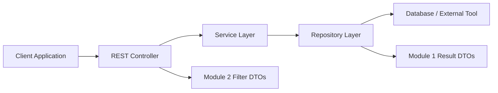
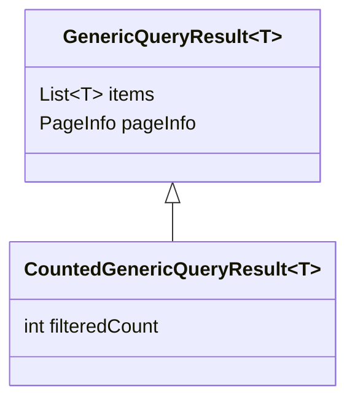
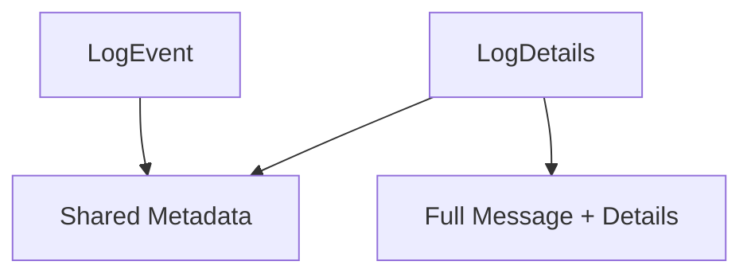
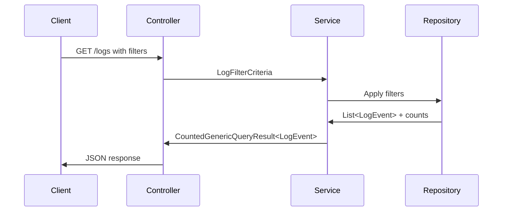
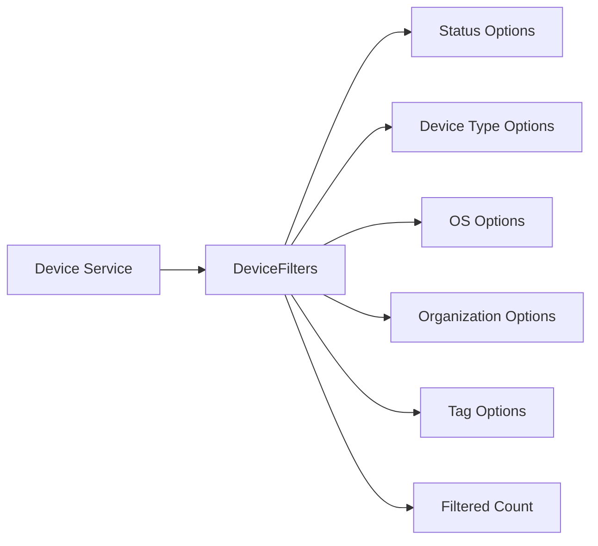
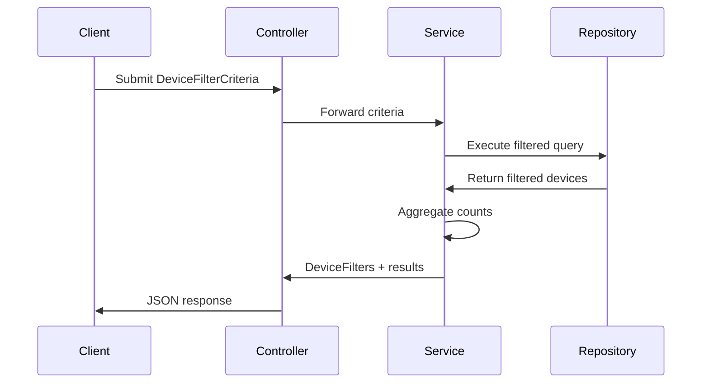
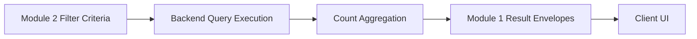

# openframe-oss-lib

## Purpose

`openframe-oss-lib` is the foundational **API contract library** for the OpenFrame ecosystem. It defines reusable, type-safe Data Transfer Objects (DTOs) that standardize:

- ✅ Paginated query responses  
- ✅ Count-aware result envelopes  
- ✅ Audit log event modeling  
- ✅ Log filtering and faceted search  
- ✅ Device filtering and metadata-driven queries  

This repository does **not** contain business logic, persistence, or controllers.  
Instead, it provides the shared **API schema layer** consumed by backend services, REST controllers, and client applications across OpenFrame and Flamingo.

It ensures:

- Consistent API response structures  
- Strong typing across modules  
- UI-friendly filtering contracts  
- Multi-tenant awareness  

---

# Repository Structure

```text
openframe-oss-lib
└── openframe-api-lib
    └── src/main/java/com/openframe/api/dto
        ├── GenericQueryResult
        ├── CountedGenericQueryResult
        ├── audit
        │   ├── LogEvent
        │   ├── LogDetails
        │   ├── LogFilterCriteria
        │   ├── LogFilters
        │   └── OrganizationFilterOption
        └── device
            ├── DeviceFilterCriteria
            ├── DeviceFilterOption
            └── DeviceFilters
```

The repository is organized into two conceptual modules:

- **Module 1 → Query & Audit Result Modeling**
- **Module 2 → Filtering & Faceted Search Modeling**

---

# End-to-End Architecture

At a system level, `openframe-oss-lib` sits between API consumers and backend services, defining the shared DTO contracts.


```mermaid
flowchart LR
    Client["Client Application"] --> Controller["REST Controller"]
    Controller --> Service["Service Layer"]
    Service --> Repository["Repository Layer"]
    Repository --> DataStore["Database / External Tool"]

    Repository --> Results["Module 1 Result DTOs"]
    Controller --> Filters["Module 2 Filter DTOs"]
```

### Responsibility Boundaries

| Layer | Responsibility |
|-------|---------------|
| Module 2 | Defines filtering input & filter metadata |
| Service Layer | Executes filtered queries |
| Module 1 | Defines structured query responses |
| Client | Renders results and faceted filters |

---

# Module 1 – Query & Audit Result Modeling

📄 Documentation: `module_1/module_1.md`

Module 1 defines the **canonical query response envelopes** and **audit log data models**.

## Core Components

### 1. GenericQueryResult<T>

Reusable paginated response wrapper.

```java
public class GenericQueryResult<T> {
    private List<T> items;
    private PageInfo pageInfo;
}
```

**Purpose:**

- Standardizes paginated responses
- Enforces consistent API structure
- Provides type-safe generic results

---

### 2. CountedGenericQueryResult<T>

Extends `GenericQueryResult<T>` with a `filteredCount`.


```mermaid
classDiagram
    class GenericQueryResult~T~ {
        List~T~ items
        PageInfo pageInfo
    }

    class CountedGenericQueryResult~T~ {
        int filteredCount
    }

    GenericQueryResult <|-- CountedGenericQueryResult
```

Used for:

- Faceted search
- Dashboard analytics
- Advanced filtering UIs

---

### 3. LogEvent

Lightweight audit log representation for list views.

Contains:

- Event metadata
- Severity
- Organization context
- Summary
- Timestamp

Optimized for performance in large log queries.

---

### 4. LogDetails

Full audit record representation.


```mermaid
flowchart TD
    LogEventNode["LogEvent"] --> Shared["Shared Metadata"]
    LogDetailsNode["LogDetails"] --> Shared
    LogDetailsNode --> Extra["Full Message + Details"]
```

Used in detail endpoints such as:

- `GET /logs`
- `GET /logs/{id}`

---

### 5. LogFilterCriteria

Encapsulates filtering constraints for audit log queries.

Supports:

- Date ranges
- Event types
- Tool types
- Severities
- Organization scoping
- Device-specific filtering

---

## Module 1 – Audit Query Lifecycle


```mermaid
sequenceDiagram
    participant Client
    participant Controller
    participant Service
    participant Repository

    Client->>Controller: GET /logs with filters
    Controller->>Service: LogFilterCriteria
    Service->>Repository: Apply filters
    Repository->>Service: List<LogEvent> + counts
    Service->>Controller: CountedGenericQueryResult<LogEvent>
    Controller->>Client: JSON response
```

---

# Module 2 – Filtering & Faceted Search Modeling

📄 Documentation: `module_2/module_2.md`

Module 2 defines how clients:

- Submit filter criteria
- Receive available filter options
- Retrieve dynamic counts per filter dimension

It complements Module 1:

- Module 2 → defines *how data is filtered*
- Module 1 → defines *how filtered data is returned*

---

## Audit Filtering Components

### LogFilters

Represents available audit filter dimensions:

```java
public class LogFilters {
    private List<String> toolTypes;
    private List<String> eventTypes;
    private List<String> severities;
    private List<OrganizationFilterOption> organizations;
}
```

Supports multi-value filtering and UI dropdown population.

---

### OrganizationFilterOption

UI-friendly representation of organization filter options.

```java
public class OrganizationFilterOption {
    private String id;
    private String name;
}
```

---

## Device Filtering Components

Device filtering supports:

- Status
- Device type
- OS
- Organization
- Tags

---

### DeviceFilterCriteria

Client-submitted filtering constraints.

```java
public class DeviceFilterCriteria {
    private List<DeviceStatus> statuses;
    private List<DeviceType> deviceTypes;
    private List<String> osTypes;
    private List<String> organizationIds;
    private List<String> tagKeys;
    private List<String> tagValues;
}
```

---

### DeviceFilterOption

UI-ready filter option with counts.

```java
public class DeviceFilterOption {
    private String value;
    private String label;
    private Integer count;
}
```

---

### DeviceFilters

Aggregated filter metadata returned to clients.


```mermaid
flowchart LR
    Service["Device Service"] --> DeviceFiltersNode["DeviceFilters"]
    DeviceFiltersNode --> StatusOpts["Status Options"]
    DeviceFiltersNode --> TypeOpts["Device Type Options"]
    DeviceFiltersNode --> OSOpts["OS Options"]
    DeviceFiltersNode --> OrgOpts["Organization Options"]
    DeviceFiltersNode --> TagOpts["Tag Options"]
    DeviceFiltersNode --> Count["Filtered Count"]
```

---

## Device Filtering Lifecycle


```mermaid
sequenceDiagram
    participant Client
    participant Controller
    participant Service
    participant Repository

    Client->>Controller: Submit DeviceFilterCriteria
    Controller->>Service: Forward criteria
    Service->>Repository: Execute filtered query
    Repository->>Service: Return filtered devices
    Service->>Service: Aggregate counts
    Service->>Controller: DeviceFilters + results
    Controller->>Client: JSON response
```

---

# Full Query Lifecycle (Modules 1 + 2 Combined)


```mermaid
flowchart LR
    Filters["Module 2 Filter Criteria"] --> Query["Backend Query Execution"]
    Query --> Aggregation["Count Aggregation"]
    Aggregation --> Results["Module 1 Result Envelopes"]
    Results --> Client["Client UI"]
```

---

# Design Principles

### 1. Separation of Concerns

- Filtering input → Module 2  
- Query results → Module 1  
- Business logic → External services  

---

### 2. UI-First Modeling

Filter option DTOs consistently follow:

- `value`
- `label`
- `count`

This enables faceted search and dynamic filtering experiences.

---

### 3. Multi-Tenant Awareness

Both modules support:

- Organization scoping
- Device-level isolation
- Secure filtering boundaries

---

### 4. Extensibility

- List-based filtering supports new dimensions
- Generic result envelopes reduce duplication
- Strong typing ensures compile-time safety

---

# Summary

`openframe-oss-lib` is the **contract backbone** of the OpenFrame API layer.

It provides:

- ✅ Generic paginated result envelopes  
- ✅ Count-aware query responses  
- ✅ Lightweight and detailed audit log models  
- ✅ Strongly typed filtering criteria  
- ✅ UI-friendly filter metadata structures  
- ✅ Multi-tenant aware DTO modeling  

Together, Module 1 and Module 2 form the complete query contract lifecycle:

**Filter → Execute → Aggregate → Return Structured Results**

This makes `openframe-oss-lib` a critical foundational library for consistent, scalable, and extensible API development within the OpenFrame ecosystem.