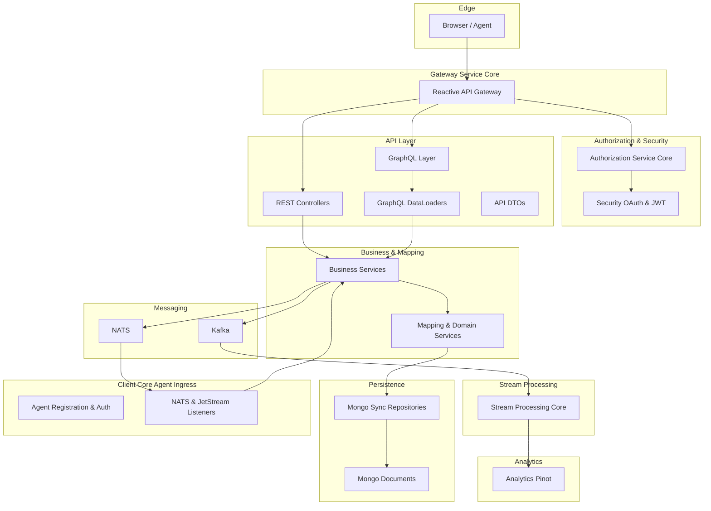
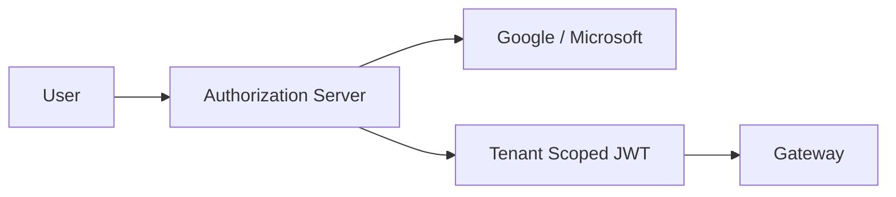
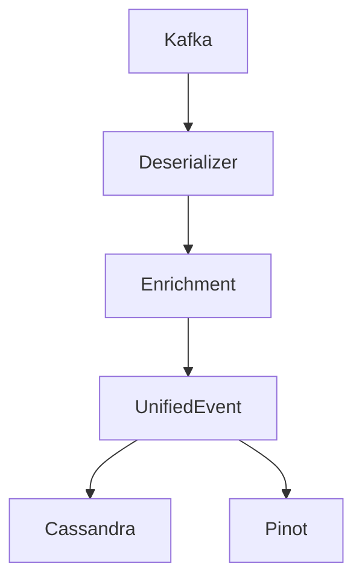
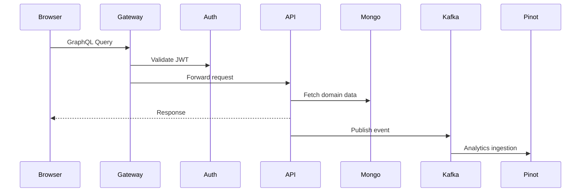

# OpenFrame OSS Lib – Repository Overview

The **`openframe-oss-lib`** repository is the modular backend foundation of the OpenFrame platform.  
It provides a complete multi-tenant, event-driven, analytics-enabled architecture for:

- ✅ API services (REST + GraphQL)
- ✅ OAuth2 / OIDC authorization
- ✅ JWT-based security
- ✅ Agent ingress & command execution
- ✅ Kafka & NATS messaging
- ✅ MongoDB operational persistence
- ✅ Apache Pinot analytics
- ✅ Tool integrations (Tactical RMM, Fleet MDM, etc.)

This repository is structured as a set of independent but cohesive modules forming a layered, scalable backend system.

---

# 🎯 Purpose of the Repository

`openframe-oss-lib` delivers:

1. **Multi-tenant API infrastructure**
2. **OAuth2 Authorization Server**
3. **JWT security & BFF orchestration**
4. **Reactive Gateway layer**
5. **Device & ticket lifecycle management**
6. **Real-time event ingestion & enrichment**
7. **High-performance analytics via Pinot**
8. **Tool SDK abstraction layer**
9. **Agent ingress & command execution**
10. **Operational management & migrations**

It is designed to support both:
- 🟢 OSS single-tenant deployments
- 🔵 SaaS multi-tenant environments

---

# 🏗 End-to-End Architecture

Below is the complete system architecture across all modules:

```mermaid
flowchart TD

    subgraph Edge
        Client["Browser / Agent"]
    end

    subgraph GatewayLayer["Gateway Service Core"]
        Gateway["Reactive API Gateway"]
    end

    subgraph SecurityLayer["Authorization & Security"]
        AuthServer["Authorization Service Core"]
        SecurityCore["Security OAuth & JWT"]
    end

    subgraph ApiLayer["API Layer"]
        Rest["REST Controllers"]
        GraphQL["GraphQL Layer"]
        DataLoaders["GraphQL DataLoaders"]
        ApiDtos["API DTOs"]
    end

    subgraph DomainLayer["Business & Mapping"]
        Services["Business Services"]
        Mapping["Mapping & Domain Services"]
    end

    subgraph PersistenceLayer["Persistence"]
        MongoDocs["Mongo Documents"]
        MongoSync["Mongo Sync Repositories"]
    end

    subgraph MessagingLayer["Messaging"]
        Kafka["Kafka"]
        Nats["NATS"]
    end

    subgraph StreamLayer["Stream Processing"]
        StreamCore["Stream Processing Core"]
    end

    subgraph AnalyticsLayer["Analytics"]
        Pinot["Analytics Pinot"]
    end

    subgraph AgentIngress["Client Core Agent Ingress"]
        AgentAPI["Agent Registration & Auth"]
        AgentListeners["NATS & JetStream Listeners"]
    end

    Client --> Gateway
    Gateway --> Rest
    Gateway --> GraphQL
    Gateway --> AuthServer

    AuthServer --> SecurityCore

    Rest --> Services
    GraphQL --> DataLoaders
    DataLoaders --> Services

    Services --> Mapping
    Mapping --> MongoSync
    MongoSync --> MongoDocs

    Services --> Kafka
    Services --> Nats

    Kafka --> StreamCore
    StreamCore --> Pinot

    Nats --> AgentListeners
    AgentListeners --> Services
```

---

# 📦 Repository Module Structure

The repository is composed of the following major modules:

---

## 1️⃣ API Contract & DTO Layer

### `api-lib-dto-contracts`
**Purpose:** Defines stable transport contracts shared between REST, GraphQL, and services.

Includes:
- Device filters
- Organization responses
- Script commands
- Tool filters
- Relay pagination primitives
- Command dispatch contracts

👉 Reference: **Api Lib Dto Contracts documentation**

---

### `api-service-core-dtos`
Defines REST & GraphQL DTOs for:
- SSO
- OAuth
- Invitations
- Knowledge base
- Notifications
- Force tool operations
- Relay connections

👉 Reference: **Api Service Core Dtos documentation**

---

## 2️⃣ API Service Core

### `api-service-core-rest-controllers`
Thin HTTP controllers for:
- Organizations
- Devices
- API Keys
- Invitations
- SSO
- User management
- Force tool operations

---

### `api-service-core-graphql-layer`
Relay-compliant GraphQL API:
- Node resolution
- Cursor pagination
- Mutations
- Type resolvers
- DataLoader integration

---

### `api-service-core-graphql-dataloaders`
Prevents N+1 queries with batched loading for:
- Machines
- Organizations
- Tags
- Knowledge Base
- Tickets
- Tool connections

---

### `api-service-core-business-services`
Core domain orchestration:
- User lifecycle
- SSO configuration
- Domain validation
- Extension processors

---

### `api-lib-mapping-and-domain-services`
Mapping layer between:
- DTOs
- Domain documents
- Repository layer

---

### `api-service-core-config-and-security`
Infrastructure configuration:
- JWT resource server
- OAuth integration
- Custom GraphQL scalars
- OAuth client initialization

---

## 3️⃣ Authorization & Security

### `authorization-service-core`
Full OAuth2 + OIDC Authorization Server:

- Multi-tenant JWT issuers
- RSA signing keys per tenant
- PKCE enforcement
- Dynamic SSO providers
- Invitation onboarding
- Tenant registration

```mermaid
flowchart LR
    User["User"] --> Auth["Authorization Server"]
    Auth --> IdP["Google / Microsoft"]
    Auth --> JWT["Tenant Scoped JWT"]
    JWT --> Gateway
```

---

### `security-oauth-and-jwt`
Provides:
- JWT encoder/decoder
- PKCE utilities
- OAuth BFF controller
- Secure cookie strategy

---

## 4️⃣ Gateway Layer

### `gateway-service-core`

Reactive Spring Cloud Gateway:

- JWT validation
- API key authentication
- Role-based routing
- WebSocket proxying
- Tool upstream resolution
- Rate limiting

---

## 5️⃣ Persistence Layer

### `data-model-and-repositories-mongo`
Defines:
- MongoDB documents
- Query filters
- Base repositories
- Tenant ID provider

---

### `data-access-mongo-sync`
MongoTemplate-based advanced repository implementations:
- Cursor pagination
- Aggregations
- Ticket lifecycle
- Device filtering
- Notification joins
- Optimistic locking retries

---

## 6️⃣ Messaging & Eventing

### `eventing-and-messaging-kafka-nats`

Hybrid messaging model:

- Kafka for durable streaming
- NATS for real-time messaging
- Debezium CDC integration
- Notification broadcasting
- Agent command execution

---

## 7️⃣ Stream Processing

### `stream-processing-core`

Real-time event enrichment engine:

- Tool event deserialization
- Tenant resolution
- Unified event taxonomy
- Kafka Streams joins
- Cassandra integration
- Pinot ingestion support

```mermaid
flowchart TD
    Kafka --> Deserializer
    Deserializer --> Enrichment
    Enrichment --> UnifiedEvent
    UnifiedEvent --> Cassandra
    UnifiedEvent --> Pinot
```

---

## 8️⃣ Analytics

### `analytics-pinot`

High-performance read layer:

- Device faceted filtering
- Log search
- Cursor pagination
- Distinct filter options
- Tenant isolation
- Broker warm-up

---

## 9️⃣ Agent Ingress

### `client-core-agent-ingress`

Handles:

- Agent registration
- OAuth token issuance
- Tool ID transformation
- Machine heartbeat tracking
- JetStream event consumption

---

## 🔟 Management & Operations

### `management-service-core`

Operational control plane:

- NATS stream initialization
- Tool lifecycle management
- Version publishing
- Distributed schedulers
- Mongo migrations (Mongock)
- Ticket status seeding

---

## 1️⃣1️⃣ Integrations SDKs

### `integrations-sdks`

Typed SDK abstractions for:

- Tactical RMM
- Fleet MDM

Provides:
- Strongly typed request/response models
- Auto-configuration
- Script scheduling support
- Policy management

---

# 🔐 Cross-Cutting Architecture Patterns

- ✅ Multi-tenant isolation at all layers
- ✅ Relay-compliant GraphQL
- ✅ Cursor-based pagination everywhere
- ✅ Distributed scheduling via ShedLock
- ✅ Event-driven architecture (Kafka + NATS)
- ✅ Asymmetric JWT signing
- ✅ PKCE enforcement
- ✅ Broker warm-up for analytics
- ✅ Soft-delete instead of hard deletes
- ✅ Extension-point processor pattern

---

# 🧠 End-to-End Request Lifecycle Example

```mermaid
sequenceDiagram
    participant Browser
    participant Gateway
    participant Auth
    participant API
    participant Mongo
    participant Kafka
    participant Pinot

    Browser->>Gateway: GraphQL Query
    Gateway->>Auth: Validate JWT
    Gateway->>API: Forward request
    API->>Mongo: Fetch domain data
    API-->>Browser: Response

    API->>Kafka: Publish event
    Kafka->>Pinot: Analytics ingestion
```

---

# ✅ Summary

The **`openframe-oss-lib`** repository is a complete backend platform composed of:

- Secure multi-tenant authorization
- Reactive gateway routing
- REST & GraphQL APIs
- Domain-driven services
- Mongo operational storage
- Kafka + NATS messaging
- Stream enrichment pipelines
- Pinot analytics
- Agent ingress services
- Tool integration SDKs
- Operational management control plane

It provides a modular, scalable, and extensible foundation for building a unified, AI-enhanced MSP backend platform.