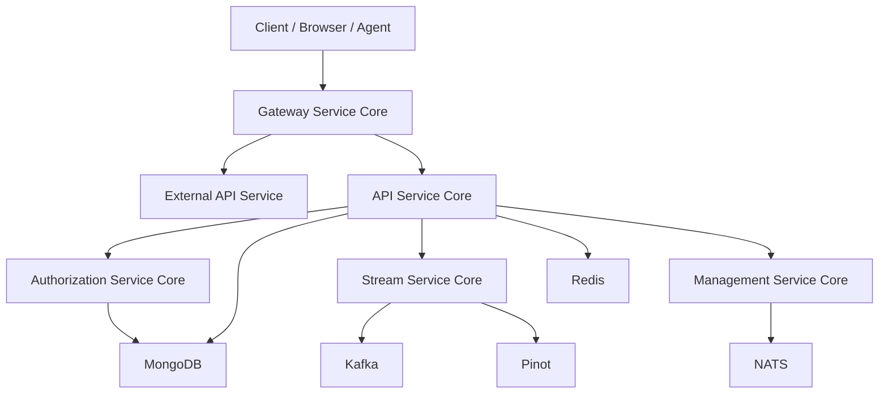
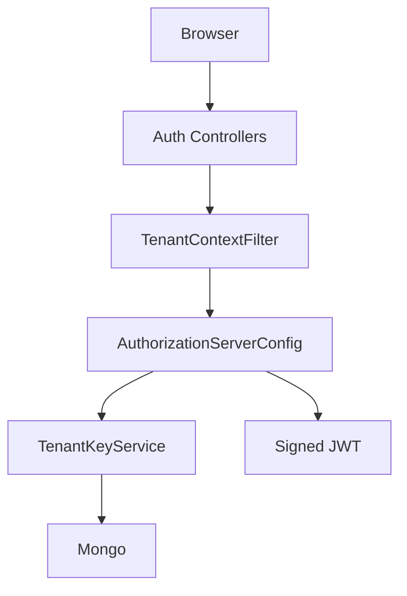
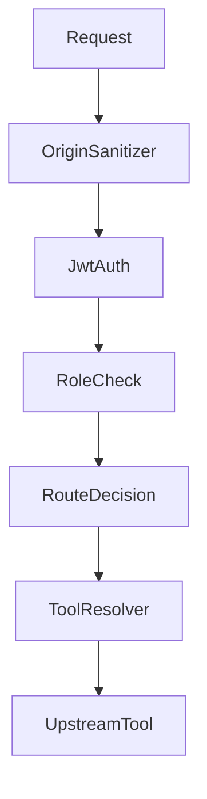
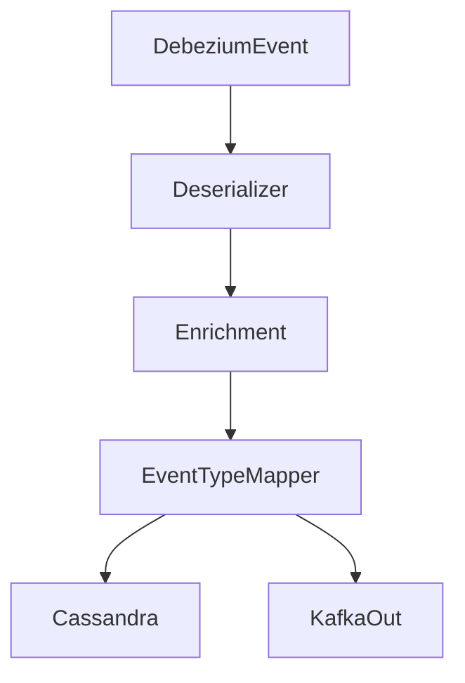
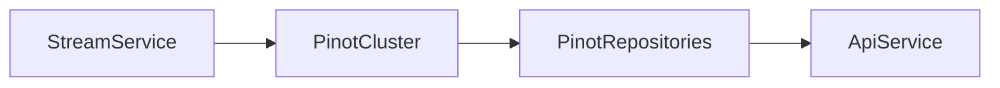
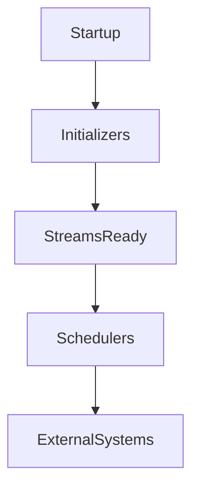
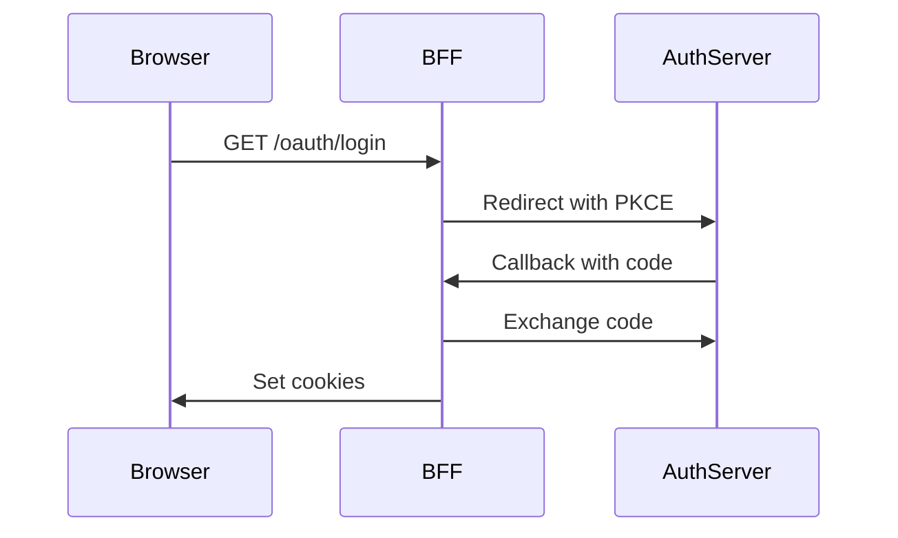
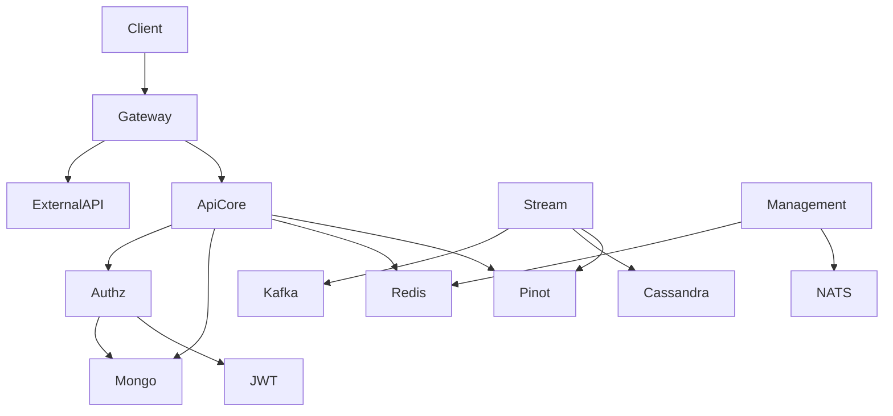

# OpenFrame OSS Lib – Repository Overview

The **openframe-oss-lib** repository contains the foundational backend libraries powering the OpenFrame platform. It provides:

- Multi-tenant authentication and authorization
- API service layers (REST + GraphQL)
- Gateway routing and security
- Event ingestion and streaming (Kafka)
- Real-time messaging (NATS)
- Polyglot persistence (MongoDB, Redis, Pinot)
- Management initializers and distributed schedulers

This repository represents the **core backend infrastructure stack** of OpenFrame and is designed to be modular, extensible, and multi-tenant by default.

---

# High-Level Architecture

OpenFrame follows a layered, service-oriented architecture with strong separation between:

- Identity & Authorization
- API Surface (Internal + External)
- Gateway & Edge Security
- Stream Processing
- Data Access Layer
- Caching & Messaging
- Management & Operations

```mermaid
flowchart TD
    Client["Client / Browser / Agent"] --> Gateway["Gateway Service Core"]
    Gateway --> ExternalAPI["External API Service"]
    Gateway --> ApiCore["API Service Core"]

    ApiCore --> Authz["Authorization Service Core"]
    ApiCore --> Stream["Stream Service Core"]
    ApiCore --> Management["Management Service Core"]

    Authz --> Mongo["MongoDB"]
    ApiCore --> Mongo
    Stream --> Kafka["Kafka"]
    Stream --> Pinot["Pinot"]
    ApiCore --> Redis["Redis"]
    Management --> NATS["NATS"]
```

---

# Core Modules

Below is a structured overview of the major modules contained in this repository.

---

## 1. API Foundation

### 🔹 `api-contracts-and-pagination`
Defines reusable API contracts:

- Relay-style pagination (`ConnectionArgs`, cursors)
- Count-aware query results
- Opaque cursor encoding (`CursorCodec`)
- Standard mutation inputs

📄 Core Docs:  
- `CountedGenericQueryResult`
- `ConnectionArgs`
- `CursorCodec`
- `MutationDeleteInput`

---

### 🔹 `api-domain-filters-dtos`
Strongly-typed filter DTOs for:

- Devices
- Events
- Logs
- Knowledge Base
- Organizations
- Tools

Bridges API input → Mongo query filters.

---

### 🔹 `api-lib-core-services`
Reusable domain services:

- Installed agent resolution
- Tool connections
- Ticket queries
- Knowledge base lifecycle hooks
- Device status processors

Optimized for DataLoader and GraphQL batching.

---

## 2. API Service Core

### 🔹 REST Controllers
Internal operational endpoints:

- Organizations
- Devices
- Users
- Invitations
- SSO Config
- API Keys
- Release versions
- Agent lifecycle control

📄 Module: `api-service-core-rest-controllers`

---

### 🔹 GraphQL Layer
Relay-compliant GraphQL execution layer:

- Data fetchers
- DataLoaders
- Relay Node resolution
- Cursor-based pagination
- Polymorphic type resolution

📄 Modules:
- `api-service-core-graphql-datafetchers`
- `api-service-core-dataloaders`
- `api-service-core-graphql-dtos`
- `api-service-core-relay-type-resolution`

---

### 🔹 Security & Config
Provides:

- JWT resource server config
- Multi-issuer support
- Custom GraphQL scalars
- OAuth client initialization
- Argument resolvers

📄 Module: `api-service-core-config-and-security`

---

## 3. Authorization Service Core

Multi-tenant OAuth2 Authorization Server.

### Capabilities

- Per-tenant RSA key pairs
- JWT issuance with `tenant_id`
- Dynamic client registration
- SSO flows (Google, Microsoft)
- PKCE support
- Invitation-based onboarding
- Tenant discovery & registration

```mermaid
flowchart TD
    Browser --> AuthController["Auth Controllers"]
    AuthController --> TenantContext["TenantContextFilter"]
    TenantContext --> AuthServer["AuthorizationServerConfig"]
    AuthServer --> TenantKeyService["TenantKeyService"]
    TenantKeyService --> Mongo
    AuthServer --> JWT["Signed JWT"]
```

📄 Modules:
- `authorization-service-core-server-and-tenant`
- `authorization-service-core-auth-controllers-and-dtos`
- `authorization-service-core-keys-and-authorization-persistence`
- `authorization-service-core-sso-flow-and-utils`

---

## 4. Gateway Service Core

Reactive edge gateway built on Spring Cloud Gateway + WebFlux.

### Responsibilities

- JWT validation (multi-issuer)
- Role-based authorization
- API key authentication + rate limiting
- WebSocket proxying
- Tool upstream resolution
- Origin sanitization
- CORS enforcement

```mermaid
flowchart TD
    Request --> OriginSanitizer
    OriginSanitizer --> JwtAuth
    JwtAuth --> RoleCheck
    RoleCheck --> RouteDecision
    RouteDecision --> ToolResolver
    ToolResolver --> UpstreamTool
```

📄 Module: `gateway-service-core-security-and-routing`

---

## 5. Stream Service Core (Kafka)

Event ingestion and normalization backbone.

### Responsibilities

- Consume Debezium CDC events
- Tool-specific deserialization
- Event enrichment (tenant, device, org)
- Unified event type mapping
- Cassandra persistence
- Kafka republishing
- Kafka Streams enrichment

```mermaid
flowchart TD
    DebeziumEvent --> Deserializer
    Deserializer --> Enrichment
    Enrichment --> EventTypeMapper
    EventTypeMapper --> Cassandra
    EventTypeMapper --> KafkaOut
```

📄 Module: `stream-service-core-kafka-and-handlers`

---

## 6. Data Layer

### MongoDB

- Domain documents (`User`, `Organization`, `Device`, `Ticket`, etc.)
- Base repositories (sync + reactive)
- Custom query repositories
- Cursor pagination logic
- Index configuration

📄 Modules:
- `data-mongo-domain-model`
- `data-mongo-query-filters`
- `data-mongo-base-repositories`
- `data-mongo-sync-config-and-custom-repositories`
- `data-mongo-reactive-repositories`

---

### Redis

- Tenant-aware cache key prefixing
- Spring Cache integration
- Reactive + blocking templates

📄 Module: `data-redis-cache`

---

### Kafka

- Tenant-scoped Kafka configuration
- Topic auto-provisioning
- Debezium message modeling
- Retry & recovery handling

📄 Module: `data-kafka-configuration-and-retry`

---

### NATS (Real-Time Notifications)

- Persist-first notification strategy
- Read-state tracking
- Per-recipient NATS publish
- Graceful degradation if NATS disabled

📄 Module: `data-nats-notifications`

---

### Pinot (Analytics)

- Log exploration
- Device faceted filtering
- High-performance aggregation queries

```mermaid
flowchart LR
    StreamService --> PinotCluster
    PinotCluster --> PinotRepositories
    PinotRepositories --> ApiService
```

📄 Module: `data-pinot-repositories`

---

## 7. Management Service Core

Operational backbone of the platform.

### Startup Initializers

- Agent registration secret bootstrap
- NATS stream provisioning
- Client configuration loading
- Tactical RMM script initialization

### Distributed Schedulers (ShedLock + Redis)

- Offline device detection
- API key stats sync
- Fleet MDM setup
- Version publish fallback

```mermaid
flowchart TD
    Startup --> Initializers
    Initializers --> StreamsReady
    StreamsReady --> Schedulers
    Schedulers --> ExternalSystems
```

📄 Module: `management-service-core-initializers-and-schedulers`

---

## 8. External API Service Core

Public REST interface for third-party integrations.

- API key–based authentication
- Cursor-based pagination
- Device / Event / Log / Organization APIs
- Tool proxy endpoints
- OpenAPI documentation

📄 Module: `external-api-service-core`

---

## 9. Security Core & OAuth BFF

Frontend-safe OAuth2 BFF layer.

- PKCE utilities
- JWT encoder/decoder
- OAuth login flow
- Token refresh & revocation
- HttpOnly cookie management

```mermaid
sequenceDiagram
    participant Browser
    participant BFF
    participant AuthServer

    Browser->>BFF: GET /oauth/login
    BFF->>AuthServer: Redirect with PKCE
    AuthServer->>BFF: Callback with code
    BFF->>AuthServer: Exchange code
    BFF->>Browser: Set cookies
```

📄 Module: `security-core-and-oauth-bff`

---

# End-to-End System View

```mermaid
flowchart TD
    Client --> Gateway
    Gateway --> ExternalAPI
    Gateway --> ApiCore

    ApiCore --> Authz
    ApiCore --> Mongo
    ApiCore --> Redis
    ApiCore --> Pinot

    Authz --> Mongo
    Authz --> JWT

    Stream --> Kafka
    Stream --> Cassandra
    Stream --> Pinot

    Management --> Redis
    Management --> NATS
```

---

# Design Principles

The repository follows consistent architectural principles:

1. **Multi-Tenancy First**
   - Tenant ID embedded in JWT
   - Tenant-scoped keys and locks
   - Tenant-aware caching

2. **Separation of Concerns**
   - Domain model isolated from transport
   - Query filters separate from API DTOs
   - Gateway isolated from business logic

3. **Polyglot Persistence**
   - MongoDB → transactional
   - Pinot → analytical
   - Redis → caching
   - Kafka → streaming
   - NATS → real-time

4. **Event-Driven Architecture**
   - Debezium ingestion
   - Kafka normalization
   - Unified event model

5. **Extensibility**
   - Conditional beans
   - Processor hooks
   - Strategy patterns
   - Pluggable resolvers

---

# Conclusion

The **openframe-oss-lib** repository is the foundational backend library stack of OpenFrame. It provides:

- A multi-tenant OAuth2 authorization server
- Internal and external API layers
- A reactive gateway
- Event streaming and normalization
- Analytics querying
- Distributed management workflows
- Secure OAuth BFF flows
- Polyglot data infrastructure

Together, these modules form a production-grade, scalable, multi-tenant backend architecture that powers the OpenFrame platform end-to-end.