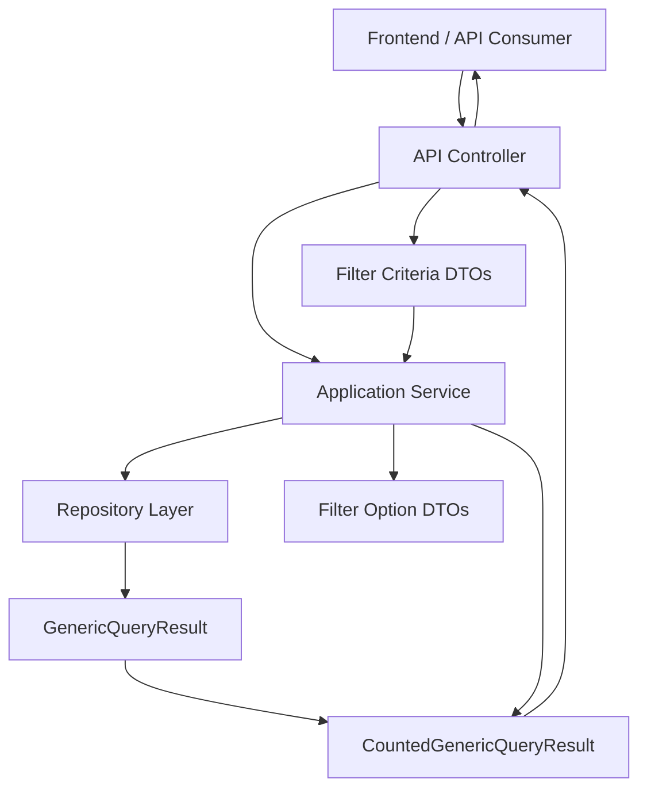
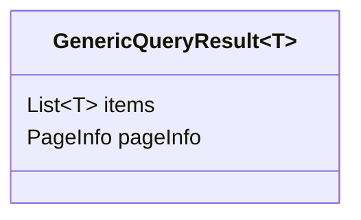
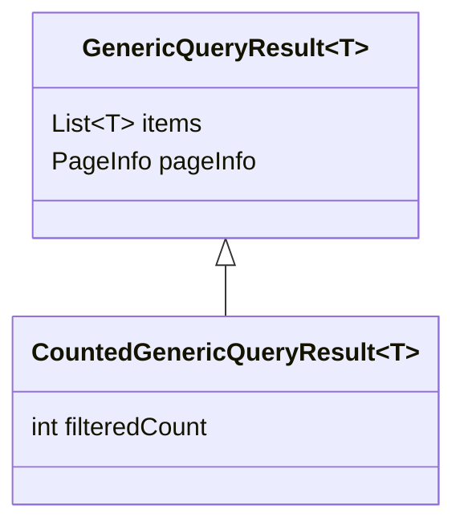
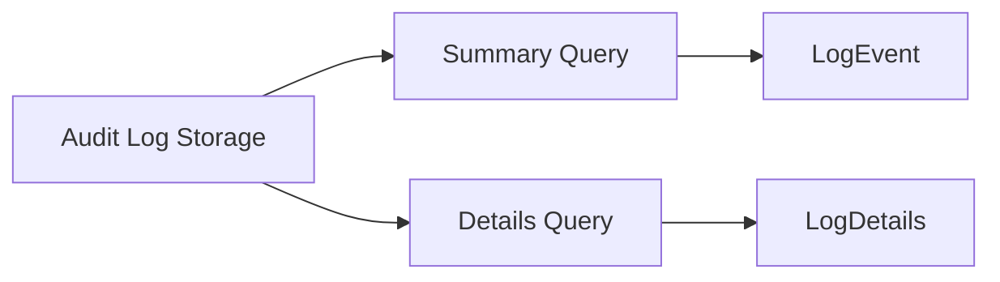
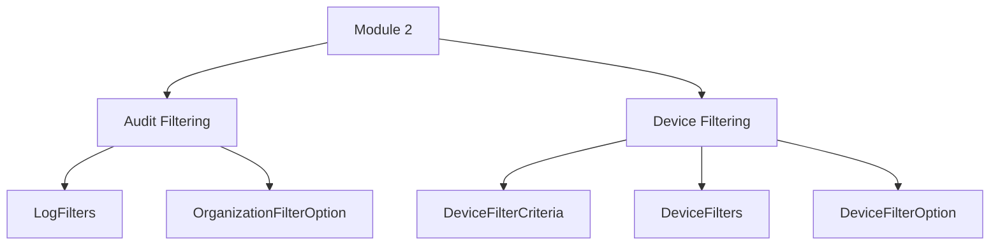
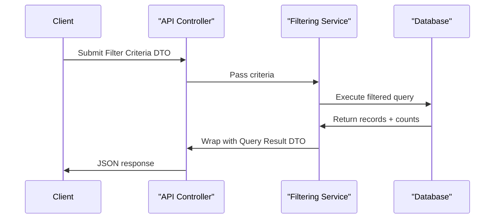
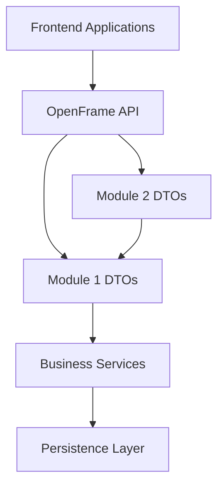

# openframe-oss-lib

## Purpose

`openframe-oss-lib` is the foundational **API DTO library** for the OpenFrame platform. It defines the shared data transfer objects (DTOs) used across services for:

- Generic paginated query results  
- Count-aware filtered responses  
- Audit log summaries and detailed records  
- Device and audit filtering criteria  
- Faceted filter options for dynamic UI filtering  

This repository does **not** implement business logic, persistence, or controllers. Instead, it provides a **strongly typed, reusable contract layer** that standardizes communication between:

- API controllers  
- Service layers  
- Persistence layers  
- Frontend clients  

By centralizing DTO definitions, OpenFrame ensures consistency, type safety, and predictable API response structures across the platform.

---

# Repository Structure

```text
openframe-oss-lib/
└── openframe-api-lib/
    └── src/main/java/com/openframe/api/dto/
        ├── GenericQueryResult
        ├── CountedGenericQueryResult
        ├── audit/
        │   ├── LogEvent
        │   ├── LogDetails
        │   ├── LogFilterCriteria
        │   ├── LogFilters
        │   └── OrganizationFilterOption
        └── device/
            ├── DeviceFilterCriteria
            ├── DeviceFilterOption
            └── DeviceFilters
```

The repository is logically organized into two core modules:

- **Module 1** – Query Result & Audit Core DTOs  
- **Module 2** – Audit & Device Filtering DTOs  

---

# End-to-End Architecture

`openframe-oss-lib` sits at the **contract boundary** between client requests and backend processing.


```mermaid
flowchart TD
    Client["Frontend / API Consumer"] --> Controller["API Controller"]
    Controller --> Service["Application Service"]
    Service --> Repository["Repository Layer"]

    Repository --> QueryResult["GenericQueryResult<T>"]
    QueryResult --> CountedResult["CountedGenericQueryResult<T>"]

    Controller --> FilterCriteria["Filter Criteria DTOs"]
    Service --> FilterOptions["Filter Option DTOs"]

    FilterCriteria --> Service
    Service --> CountedResult
    CountedResult --> Controller
    Controller --> Client
```

### Key Responsibilities in the Flow

- **Filter Criteria DTOs (Module 2)**  
  Define what the client can filter by.

- **Service Layer**  
  Applies business rules and delegates to repositories.

- **Query Result DTOs (Module 1)**  
  Standardize paginated and counted responses.

- **Filter Option DTOs (Module 2)**  
  Enable faceted search and dropdown population in UI.

---

# Module 1 – Query Results & Audit Core DTOs

📄 Documentation:  
- [`module_1/module_1.md`](../module_1/module_1.md)

## Overview

Module 1 defines foundational DTOs for:

- Generic paginated results  
- Count-aware filtered results  
- Audit log summary and detailed views  
- Log filtering criteria  

### Core Components

- `GenericQueryResult<T>`
- `CountedGenericQueryResult<T>`
- `LogEvent`
- `LogDetails`
- `LogFilterCriteria`

---

## Query Result Abstraction

### GenericQueryResult<T>

Provides a standardized paginated response wrapper.


```mermaid
classDiagram
    class GenericQueryResult~T~ {
        List~T~ items
        PageInfo pageInfo
    }
```

Used for:

- Device lists  
- Audit summaries  
- Organization queries  
- Any paginated endpoint  

---

### CountedGenericQueryResult<T>

Extends `GenericQueryResult<T>` with a filtered count.


```mermaid
classDiagram
    class GenericQueryResult~T~ {
        List~T~ items
        PageInfo pageInfo
    }

    class CountedGenericQueryResult~T~ {
        int filteredCount
    }

    GenericQueryResult <|-- CountedGenericQueryResult
```

Enables:

- Accurate filtered totals  
- Advanced search UIs  
- Faceted result counts  

---

## Audit Models

### LogEvent

Lightweight summary view for list endpoints.

### LogDetails

Extended detailed representation including message and structured details.


```mermaid
flowchart LR
    LogStorage["Audit Log Storage"] --> SummaryQuery["Summary Query"]
    LogStorage --> DetailsQuery["Details Query"]

    SummaryQuery --> LogEventDTO["LogEvent"]
    DetailsQuery --> LogDetailsDTO["LogDetails"]
```

### LogFilterCriteria

Encapsulates structured filtering parameters:

- Date range  
- Event types  
- Tool types  
- Severity  
- Organization scope  
- Device scope  

Used together with filter option DTOs from Module 2.

---

# Module 2 – Filtering DTOs (Audit & Device)

📄 Documentation:  
- [`module_2/module_2.md`](../module_2/module_2.md)  
- [`module_2/audit_filtering/audit_filtering.md`](module_2/audit_filtering/audit_filtering.md)  
- [`module_2/device_filtering/device_filtering.md`](module_2/device_filtering/device_filtering.md)  

## Overview

Module 2 standardizes:

- Filter criteria submitted by clients  
- Filter options returned by backend  
- Faceted filtering structures  

It is divided into two domains:

1. **Audit Filtering**
2. **Device Filtering**

---

## Architectural Breakdown


```mermaid
flowchart TD
    Module2["Module 2"] --> AuditFiltering["Audit Filtering"]
    Module2 --> DeviceFiltering["Device Filtering"]

    AuditFiltering --> LogFilters["LogFilters"]
    AuditFiltering --> OrganizationFilterOption["OrganizationFilterOption"]

    DeviceFiltering --> DeviceFilterCriteria["DeviceFilterCriteria"]
    DeviceFiltering --> DeviceFilters["DeviceFilters"]
    DeviceFiltering --> DeviceFilterOption["DeviceFilterOption"]
```

---

## Typical Filtering Sequence


```mermaid
sequenceDiagram
    participant Client
    participant API as "API Controller"
    participant Service as "Filtering Service"
    participant DB as "Database"

    Client->>API: Submit Filter Criteria DTO
    API->>Service: Pass criteria
    Service->>DB: Execute filtered query
    DB->>Service: Return records + counts
    Service->>API: Wrap with Query Result DTO
    API->>Client: JSON response
```

---

# Design Principles

### 1. Contract-First DTO Layer
The repository defines shared contracts independent of:

- Database models  
- Framework implementations  
- Business logic  

---

### 2. Generic & Reusable Abstractions

- `GenericQueryResult<T>` avoids duplication  
- Strong typing ensures consistent API behavior  
- DTO separation prevents domain leakage  

---

### 3. Separation of Criteria and Options

Clear distinction between:

- **Filter Criteria** (input DTOs)  
- **Filter Options** (faceted output DTOs)  

Enables:

- Dynamic UI filtering  
- Multi-select support  
- Accurate filtered counts  

---

### 4. Multi-Tenant Awareness

Filtering supports organization scoping via:

- `OrganizationFilterOption`
- Organization-based criteria fields  

This ensures tenant isolation across audit and device domains.

---

# How openframe-oss-lib Fits into OpenFrame


```mermaid
flowchart TB
    UI["Frontend Applications"] --> API["OpenFrame API"]
    API --> Module1["Module 1 DTOs"]
    API --> Module2["Module 2 DTOs"]

    Module2 --> Module1
    Module1 --> Services["Business Services"]
    Services --> Database["Persistence Layer"]
```

`openframe-oss-lib` acts as the **shared API contract foundation** across the OpenFrame ecosystem, ensuring:

- Predictable response structures  
- Strong typing  
- Clear separation of concerns  
- Scalable filtering patterns  
- Clean pagination and result wrapping  

---

# Summary

`openframe-oss-lib` is the core DTO contract library of OpenFrame.

It provides:

- ✅ Generic paginated result wrappers  
- ✅ Count-aware filtered results  
- ✅ Structured audit log representations  
- ✅ Comprehensive filtering DTOs for audit and devices  
- ✅ Multi-tenant-aware filtering contracts  

By isolating API data contracts into a dedicated library, OpenFrame maintains a clean architecture, reusable abstractions, and consistent API behavior across services.