# OpenFrame OSS Lib – Repository Overview

The **`openframe-oss-lib`** repository is the modular backbone of the OpenFrame platform — Flamingo’s AI-powered MSP stack.  

It provides:

- ✅ Multi-tenant identity & OAuth2 authorization  
- ✅ Reactive API layer (REST + GraphQL)  
- ✅ Gateway & WebSocket routing  
- ✅ MongoDB data layer (reactive + sync)  
- ✅ Kafka-based stream processing & enrichment  
- ✅ Operational management services  
- ✅ Frontend UI & AI Chat foundation  
- ✅ Shared API contract definitions  

This repository is structured as independent but composable modules forming a full end-to-end MSP platform stack.

---

# High-Level Architecture

Below is the complete system architecture represented across modules in this repository.

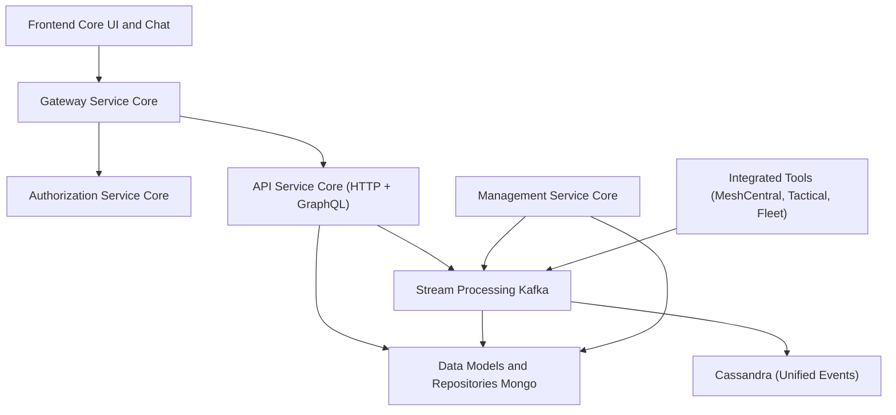
```mermaid
flowchart TD
    Frontend["Frontend Core UI and Chat"]
    Gateway["Gateway Service Core"]
    Auth["Authorization Service Core"]
    API["API Service Core (HTTP + GraphQL)"]
    Management["Management Service Core"]
    Data["Data Models and Repositories Mongo"]
    Stream["Stream Processing Kafka"]
    Cassandra["Cassandra (Unified Events)"]
    Tools["Integrated Tools (MeshCentral, Tactical, Fleet)"]

    Frontend --> Gateway
    Gateway --> Auth
    Gateway --> API
    API --> Data
    API --> Stream
    Stream --> Cassandra
    Stream --> Data
    Management --> Data
    Management --> Stream
    Tools --> Stream
```

---

# Repository Modules

## 1. `api-lib-contracts`

**Purpose:**  
Defines all shared DTOs, filters, pagination primitives, and API boundary contracts.

### Responsibilities

- Device, Organization, Script, Tool, KnowledgeBase DTOs  
- Relay-style pagination (`ConnectionArgs`, `CursorCodec`)  
- Filter criteria objects (DeviceFilterCriteria, LogFilterCriteria, etc.)  
- Command dispatch contracts  
- Shared mappers (e.g., `OrganizationMapper`)  

### Architectural Role

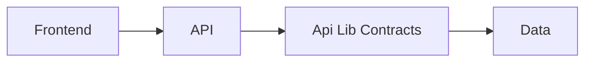
```mermaid
flowchart LR
    Frontend --> API
    API --> Contracts["Api Lib Contracts"]
    Contracts --> Data
```

📘 See module documentation: **Api Lib Contracts**

---

## 2. `api-service-core-http-and-graphql`

**Purpose:**  
Primary application-layer API surface.

Exposes:

- REST endpoints
- GraphQL (Netflix DGS)
- Relay global node resolution
- DataLoader batching
- OAuth2 Resource Server security

### Key Components

- Controllers (Device, Organization, User, Invitation, SSOConfig, etc.)
- GraphQL DataFetchers
- DataLoaders (N+1 prevention)
- SecurityConfig (JWT validation)
- Relay Node resolvers

### API Flow

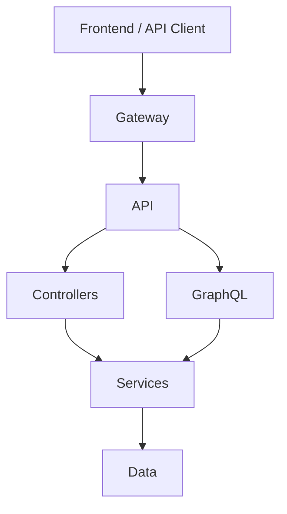
```mermaid
flowchart TD
    Client["Frontend / API Client"] --> Gateway
    Gateway --> API
    API --> Controllers
    API --> GraphQL
    Controllers --> Services
    GraphQL --> Services
    Services --> Data
```

📘 See module documentation: **Api Service Core HTTP And GraphQL**

---

## 3. `authorization-service-core`

**Purpose:**  
Multi-tenant OAuth2 + OIDC Authorization Server.

Handles:

- JWT issuance
- Tenant-aware signing keys
- Dynamic OIDC client registration
- SSO (Google, Microsoft)
- Password reset & invitations
- OAuth2 persistence in Mongo

### Token Flow

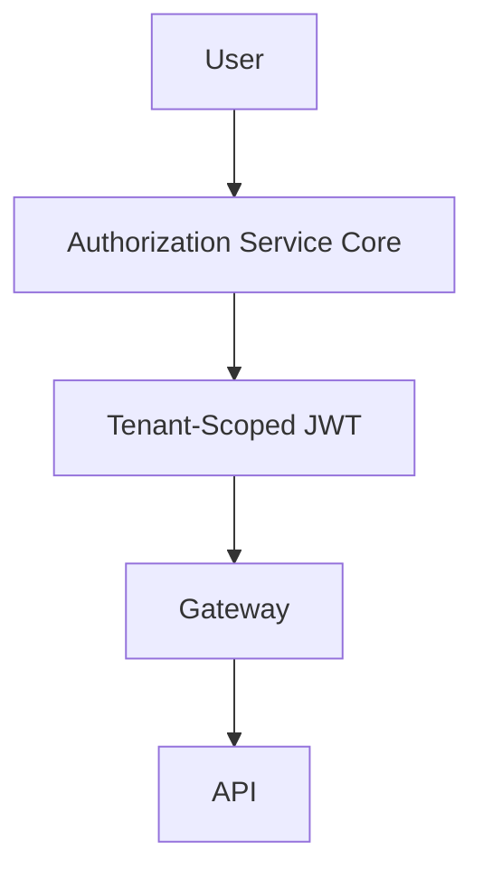
```mermaid
flowchart TD
    User --> AuthServer["Authorization Service Core"]
    AuthServer --> JWT["Tenant-Scoped JWT"]
    JWT --> Gateway
    Gateway --> API
```

Each tenant has:

- Independent RSA keypair
- Isolated issuer
- Custom JWT claims

📘 See module documentation: **Authorization Service Core**

---

## 4. `gateway-service-core`

**Purpose:**  
Reactive edge layer (Spring Cloud Gateway + WebFlux).

Handles:

- JWT validation
- API key authentication
- Rate limiting
- REST & WebSocket proxying
- Tool-specific upstream resolution

### Edge Routing

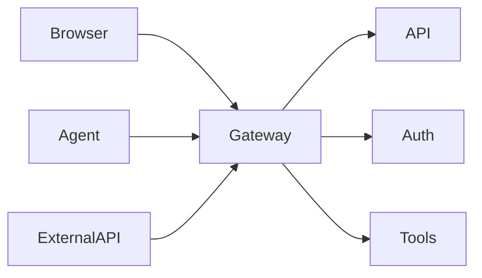
```mermaid
flowchart LR
    Browser --> Gateway
    Agent --> Gateway
    ExternalAPI --> Gateway

    Gateway --> API
    Gateway --> Auth
    Gateway --> Tools
```

Supports:

- MeshCentral
- Tactical RMM
- Fleet MDM
- NATS WebSocket streams

📘 See module documentation: **Gateway Service Core**

---

## 5. `management-service-core`

**Purpose:**  
Operational control plane.

Handles:

- Cluster version coordination
- Tool lifecycle management
- Initializers (NATS, agents, configs)
- Distributed schedulers (ShedLock + Redis)
- Mongo migrations (Mongock)
- Background health tasks

### Operational Flow

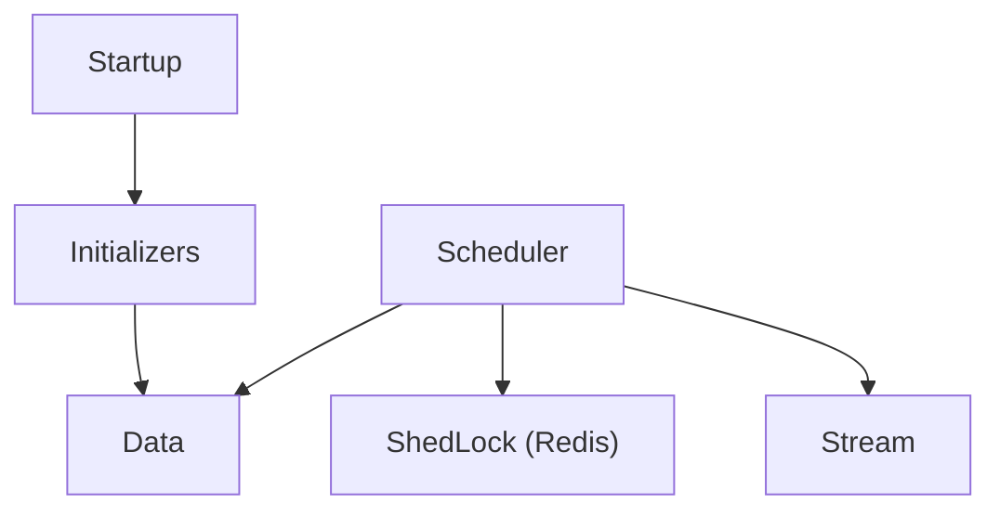
```mermaid
flowchart TD
    Startup --> Initializers
    Initializers --> Data
    Scheduler --> Redis["ShedLock (Redis)"]
    Scheduler --> Data
    Scheduler --> Stream
```

📘 See module documentation: **Management Service Core**

---

## 6. `data-models-and-repositories-mongo`

**Purpose:**  
MongoDB persistence backbone.

Includes:

- Core documents (User, Device, Ticket, Organization, Event, Notification)
- QueryFilter objects
- Reactive + Sync repositories
- Custom MongoTemplate implementations
- Cursor pagination
- Aggregation metrics

### Data Layer Architecture

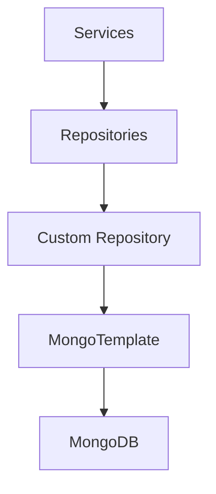
```mermaid
flowchart TD
    Services --> Repositories
    Repositories --> CustomImpl["Custom Repository"]
    CustomImpl --> MongoTemplate
    MongoTemplate --> MongoDB
```

Multi-tenant isolation enforced via `tenantId` field.

📘 See module documentation: **Data Models And Repositories Mongo**

---

## 7. `stream-processing-kafka`

**Purpose:**  
Event ingestion & normalization pipeline.

Consumes:

- Debezium CDC events
- MeshCentral
- Tactical RMM
- Fleet MDM

Performs:

- Tool-specific deserialization
- Event normalization
- Tenant resolution
- Kafka Streams enrichment
- Cassandra persistence

### Event Pipeline

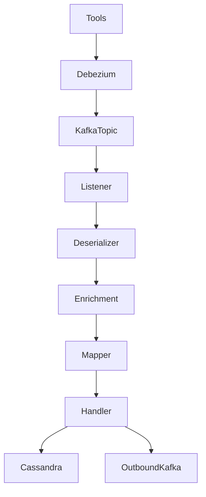
```mermaid
flowchart TD
    Tools --> Debezium
    Debezium --> KafkaTopic
    KafkaTopic --> Listener
    Listener --> Deserializer
    Deserializer --> Enrichment
    Enrichment --> Mapper
    Mapper --> Handler
    Handler --> Cassandra
    Handler --> OutboundKafka
```

📘 See module documentation: **Stream Processing Kafka**

---

## 8. `frontend-core-ui-and-chat`

**Purpose:**  
Reusable UI foundation + AI Chat engine.

Includes:

- Embeddable AI assistant (Guide + Mingo modes)
- Ticket Center
- Kanban Board
- Notifications Drawer
- Data Tables
- Runtime-driven navigation

### Chat Architecture

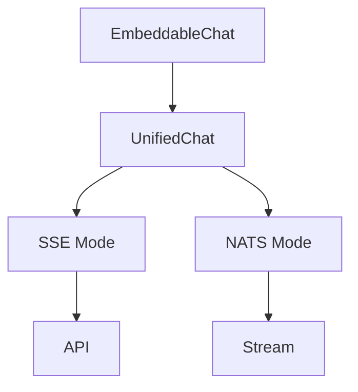
```mermaid
flowchart TD
    EmbeddableChat --> UnifiedChat
    UnifiedChat --> GuideMode["SSE Mode"]
    UnifiedChat --> MingoMode["NATS Mode"]
    GuideMode --> API
    MingoMode --> Stream
```

Designed for:

- Platform embedding
- Runtime injection
- Transport abstraction
- Segment-based streaming messages

📘 See module documentation: **Frontend Core UI And Chat**

---

# End-to-End Request Flow

Below is a full lifecycle example: user logs in, performs an action, and event propagates.

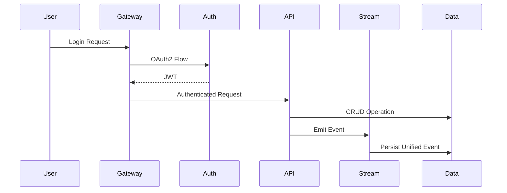
```mermaid
sequenceDiagram
    participant User
    participant Gateway
    participant Auth
    participant API
    participant Stream
    participant Data

    User->>Gateway: Login Request
    Gateway->>Auth: OAuth2 Flow
    Auth-->>Gateway: JWT
    Gateway->>API: Authenticated Request
    API->>Data: CRUD Operation
    API->>Stream: Emit Event
    Stream->>Data: Persist Unified Event
```

---

# Core Design Principles

1. **Tenant-first architecture**
2. **Strict module separation**
3. **Reactive edge + streaming core**
4. **Cursor-based pagination**
5. **Tool-agnostic event normalization**
6. **Extensible processors and hooks**
7. **Shared contract spine**

---

# How Everything Fits Together

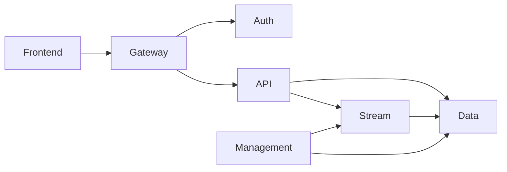
```mermaid
flowchart LR
    Frontend
    Gateway
    Auth
    API
    Management
    Data
    Stream

    Frontend --> Gateway
    Gateway --> Auth
    Gateway --> API
    API --> Data
    API --> Stream
    Stream --> Data
    Management --> Data
    Management --> Stream
```

The repository forms:

- 🔐 Identity & trust layer (Authorization)
- 🌐 Edge & routing layer (Gateway)
- 🧠 Application API layer (API Core)
- 🗄 Data persistence layer (Mongo)
- 🔄 Event processing layer (Kafka)
- ⚙ Operational control plane (Management)
- 💬 UI & AI interaction layer (Frontend Core)

---

# Conclusion

The **`openframe-oss-lib`** repository is the complete modular backbone of OpenFrame’s open-source MSP platform.

It delivers:

- Multi-tenant security  
- Unified API contracts  
- Reactive gateway & API  
- Scalable Mongo persistence  
- Event-driven stream processing  
- Distributed operational control  
- Embeddable AI-powered UI  

Together, these modules form a production-grade, extensible, and tenant-safe platform for modern MSP automation.