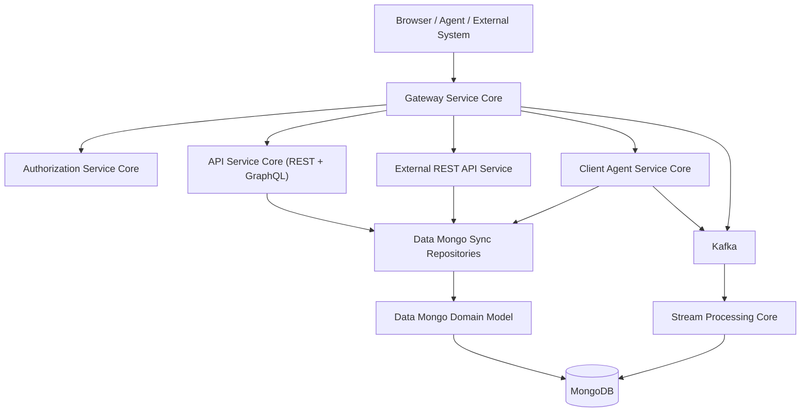
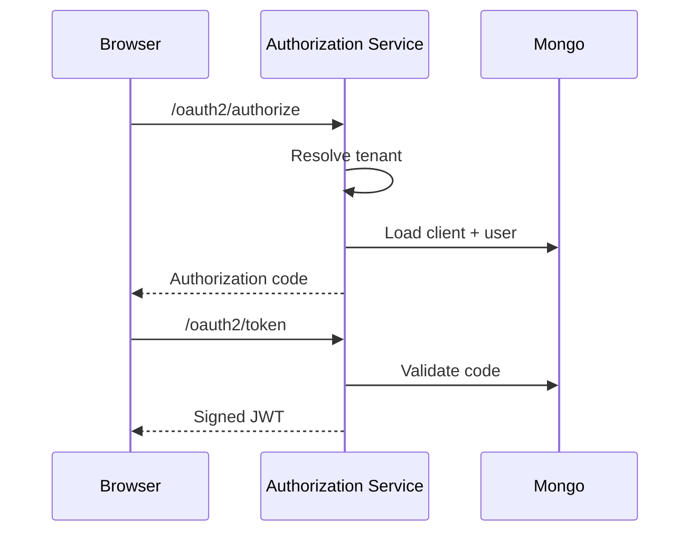
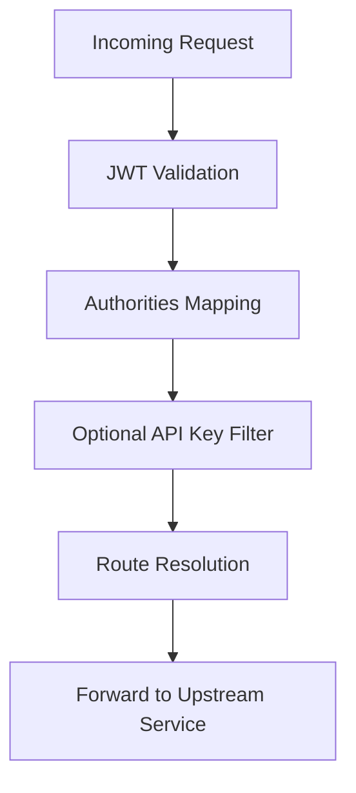
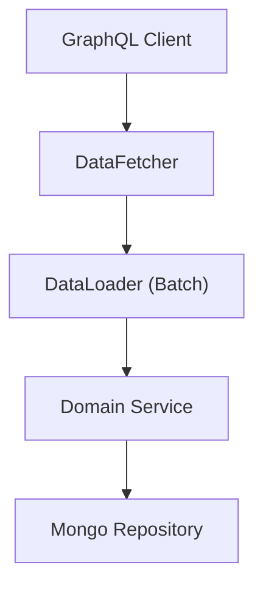
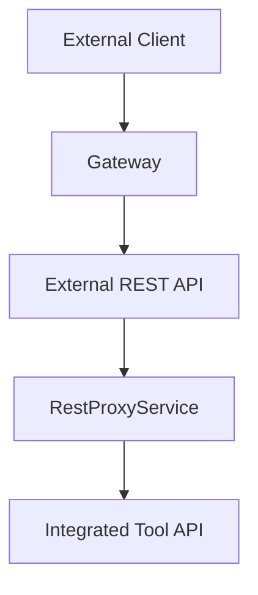
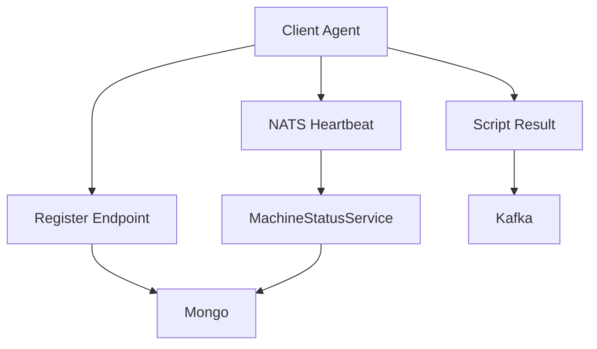
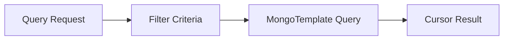
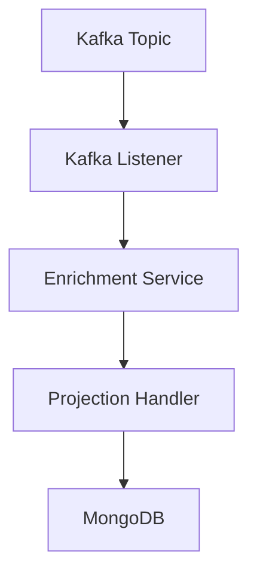

# OpenFrame OSS Lib — Repository Overview

The **`flamingo-stack/openframe-oss-lib`** repository contains the core backend building blocks of the OpenFrame platform — an AI-driven MSP (Managed Service Provider) stack designed to unify IT operations, automation, RMM, identity, and integrations into a multi-tenant, event-driven architecture.

It provides:

- Multi-tenant OAuth2 / OIDC authorization server
- Reactive gateway with JWT and API key enforcement
- Internal REST + Relay-compliant GraphQL APIs
- MongoDB domain model + advanced repositories
- Kafka-based stream processing and enrichment
- Agent lifecycle management (registration, heartbeat, RMM execution)
- External REST API surface for integrations
- Tool proxying and WebSocket routing

The repository is structured as a modular monorepo with clear separation between edge, API, domain, data, stream, and agent layers.

---

# End-to-End Architecture

OpenFrame follows a layered, multi-tenant, event-driven architecture.


```mermaid
flowchart TD
    Client["Browser / Agent / External System"] --> Gateway["Gateway Service Core"]

    Gateway --> Authz["Authorization Service Core"]
    Gateway --> Api["API Service Core (REST + GraphQL)"]
    Gateway --> ExternalApi["External REST API Service"]
    Gateway --> ClientAgent["Client Agent Service Core"]

    Api --> Repos["Data Mongo Sync Repositories"]
    ExternalApi --> Repos
    ClientAgent --> Repos

    Repos --> Domain["Data Mongo Domain Model"]
    Domain --> Mongo[("MongoDB")]

    ClientAgent --> Kafka["Kafka"]
    Gateway --> Kafka
    Kafka --> Stream["Stream Processing Core"]
    Stream --> Mongo
```

### Architectural Characteristics

- **Multi-tenant by design**
- **Reactive edge (WebFlux + Netty)**
- **JWT-based identity with dynamic issuers**
- **Cursor-based pagination (keyset, not offset)**
- **Event-driven state projections (Kafka → Mongo)**
- **Relay-compliant GraphQL API**
- **Pluggable tool integrations**

---

# Core Module Overview

Below is a structured overview of the primary modules in `openframe-oss-lib`.

---

## 1. Authorization Service Core

**Path:** `openframe-authorization-service-core`

The identity backbone of the platform.

Provides:

- OAuth2 Authorization Server (Spring Authorization Server)
- OpenID Connect login (form + SSO)
- Multi-tenant tenant resolution
- JWT issuance with tenant-aware claims
- Mongo-backed OAuth persistence
- Invitation-based registration
- Password reset flows

### Token Flow


```mermaid
sequenceDiagram
    participant Browser
    participant Auth as Authorization Service
    participant Mongo

    Browser->>Auth: /oauth2/authorize
    Auth->>Auth: Resolve tenant
    Auth->>Mongo: Load client + user
    Auth-->>Browser: Authorization code
    Browser->>Auth: /oauth2/token
    Auth->>Mongo: Validate code
    Auth-->>Browser: Signed JWT
```

📘 See module documentation:
- `authorization-service-core`

---

## 2. Gateway Service Core

**Path:** `openframe-gateway-service-core`

Reactive edge service built with Spring Cloud Gateway.

Responsibilities:

- JWT authentication (multi-issuer)
- API key authentication + rate limiting
- Role-based path authorization
- Tenant namespace rewriting
- REST + WebSocket proxying
- Tool-specific upstream resolution (Fleet, MeshCentral)

### Edge Security Flow


```mermaid
flowchart TD
    Request["Incoming Request"] --> Jwt["JWT Validation"]
    Jwt --> Roles["Authorities Mapping"]
    Roles --> ApiKey["Optional API Key Filter"]
    ApiKey --> Route["Route Resolution"]
    Route --> Upstream["Forward to Upstream Service"]
```

📘 See module documentation:
- `gateway-service-core`

---

## 3. API Service Core (Internal API Layer)

**Paths:**
- `openframe-api-service-core`
- `openframe-api-lib`

This layer exposes:

- Internal REST controllers
- Relay-compliant GraphQL API (Netflix DGS)
- DataLoaders for N+1 elimination
- Cursor-based pagination
- DTO contracts + entity mapping

### GraphQL Execution Model


```mermaid
flowchart TD
    Client["GraphQL Client"] --> Fetcher["DataFetcher"]
    Fetcher --> Loader["DataLoader (Batch)"]
    Loader --> Service["Domain Service"]
    Service --> Repo["Mongo Repository"]
```

### Key Submodules

- **API Contracts and Mapping**
- **Config and Security**
- **REST Controllers**
- **GraphQL**
- **DataLoaders**

📘 See module documentation:
- `api-contracts-and-mapping`
- `api-service-core-config-and-security`
- `api-service-core-rest-controllers`
- `api-service-core-graphql`
- `api-service-core-dataloaders`

---

## 4. External REST API Service Core

**Path:** `openframe-external-api-service-core`

Public, API-key–secured REST surface for third-party integrations.

Features:

- `/api/v1/**` versioned endpoints
- Cursor-based pagination
- Filtering + sorting
- Tool proxying
- OpenAPI documentation

### Proxy Flow


```mermaid
flowchart TD
    Client["External Client"] --> Gateway
    Gateway --> ExternalApi["External REST API"]
    ExternalApi --> Proxy["RestProxyService"]
    Proxy --> Tool["Integrated Tool API"]
```

📘 See module documentation:
- `external-rest-api-service-core`

---

## 5. Client Agent Service Core

**Path:** `openframe-client-core`

Handles lifecycle and ingestion of managed agents.

Responsibilities:

- Agent registration
- OAuth token issuance for agents
- Machine heartbeat ingestion (NATS)
- Script + command result ingestion
- RMM schedule execution
- Execution watchdog enforcement
- Kafka publishing for downstream enrichment

### Agent Lifecycle Example


```mermaid
flowchart TD
    Agent["Client Agent"] --> Register["Register Endpoint"]
    Register --> Mongo

    Agent --> Heartbeat["NATS Heartbeat"]
    Heartbeat --> UpdateStatus["MachineStatusService"]
    UpdateStatus --> Mongo

    Agent --> Result["Script Result"]
    Result --> Kafka
```

📘 See module documentation:
- `client-agent-service-core`

---

## 6. Data Mongo Domain Model

**Path:** `openframe-data-mongo-common`

Defines all MongoDB documents:

- Device
- Organization
- User
- Notification
- Event
- CommandExecution
- ScriptExecution
- TagAssignment

All documents are:

- Tenant-scoped
- Indexed for performance
- Designed for write-heavy event workloads
- Soft-delete aware where required

📘 See module documentation:
- `data-mongo-domain-model`

---

## 7. Data Mongo Sync Repositories

**Path:** `openframe-data-mongo-sync`

Implements advanced query logic:

- Keyset (cursor-based) pagination
- Compound sorting
- Aggregations and faceting
- Tenant-aware isolation
- Deterministic ordering


```mermaid
flowchart LR
    Request["Query Request"] --> Filter["Filter Criteria"]
    Filter --> Query["MongoTemplate Query"]
    Query --> Result["Cursor Result"]
```

📘 See module documentation:
- `data-mongo-sync-repositories`

---

## 8. Stream Processing Core

**Path:** `openframe-stream-service-core`

Kafka-based event processing and projection engine.

Responsibilities:

- Ingest tool + RMM events
- Enrich with machine + organization metadata
- Map tool events into canonical types
- Update Mongo execution history
- Kafka Streams joins and transformations
- Multi-tenant stream isolation

### Stream Processing Flow


```mermaid
flowchart TD
    Kafka["Kafka Topic"] --> Listener["Kafka Listener"]
    Listener --> Enrich["Enrichment Service"]
    Enrich --> Handler["Projection Handler"]
    Handler --> Mongo["MongoDB"]
```

📘 See module documentation:
- `stream-processing-core`

---

# Repository Structure (Logical)

```
openframe-oss-lib/
├── openframe-authorization-service-core
├── openframe-gateway-service-core
├── openframe-api-service-core
├── openframe-api-lib
├── openframe-client-core
├── openframe-data-mongo-common
├── openframe-data-mongo-sync
├── openframe-stream-service-core
└── openframe-external-api-service-core
```

Each module is independently testable and follows clear layering:

- Edge → Identity → API → Service → Repository → Domain → Database
- Event → Kafka → Enrichment → Projection → Mongo

---

# Design Principles

1. **Tenant Isolation First**
2. **Event-Driven State Management**
3. **Keyset Pagination Everywhere**
4. **Reactive Edge, Blocking Core**
5. **Explicit DTO Mapping (No Direct Entity Exposure)**
6. **Separation of Concerns Across Modules**
7. **Pluggable Tool Integrations**
8. **JWT-Based Stateless Security**

---

# Conclusion

The `openframe-oss-lib` repository is the foundational backend library of OpenFrame. It combines:

- Multi-tenant identity
- Reactive gateway enforcement
- REST + GraphQL APIs
- Advanced Mongo query infrastructure
- Event-driven stream processing
- Agent lifecycle management
- Secure external integrations

Together, these modules form a scalable, secure, multi-tenant SaaS backend architecture purpose-built for AI-enhanced IT operations and modern MSP workflows.