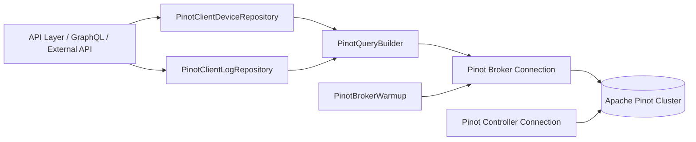
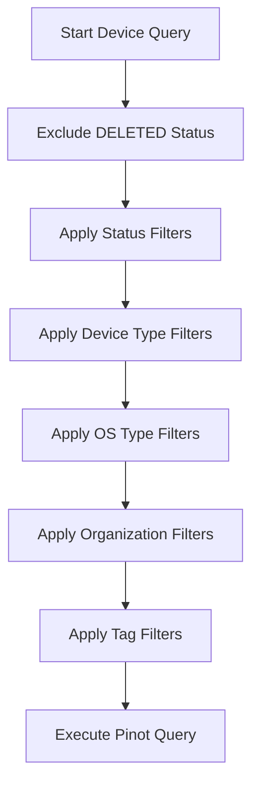
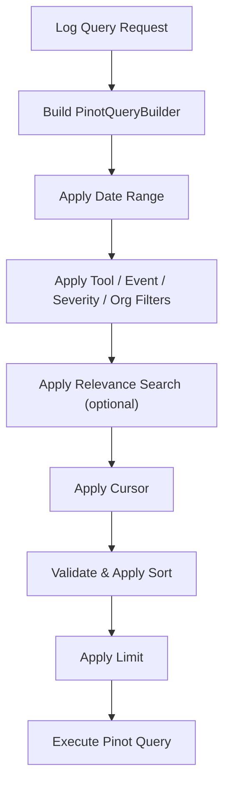
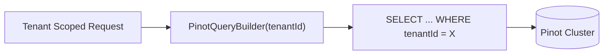
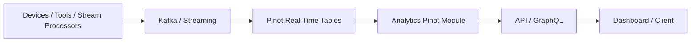

# Analytics Pinot

The **Analytics Pinot** module provides high-performance, real-time analytics capabilities for the OpenFrame platform using Apache Pinot. It is responsible for querying large volumes of time-series and event data (devices, logs, and related metadata) with low latency, enabling dashboards, filtering, search, and reporting use cases.

This module acts as the analytical read layer of the system, complementing MongoDB (operational storage) and Kafka/NATS (event ingestion and streaming).

---

## 1. Purpose and Responsibilities

Analytics Pinot is designed to:

- Provide fast, faceted filtering for devices
- Enable time-range log search with cursor-based pagination
- Support distinct filter option queries (e.g., severity, event type, tool type)
- Offer organization-based analytics projections
- Abstract Apache Pinot query construction and execution behind repository interfaces
- Warm up Pinot brokers at application startup to reduce first-query latency

It is optimized for read-heavy workloads and analytical queries across large datasets.

---

## 2. High-Level Architecture

Analytics Pinot sits between application services (API layer, GraphQL, external APIs) and the Pinot cluster.



### Key Architectural Concepts

- **Repository Pattern**: Encapsulates Pinot query logic.
- **Query Builder Abstraction**: Dynamically builds SQL queries with filters and sorting.
- **Broker vs Controller Connections**:
  - Broker: Executes analytical queries.
  - Controller: Used for cluster-level operations if needed.
- **Startup Warm-Up**: Ensures brokers are ready before first user query.

---

## 3. Configuration Layer

### 3.1 PinotConfig

`PinotConfig` defines Spring beans for connecting to Apache Pinot:

- `pinotBrokerConnection()`
- `pinotControllerConnection()`

Configuration properties:

```text
pinot.broker.url
pinot.controller.url
pinot.tables.devices.name
pinot.tables.logs.name
```

These connections are injected into repositories via `@Qualifier("pinotBrokerConnection")`.

### 3.2 PinotBrokerWarmup

`PinotBrokerWarmup` is conditionally enabled via:

```text
pinot.broker.warmup.enabled=true
```

On `ApplicationReadyEvent`, it executes:

```sql
SELECT COUNT(*) FROM "devices" LIMIT 1
```

Purpose:

- Pre-load broker routing tables
- Reduce cold-start latency
- Fail gracefully (non-blocking) if warm-up fails

---

## 4. Data Models

### 4.1 OrganizationOption

A lightweight projection model:

```text
id   -> organization identifier
name -> display name
```

Used when returning distinct organization filter options from logs.

### 4.2 PinotEventEntity

Currently acts as a placeholder entity for Pinot-backed event projections. It can be extended to represent denormalized event documents optimized for analytical reads.

---

## 5. Device Analytics Repository

### PinotClientDeviceRepository

Responsible for device-level analytics and filter aggregation.

#### Core Responsibilities

- Faceted filter queries (status, device type, OS type, organization, tags)
- Filtered device count queries
- Multi-dimensional filtering
- Exclusion of logically deleted devices

### Faceted Query Pattern

Each filter option query follows this structure:

```sql
SELECT {facetField}, COUNT(*) as count
FROM devices
WHERE <applied filters except facetField>
GROUP BY {facetField}
ORDER BY count DESC
```

Implemented through:

- `executeFacetQuery(...)`
- `applyDeviceFilters(...)`

### Device Filter Logic

All queries:

- Exclude `DELETED` status
- Apply OR-based filtering for:
  - status
  - deviceType
  - osType
  - organizationId
  - tags
  - tagKeyValues



### Counting Devices

`getFilteredDeviceCount(...)` builds a `SELECT COUNT(*)` query using the same filtering logic to ensure consistency between facet results and total counts.

---

## 6. Log Analytics Repository

### PinotClientLogRepository

Handles time-series log queries with advanced filtering and sorting.

#### Core Capabilities

- Time-range filtering
- Full-text relevance search
- Cursor-based pagination
- Distinct filter option queries
- Organization option projections
- Controlled sorting via allowlist

### 6.1 Log Query Flow



### 6.2 Sorting Safety

Only fields in `SORTABLE_COLUMNS` are allowed:

```text
eventTimestamp
severity
eventType
toolType
organizationId
deviceId
ingestDay
```

If the requested field is invalid:

- Sorting falls back to `eventTimestamp`
- A primary key (`toolEventId`) ensures deterministic pagination

### 6.3 Search vs Standard Query

- `findLogs(...)` → Structured filtering only
- `searchLogs(...)` → Includes `whereRelevanceLogSearch(searchTerm)`

This allows Pinot's indexing and relevance scoring to power free-text search.

### 6.4 Distinct Option Queries

Used to dynamically populate filter dropdowns:

- `getEventTypeOptions(...)`
- `getSeverityOptions(...)`
- `getToolTypeOptions(...)`
- `getAvailableDateRanges(...)`
- `getOrganizationOptions(...)`

These use `SELECT DISTINCT` patterns optimized for analytics.

---

## 7. Query Execution Abstraction

Both repositories extend `AbstractPinotRepository`.

Responsibilities abstracted away:

- Query execution against Pinot
- Result set mapping
- Column index resolution
- Count query execution
- Key-count mapping

This ensures:

- Centralized Pinot integration logic
- Reduced duplication
- Easier instrumentation and logging

---

## 8. Multi-Tenancy Model

All queries require a `tenantId`.

The `PinotQueryBuilder` enforces tenant scoping at query construction time.



This guarantees:

- Tenant isolation at the analytics layer
- Safe multi-tenant data access

---

## 9. Integration with the Platform

Analytics Pinot interacts with:

- Stream processing modules (for ingestion into Pinot tables)
- Device and log-producing services
- API and GraphQL layers consuming analytics projections

Typical data flow:



---

## 10. Performance Characteristics

Analytics Pinot is optimized for:

- Large-scale time-series data
- High-cardinality filter dimensions
- Fast aggregation queries
- Real-time dashboard refresh

Key optimizations include:

- Faceted aggregation queries
- Date partition filtering (`ingestDay`)
- Controlled sortable fields
- Broker warm-up at startup

---

## 11. Design Principles

- ✅ Separation of analytical and operational storage
- ✅ Repository abstraction over raw Pinot client
- ✅ Explicit multi-tenant scoping
- ✅ Deterministic cursor-based pagination
- ✅ Defensive sorting validation
- ✅ Non-blocking warm-up behavior

---

## 12. Summary

The **Analytics Pinot** module provides the analytical backbone of OpenFrame, enabling real-time insights into devices and logs at scale.

It:

- Connects securely to Apache Pinot
- Exposes optimized repositories for devices and logs
- Supports faceted filtering and full-text search
- Enforces tenant isolation
- Ensures predictable and safe sorting behavior
- Improves startup performance with broker warm-up

Together, these capabilities allow the platform to deliver responsive dashboards, advanced filtering, and scalable analytics over large operational datasets.
