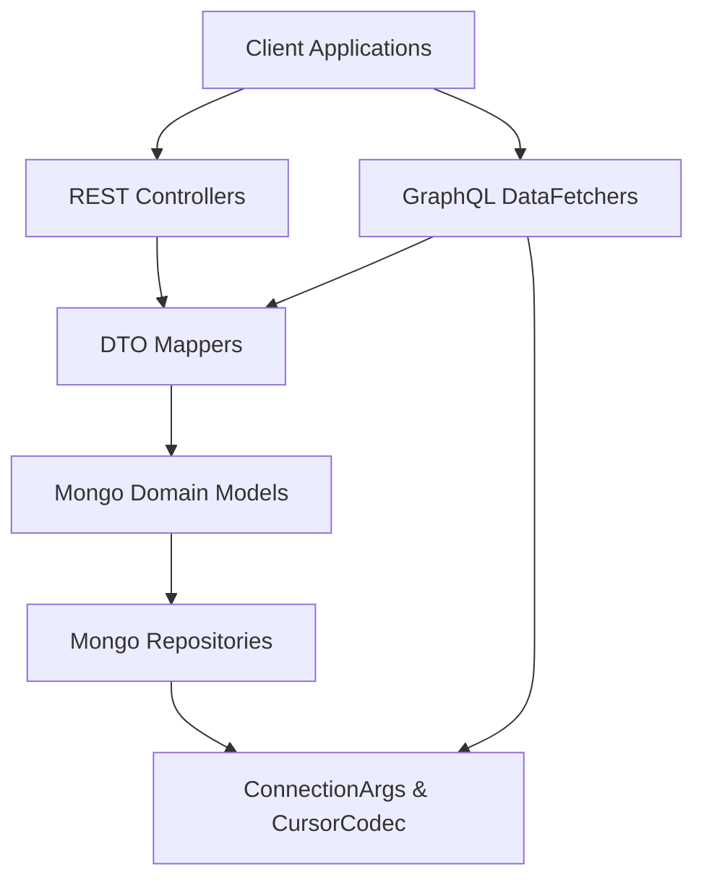
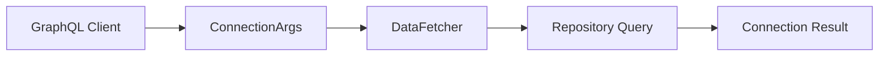
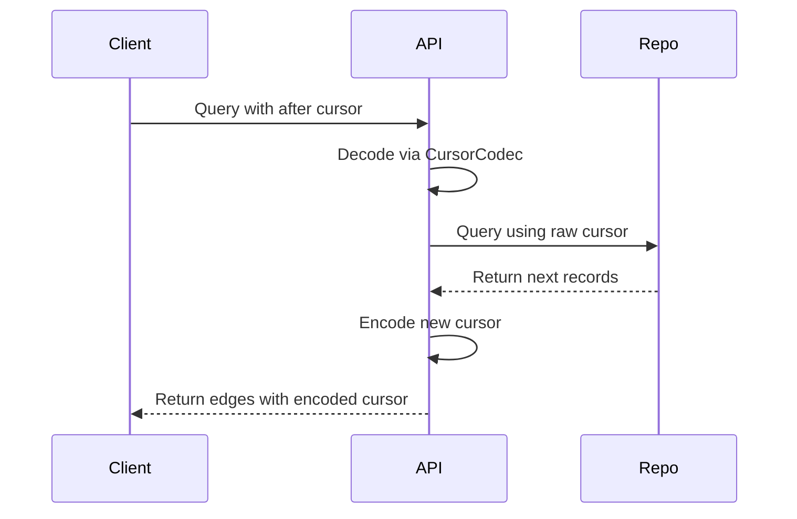
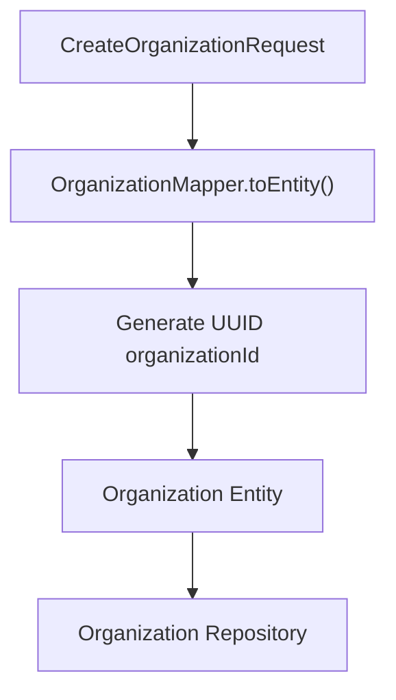
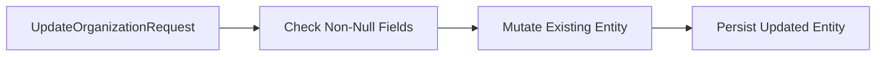

# Api Contracts And Mapping

## Overview

The **Api Contracts And Mapping** module defines the shared data transfer objects (DTOs), pagination contracts, cursor encoding utilities, and entity–DTO mappers used across the OpenFrame platform.

It acts as the **boundary layer** between:

- External API consumers (REST and GraphQL)
- Internal service logic
- Mongo domain models

By centralizing contracts and mapping logic, this module ensures:

- Consistent API shapes across REST and GraphQL
- Stable pagination semantics (Relay-style connections)
- Clean separation between persistence models and exposed DTOs
- Controlled mutation and update rules

This module is consumed by:

- [Api Service Core Rest Controllers](../api-service-core-rest-controllers/api-service-core-rest-controllers.md)
- [Api Service Core GraphQL](../api-service-core-graphql/api-service-core-graphql.md)
- [Api Service Core Dataloaders](../api-service-core-dataloaders/api-service-core-dataloaders.md)
- [Data Mongo Domain Model](../data-mongo-domain-model/data-mongo-domain-model.md)

---

## Architectural Role

The module sits between API-facing components and domain persistence models.



### Responsibilities

1. Define generic query result wrappers
2. Implement Relay-style pagination contracts
3. Provide cursor encoding/decoding utilities
4. Map domain entities to API DTOs and vice versa

---

## Core Components

### 1. CountedGenericQueryResult

**Component:**  
`openframe-oss-lib.openframe-api-lib.src.main.java.com.openframe.api.dto.CountedGenericQueryResult.CountedGenericQueryResult`

#### Purpose

Extends a generic query result wrapper by including a `filteredCount` field.

This is particularly useful when:

- A query applies filters
- The client needs to know the total filtered result size
- Pagination metadata must include both page data and total counts

#### Structure

```java
public class CountedGenericQueryResult<T> extends GenericQueryResult<T> {
    private int filteredCount;
}
```

#### Usage Context

Used in REST endpoints and GraphQL resolvers where:

- Server-side filtering is applied
- Clients need accurate total counts for UI pagination

---

### 2. ConnectionArgs

**Component:**  
`openframe-oss-lib.openframe-api-lib.src.main.java.com.openframe.api.dto.shared.ConnectionArgs.ConnectionArgs`

#### Purpose

Implements **Relay Connection Specification** pagination arguments.

Supports both forward and backward pagination:

- Forward: `first` + `after`
- Backward: `last` + `before`

#### Validation Rules

- `first` and `last` must be between 1 and 100
- Enforced via Jakarta Bean Validation

```java
@Min(1)
@Max(100)
private Integer first;

private String after;

@Min(1)
@Max(100)
private Integer last;

private String before;
```

#### Architectural Impact

ConnectionArgs standardizes pagination across:

- GraphQL data fetchers
- Repository queries
- Relay-compliant frontend clients



---

### 3. CursorCodec

**Component:**  
`openframe-oss-lib.openframe-api-lib.src.main.java.com.openframe.api.dto.shared.CursorCodec.CursorCodec`

#### Purpose

Encodes and decodes opaque Relay-style cursors using Base64.

This prevents clients from:

- Seeing internal database identifiers
- Coupling to Mongo ObjectIds
- Manipulating raw cursor state

#### Encoding Logic

```java
public static String encode(String rawCursor)
```

- Converts raw internal cursor value
- Encodes using Base64 (UTF-8)
- Returns opaque string

#### Decoding Logic

```java
public static String decode(String opaqueCursor)
```

- Attempts Base64 decode
- Returns null on invalid input

#### Data Flow Example



---

### 4. OrganizationMapper

**Component:**  
`openframe-oss-lib.openframe-api-lib.src.main.java.com.openframe.api.mapper.OrganizationMapper.OrganizationMapper`

#### Purpose

Provides bidirectional mapping between:

- Organization domain entities
- Organization request DTOs
- Organization response DTOs

Used by both REST and GraphQL APIs.

#### Mapping Responsibilities

1. Convert `CreateOrganizationRequest` → `Organization`
2. Partial update using `UpdateOrganizationRequest`
3. Convert `Organization` → `OrganizationResponse`
4. Map nested objects:
   - ContactInformation
   - ContactPerson
   - Address

---

### Organization Creation Flow



#### Key Design Decisions

- `organizationId` is generated as UUID
- `organizationId` is immutable
- `isDefault` is forced to false on creation
- Nested DTOs are mapped explicitly

---

### Partial Update Strategy

The `updateEntity` method:

- Updates only non-null request fields
- Protects immutable fields (`organizationId`)
- Enables PATCH-like semantics



---

## Interaction With Other Modules

### With Api Service Core Rest Controllers

REST controllers:

- Accept request DTOs
- Use mappers to convert to entities
- Return response DTOs

See:  
[Api Service Core Rest Controllers](../api-service-core-rest-controllers/api-service-core-rest-controllers.md)

---

### With Api Service Core GraphQL

GraphQL data fetchers:

- Use ConnectionArgs for pagination
- Use CursorCodec for opaque cursors
- Use OrganizationMapper for DTO conversion

See:  
[Api Service Core GraphQL](../api-service-core-graphql/api-service-core-graphql.md)

---

### With Data Mongo Domain Model

The mapper layer isolates:

- Mongo document structure
- Persistence concerns
- Internal status fields

From:

- API response structure
- Public contract stability

See:  
[Data Mongo Domain Model](../data-mongo-domain-model/data-mongo-domain-model.md)

---

## Design Principles

### 1. Contract Stability

API DTOs are decoupled from domain models to prevent breaking changes.

### 2. Opaque Pagination

Cursor encoding ensures:

- No exposure of database internals
- Freedom to change persistence strategies

### 3. Explicit Mapping

Mapping is not implicit or reflection-based.

Benefits:

- Full control over field exposure
- Security through explicit inclusion
- Easier evolution of API contracts

### 4. Controlled Mutation

Update methods:

- Enforce immutability rules
- Prevent accidental ID overwrites
- Support partial update semantics

---

## Summary

The **Api Contracts And Mapping** module defines the structural backbone of the OpenFrame API layer.

It ensures:

- Consistent pagination semantics
- Safe cursor handling
- Stable DTO contracts
- Clear entity-to-DTO transformation rules

Without this module, REST controllers and GraphQL resolvers would tightly couple to persistence models, increasing the risk of breaking changes and security issues.

This module is foundational to maintaining API integrity across the OpenFrame ecosystem.