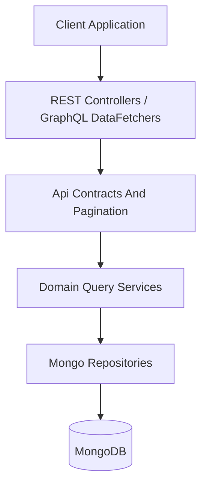
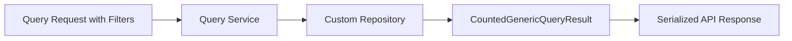
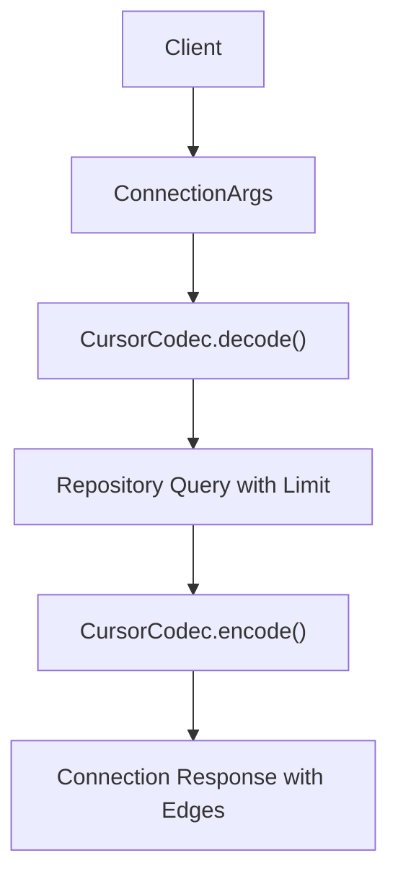
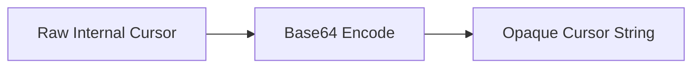
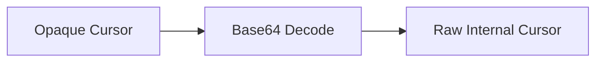
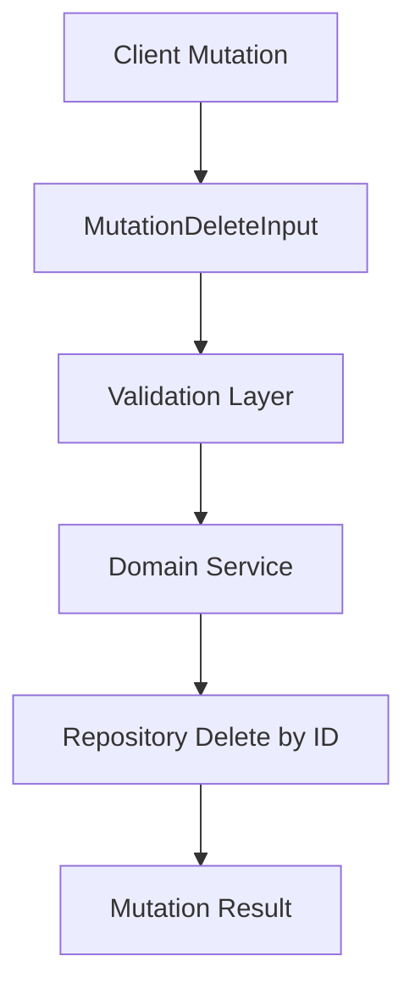
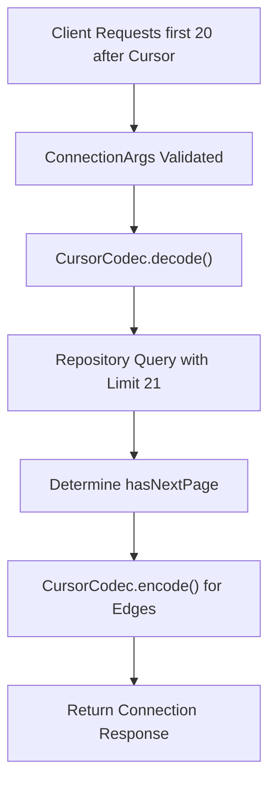

# Api Contracts And Pagination

## Overview

The **Api Contracts And Pagination** module defines the foundational API data contracts used across OpenFrame services, with a strong focus on:

- Relay-style cursor-based pagination
- Count-aware query results
- Opaque cursor encoding and decoding
- Standardized mutation input structures

This module sits at the boundary between transport layers (REST and GraphQL) and domain/query services. It ensures consistent, predictable API behavior across the platform while hiding internal persistence details (such as MongoDB identifiers or composite keys) from API consumers.

---

## Core Responsibilities

The Api Contracts And Pagination module provides:

1. **Generic query result wrappers** with total/filtered counts
2. **Relay-compliant pagination arguments**
3. **Opaque cursor encoding/decoding utilities**
4. **Standard mutation input contracts (e.g., delete by ID)**

These contracts are reused by:

- GraphQL data fetchers
- REST controllers
- Domain query services
- MongoDB custom repositories

---

## Architectural Positioning

The module acts as a shared contract layer between API entry points and data/query layers.



### Key Characteristics

- **Transport-agnostic**: Works with both REST and GraphQL.
- **Persistence-agnostic**: Does not expose internal database identifiers.
- **Validation-aware**: Uses Jakarta validation annotations for input constraints.
- **Relay-compliant**: Follows the GraphQL Relay Connection specification patterns.

---

# Core Components

## 1. CountedGenericQueryResult

**Class:** `CountedGenericQueryResult<T>`  
**Extends:** `GenericQueryResult<T>`  

### Purpose

Adds a `filteredCount` field to a generic query result, allowing APIs to return:

- The current page of results
- Total elements (from base class)
- Filtered result count (after applying search/filter criteria)

### Structure

```text
CountedGenericQueryResult<T>
 ├─ List<T> results
 ├─ int totalCount
 └─ int filteredCount
```

### Why It Matters

This structure enables:

- Efficient UI pagination
- Accurate result counts after filtering
- Consistent response shape across domains (devices, events, users, etc.)

### Example Usage Flow



The `filteredCount` is especially important when:

- Full dataset size is large
- Filters significantly reduce results
- UI must display: "Showing 10 of 245 filtered results"

---

## 2. ConnectionArgs

**Class:** `ConnectionArgs`

### Purpose

Defines Relay-style pagination arguments used primarily in GraphQL connections.

Supports:

- Forward pagination: `first` + `after`
- Backward pagination: `last` + `before`

### Field Definitions

```text
ConnectionArgs
 ├─ Integer first   (min 1, max 100)
 ├─ String after
 ├─ Integer last    (min 1, max 100)
 └─ String before
```

### Validation Rules

- `first` and `last` must be between 1 and 100.
- Validation is enforced via Jakarta annotations.
- Prevents excessive data loading and abuse.

### Pagination Model



### Design Principles

- Hard limit (100) protects backend resources.
- Supports bi-directional pagination.
- Compatible with Relay Connection pattern.

---

## 3. CursorCodec

**Class:** `CursorCodec`

### Purpose

Encodes and decodes opaque pagination cursors using Base64.

This ensures that internal cursor values such as:

- MongoDB ObjectIds
- Composite keys (e.g., "timestamp_eventId")
- Internal database offsets

are not exposed directly to API consumers.

### Encoding Flow



### Decoding Flow



### Key Behaviors

- Returns `null` for null or empty input.
- Gracefully handles invalid Base64 input.
- Hides implementation details from clients.

### Example

```text
Raw Cursor:  665fae2b3a91c87b12345678
Encoded:     NjY1ZmFlMmIzYTkxYzg3YjEyMzQ1Njc4
```

This pattern guarantees that clients cannot infer database structure or ordering logic.

---

## 4. MutationDeleteInput

**Class:** `MutationDeleteInput`

### Purpose

Defines a standard mutation input structure for delete operations.

### Structure

```text
MutationDeleteInput
 └─ String id  (must not be blank)
```

### Design Rationale

- Enforces explicit ID-based deletion.
- Aligns with GraphQL mutation input patterns.
- Supports validation via `@NotBlank`.

### Mutation Flow



---

# Pagination Strategy in the Platform

The Api Contracts And Pagination module supports two complementary patterns:

## 1. Cursor-Based Pagination (GraphQL)

Used for connection-based queries:

- Forward and backward navigation
- Opaque cursors
- Relay compliance

Benefits:

- Stable pagination even with concurrent inserts
- No reliance on numeric offsets
- Efficient indexed queries

## 2. Counted Query Results (REST or Hybrid)

Used where:

- UI requires total/filtered counts
- Offset-based or filtered queries are needed
- Simpler REST-style pagination is sufficient

---

# End-to-End Data Flow Example

Below is a complete pagination lifecycle example.



### Why Fetch 21 for a Limit of 20?

To determine if:

- There is a next page
- `hasNextPage` should be true

This pattern ensures efficient and correct pagination semantics.

---

# Design Principles

The Api Contracts And Pagination module follows these core principles:

1. **Consistency Across Domains**  
   Devices, events, users, organizations, and tools all use uniform contracts.

2. **Opaque by Default**  
   Clients never see internal IDs or composite keys.

3. **Validation at the Edge**  
   Input constraints are enforced before hitting service layers.

4. **Resource Safety**  
   Pagination limits prevent unbounded queries.

5. **Transport Layer Neutrality**  
   Usable by both REST controllers and GraphQL data fetchers.

---

# Summary

The **Api Contracts And Pagination** module is a foundational contract layer for OpenFrame APIs.

It standardizes:

- How lists are queried
- How pagination works
- How cursors are encoded
- How deletions are requested

By centralizing these patterns, the platform achieves:

- Predictable API behavior
- Secure data exposure boundaries
- Efficient pagination at scale
- Strong validation guarantees

This module underpins consistent API design across the entire OpenFrame ecosystem.