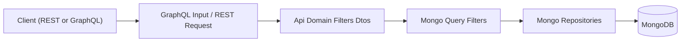
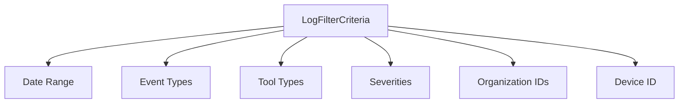
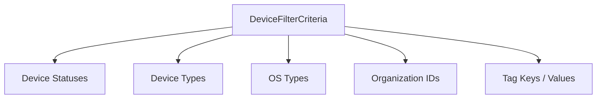
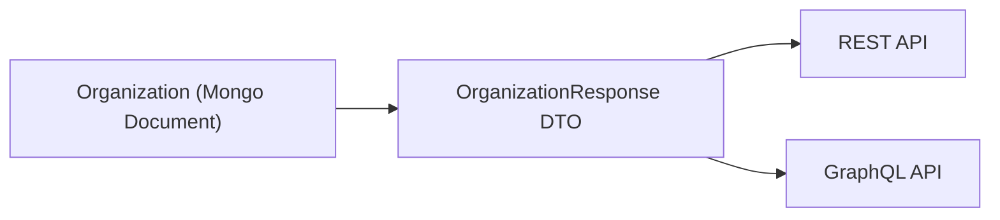
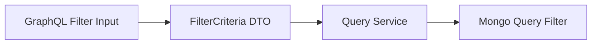
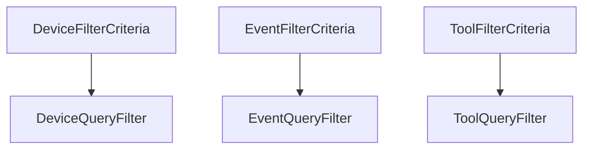

# Api Domain Filters Dtos

The **Api Domain Filters Dtos** module defines the domain-level Data Transfer Objects (DTOs) used to:

- Express filtering criteria for core entities (Devices, Events, Logs, Knowledge Base, Organizations, Tools)
- Provide structured filter metadata for UI dropdowns and faceted search
- Standardize list and response payloads shared across REST and GraphQL layers

This module acts as a **contract layer** between:

- GraphQL DataFetchers and REST Controllers
- Core services and query layers
- Mongo query filter builders and repositories

It does not contain business logic. Instead, it provides strongly typed filter contracts that drive query construction in downstream modules.

---

## Architectural Role

At a high level, Api Domain Filters Dtos sits between API input DTOs and persistence query filters.

### Responsibilities

1. **Normalize filter structures** across APIs
2. **Encapsulate filtering intent** in strongly typed criteria classes
3. **Support UI filter metadata responses** (counts, labels, selectable options)
4. **Bridge domain enums and database query filters**

---

# Core Filter Patterns

Across entities, this module follows consistent patterns:

## 1. *FilterCriteria Classes*

These represent the filtering rules submitted by the client.

Examples:

- `LogFilterCriteria`
- `DeviceFilterCriteria`
- `EventFilterCriteria`
- `KnowledgeBaseFilterCriteria`
- `ToolFilterCriteria`

These classes typically include:

- Date ranges (`startDate`, `endDate`)
- Entity type filters
- Status filters
- Organization scoping
- Tag-based filtering

They are consumed by service/query layers to build Mongo queries.

---

## 2. *Filters Classes (Faceted Responses)*

These classes provide filter metadata for UI dropdowns and dashboards.

Examples:

- `LogFilters`
- `DeviceFilters`
- `EventFilters`
- `ToolFilters`

They usually contain:

- Available filter values
- Display labels
- Optional counts per filter value

These enable dynamic filtering experiences (faceted search).

---

## 3. *List & Response DTOs*

Used to standardize list responses and entity projections:

- `OrganizationList`
- `ToolList`
- `OrganizationResponse`

These are shared between:

- GraphQL DTO layer
- REST external API layer

---

# Entity-Specific Filter Structures

## Log Filtering

### LogFilterCriteria

Encapsulates audit log filtering rules:

- `startDate` / `endDate`
- `eventTypes`
- `toolTypes`
- `severities`
- `organizationIds`
- `deviceId`

### LogFilters

Provides available values for:

- Tool types
- Event types
- Severities
- Organizations (via `OrganizationFilterOption`)

### OrganizationFilterOption

Represents a selectable organization option:

- `id`
- `name`

Used primarily for UI dropdown population.

---

## Device Filtering

### DeviceFilterCriteria

Supports multi-dimensional filtering:

- `statuses` (DeviceStatus enum)
- `deviceTypes` (DeviceType enum)
- `osTypes`
- `organizationIds`
- `tagKeys`
- `tagValues`

### DeviceFilters

Faceted filter response containing:

- `statuses`
- `deviceTypes`
- `osTypes`
- `organizationIds`
- `tagKeys`
- `filteredCount`

Each option is represented by:

### DeviceFilterOption

- `value`
- `label`
- `count`

### TagFilterOption

- `key`
- `value`
- `count`

This enables advanced tag-based device filtering.

---

## Event Filtering

### EventFilterCriteria

Filters system/user events by:

- `userIds`
- `eventTypes`
- `startDate`
- `endDate`

### EventFilters

Returns available:

- User IDs
- Event types

This supports activity feed filtering and auditing dashboards.

---

## Knowledge Base Filtering

### KnowledgeBaseFilterCriteria

Used to query hierarchical content:

- `parentId`
- `type` (KnowledgeBaseItemType enum)
- `tagIds`
- `statuses` (KnowledgeBaseArticleStatus enum)

This enables:

- Folder-level filtering
- Tag-based content queries
- Status-based moderation filtering

---

## Organization Filtering & Responses

### OrganizationFilterOptions

Internal filtering structure for:

- `category`
- `minEmployees`
- `maxEmployees`
- `hasActiveContract`
- `status`

### OrganizationList

Wrapper for returning multiple Organization documents.

### OrganizationResponse

Shared response DTO across GraphQL and REST.

Contains:

- Identity fields (`id`, `organizationId`)
- Business metadata
- Revenue and contract information
- Lifecycle timestamps
- Status fields

---

## Tool Filtering

### ToolFilterCriteria

Filters integrated tools by:

- `enabled`
- `type`
- `category`
- `platformCategory`

### ToolFilters

Provides available:

- Tool types
- Categories
- Platform categories

### ToolList

Wrapper for returning a list of `IntegratedTool` domain documents.

---

# Interaction with Other Layers

## With GraphQL Layer

GraphQL input DTOs are transformed into FilterCriteria objects, which are then passed to service/query layers.

## With Mongo Query Filters

Each FilterCriteria maps conceptually to a corresponding Mongo query filter class in the query layer.

Example conceptual mapping:

The DTO layer remains persistence-agnostic, while query modules handle database-specific logic.

---

# Design Principles

The Api Domain Filters Dtos module follows these architectural principles:

1. **Separation of Concerns**  
   DTOs describe intent; services implement logic.

2. **Strong Typing**  
   Uses enums and structured lists instead of raw maps.

3. **UI-Driven Design**  
   Includes filter option and count DTOs for faceted filtering.

4. **Cross-API Reusability**  
   Shared response DTOs prevent duplication across REST and GraphQL.

5. **Extensibility**  
   New filter dimensions can be added without impacting existing consumers.

---

# Summary

The **Api Domain Filters Dtos** module provides the structured filtering and response contracts that power:

- Device management
- Audit logs
- Event tracking
- Knowledge base content
- Organization management
- Tool integrations

It forms the backbone of query expressiveness across the OpenFrame API stack, enabling consistent filtering semantics across services, APIs, and persistence layers.