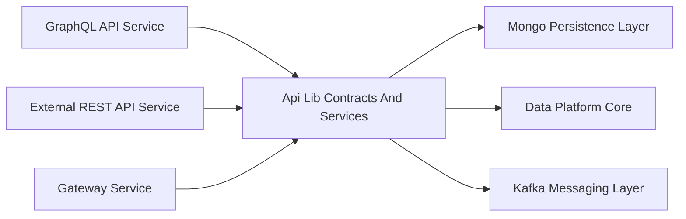
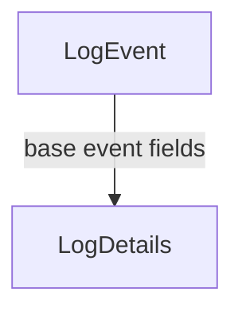
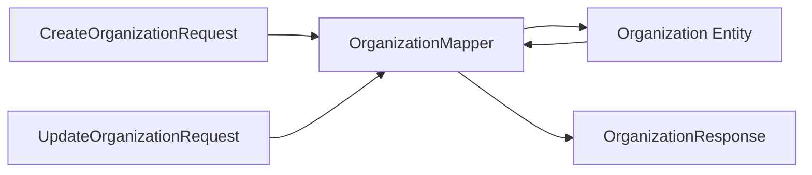
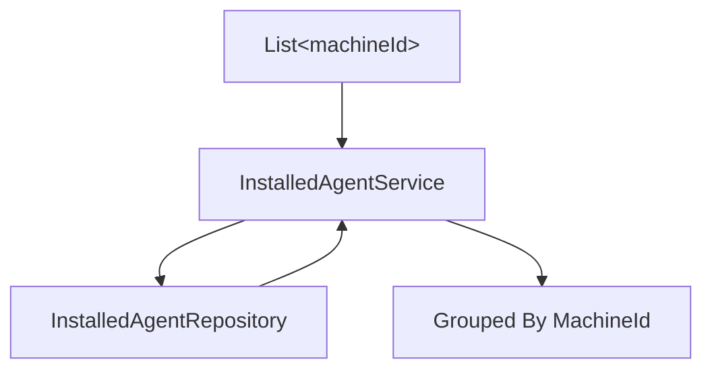
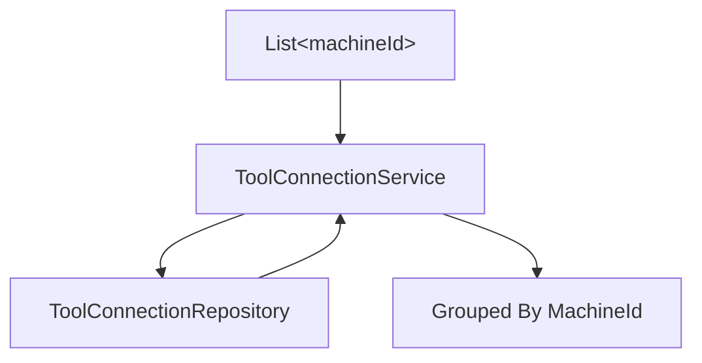
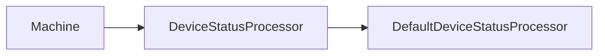

# Api Lib Contracts And Services

## Overview

The **Api Lib Contracts And Services** module defines the shared API contracts, DTOs, mappers, and reusable service components used across the OpenFrame backend ecosystem.

It acts as a **contract layer** between:

- API-facing modules (GraphQL and REST services)
- Persistence layers (Mongo, Cassandra, Pinot)
- Messaging layers (Kafka)
- Client agent services

By centralizing DTOs and cross-cutting services in this module, OpenFrame ensures:

- Consistent data models across internal and external APIs
- Reduced duplication between GraphQL and REST implementations
- Stable integration boundaries between microservices
- Reusable service utilities for DataLoader and processing logic

---

## Architectural Role in the Platform

The Api Lib Contracts And Services module sits between API entry points and lower-level data modules.



### Responsibilities

1. Define shared DTOs (request/response models)
2. Define filtering contracts for devices, logs, tools, events, and organizations
3. Provide shared mapping logic (e.g., OrganizationMapper)
4. Provide reusable service components used by higher-level APIs
5. Provide default processors and extension points

---

# Core Functional Areas

The module can be logically divided into the following areas:

1. Generic Query & Pagination Contracts
2. Audit & Log Contracts
3. Device Contracts
4. Event Contracts
5. Organization Contracts
6. Tool Contracts
7. Shared Services
8. Mapping Layer

---

## 1. Generic Query & Pagination Contracts

### CountedGenericQueryResult

`CountedGenericQueryResult<T>` extends a generic query result with a `filteredCount` field.

```text
CountedGenericQueryResult<T>
 ├─ items (from GenericQueryResult)
 └─ filteredCount
```

This pattern supports:

- Server-side filtering
- Client-side UI display of "X results found"
- Cursor or offset-based pagination

### CursorPaginationInput

Defines cursor-based pagination input:

```text
CursorPaginationInput
 ├─ limit (1..100)
 └─ cursor
```

Features:

- Validation constraints on limit
- Support for forward pagination
- Compatible with GraphQL connections and REST pagination

---

## 2. Audit & Log Contracts

These DTOs define the structure of audit logs and filtering criteria.

### LogEvent vs LogDetails



- **LogEvent**: Lightweight event representation (summary-level).
- **LogDetails**: Extended version including `message` and `details`.

Fields include:

- toolEventId
- eventType
- toolType
- severity
- organizationId
- deviceId
- timestamp

### LogFilterOptions

Defines filtering input:

```text
LogFilterOptions
 ├─ startDate
 ├─ endDate
 ├─ eventTypes
 ├─ toolTypes
 ├─ severities
 ├─ organizationIds
 └─ deviceId
```

### LogFilters

Defines available filter values returned to clients (e.g., dropdowns):

- toolTypes
- eventTypes
- severities
- organizations

### OrganizationFilterOption

Represents a simple id + name pair used in filter dropdowns.

---

## 3. Device Contracts

Device filtering is split into:

- Filter input definitions
- Filter option responses
- Aggregated filter metadata

### DeviceFilterOptions

Defines possible filter constraints:

- statuses
- deviceTypes
- osTypes
- organizationIds
- tagNames

### DeviceFilters

Returned to clients with enriched metadata:

```text
DeviceFilters
 ├─ statuses (with count)
 ├─ deviceTypes (with count)
 ├─ osTypes (with count)
 ├─ organizationIds (with count)
 ├─ tags (with count)
 └─ filteredCount
```

### DeviceFilterOption and TagFilterOption

Provide:

- value
- label
- count

These enable dynamic filter UIs with per-option counts.

---

## 4. Event Contracts

Event filtering is simpler than log filtering.

### EventFilterOptions

```text
EventFilterOptions
 ├─ userIds
 ├─ eventTypes
 ├─ startDate
 └─ endDate
```

### EventFilters

Represents selected or available filter values:

- userIds
- eventTypes

---

## 5. Organization Contracts

Organization contracts are shared across GraphQL and REST services.

### OrganizationResponse

Primary DTO used externally.

Includes:

- identity (id, organizationId)
- metadata (category, numberOfEmployees)
- financial (monthlyRevenue)
- contract dates
- contact information
- lifecycle flags (deleted, isDefault)

### OrganizationList

Wrapper DTO:

```text
OrganizationList
 └─ organizations[]
```

### OrganizationFilterOptions

Used for filtering organizations internally:

- category
- minEmployees
- maxEmployees
- hasActiveContract

---

## 6. Tool Contracts

Defines filtering and listing logic for integrated tools.

### ToolFilterOptions

```text
ToolFilterOptions
 ├─ enabled
 ├─ type
 ├─ category
 └─ platformCategory
```

### ToolFilters

Represents selected or available tool filter dimensions:

- types
- categories
- platformCategories

### ToolList

```text
ToolList
 └─ tools[]
```

Uses `IntegratedTool` from the data layer.

---

# Mapping Layer

## OrganizationMapper

The `OrganizationMapper` is a central mapping component shared between API layers.

### Responsibilities

1. Convert CreateOrganizationRequest → Organization entity
2. Perform partial updates from UpdateOrganizationRequest
3. Convert Organization → OrganizationResponse
4. Map nested contact information structures
5. Generate unique organizationId (UUID-based)



### Design Principles

- organizationId is immutable once created
- Partial updates only modify non-null fields
- Mailing address can mirror physical address
- Mapping is explicit (no reflection-based magic)

This ensures stable API contracts and predictable transformation behavior.

---

# Shared Services

The module provides reusable services used by API services and DataLoader mechanisms.

## InstalledAgentService

Provides batched and single-machine retrieval methods.

### Key Feature: DataLoader-Friendly Batching



Supports:

- findByMachineIdIn
- findByMachineId
- findByMachineIdAndAgentType
- findAll

Optimized for GraphQL DataLoader usage to avoid N+1 query problems.

---

## ToolConnectionService

Similar batching pattern for tool connections.



Provides:

- Batched retrieval
- Per-machine retrieval

---

## DefaultDeviceStatusProcessor

Provides a default implementation of `DeviceStatusProcessor`.

Characteristics:

- Activated only if no other bean is defined
- Logs device status updates
- Extension point for advanced status handling



This allows platform-specific services to override behavior without modifying the core module.

---

# Design Patterns Used

## 1. Contract-First Design

DTOs are defined centrally and reused across:

- GraphQL APIs
- REST APIs
- Internal services

## 2. Separation of Concerns

- DTOs: Represent API contracts
- Mapper: Translates between DTO and entity
- Services: Encapsulate business retrieval logic
- Persistence: Located in separate modules

## 3. Batch Loading Pattern

Used in:

- InstalledAgentService
- ToolConnectionService

Prevents N+1 issues in GraphQL execution.

## 4. Extension via Conditional Beans

DefaultDeviceStatusProcessor demonstrates Spring’s conditional override pattern.

---

# How This Module Fits Into the System

The Api Lib Contracts And Services module is the **shared API foundation** for the OpenFrame backend.

It enables:

- Unified data contracts across internal and external APIs
- Clean layering between API and persistence
- Extensible processing hooks
- Efficient batched data retrieval

Without this module, each API service would duplicate DTOs, mapping logic, and service utilities—leading to contract drift and maintenance complexity.

This module ensures consistency, reuse, and architectural clarity across the platform.
