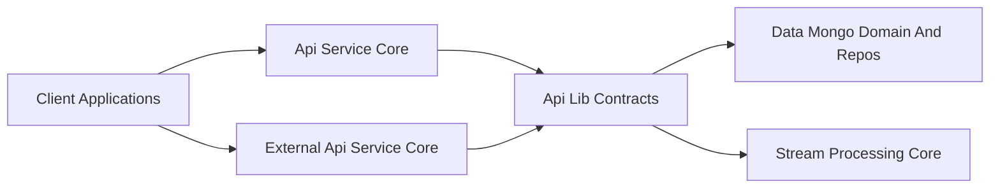
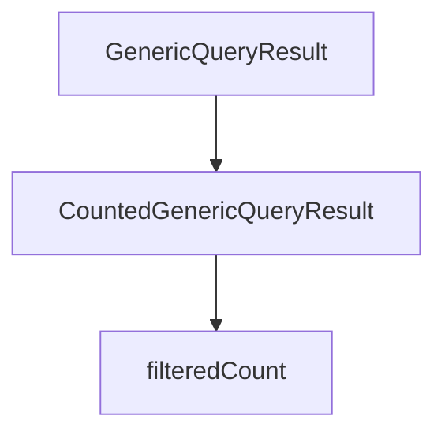
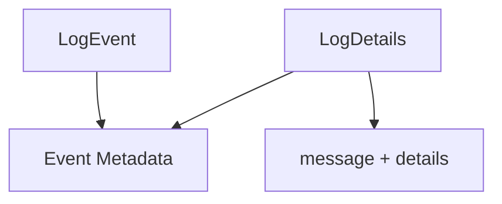
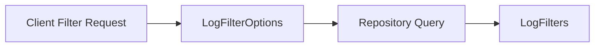
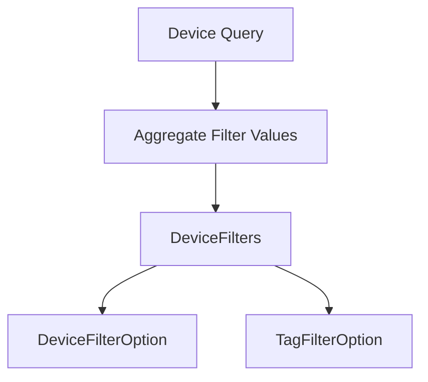
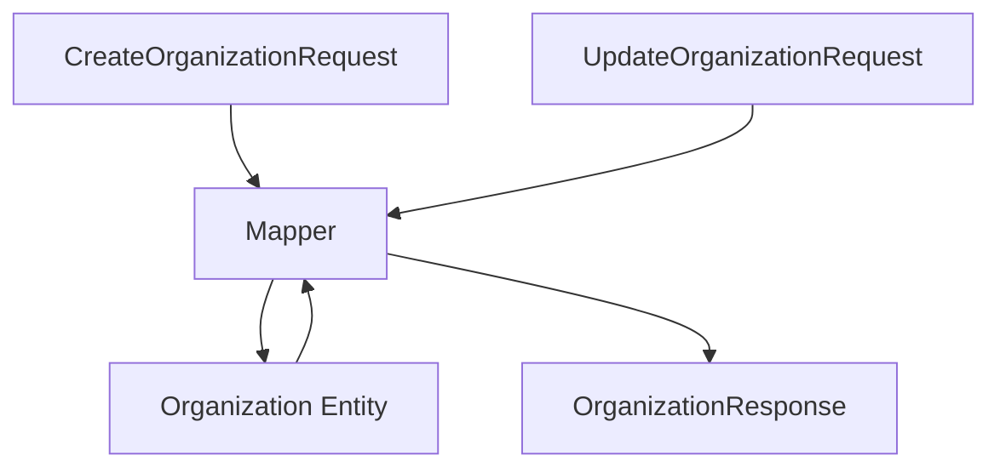
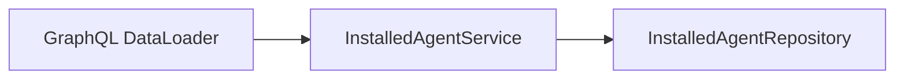
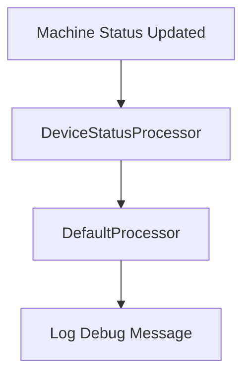
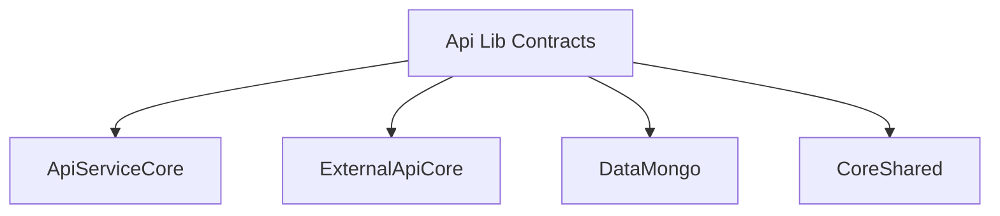

# Api Lib Contracts

## Overview

The **Api Lib Contracts** module defines the shared API contracts, data transfer objects (DTOs), filter models, and mapping utilities used across the OpenFrame backend services.

It acts as a **contract boundary layer** between:

- API-facing modules such as [Api Service Core](../api-service-core/api-service-core.md) and [External Api Service Core](../external-api-service-core/external-api-service-core.md)
- Data and domain modules such as [Data Mongo Domain And Repos](../data-mongo-domain-and-repos/data-mongo-domain-and-repos.md)
- Supporting services such as [Authorization Service Core](../authorization-service-core/authorization-service-core.md)

This module ensures:

- A consistent and reusable contract model across REST and GraphQL APIs
- Centralized filtering models for devices, events, logs, tools, and organizations
- Shared pagination abstractions
- Reusable mappers for translating between persistence entities and API DTOs

---

## Architectural Role

Api Lib Contracts sits between domain persistence and API layers.

### Responsibilities

1. Define API-safe DTOs
2. Define filtering and query option models
3. Provide reusable mapping logic
4. Provide shared service abstractions used by GraphQL DataLoaders
5. Provide generic pagination and result wrappers

---

## Module Structure

The Api Lib Contracts module is organized into the following logical areas:

- Audit DTOs
- Device DTOs
- Event DTOs
- Organization DTOs
- Tool DTOs
- Shared DTOs
- Mappers
- Supporting Services
- Processors

---

# 1. Generic Query and Pagination Contracts

## CountedGenericQueryResult

`CountedGenericQueryResult<T>` extends a base `GenericQueryResult<T>` and adds:

- `filteredCount` – total number of items after filters are applied

This is typically used when:

- Returning paginated GraphQL results
- Providing filtered counts for dashboards

---

## CursorPaginationInput

`CursorPaginationInput` defines a cursor-based pagination model:

- `limit` (validated between 1 and 100)
- `cursor`

This abstraction is shared across GraphQL queries and REST endpoints where cursor pagination is used.

---

# 2. Audit and Log Contracts

The audit package defines models used for querying and returning log data.

## LogEvent vs LogDetails

- `LogEvent` → Lightweight summary model
- `LogDetails` → Extended version including `message` and `details`

Common fields include:

- toolEventId
- eventType
- toolType
- severity
- organization metadata
- timestamp

---

## Log Filtering

### LogFilterOptions

Represents input constraints for filtering logs:

- Date range
- Event types
- Tool types
- Severities
- Organization IDs
- Device ID

### LogFilters

Represents aggregated filter values returned to the client (e.g., dropdown options):

- toolTypes
- eventTypes
- severities
- organizations (via `OrganizationFilterOption`)

---

# 3. Device Contracts

The device DTOs define filtering and aggregation structures used by the API layer.

## DeviceFilterOptions

Defines filter inputs:

- statuses
- deviceTypes
- osTypes
- organizationIds
- tagNames

These correlate directly to fields in the `Machine` domain model from the data layer.

---

## DeviceFilters

Represents aggregated filter metadata returned to clients:

- statuses
- deviceTypes
- osTypes
- organizationIds
- tags
- filteredCount

Each filter option includes:

- value
- label
- count

---

# 4. Event Contracts

## EventFilterOptions

Defines filtering inputs:

- userIds
- eventTypes
- startDate
- endDate

## EventFilters

Defines filter aggregations returned to clients.

These DTOs are used by:

- Api Service Core GraphQL DataFetchers
- External Api Service Core REST controllers

---

# 5. Organization Contracts

Organization DTOs are shared across GraphQL and REST APIs.

## OrganizationResponse

This is the central API-facing representation of an organization.

Fields include:

- id
- organizationId (immutable UUID)
- category
- employee counts
- contract dates
- financial data
- soft delete metadata

---

## OrganizationMapper

`OrganizationMapper` is a shared Spring component responsible for:

- Mapping CreateOrganizationRequest → Organization entity
- Mapping UpdateOrganizationRequest → partial entity updates
- Mapping Organization entity → OrganizationResponse
- Handling nested mapping for:
  - ContactInformation
  - Address
  - ContactPerson

### Key Design Decisions

- organizationId is generated as UUID and immutable
- Partial updates only modify non-null fields
- Mailing address can mirror physical address via copy logic

---

# 6. Tool Contracts

## ToolFilterOptions

Defines tool filtering inputs:

- enabled
- type
- category
- platformCategory

## ToolFilters

Aggregated filter values:

- types
- categories
- platformCategories

## ToolList

Wraps a list of `IntegratedTool` domain entities for API responses.

---

# 7. Supporting Services

Although primarily a contract module, Api Lib Contracts also provides reusable service logic for API layers.

## InstalledAgentService

Provides batch-friendly retrieval methods:

- getInstalledAgentsForMachines(List<String>)
- getInstalledAgentsForMachine(String)
- getInstalledAgentByMachineIdAndType(String, String)

This service is optimized for GraphQL DataLoader usage.

---

## ToolConnectionService

Provides batched retrieval of tool connections per machine.

Used in similar fashion to avoid N+1 query issues.

---

# 8. Device Status Processor Extension Point

## DefaultDeviceStatusProcessor

Provides a default implementation of `DeviceStatusProcessor`.

- Logs status updates
- Marked with `@ConditionalOnMissingBean`

This allows downstream services to override behavior without modifying the core contract module.

---

# Cross-Module Relationships

Api Lib Contracts is consumed by:

- Api Service Core (GraphQL controllers and DataFetchers)
- External Api Service Core (REST controllers)
- Gateway Service Core (via DTO alignment)
- Authorization Service Core (shared organization and user models)

It depends on:

- Data Mongo Domain And Repos for entities
- Core Shared Utilities for pagination and validation utilities

---

# Design Principles

1. Single Source of Truth for API DTOs
2. Separation of Persistence and API Models
3. Batch-Friendly Service Abstractions
4. Filter-Aware Response Modeling
5. Extensible via Conditional Beans

---

# Summary

The **Api Lib Contracts** module is the shared contract backbone of the OpenFrame API ecosystem.

It provides:

- Consistent DTOs for devices, events, logs, organizations, and tools
- Shared filtering abstractions
- Pagination models
- Mapping logic between domain entities and API contracts
- Batch-friendly services used by higher-level API modules

By centralizing these contracts, OpenFrame ensures consistency across REST and GraphQL APIs while maintaining clean separation from persistence and infrastructure layers.
