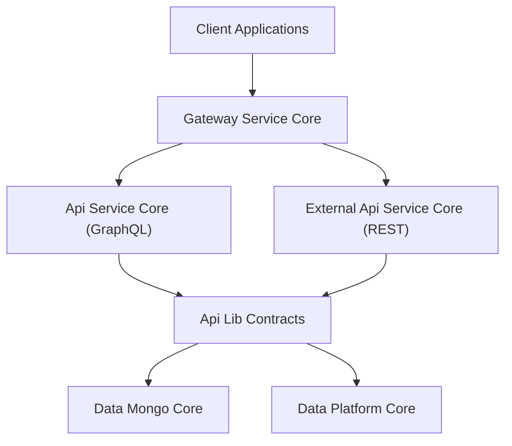
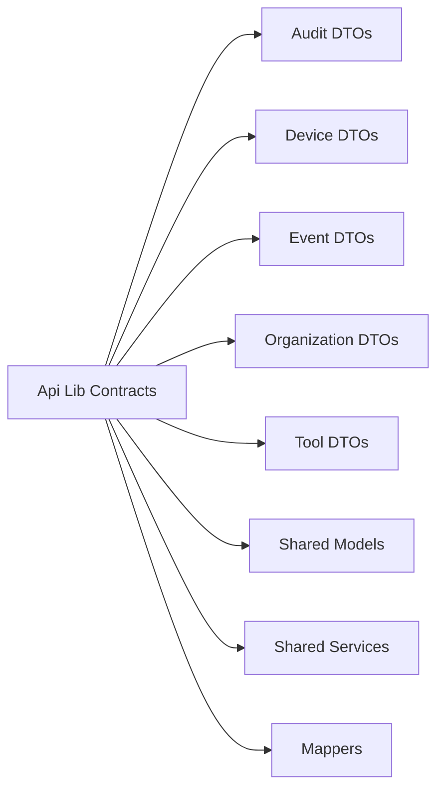
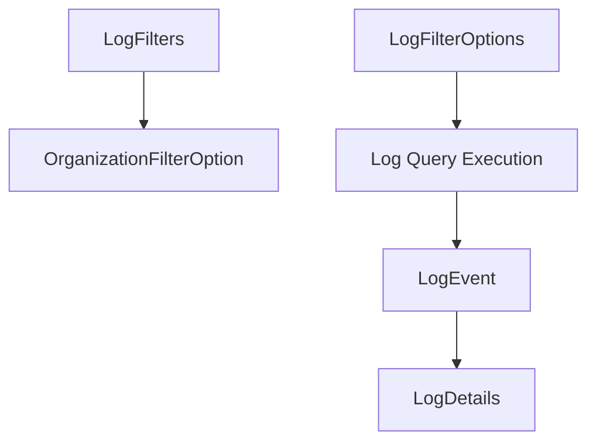
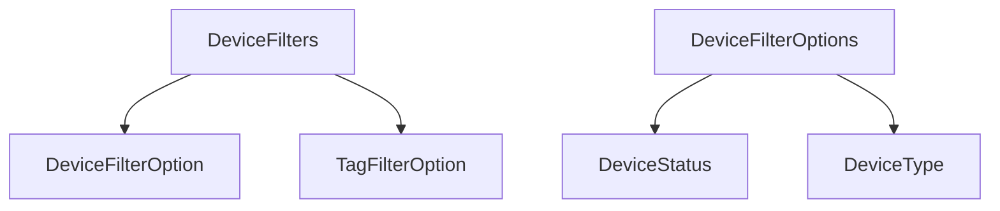
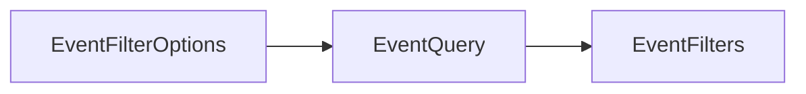
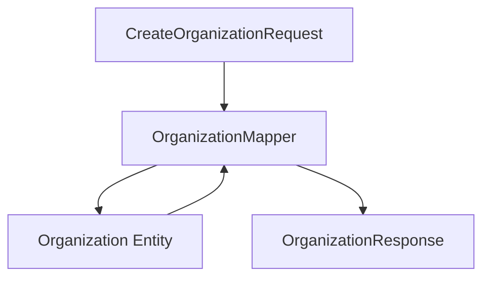
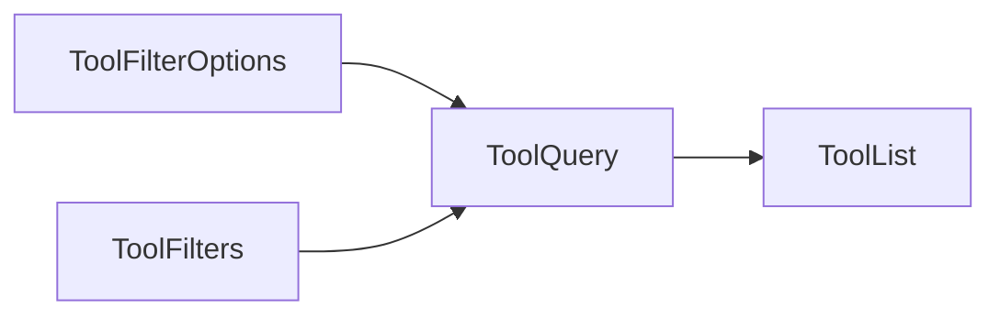
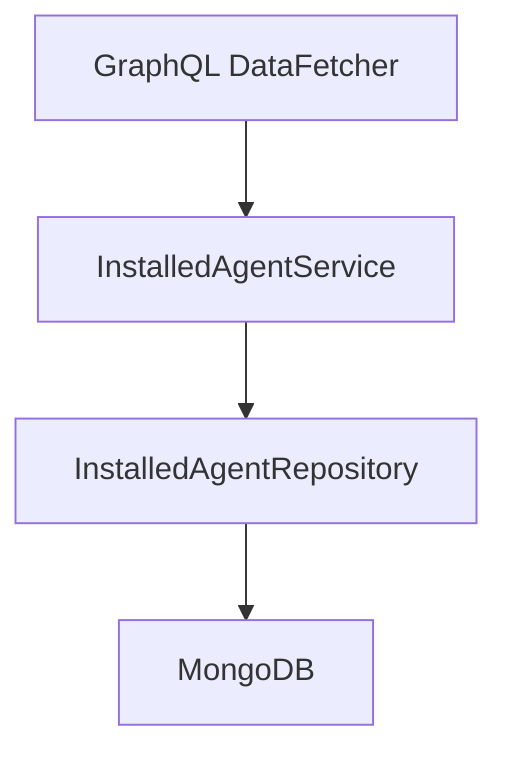
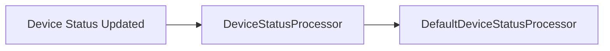
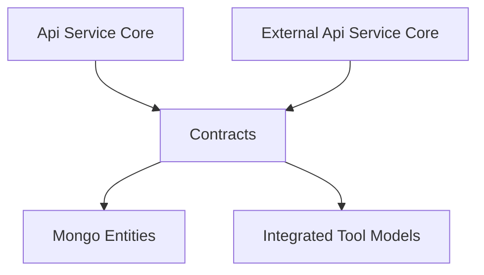

# Api Lib Contracts

## Overview

**Api Lib Contracts** is the shared contract and domain-support module for the OpenFrame platform. It defines:

- Cross-service DTOs (Data Transfer Objects)
- Filtering and pagination models
- Shared mappers between entities and API models
- Lightweight service abstractions reused across API layers

This module acts as the **contract boundary** between:

- GraphQL APIs in Api Service Core
- REST APIs in External Api Service Core
- Persistence layers in Data Mongo Core and Data Platform Core
- Client-facing components such as Gateway Service Core

By centralizing shared DTOs and mapping logic, Api Lib Contracts ensures:

- Consistent API responses across GraphQL and REST
- Stable contracts between services
- Reduced duplication in API layers
- Clear separation between domain entities and external representations

---

## Architectural Position

Api Lib Contracts sits between the persistence layer and API delivery layers.



### Responsibilities by Layer

- **Api Service Core**: Controllers, GraphQL data fetchers, orchestration
- **External Api Service Core**: REST controllers and OpenAPI exposure
- **Api Lib Contracts**: Shared DTOs, filters, mappers, reusable service logic
- **Data Modules**: MongoDB, Kafka, Cassandra, Pinot, Redis, etc.

---

## Module Structure

Api Lib Contracts is organized into the following logical areas:

- Audit (Logs)
- Devices
- Events
- Organizations
- Tools
- Shared (Pagination, generic results)
- Services
- Mappers



---

# Shared Models

## CountedGenericQueryResult

Extends a generic query result with a `filteredCount` field.

**Purpose:**
- Support filtered queries with total count metadata
- Enable UI components to display result count after filtering

```java
public class CountedGenericQueryResult<T> extends GenericQueryResult<T> {
    private int filteredCount;
}
```

This is typically used in combination with filtering DTOs for devices, tools, logs, or events.

---

## CursorPaginationInput

Provides cursor-based pagination input with validation constraints.

Key characteristics:

- `limit` must be between 1 and 100
- `cursor` represents the position token

```java
public class CursorPaginationInput {
    @Min(1)
    @Max(100)
    private Integer limit;
    private String cursor;
}
```

Used by both GraphQL and REST endpoints to standardize pagination behavior.

---

# Audit (Logs)

The audit package defines DTOs for log retrieval, filtering, and display.

## Core DTOs

- `LogEvent` – Lightweight log summary
- `LogDetails` – Full log with message and details
- `LogFilterOptions` – Filter criteria input
- `LogFilters` – Available filter values for UI
- `OrganizationFilterOption` – Dropdown-friendly org option



### Design Intent

- Separate **filter input** (`LogFilterOptions`) from **available filter values** (`LogFilters`).
- Allow frontend applications to dynamically render filter dropdowns.
- Keep summary (`LogEvent`) and detailed (`LogDetails`) views distinct.

These models are consumed by:

- Api Service Core data fetchers
- External Api Service Core REST controllers

---

# Devices

Device-related DTOs define filtering and metadata structures for machine inventory.

## Core Components

- `DeviceFilterOptions`
- `DeviceFilters`
- `DeviceFilterOption`
- `TagFilterOption`



### Separation of Concerns

- `DeviceFilterOptions` → Raw filter inputs (status, type, OS, org IDs)
- `DeviceFilters` → UI-enriched options with counts
- `DeviceFilterOption` → Individual selectable filter item
- `TagFilterOption` → Tag-based filtering with count metadata

This enables:

- Efficient backend filtering
- Rich UI filtering with precomputed counts

---

# Events

Event filtering is simplified compared to logs.

## Components

- `EventFilterOptions`
- `EventFilters`



These models support time-bound and user-bound filtering.

---

# Organizations

The organization package is one of the most important contract areas.

## OrganizationResponse

Shared response model used by:

- Api Service Core (GraphQL)
- External Api Service Core (REST)

It includes:

- Business metadata (category, employees, revenue)
- Contract lifecycle dates
- Contact information
- Soft-delete fields

---

## OrganizationList

Simple wrapper DTO for returning multiple organizations.

---

## OrganizationFilterOptions

Internal filtering model supporting:

- Category-based filtering
- Employee size range
- Active contract flag

---

## OrganizationMapper

A shared Spring component responsible for:

- Converting create/update requests into `Organization` entities
- Mapping entities into `OrganizationResponse`
- Handling nested contact and address mapping
- Enforcing immutability of `organizationId`



### Key Design Decisions

- `organizationId` is generated as a UUID and is immutable.
- Update operations are partial (only non-null fields applied).
- Mailing address may mirror physical address if flagged.

This centralization guarantees consistent mapping across GraphQL and REST layers.

---

# Tools

Tool-related DTOs provide filtering and list response structures.

## Components

- `ToolFilterOptions`
- `ToolFilters`
- `ToolList`



`ToolList` wraps `IntegratedTool` domain entities from Data Mongo Core.

---

# Shared Services

Api Lib Contracts includes reusable service components that abstract repository access patterns.

## InstalledAgentService

Provides machine-to-agent resolution logic.

Responsibilities:

- Batch lookup for multiple machine IDs (optimized for DataLoader usage)
- Single machine agent lookup
- Agent lookup by machine and type



The batch method returns a list aligned to the input order of machine IDs, supporting efficient GraphQL DataLoader behavior.

---

## ToolConnectionService

Similar pattern to InstalledAgentService.

Responsibilities:

- Batch machine-to-tool connection lookup
- Single machine lookup

Optimized for minimizing N+1 query problems in GraphQL environments.

---

## DefaultDeviceStatusProcessor

Default implementation of `DeviceStatusProcessor`.

- Annotated with `@ConditionalOnMissingBean`
- Allows platform override with custom processor
- Logs status updates for observability



This design enables pluggable status handling without coupling API logic to specific infrastructure behaviors.

---

# Cross-Module Relationships

Api Lib Contracts interacts heavily with:

- Api Service Core (GraphQL controllers, data fetchers)
- External Api Service Core (REST controllers)
- Data Mongo Core (entities and repositories)
- Data Platform Core (event and tool models)



The module does not contain:

- Controller logic
- Security configuration
- Infrastructure configuration

It strictly defines contracts and shared mapping/service utilities.

---

# Design Principles

1. **Contract Stability** – DTOs are designed to be stable across services.
2. **Separation of Entity and API Models** – Mappers isolate persistence from API representation.
3. **UI-Aware Filtering** – Filter DTOs include metadata for dynamic UI rendering.
4. **Batch-Friendly Services** – Services support GraphQL DataLoader patterns.
5. **Extensibility** – Default processors can be overridden by custom implementations.

---

# Summary

Api Lib Contracts is the **contract backbone** of the OpenFrame API layer.

It:

- Standardizes DTOs across GraphQL and REST
- Centralizes organization mapping logic
- Defines filtering structures for devices, tools, events, and logs
- Provides reusable service logic for agent and tool resolution
- Enables consistent and extensible API behavior across the platform

By keeping contracts isolated from controllers and infrastructure, the platform maintains clarity, reusability, and long-term maintainability.