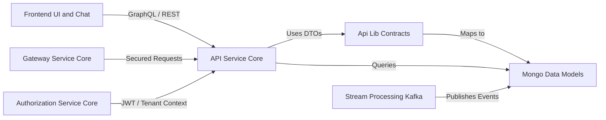
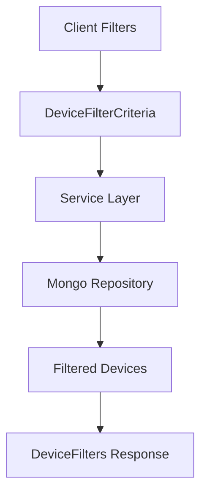
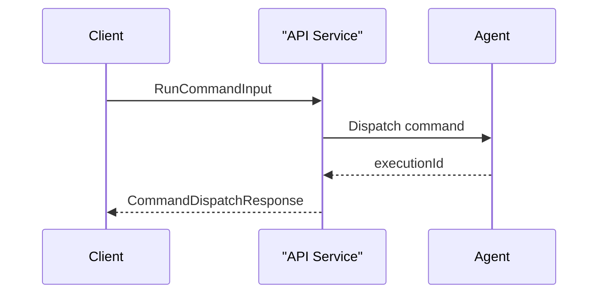
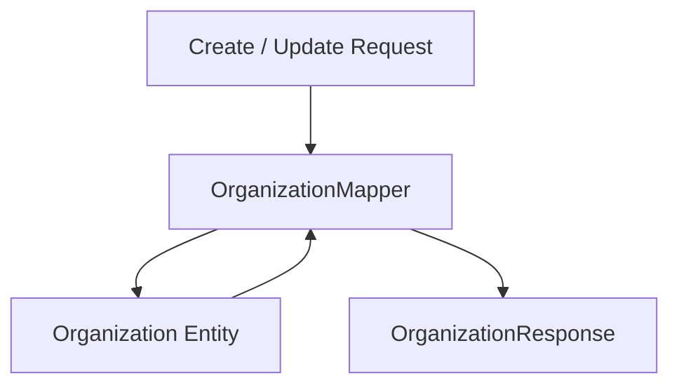
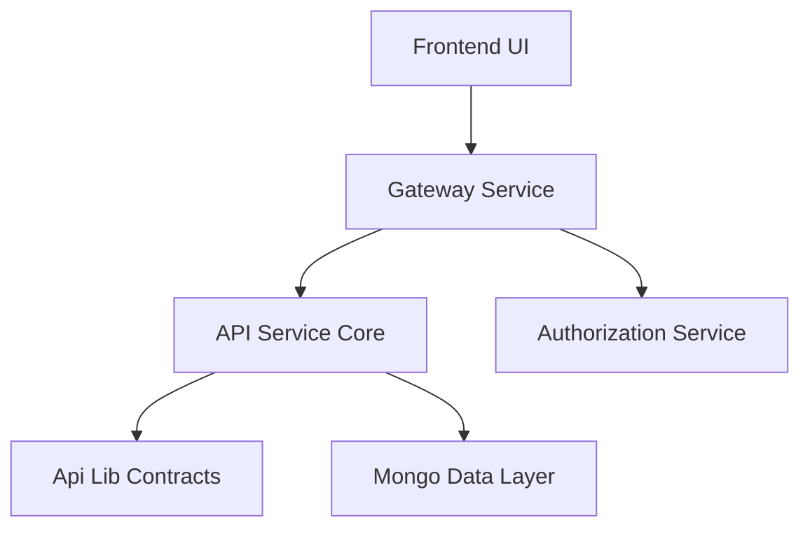

# Api Lib Contracts

## Overview

Api Lib Contracts is the shared contract module for the OpenFrame backend. It defines:

- Data Transfer Objects (DTOs) for queries, mutations, filters, and responses
- Shared pagination primitives (Relay-style connections and cursors)
- Command input and dispatch contracts
- Filter criteria models for devices, logs, events, tools, scripts, and organizations
- Cross-layer mappers (e.g., OrganizationMapper)

This module contains **no transport logic** (no controllers, no GraphQL resolvers, no persistence). Instead, it acts as the stable contract layer between:

- HTTP + GraphQL services
- Management and stream-processing services
- Mongo data models and repositories
- Frontend clients

By centralizing contracts here, OpenFrame ensures type consistency and reduces duplication across services.

---

## Architectural Role in the System


```mermaid
flowchart LR
    Frontend["Frontend UI and Chat"] -->|"GraphQL / REST"| ApiService["API Service Core"]
    ApiService -->|"Uses DTOs"| Contracts["Api Lib Contracts"]
    Contracts -->|"Maps to"| DataModels["Mongo Data Models"]
    ApiService -->|"Queries"| DataModels
    Stream["Stream Processing Kafka"] -->|"Publishes Events"| DataModels
    Gateway["Gateway Service Core"] -->|"Secured Requests"| ApiService
    Auth["Authorization Service Core"] -->|"JWT / Tenant Context"| ApiService
```

### Key Responsibilities

1. **Defines API boundaries** (inputs and outputs).
2. **Decouples transport from persistence**.
3. **Enforces validation constraints** using Jakarta Validation.
4. **Implements Relay-style pagination primitives**.
5. **Provides shared mapping utilities**.

---

# Core Contract Categories

## 1. Generic Query & Pagination Contracts

### CountedGenericQueryResult

`CountedGenericQueryResult<T>` extends a generic query result and adds:

- `filteredCount` – total number of items after filters are applied

This is typically used in filtered list endpoints where:

- The UI needs total counts
- Filtering and pagination occur simultaneously

### Relay Pagination Support

#### ConnectionArgs

Encapsulates forward and backward pagination arguments:

- `first` + `after`
- `last` + `before`

Validation constraints:

- Minimum: 1
- Maximum: 100

#### CursorCodec

Utility for encoding and decoding opaque cursors.

```text
Raw cursor (e.g. "timestamp_eventId")
    ↓ Base64 encode
Opaque cursor returned to client
    ↓ Base64 decode
Raw internal cursor
```

This ensures:

- Internal identifiers remain hidden
- Pagination logic can evolve without breaking clients

#### MutationDeleteInput

Standard delete input wrapper:

- `id` (required)

Used for GraphQL mutation patterns requiring explicit input objects.

---

## 2. Device Filtering Contracts

### DeviceFilterCriteria

Defines server-side filtering logic:

- Device statuses
- Device types
- OS types
- Organization IDs
- Tag key/value filtering

### DeviceFilterOption & TagFilterOption

Used for UI filter dropdowns:

- `value` / `label`
- `count`

### DeviceFilters

Aggregated filter response model containing:

- Status options
- Device type options
- OS type options
- Organization options
- Tag keys
- `filteredCount`


```mermaid
flowchart TD
    Client["Client Filters"] --> Criteria["DeviceFilterCriteria"]
    Criteria --> Service["Service Layer"]
    Service --> Repo["Mongo Repository"]
    Repo --> Results["Filtered Devices"]
    Results --> Filters["DeviceFilters Response"]
```

---

## 3. Audit & Event Filtering Contracts

### LogFilterCriteria

Supports advanced audit filtering:

- Date range
- Event types
- Tool types
- Severities
- Organization IDs
- Device ID

### LogFilters

Provides UI-ready filter options:

- Tool types
- Event types
- Severities
- Organization dropdown options

### EventFilterCriteria & EventFilters

Used for querying core event documents:

- User IDs
- Event types
- Date ranges

These contracts map closely to Mongo query filters in the data layer.

---

## 4. Command Execution Contracts

### RunCommandInput

GraphQL input for dispatching ad-hoc commands to agents:

- `machineId`
- `command`
- `shell`
- `privilegeLevel`
- `timeoutSeconds`

Validation ensures:

- Required fields are present
- Timeout is positive

### CommandDispatchResponse

Returns:

- `executionId`

### CancelExecutionInput & CancelDispatchResponse

Used to cancel agent executions.


```mermaid
sequenceDiagram
    participant Client
    participant ApiService as "API Service"
    participant Agent

    Client->>ApiService: RunCommandInput
    ApiService->>Agent: Dispatch command
    Agent-->>ApiService: executionId
    ApiService-->>Client: CommandDispatchResponse
```

---

## 5. Knowledge Base Contracts

### CreateArticleCommand

Defines article creation fields:

- Name, content, summary
- Parent hierarchy
- Status
- Tag assignments
- Organization / device / ticket links

### UpdateArticleCommand

Partial update for article metadata and content.

### KnowledgeBaseFilterCriteria

Filtering by:

- Parent
- Type
- Tags
- Statuses

### KnowledgeBaseAttachmentUpload

Returns:

- Attachment metadata
- Pre-signed upload URL

---

## 6. Script Management Contracts

### CreateScriptInput

Defines script creation fields:

- Name
- Shell
- Script body
- Supported platforms
- Default timeout
- Default arguments
- Environment variables

### ScriptEnvVarInput

Symmetric DTO used for:

- Input
- Output

Contains:

- Name
- Value
- `secret` flag

### ScriptFilterInput

Supports filtering by:

- Shells
- Statuses
- Platforms
- Tag

### UpdateScriptInput

Implements full-replacement semantics (PUT-style):

- All fields must be provided
- Null clears optional fields

### ScriptResponse

API-facing representation:

- Omits tenantId
- Serializes enums as names
- Includes lifecycle metadata

---

## 7. Organization Contracts & Mapping

### OrganizationResponse

Shared response model for both GraphQL and REST.

Contains:

- Business metadata
- Financial metadata
- Contract dates
- Contact information
- Status and lifecycle fields

### OrganizationList

Wrapper for returning multiple organizations.

### OrganizationFilterOptions

Internal filtering metadata:

- Category
- Employee range
- Contract status

### OrganizationMapper

A Spring component responsible for:

- Mapping create requests to entities
- Performing partial updates
- Converting entities to OrganizationResponse
- Mapping nested contact information


```mermaid
flowchart TD
    Request["Create / Update Request"] --> Mapper["OrganizationMapper"]
    Mapper --> Entity["Organization Entity"]
    Entity --> Mapper
    Mapper --> Response["OrganizationResponse"]
```

Key design decisions:

- `organizationId` is generated as UUID
- Immutable once created
- Partial updates ignore null fields
- Mailing address may mirror physical address

---

## 8. Tool Filtering Contracts

### ToolFilterCriteria

Server-side filtering fields:

- Enabled
- Type
- Category
- Platform category

### ToolFilters

UI-oriented aggregated filter options.

### ToolList

Wrapper returning:

- List of integrated tool entities

---

# Design Principles

## 1. Separation of Concerns

- DTOs contain no persistence logic
- No repository or controller code
- No service orchestration

This ensures portability across services.

## 2. Validation at the Boundary

Jakarta validation annotations enforce:

- Required fields
- Numeric constraints
- Input integrity

Transport layers trigger validation automatically.

## 3. Tenant Safety

Certain fields (e.g., tenantId) are intentionally excluded from API contracts.

Tenant context is derived from authentication layers, not from client input.

## 4. Opaque Pagination

CursorCodec ensures:

- Internal identifiers remain hidden
- Backward-compatible pagination evolution

---

# How Api Lib Contracts Fits Into OpenFrame


```mermaid
flowchart TD
    Contracts["Api Lib Contracts"]
    Api["API Service Core"]
    Auth["Authorization Service"]
    Data["Mongo Data Layer"]
    Gateway["Gateway Service"]
    Frontend["Frontend UI"]

    Frontend --> Gateway
    Gateway --> Auth
    Gateway --> Api
    Api --> Contracts
    Api --> Data
```

Api Lib Contracts is the **contract spine** of the backend. It:

- Standardizes API inputs and outputs
- Ensures consistent filter and pagination behavior
- Enables both REST and GraphQL to share models
- Decouples transport, business logic, and persistence

Without this module, every service would redefine overlapping DTOs, increasing coupling and breaking consistency.

---

# Summary

Api Lib Contracts is a foundational module that:

- Defines all core API DTOs
- Implements filter and pagination primitives
- Supports device, event, audit, organization, script, tool, and knowledge base domains
- Provides shared mapping utilities
- Enforces validation at API boundaries

It is intentionally lightweight but architecturally critical — serving as the shared language between OpenFrame services and clients.