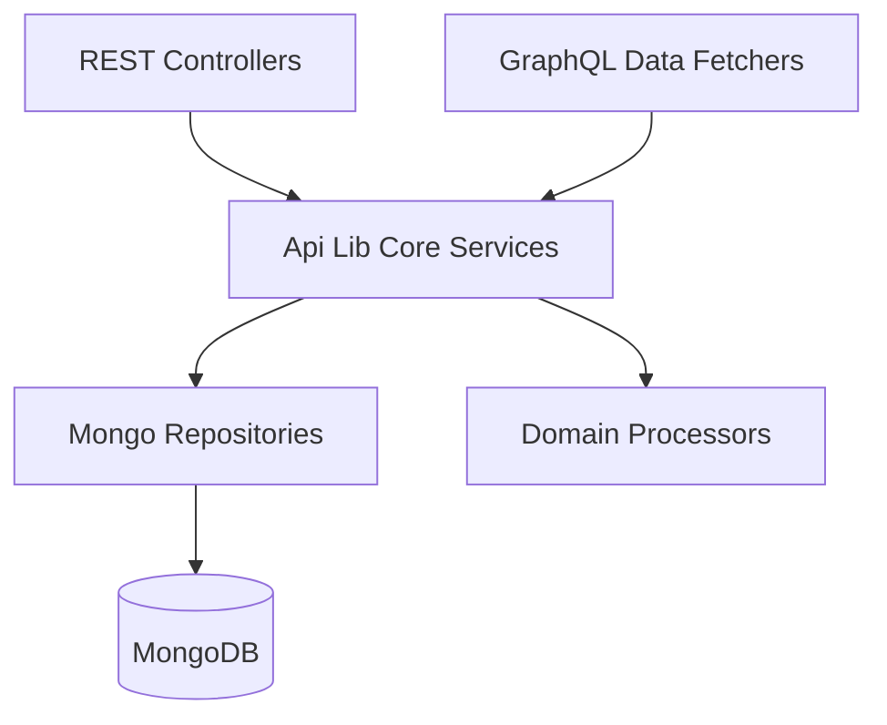
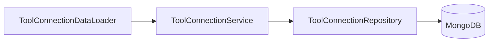
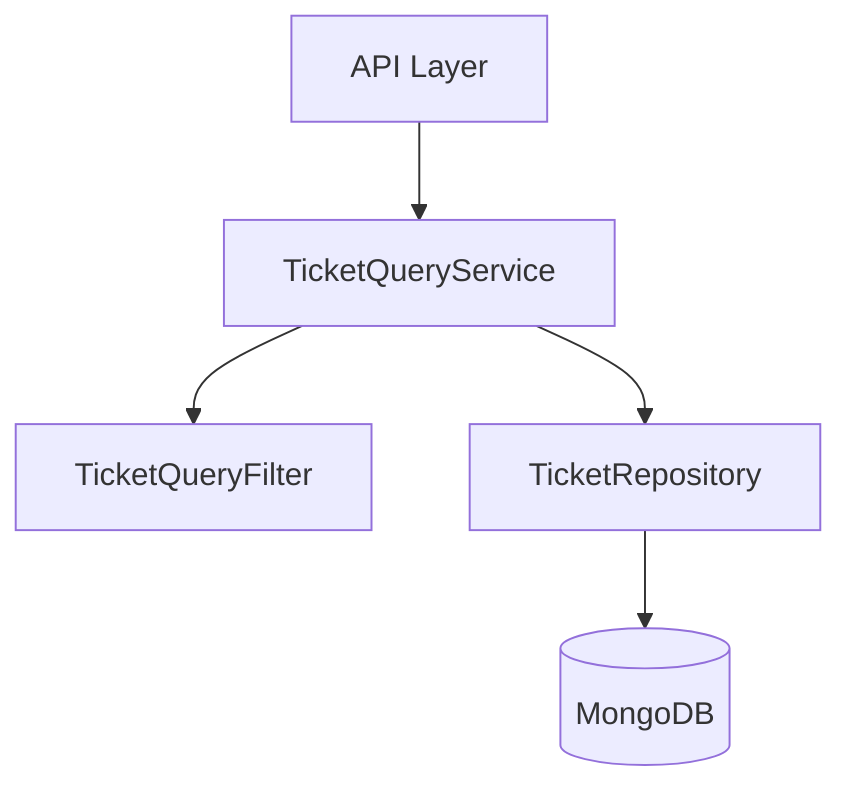
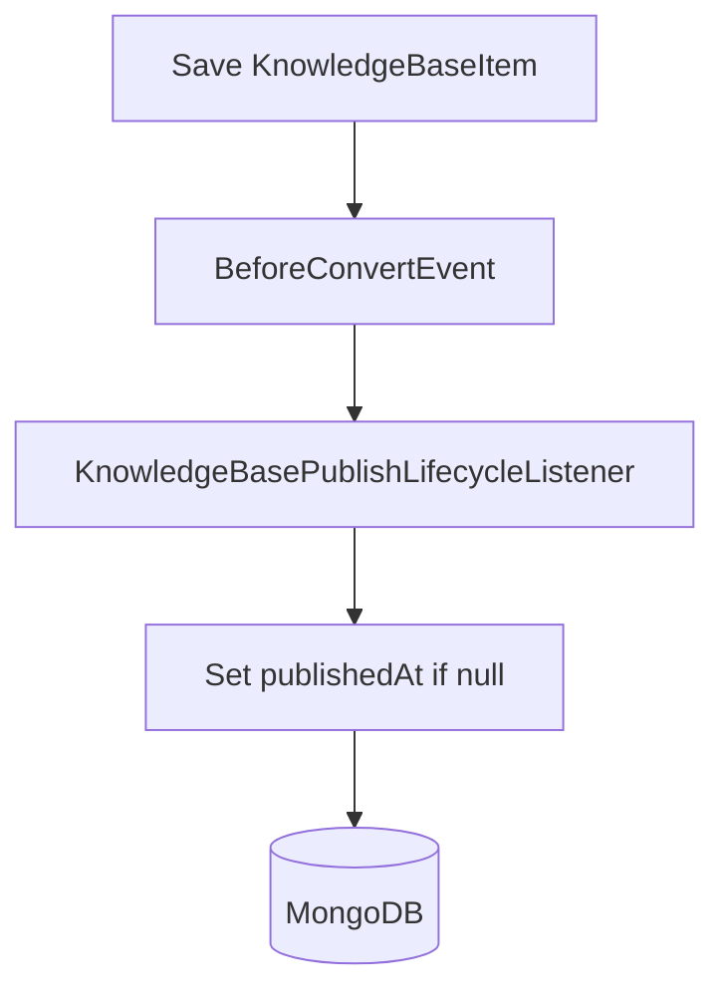
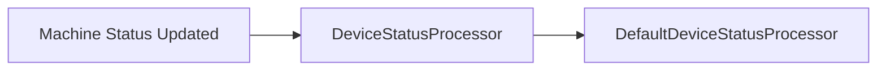
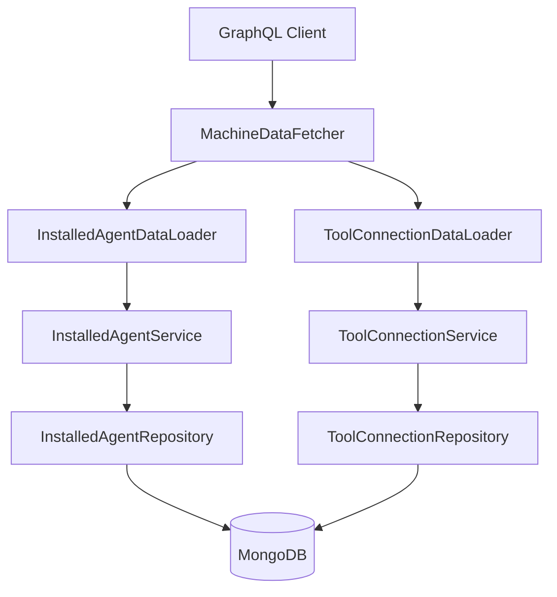

# Api Lib Core Services

## Overview

The **Api Lib Core Services** module provides the core business service layer for the OpenFrame API library. It sits between the API-facing layers (REST controllers and GraphQL data fetchers) and the persistence layer (Mongo repositories and domain documents).

This module encapsulates reusable domain logic related to:

- Installed agents per machine
- Tool connections and integrations
- Ticket querying and search
- Knowledge base publication lifecycle
- Device status post-processing

It is designed to be:

- ✅ Framework-aligned (Spring Boot, Spring Data)
- ✅ Multi-tenant ready (delegating to repository-level filters)
- ✅ GraphQL DataLoader-friendly (batch-oriented methods)
- ✅ Extensible via conditional beans and processors

---

## Architectural Position

The Api Lib Core Services module acts as a **pure service layer** within the larger OpenFrame architecture.



### Upstream Consumers

- REST Controllers (API Service Core)
- GraphQL Data Fetchers
- DataLoaders (batch loading layer)

### Downstream Dependencies

- Mongo domain documents (Machine, Ticket, ToolConnection, InstalledAgent)
- Spring Data repositories
- Mongo event lifecycle hooks

The module intentionally contains **no HTTP or GraphQL annotations**, ensuring reusability across different API surfaces.

---

## Core Components

### 1. InstalledAgentService

**Purpose:**
Provides read access and batch-loading logic for installed agents across machines.

**Key Capabilities:**

- Fetch installed agents for a single machine
- Fetch installed agents for multiple machines (DataLoader optimized)
- Lookup by ID
- Lookup by machine and agent type


#### Batch-Oriented Design

The method:

```java
getInstalledAgentsForMachines(List<String> machineIds)
```

- Fetches all agents using `findByMachineIdIn`
- Groups them in-memory by machine ID
- Returns a list aligned with the original input order

This structure avoids the **N+1 query problem** in GraphQL environments.

---

### 2. ToolConnectionService

**Purpose:**
Manages retrieval of tool connection data associated with machines.

**Responsibilities:**

- Fetch tool connections by ID
- Fetch tool connections per machine
- Batch-fetch tool connections for multiple machines



Similar to InstalledAgentService, this service is optimized for batch resolution in GraphQL environments.

---

### 3. TicketQueryService

**Purpose:**
Encapsulates ticket search and retrieval logic with filtering and cursor-based pagination support.

**Key Methods:**

- `findById(String ticketId)`
- `searchTickets(TicketQueryFilter filter, String search, int limit)`



#### Query Construction Flow

1. Build a `Query` object using:
   - Structured filter (`TicketQueryFilter`)
   - Free-text search
2. Delegate to repository method:
   - `findTicketsWithCursor(...)`
3. Apply default sorting:
   - Field: `createdAt`
   - Direction: `DESC`

This service centralizes ticket query semantics and ensures consistent sorting behavior.

---

### 4. KnowledgeBasePublishLifecycleListener

**Purpose:**
Automatically stamps `publishedAt` when a knowledge base article transitions into the `PUBLISHED` state for the first time.

This is implemented as a:

- Spring `@Component`
- Extends `AbstractMongoEventListener<KnowledgeBaseItem>`
- Hooks into `onBeforeConvert`



### Semantic Guarantees

- ✅ `publishedAt` is set only once
- ✅ Unpublish/republish cycles do not overwrite the original timestamp
- ✅ Aligns with Schema.org `datePublished` and Atom `published`

This ensures historical integrity and stable audit semantics.

---

### 5. DefaultDeviceStatusProcessor

**Purpose:**
Provides a default implementation for device status post-processing logic.

It implements `DeviceStatusProcessor` and is registered with:

- `@Component`
- `@ConditionalOnMissingBean`



### Extensibility Model

Because it is conditionally registered, applications can:

- Provide a custom `DeviceStatusProcessor`
- Override default behavior without modifying the core module

The default implementation only logs status changes, making it safe and side-effect free.

---

## Design Patterns Used

### 1. Service Layer Pattern
Encapsulates domain logic and shields API layers from persistence details.

### 2. DataLoader-Friendly Batch APIs
Both InstalledAgentService and ToolConnectionService provide:

- `List<List<Entity>>` aligned responses
- Deterministic ordering
- Single query per batch

### 3. Repository Delegation
All query logic ultimately delegates to repositories responsible for:

- Query construction
- Pagination mechanics
- Sorting logic

### 4. Event-Driven Lifecycle Hooks
KnowledgeBasePublishLifecycleListener demonstrates:

- Mongo lifecycle event integration
- Declarative business rules
- Immutable publication timestamp semantics

### 5. Conditional Bean Extension
DefaultDeviceStatusProcessor enables pluggable domain behavior using Spring Boot auto-configuration conventions.

---

## Data Flow Example: GraphQL Machine Query

When querying machines with nested installed agents and tool connections:



This ensures:

- ✅ No N+1 queries
- ✅ Deterministic batch resolution
- ✅ Clean separation between data resolution and domain logic

---

## Transaction and Consistency Model

- Read-only services are annotated with `@Transactional(readOnly = true)`
- Lifecycle listeners operate before persistence conversion
- Repository layer enforces query-level consistency

The module intentionally avoids complex transaction orchestration and instead relies on:

- Repository atomic operations
- Mongo consistency guarantees

---

## Extension Guidelines

When extending Api Lib Core Services:

1. ✅ Keep services stateless
2. ✅ Delegate persistence to repositories
3. ✅ Provide batch-friendly APIs when used by GraphQL
4. ✅ Use conditional beans for override points
5. ✅ Keep lifecycle logic idempotent

---

## Summary

The **Api Lib Core Services** module is the domain-centric service backbone of the OpenFrame API stack.

It provides:

- Clean separation of concerns
- Batch-optimized data access patterns
- Event-driven lifecycle management
- Extensible processing hooks
- Consistent query semantics

By centralizing domain service logic in this module, the broader OpenFrame platform maintains a modular, scalable, and extensible API architecture.