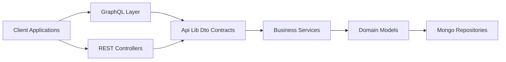
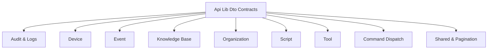
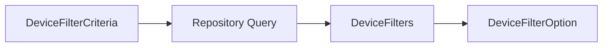
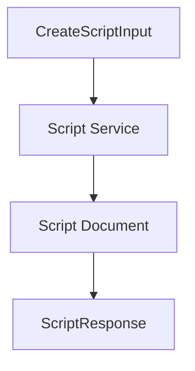
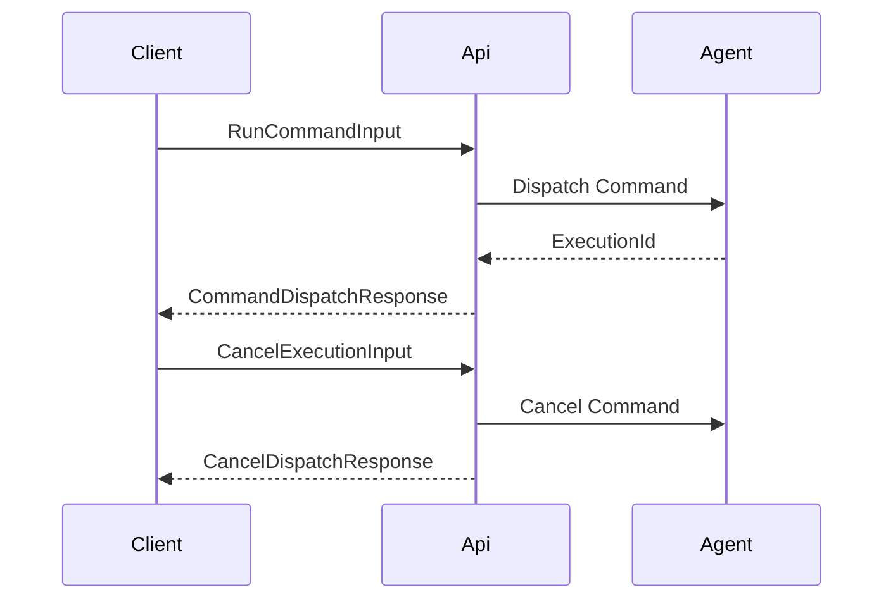
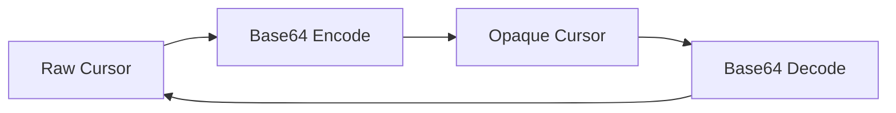

# Api Lib Dto Contracts

## Overview

The **Api Lib Dto Contracts** module defines the shared Data Transfer Objects (DTOs) that form the contract layer between:

- GraphQL resolvers in `api-service-core-graphql-layer`
- REST controllers in `api-service-core-rest-controllers`
- External REST APIs in `external-api-service-core`
- Business services in `api-lib-mapping-and-domain-services`
- Domain models and repositories in `data-model-and-repositories-mongo`

This module is intentionally free of transport logic, persistence logic, and business rules. It provides **stable, reusable contract models** that:

- Define input payloads for commands and mutations
- Define filter criteria for search operations
- Provide response shapes for REST and GraphQL
- Implement Relay-compatible pagination primitives
- Standardize command dispatch and execution contracts

It acts as the **boundary language** of the OpenFrame API ecosystem.

---

## Architectural Role

The module sits between the API layer and the domain layer, serving as a stable contract boundary.

### Key Responsibilities

- ✅ Define **input contracts** (commands, filters, mutation inputs)
- ✅ Define **output contracts** (responses, lists, filter options)
- ✅ Encapsulate **pagination rules** (Relay connection spec)
- ✅ Standardize **cross-module payloads** (Organization, Script, Tool, Device)
- ✅ Avoid leaking internal domain objects unnecessarily

---

## Design Principles

### 1. Clear Separation of Concerns

DTOs do not:

- Access repositories
- Contain business logic
- Perform validation beyond structural constraints

They may use:

- Jakarta validation annotations (`@NotBlank`, `@NotNull`, `@Positive`)
- Enum references from domain models
- Lombok for immutability and builders

---

### 2. Shared Between GraphQL and REST

Several DTOs (e.g., `OrganizationResponse`) are explicitly designed for reuse across both internal GraphQL and external REST APIs.

This ensures:

- Identical serialization
- Consistent field naming
- No duplication of contract logic

---

### 3. Tenant Awareness by Context, Not Payload

Inputs such as `CreateScriptInput` explicitly avoid including `tenantId`. Tenant attribution is derived from authentication context in upper layers.

This prevents:

- Cross-tenant spoofing
- Contract-level security leaks
- Client-controlled multi-tenant switching

---

# Module Breakdown

The Api Lib Dto Contracts module can be grouped into the following logical areas:

---

# Audit & Log DTOs

### Core Classes

- `LogFilterCriteria`
- `LogFilters`
- `OrganizationFilterOption`

### Responsibilities

- Define filter inputs for log queries
- Provide dropdown option models for UI
- Support time-bound and multi-field filtering

### Example Fields

- Date ranges (`startDate`, `endDate`)
- Event types
- Tool types
- Severity levels
- Organization filters
- Device scoping

These DTOs are typically consumed by:

- GraphQL `LogDataFetcher`
- REST log endpoints in `external-api-service-core`

---

# Device DTOs

### Core Classes

- `DeviceFilterCriteria`
- `DeviceFilterOption`
- `DeviceFilters`
- `TagFilterOption`

### Responsibilities

- Express device filtering constraints
- Return aggregation-style filter options
- Support faceted search patterns

### Pattern

Key features:

- Filter by status, type, OS, organization
- Tag-based filtering (key/value)
- Include `filteredCount` for UI summary statistics

---

# Event DTOs

### Core Classes

- `EventFilterCriteria`
- `EventFilters`

Used to:

- Filter audit and system events
- Constrain by user, type, and time window

These integrate with:

- Event repositories
- Analytics pipelines
- Stream processing components

---

# Knowledge Base DTOs

### Core Classes

- `CreateArticleCommand`
- `UpdateArticleCommand`
- `KnowledgeBaseFilterCriteria`
- `KnowledgeBaseAttachmentUpload`

### Responsibilities

- Create and update hierarchical knowledge base items
- Filter by parent, type, tags, and status
- Manage temporary attachment uploads

The commands allow association with:

- Organizations
- Devices
- Tickets
- Other knowledge articles

This enables rich contextual linking.

---

# Organization DTOs

### Core Classes

- `OrganizationFilterOptions`
- `OrganizationList`
- `OrganizationResponse`

`OrganizationResponse` is a shared cross-layer contract used by:

- GraphQL resolvers
- External REST APIs

It includes:

- Financial data (monthly revenue)
- Contract lifecycle dates
- Contact information
- Status tracking metadata

This DTO is a canonical representation of organization state at the API boundary.

---

# Script DTOs

### Core Classes

- `CreateScriptInput`
- `UpdateScriptInput`
- `ScriptFilterInput`
- `ScriptResponse`
- `ScriptEnvVarInput`

### Command Lifecycle

### Notable Characteristics

- Explicit enum usage (`ScriptShell`, `ScriptPlatform`, `ScriptStatus`)
- Validation constraints on required fields
- Full replacement semantics for update
- Secret flag on environment variables
- Tenant context inferred from authentication

This set of DTOs standardizes script management across integrations.

---

# Command Dispatch DTOs

### Core Classes

- `RunCommandInput`
- `CancelExecutionInput`
- `CommandDispatchResponse`
- `CancelDispatchResponse`

### Flow

These DTOs standardize remote command execution across:

- Web clients
- Agent services
- Message buses (Kafka / NATS)

They ensure consistent execution tracking via `executionId`.

---

# Tool DTOs

### Core Classes

- `ToolFilterCriteria`
- `ToolFilters`
- `ToolList`

Responsibilities:

- Filter integrated tools
- Return tool catalog lists
- Provide platform and category grouping

`ToolList` wraps domain `IntegratedTool` objects for API consumption.

---

# Shared & Pagination DTOs

### Core Classes

- `ConnectionArgs`
- `CursorCodec`
- `MutationDeleteInput`
- `CountedGenericQueryResult<T>`

## Relay Pagination

`ConnectionArgs` implements forward and backward pagination semantics:

- `first` + `after`
- `last` + `before`

`CursorCodec` encodes opaque base64 cursors to prevent leaking database identifiers.

## Counted Query Results

`CountedGenericQueryResult<T>` extends a generic query result with:

- `filteredCount`

This supports UI patterns where:

- Total available
- Total filtered
- Page slice

must all be visible simultaneously.

---

# Integration with Other Modules

The Api Lib Dto Contracts module integrates tightly with:

- `api-lib-mapping-and-domain-services` for mapping between domain models and DTOs
- `api-service-core-graphql-layer` for GraphQL input/output contracts
- `api-service-core-rest-controllers` for REST serialization
- `external-api-service-core` for public API responses
- `data-model-and-repositories-mongo` for domain entity references
- `security-oauth-and-jwt` for authentication-derived context

However, it does not depend on those modules' runtime logic.

---

# Summary

The **Api Lib Dto Contracts** module is the **contract foundation** of the OpenFrame API architecture.

It provides:

- A consistent and reusable API language
- Strongly-typed filter and mutation inputs
- Stable response models
- Relay-compliant pagination
- Standardized command execution contracts

By isolating these definitions in a dedicated module, the system ensures:

- Clean layering
- Reduced duplication
- Easier refactoring
- Stable public API boundaries

This module is critical for maintaining long-term API consistency across GraphQL, REST, streaming integrations, and external SDK consumers.