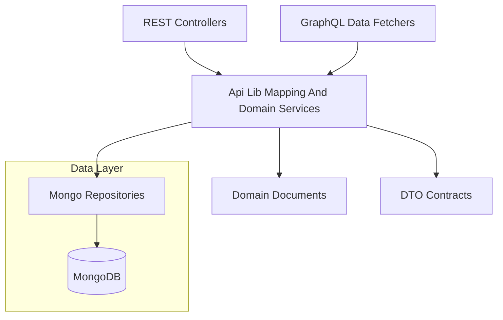
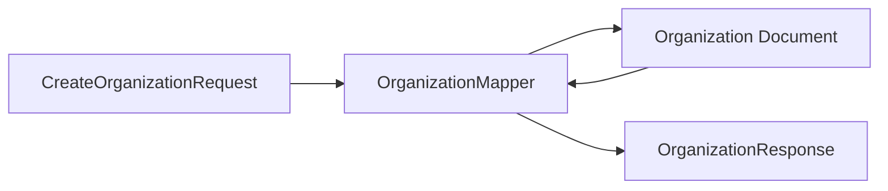
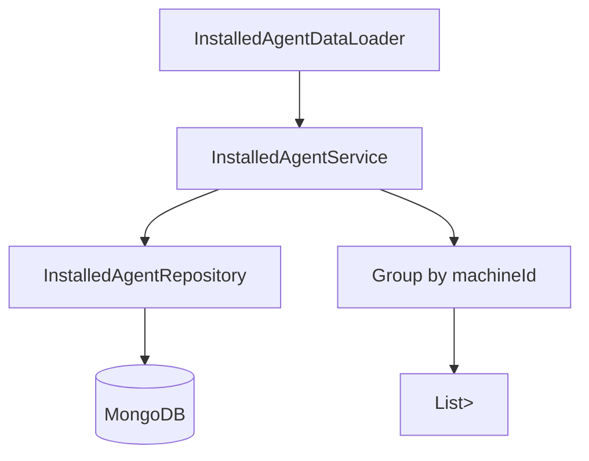
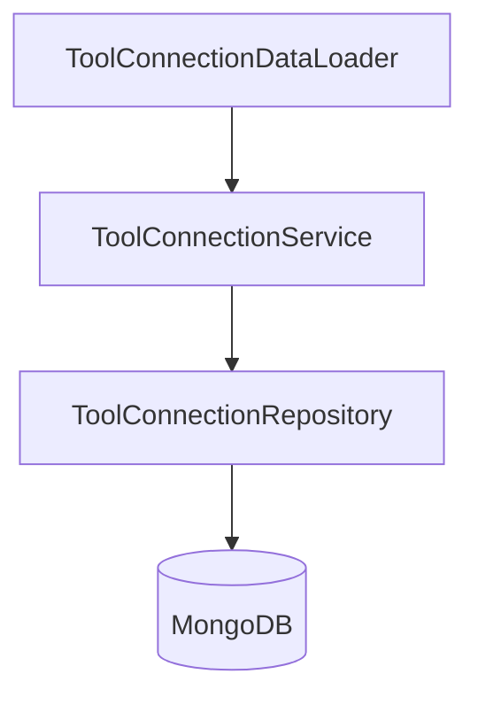
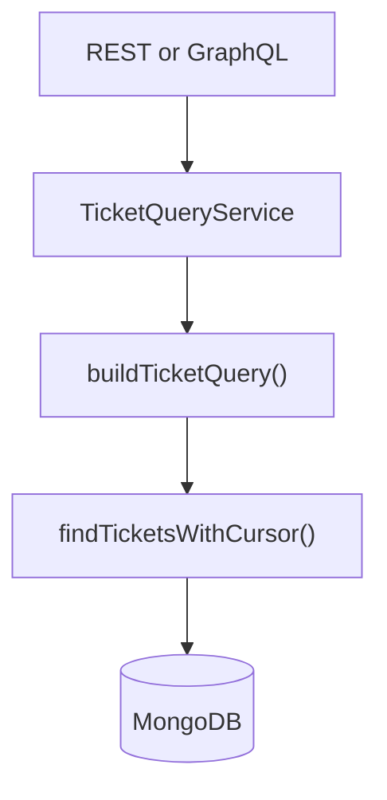
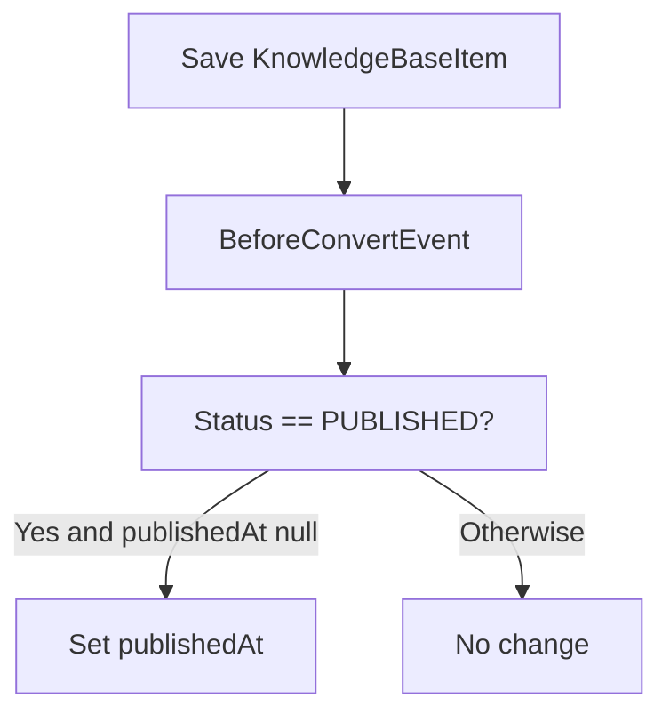
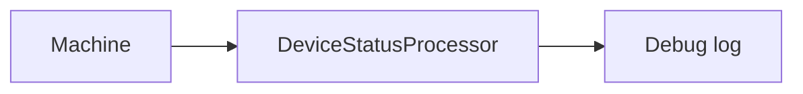
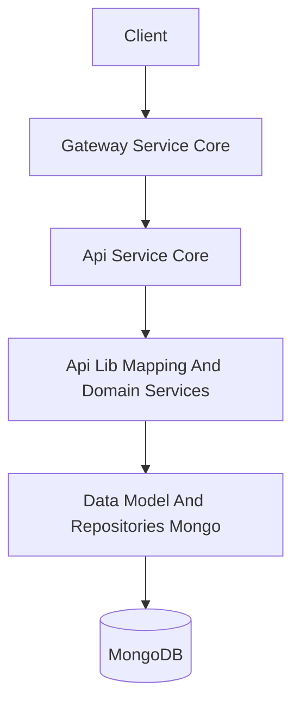

# Api Lib Mapping And Domain Services

## Overview

The **Api Lib Mapping And Domain Services** module acts as a shared application layer inside the OpenFrame API library. It bridges:

- External API contracts (DTOs from Api Lib Dto Contracts)
- Persistent domain entities (from Data Model And Repositories Mongo)
- Higher-level API layers (REST controllers and GraphQL data fetchers)

This module centralizes:

- Entity ↔ DTO mapping logic
- Query orchestration and filtering logic
- Batch-fetch support for GraphQL DataLoaders
- Domain lifecycle hooks
- Extension points for domain-specific processors

By keeping this logic in a shared module, both REST and GraphQL layers reuse consistent behavior without duplicating mapping or query logic.

---

## Architectural Context

The module sits between the API layer and the persistence layer.

### Upstream Consumers

- REST controllers from Api Service Core Rest Controllers
- GraphQL data fetchers from Api Service Core Graphql Layer
- GraphQL DataLoaders from Api Service Core Graphql Dataloaders

### Downstream Dependencies

- Domain documents and repositories from Data Model And Repositories Mongo
- Mongo query builders from Data Access Mongo Sync

---

## Core Responsibilities

The module provides:

1. **Mapping layer** – Converting DTOs to entities and back.
2. **Query services** – Encapsulating complex filtering and search logic.
3. **Batch aggregation services** – Optimized for GraphQL DataLoader patterns.
4. **Lifecycle listeners** – Domain-specific persistence hooks.
5. **Extension processors** – Default implementations for customizable domain logic.

---

## Components

### 1. Organization Mapper

**Component:** `OrganizationMapper`

The Organization Mapper is responsible for converting between:

- Create and Update request DTOs
- Organization domain entities
- Organization response DTOs

#### Responsibilities

- Generate immutable `organizationId` values (UUID-based)
- Support partial updates (only non-null fields applied)
- Enforce immutability of `organizationId`
- Map nested objects:
  - ContactInformation
  - ContactPerson
  - Address
- Convert entity status enums to response-friendly string values

#### Mapping Flow

#### Key Design Decisions

- `organizationId` is generated once and cannot be updated.
- Partial updates prevent accidental overwrites.
- Mailing address can automatically copy physical address.
- Defensive null handling avoids NPEs.

This ensures consistent behavior across both REST and GraphQL APIs.

---

### 2. Installed Agent Service

**Component:** `InstalledAgentService`

This service provides read operations for InstalledAgent documents.

#### Responsibilities

- Fetch installed agents by machine ID
- Fetch installed agents by machine ID and agent type
- Fetch all installed agents
- Support batch loading for GraphQL DataLoader

#### Batch Loading Pattern

The `getInstalledAgentsForMachines` method is optimized for GraphQL DataLoader usage:

Key behavior:

- Single query for multiple machine IDs
- In-memory grouping by machineId
- Result order matches input order

This eliminates the N+1 query problem in GraphQL.

---

### 3. Tool Connection Service

**Component:** `ToolConnectionService`

Provides read-only access to ToolConnection documents.

#### Responsibilities

- Fetch tool connections by ID
- Fetch tool connections for a single machine
- Batch fetch tool connections for multiple machines

Its batch API mirrors the Installed Agent Service pattern, making it suitable for GraphQL DataLoader integration.

---

### 4. Ticket Query Service

**Component:** `TicketQueryService`

Encapsulates ticket search logic using repository-level query builders.

#### Responsibilities

- Find ticket by ID
- Search tickets using:
  - TicketQueryFilter
  - Free-text search
  - Result limit
- Apply default sorting (`createdAt DESC`)

#### Query Flow

The service delegates query construction to the repository while enforcing:

- Default sort field
- Descending sort direction
- Read-only transactional boundary

This ensures consistent search semantics across API entry points.

---

### 5. Knowledge Base Publish Lifecycle Listener

**Component:** `KnowledgeBasePublishLifecycleListener`

A Mongo lifecycle listener that enforces "first published at" semantics.

#### Behavior

On `BeforeConvert`:

- If status == PUBLISHED
- And `publishedAt` is null
- Then set `publishedAt = Instant.now()`

#### Design Guarantees

- Timestamp is set only once.
- Unpublish/republish does not overwrite the original value.
- Aligns with Schema.org `datePublished` semantics.

This ensures canonical publishing behavior without requiring API-layer logic.

---

### 6. Default Device Status Processor

**Component:** `DefaultDeviceStatusProcessor`

Provides a default implementation of the `DeviceStatusProcessor` extension point.

#### Responsibilities

- React to device status updates
- Log status changes

#### Extensibility

- Marked with `@ConditionalOnMissingBean`
- Automatically replaced if a custom implementation is defined

This allows:

- Product-specific customization
- Plugin-style overrides
- Future event-driven expansions

---

## Cross-Cutting Design Patterns

### 1. Read-Only Service Pattern

Most services:

- Are annotated with `@Transactional(readOnly = true)`
- Delegate persistence to repositories
- Avoid embedding business mutations

This keeps the module focused on orchestration and mapping rather than domain mutation.

---

### 2. Batch-Oriented Design for GraphQL

Both InstalledAgentService and ToolConnectionService:

- Accept collections of IDs
- Perform single repository queries
- Group results in-memory
- Return ordered lists

This aligns directly with GraphQL DataLoader batching semantics.

---

### 3. Strict Mapping Separation

Mapping logic is isolated in mappers rather than:

- Controllers
- Repositories
- Domain entities

Benefits:

- Clear boundary between API contracts and domain models
- Easier DTO evolution
- Reduced accidental entity exposure

---

## How This Module Fits Into the Platform

Within the larger OpenFrame architecture:

- Api Service Core Rest Controllers call services in this module.
- Api Service Core Graphql Layer uses these services for queries.
- Api Service Core Graphql Dataloaders depend on the batch methods here.
- Data Model And Repositories Mongo provides entities and repositories.

High-level interaction:

The Api Lib Mapping And Domain Services module therefore serves as:

- A shared mapping layer
- A query orchestration layer
- A lifecycle hook provider
- A GraphQL optimization layer

It ensures consistent, reusable domain access patterns across all API entry points while keeping controllers and data fetchers thin and focused.
