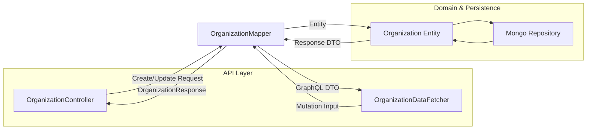
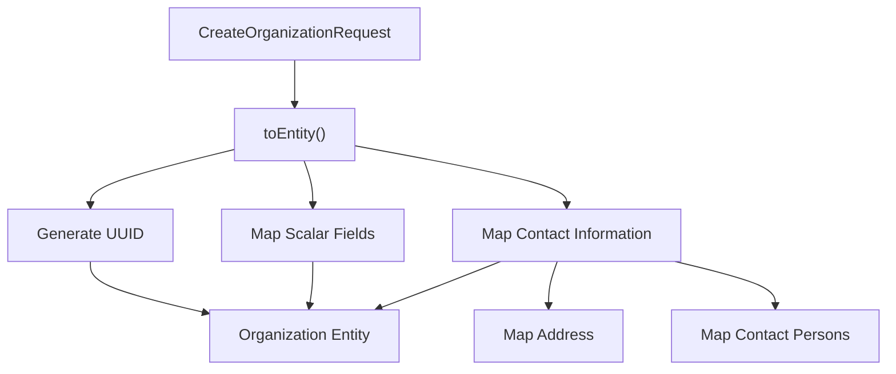
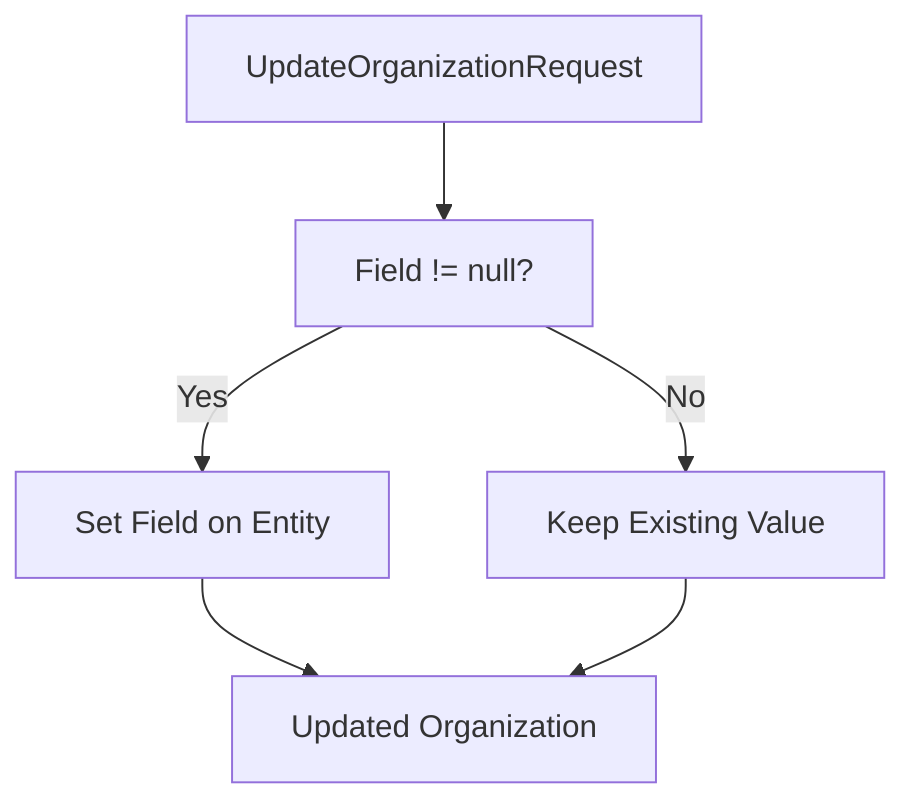
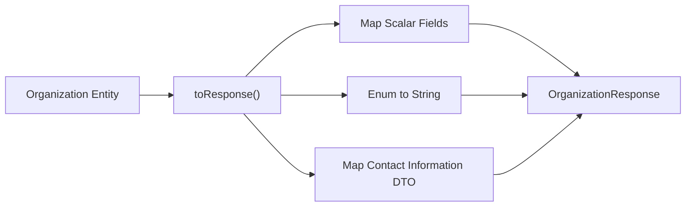
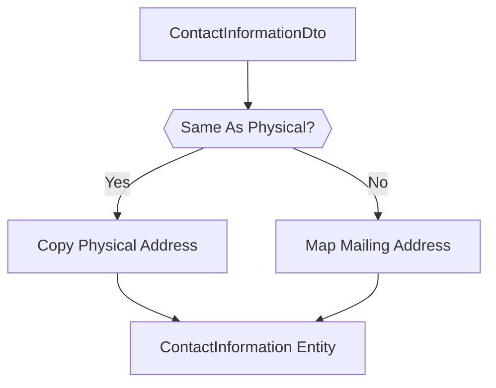
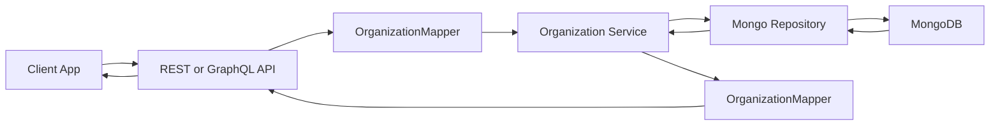

# Api Organization Mapping

The **Api Organization Mapping** module is responsible for translating between external API data transfer objects (DTOs) and the internal persistence model for organizations. It acts as the boundary layer between:

- REST and GraphQL API contracts
- Domain entities stored in MongoDB
- Service-layer business logic

At its core is the `OrganizationMapper`, a Spring component that ensures consistent, safe, and predictable conversion between request objects, domain entities, and response DTOs.

---

## 1. Purpose and Responsibilities

The Api Organization Mapping module provides:

- ✅ Conversion from API request DTOs to `Organization` entities
- ✅ Partial update (patch-style) entity updates
- ✅ Conversion from `Organization` entities to response DTOs
- ✅ Nested object mapping (contact information, addresses, contacts)
- ✅ Controlled immutability for system-critical fields (e.g., `organizationId`)

It centralizes mapping logic to avoid duplication across:

- REST controllers
- GraphQL data fetchers
- Service layer components

---

## 2. Core Component

### OrganizationMapper

Location:

```text
com.openframe.api.mapper.OrganizationMapper
```

Type:

- Spring `@Component`
- Stateless mapper
- Shared across REST and GraphQL APIs

### Primary Methods

| Method | Purpose |
|--------|----------|
| `toEntity(CreateOrganizationRequest)` | Create new `Organization` entity |
| `updateEntity(Organization, UpdateOrganizationRequest)` | Partial update of entity |
| `toResponse(Organization)` | Convert entity to API response |

---

## 3. High-Level Architecture

The mapper sits between API contracts and the domain model.



### Related Modules

- API contracts and DTO definitions: [Api Domain Filters Dtos](api-domain-filters-dtos.md)
- REST layer: [Api Service Core Rest Controllers](api-service-core-rest-controllers.md)
- GraphQL layer: [Api Service Core Graphql Datafetchers](api-service-core-graphql-datafetchers.md)
- Persistence model: [Data Mongo Domain Model](data-mongo-domain-model.md)

---

## 4. Create Flow Mapping

### 4.1 Entity Creation

`toEntity(CreateOrganizationRequest request)`:

- Generates a new `organizationId` using UUID
- Copies request fields into the entity
- Sets `isDefault` to `false`
- Converts nested contact structures



### 4.2 UUID Generation

The organization ID is:

- Generated internally
- Immutable after creation
- Independent from MongoDB primary key (`id`)

This ensures:

- External-safe identifier exposure
- Decoupling from database implementation
- Stable public references

---

## 5. Partial Update Strategy

### 5.1 Patch-Style Updates

`updateEntity(existing, request)`:

- Only updates fields that are **non-null** in the request
- Leaves unspecified fields unchanged
- Does **not** allow updating `organizationId`



### 5.2 Immutability Rules

The following field is intentionally immutable:

- `organizationId`

Reason:

- Prevents identity mutation
- Protects referential integrity across services
- Ensures stable tenant-level references

---

## 6. Response Mapping

`toResponse(Organization organization)` converts the domain entity into `OrganizationResponse`.

### 6.1 Field Transformations

- `status` → converted to string via `status.name()`
- `createdAt` and `updatedAt` preserved
- Nested contact information mapped to DTO equivalents



---

## 7. Nested Contact Mapping

The mapper handles complex nested structures:

### 7.1 ContactInformation

Structure includes:

- Contacts (list of `ContactPerson`)
- Physical address
- Mailing address
- `mailingAddressSameAsPhysical` flag

### 7.2 Mailing Address Copy Logic

If `mailingAddressSameAsPhysical == true`:

- Mailing address is a **copy** of physical address
- Avoids shared object references
- Prevents unintended mutation side effects



This defensive copying ensures data integrity when updates occur later.

---

## 8. Interaction with Other Modules

### 8.1 REST Controllers

Controllers such as `OrganizationController`:

- Accept request DTOs
- Call services
- Use `OrganizationMapper` to convert entities to responses

See: [Api Service Core Rest Controllers](api-service-core-rest-controllers.md)

### 8.2 GraphQL Data Fetchers

`OrganizationDataFetcher` uses the same mapper to:

- Convert mutation inputs
- Map domain entities to GraphQL DTOs

See: [Api Service Core Graphql Datafetchers](api-service-core-graphql-datafetchers.md)

### 8.3 Domain Model

Entity involved:

- `com.openframe.data.document.organization.Organization`

Defined in: [Data Mongo Domain Model](data-mongo-domain-model.md)

---

## 9. End-to-End Organization Lifecycle (Simplified)



The Api Organization Mapping module ensures that:

- API contracts remain stable
- Domain entities remain clean and persistence-focused
- Mapping rules are centralized and consistent

---

## 10. Design Principles

### 10.1 Single Responsibility

The mapper:

- Does not contain business logic
- Does not access repositories
- Does not perform validation

It strictly transforms data structures.

### 10.2 Stateless & Thread-Safe

- No shared mutable state
- No injected dependencies
- Safe for concurrent use

### 10.3 Explicit Mapping Over Reflection

All fields are mapped explicitly rather than using reflection-based mapping frameworks.

Benefits:

- Better compile-time safety
- Clear documentation of field transformations
- Predictable behavior
- Easier debugging

---

## 11. Key Takeaways

The **Api Organization Mapping** module:

- Acts as the transformation boundary between API and domain
- Protects immutable identity fields
- Implements safe partial update semantics
- Handles complex nested structures with defensive copying
- Is shared across REST and GraphQL layers

By centralizing organization mapping logic, the platform ensures consistent behavior across all API surfaces while keeping the domain model isolated from transport-layer concerns.