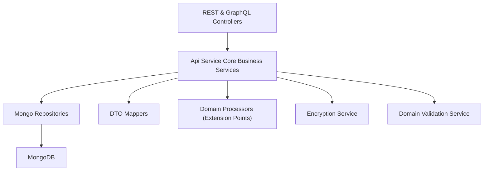
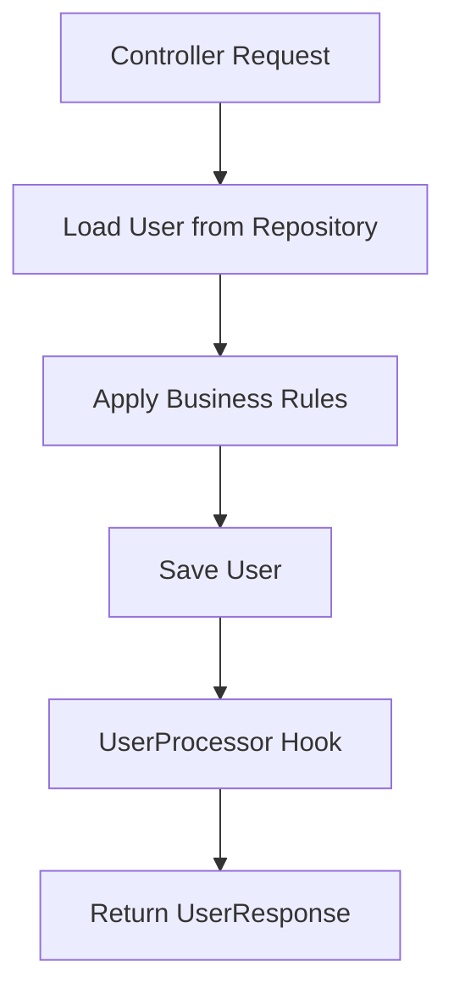
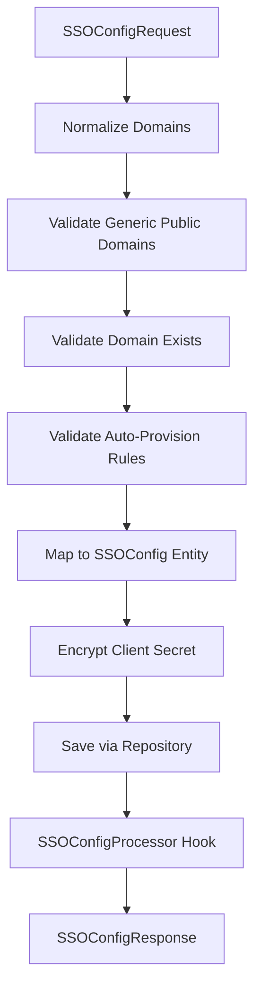
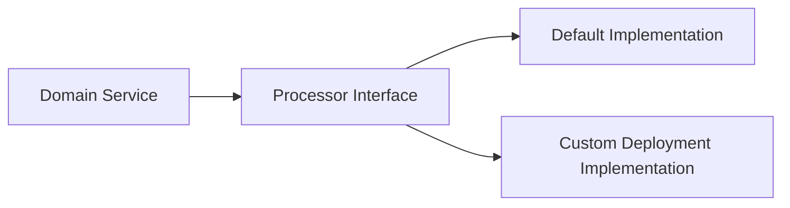
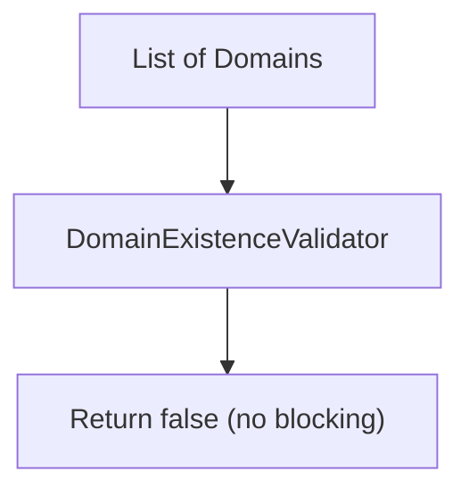

# Api Service Core Business Services

## Overview

The **Api Service Core Business Services** module contains the core domain-level business logic for the API layer. It sits between REST/GraphQL controllers and the data access layer, orchestrating:

- User lifecycle management
- Single Sign-On (SSO) configuration
- Agent registration secret processing
- Invitation processing
- Domain validation policies
- Post-processing hooks for extensibility

This module is intentionally designed with extension points (via processor interfaces and `@ConditionalOnMissingBean`) so that SaaS or enterprise deployments can override default behaviors without modifying the core OSS implementation.

---

## Architectural Context

Within the broader OpenFrame platform, Api Service Core Business Services operates as a domain orchestration layer.

### Key Responsibilities

- Enforce domain invariants
- Validate input beyond DTO constraints
- Orchestrate repository operations
- Trigger post-processing workflows
- Integrate with encryption and domain validation services

---

## Core Components

The module includes the following primary components:

- `DefaultDomainExistenceValidator`
- `SSOConfigService`
- `DefaultAgentRegistrationSecretProcessor`
- `DefaultInvitationProcessor`
- `DefaultSSOConfigProcessor`
- `DefaultUserProcessor`
- `UserService`

They can be grouped into three logical domains:

1. **User Domain Services**
2. **SSO Configuration Services**
3. **Extensibility Processors & Validators**

---

# User Domain Services

## UserService

The `UserService` is the central orchestrator for user lifecycle management.

### Responsibilities

- Retrieve users by ID or email
- Paginated listing of users
- Update mutable fields (first name, last name)
- Soft delete users
- Enforce deletion constraints
- Trigger post-processing hooks

### Dependencies

- `UserRepository`
- `UserMapper`
- `UserProcessor`

### User Lifecycle Flow

### Business Rules Enforced

- A user cannot delete themselves (`UserSelfDeleteNotAllowedException`).
- Owner accounts cannot be deleted (`OperationNotAllowedException`).
- Deletion is soft (status set to `DELETED`).
- Post-processing occurs after:
  - Fetch
  - Update
  - Delete

This ensures consistent domain behavior independent of controller implementation.

---

# SSO Configuration Services

## SSOConfigService

The `SSOConfigService` manages Single Sign-On provider configurations per tenant.

### Responsibilities

- List enabled providers (for login UI)
- List available providers (from properties)
- Retrieve full configuration for admin editing
- Create/update (upsert) provider configuration
- Delete configuration
- Toggle enabled status
- Validate auto-provisioning rules

### Dependencies

- `SSOConfigRepository`
- `EncryptionService`
- `SSOProperties`
- `SSOConfigProcessor`
- `SSOConfigMapper`
- `DomainValidationService`

### Configuration Upsert Flow

### Domain Validation Rules

Before saving configuration:

1. Domains are:
   - Trimmed
   - Lowercased
   - Deduplicated
2. Generic public domains are validated.
3. Existence validation is executed.
4. If `autoProvisionUsers` is true:
   - At least one allowed domain must exist.
   - For Microsoft provider, `msTenantId` is mandatory.

### Encryption Handling

- Client secrets are encrypted at save time.
- Decrypted only when returning full admin configuration.

This ensures secrets are never stored in plain text.

---

# Extensibility Processors & Validators

This module provides default implementations for several extension interfaces using Spring’s `@ConditionalOnMissingBean`.

These defaults are no-op implementations and are intended to be overridden in more advanced deployments.

## Processor Pattern

If a custom bean is provided, the default implementation is automatically disabled.

---

## DefaultUserProcessor

Hooks triggered by `UserService`:

- `postProcessUserDeleted`
- `postProcessUserGet`
- `postProcessUserUpdated`

Default behavior: debug-level logging only.

Custom implementations could:

- Publish domain events
- Trigger audit logging
- Notify external systems

---

## DefaultSSOConfigProcessor

Hooks triggered by `SSOConfigService`:

- After config saved
- After config deleted
- After config toggled

Default behavior: debug logging.

---

## DefaultInvitationProcessor

Hooks triggered when invitations are:

- Created
- Revoked

Default behavior: debug logging.

---

## DefaultAgentRegistrationSecretProcessor

Hooks triggered when:

- Agent registration secret is generated
- Agent registration secret is deactivated

Default behavior: debug logging.

In SaaS deployments, this could integrate with:

- Audit pipelines
- Event streaming systems
- Secret rotation workflows

---

## DefaultDomainExistenceValidator

The `DefaultDomainExistenceValidator` provides a permissive default implementation:

### Behavior

- Always returns `false`.
- Does not block domain validation in OSS mode.
- Intended to be overridden in SaaS multi-tenant environments.

This design allows:

- Strict domain control in enterprise deployments.
- Relaxed behavior in OSS mode.

---

# Cross-Module Relationships

Although this documentation focuses on Api Service Core Business Services, it integrates closely with:

- Data repositories (Mongo persistence layer)
- Encryption services
- Domain validation infrastructure
- REST controllers
- GraphQL data fetchers

The business services layer is the authoritative source of domain rules, ensuring that both REST and GraphQL interfaces behave consistently.

---

# Design Principles

## 1. Clear Domain Boundaries

Services encapsulate domain logic. Controllers delegate orchestration to this module.

## 2. Extensibility by Default

Every major domain service exposes processor hooks.

## 3. Secure-by-Design

- Client secrets encrypted at rest.
- Domain validation enforced before auto-provision.
- Owner deletion protection.

## 4. Multi-Tenant Awareness

Although tenant resolution occurs in other modules, domain validation and SSO rules support per-tenant isolation.

---

# Summary

The **Api Service Core Business Services** module is the domain orchestration engine of the API layer.

It:

- Enforces core business rules
- Coordinates persistence and mapping
- Protects critical invariants (users, SSO, secrets)
- Provides extension hooks for advanced deployments

By centralizing domain logic in this module, the platform ensures consistent behavior across REST, GraphQL, and future interfaces while maintaining strong extensibility and security guarantees.
