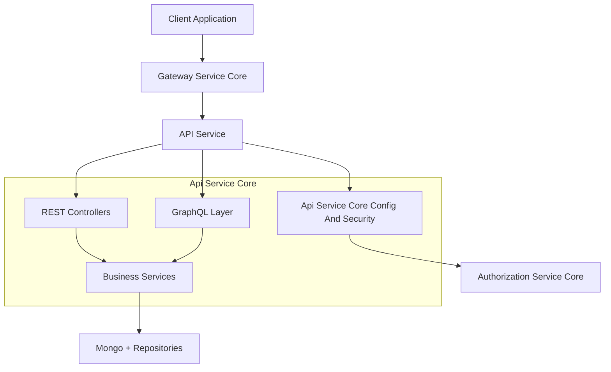
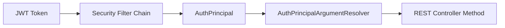
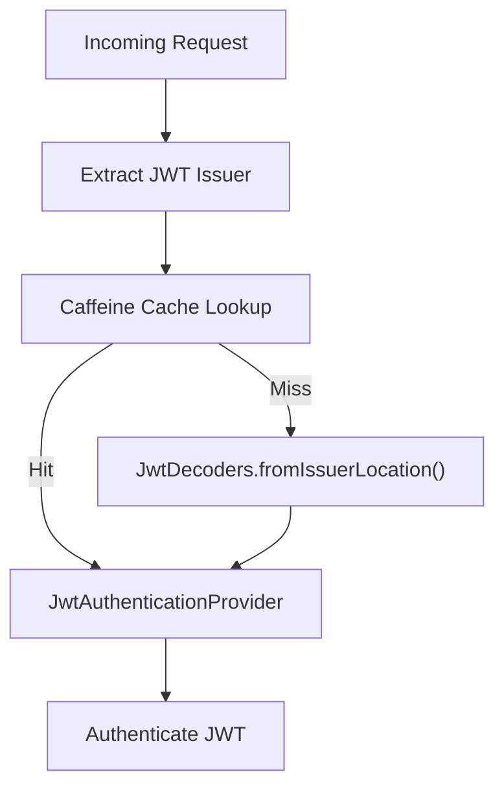
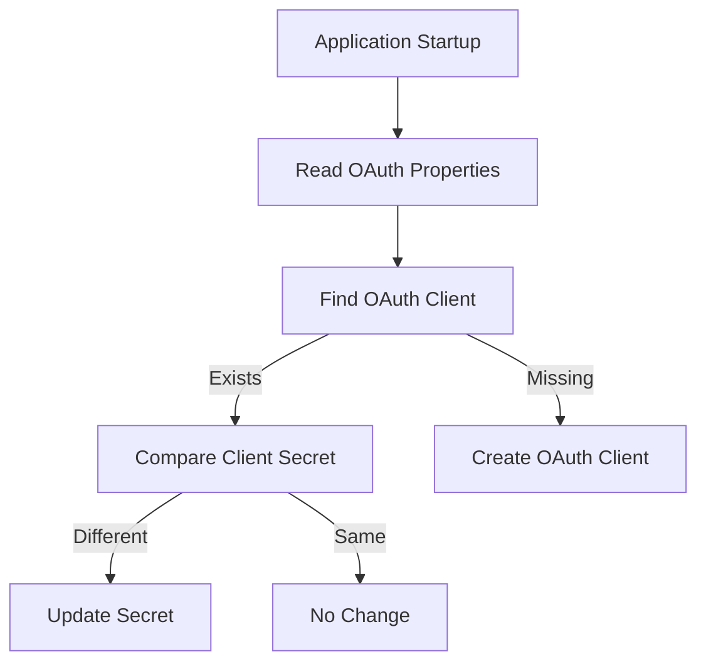
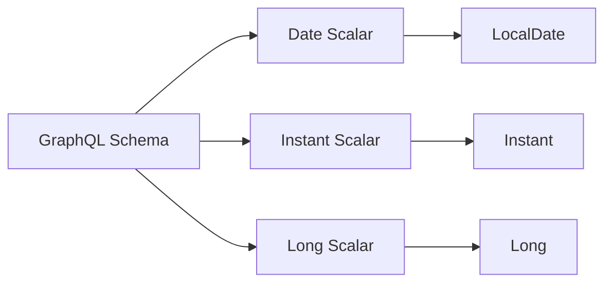
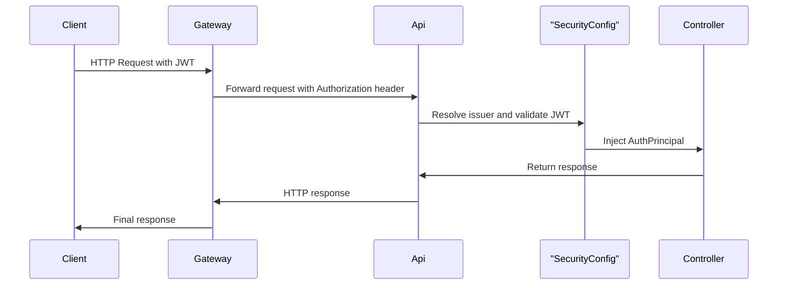

# Api Service Core Config And Security

## Overview

The **Api Service Core Config And Security** module provides foundational configuration and security infrastructure for the OpenFrame API service. It is responsible for:

- Spring Boot application-level bean configuration
- Security filter chain and OAuth2 resource server integration
- JWT issuer-based authentication resolution
- GraphQL custom scalar configuration
- OAuth client bootstrapping
- REST client provisioning

This module does **not** implement business logic or endpoint definitions. Instead, it supplies the cross-cutting infrastructure required by:

- REST Controllers (API layer)
- GraphQL Data Fetchers
- Business Services
- Data Access Layers
- External integrations

It acts as the **security and configuration backbone** of the API service.

---

## Architectural Position

The module sits between the API surface (REST + GraphQL) and the underlying authorization and data layers.



### Key Architectural Responsibilities

| Responsibility | Description |
|---------------|------------|
| Authentication Support | Enables OAuth2 resource server behavior for JWT validation |
| Principal Resolution | Injects authenticated principals into controller methods |
| OAuth Client Initialization | Seeds default OAuth client at startup |
| GraphQL Scalar Support | Registers Date, Instant, and Long custom scalars |
| REST Integration | Provides `RestTemplate` bean for external calls |
| Password Encoding | Configures BCrypt encoder for secure hashing |

---

# Core Components

## 1. ApiApplicationConfig

**Class:** `ApiApplicationConfig`

Provides foundational Spring beans required across the application.

### Password Encoder

```java
@Bean
public PasswordEncoder passwordEncoder() {
    return new BCryptPasswordEncoder();
}
```

### Purpose

- Ensures consistent password hashing using BCrypt
- Used by user services and authentication-related workflows
- Provides secure password storage compatibility with Authorization Service Core

---

## 2. AuthenticationConfig

**Class:** `AuthenticationConfig`

Registers a custom `HandlerMethodArgumentResolver`:

- `AuthPrincipalArgumentResolver`

### Responsibility

Enables controller methods to use:

```java
@AuthenticationPrincipal AuthPrincipal principal
```

This allows:

- Injection of authenticated user context
- Simplified controller method signatures
- Decoupling from raw Spring Security APIs

### Flow



---

## 3. SecurityConfig

**Class:** `SecurityConfig`

This is the core security configuration for the API service.

### Design Philosophy

The Gateway Service Core handles:

- JWT validation
- PermitAll path filtering
- Header normalization
- Cookie-to-header authorization mapping

The API service acts as an **OAuth2 Resource Server** primarily to support:

- `@AuthenticationPrincipal`
- Method-level security context

### JWT Issuer-Based Authentication

The configuration supports **multi-issuer JWT validation** using:

- `JwtIssuerAuthenticationManagerResolver`
- Caffeine-backed cache of `JwtAuthenticationProvider`

### JWT Provider Cache



### Cache Properties

Configured via application properties:

- `openframe.security.jwt.cache.expire-after`
- `openframe.security.jwt.cache.refresh-after`
- `openframe.security.jwt.cache.maximum-size`

### Security Filter Chain

Key characteristics:

- CSRF disabled (stateless API)
- `anyRequest().permitAll()`
- OAuth2 Resource Server enabled

This may look permissive, but authentication enforcement is delegated to the Gateway layer.

---

## 4. DataInitializer

**Class:** `DataInitializer`

Implements `CommandLineRunner` to initialize a default OAuth client at startup.

### Behavior

1. Reads environment properties:
   - `oauth.client.default.id`
   - `oauth.client.default.secret`
2. Checks repository for existing client
3. Updates secret if changed
4. Creates client if missing

### Initialization Flow



### Why This Matters

- Ensures consistent OAuth configuration
- Prevents manual database bootstrapping
- Supports containerized and ephemeral deployments

---

## 5. GraphQL Scalar Configurations

The module defines three custom GraphQL scalars using Netflix DGS.

### DateScalarConfig

- GraphQL Type: `Date`
- Java Type: `LocalDate`
- Format: `yyyy-MM-dd`
- Validates input and provides descriptive errors

### InstantScalarConfig

- GraphQL Type: `Instant`
- Java Type: `Instant`
- ISO-8601 compliant
- Supports serialization and literal parsing

### LongScalarConfig

- GraphQL Type: `Long`
- Java Type: `Long`
- Required because GraphQL `Int` is limited to 32-bit
- Handles:
  - Numeric values
  - String values
  - Literal values

### GraphQL Type Integration



These scalars ensure:

- Strong typing
- Input validation
- Consistent serialization across clients

---

## 6. RestTemplateConfig

**Class:** `RestTemplateConfig`

Provides a reusable `RestTemplate` bean.

### Purpose

- Used by services calling external APIs
- Supports integration with:
  - Authorization service
  - External connectors
  - Third-party integrations

While simple, centralizing it enables:

- Future interceptors
- Tracing
- Timeout configuration
- Load-balancing extensions

---

# End-to-End Request Lifecycle

The following diagram illustrates how a request flows through the system with this module in place.



---

# Interaction with Other Modules

Although this module contains no business logic, it is critical to:

- REST Controllers (authentication context injection)
- GraphQL Layer (custom scalar support)
- Business Services (password encoding and security context)
- Authorization Service Core (JWT issuer validation)
- Data repositories (OAuth client persistence)

It provides the secure and consistent runtime environment required for the broader OpenFrame platform.

---

# Design Principles

### 1. Gateway-First Security
Authentication enforcement lives at the Gateway. The API layer remains lightweight and issuer-aware.

### 2. Multi-Tenant JWT Support
Issuer-based resolution allows dynamic support for multiple identity providers.

### 3. Declarative Configuration
Spring annotations (`@Configuration`, `@Bean`) ensure predictable lifecycle behavior.

### 4. Fail-Fast Validation
GraphQL scalars enforce strict input formats.

### 5. Idempotent Bootstrapping
OAuth client initialization is safe across restarts and deployments.

---

# Summary

The **Api Service Core Config And Security** module is the infrastructural foundation of the OpenFrame API service.

It provides:

- JWT-based resource server support
- Multi-issuer authentication resolution
- Password encoding
- OAuth client bootstrapping
- GraphQL scalar definitions
- REST client configuration

Without this module, higher-level modules (controllers, GraphQL, business services) would lack authentication context, scalar type safety, and initialization guarantees.

It ensures the API service remains secure, extensible, and production-ready.