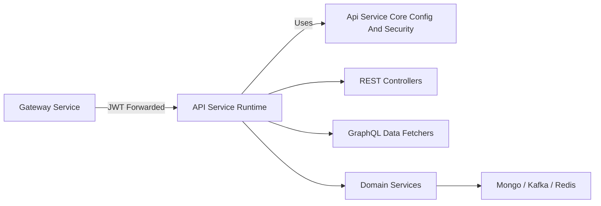
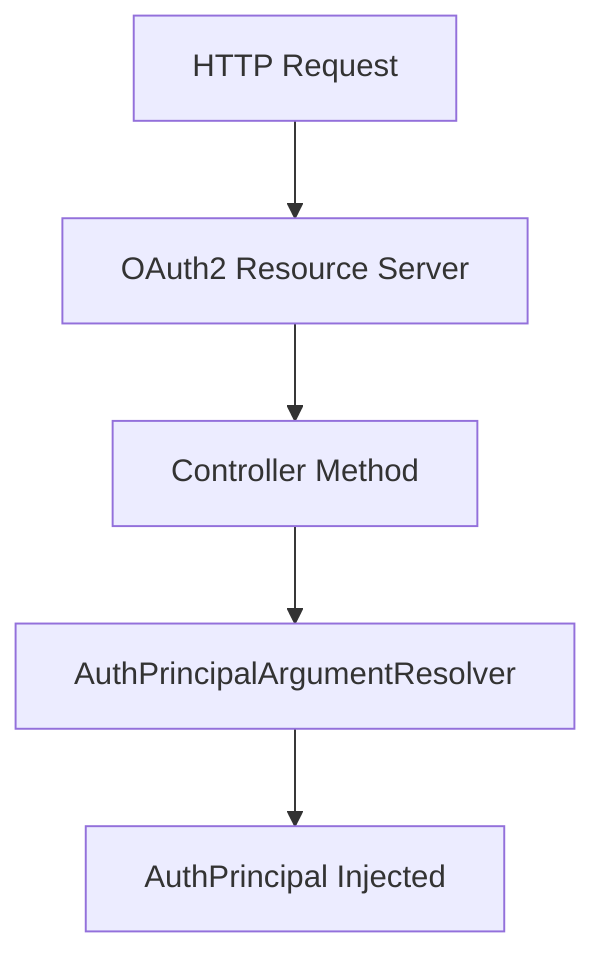
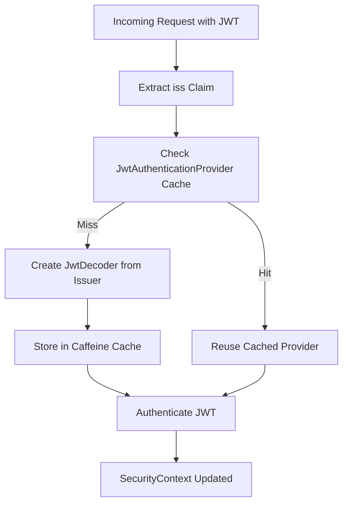
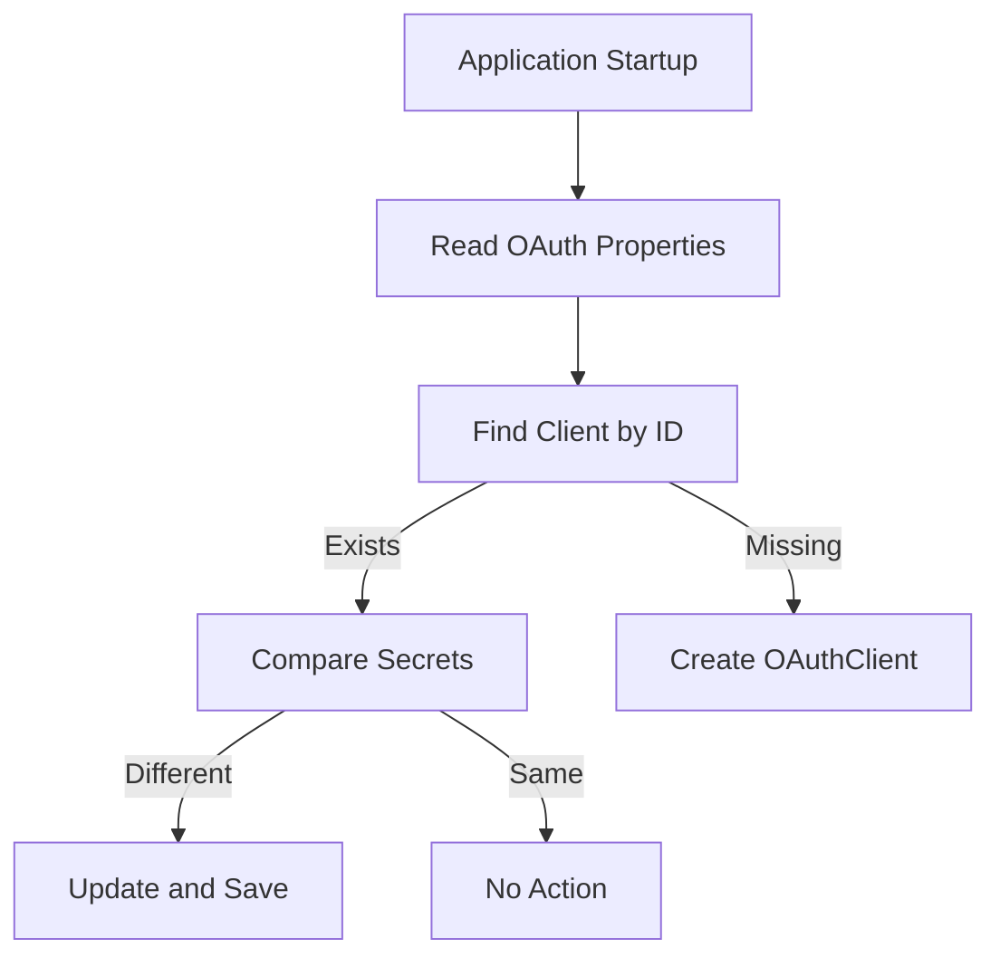
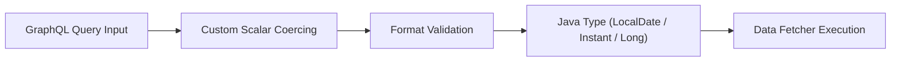
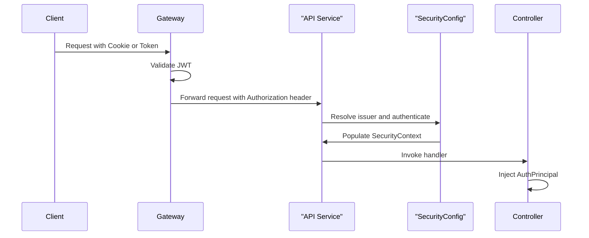

# Api Service Core Config And Security

The **Api Service Core Config And Security** module defines the foundational runtime configuration for the OpenFrame API service. It centralizes:

- Core Spring Boot bean configuration
- Authentication and argument resolution
- OAuth client bootstrapping
- GraphQL custom scalar definitions
- Outbound HTTP client configuration
- JWT resource server integration with issuer-based caching

This module is intentionally lightweight in business logic. Its responsibility is to configure and secure the API runtime so that higher-level modules such as REST controllers, GraphQL data fetchers, and service layers can operate consistently and securely.

---

## 1. Architectural Role in the System

The Api Service Core Config And Security module sits at the heart of the API runtime. It wires together:

- Spring Boot auto-configuration
- Spring Security (OAuth2 Resource Server)
- GraphQL DGS custom scalars
- OAuth client initialization
- Shared infrastructure beans (PasswordEncoder, RestTemplate)

### High-Level Placement



### Security Responsibility Split

The API service does **not** perform full authentication enforcement. Instead:

- The **Gateway Service**:
  - Validates JWT tokens
  - Handles public vs protected routes
  - Injects `Authorization` headers from cookies
- The **Api Service Core Config And Security** module:
  - Enables OAuth2 Resource Server support
  - Resolves JWT issuers dynamically
  - Exposes `@AuthenticationPrincipal` support

This layered approach keeps the API service stateless and focused on business logic.

---

## 2. Core Configuration Components

### 2.1 ApiApplicationConfig

**Component:**
- `ApiApplicationConfig`

Provides shared infrastructure beans.

#### PasswordEncoder Bean

```java
@Bean
public PasswordEncoder passwordEncoder() {
    return new BCryptPasswordEncoder();
}
```

- Uses BCrypt for secure password hashing.
- Shared across services handling credentials.
- Ensures consistent hashing strategy across modules.

---

### 2.2 AuthenticationConfig

**Component:**
- `AuthenticationConfig`

Registers a custom Spring MVC argument resolver:

- `AuthPrincipalArgumentResolver`

This enables controller methods like:

```java
public ResponseEntity<?> getProfile(@AuthenticationPrincipal AuthPrincipal principal)
```

#### Flow



This ensures:
- Clean controller signatures
- Strong typing for authenticated users
- No manual extraction of JWT claims

---

### 2.3 SecurityConfig

**Component:**
- `SecurityConfig`

This is the central Spring Security configuration.

#### Key Characteristics

- CSRF disabled (stateless API)
- All routes `permitAll()` at API layer
- OAuth2 Resource Server enabled
- Multi-issuer JWT support
- Caffeine-based JWT provider cache

### JWT Issuer-Based Authentication

The module uses:

- `JwtIssuerAuthenticationManagerResolver`
- A `LoadingCache<String, JwtAuthenticationProvider>`

This allows dynamic resolution of authentication managers based on the JWT issuer.



#### Cache Configuration

The cache is controlled by properties:

- `openframe.security.jwt.cache.expire-after`
- `openframe.security.jwt.cache.refresh-after`
- `openframe.security.jwt.cache.maximum-size`

This ensures:
- Efficient decoder reuse
- Controlled memory usage
- Automatic refresh of issuer metadata

---

### 2.4 DataInitializer

**Component:**
- `DataInitializer`

Implements a `CommandLineRunner` to initialize OAuth clients at application startup.

#### Responsibilities

- Reads properties:
  - `oauth.client.default.id`
  - `oauth.client.default.secret`
- Checks if client exists
- Updates secret if changed
- Creates client if missing



#### Design Rationale

- Ensures environment-driven configuration.
- Avoids manual database seeding.
- Keeps OAuth client configuration aligned with deployment configuration.

---

### 2.5 GraphQL Custom Scalars

The module defines three custom DGS scalars.

#### DateScalarConfig

- Scalar name: `Date`
- Backed by `LocalDate`
- Format: `yyyy-MM-dd`

Validation ensures:
- Strict format compliance
- Clear error messages for invalid input

---

#### InstantScalarConfig

- Scalar name: `Instant`
- Backed by `Instant`
- ISO-8601 format (e.g. `2026-01-01T10:15:30Z`)

Provides:
- Consistent time serialization
- Accurate timezone handling

---

#### LongScalarConfig

- Scalar name: `Long`
- Supports 64-bit integers
- Required for values exceeding GraphQL `Int` limits

Handles:
- Numeric literals
- String-based numeric input
- Safe coercion with validation



These scalars standardize type handling across all GraphQL data fetchers.

---

### 2.6 RestTemplateConfig

**Component:**
- `RestTemplateConfig`

Defines a singleton `RestTemplate` bean.

```java
@Bean
public RestTemplate restTemplate() {
    return new RestTemplate();
}
```

Used for:
- Outbound HTTP calls
- Internal service-to-service communication
- OAuth metadata resolution (indirectly via Spring Security)

Centralizing the bean allows:
- Future interceptors
- Timeout configuration
- Observability instrumentation

---

## 3. End-to-End Security Flow

Below is a simplified request lifecycle involving this module.



### Key Observations

- Authentication enforcement happens upstream.
- API service trusts Gateway filtering.
- Multi-tenant issuer resolution is supported dynamically.
- Controllers remain clean and declarative.

---

## 4. Design Principles

The Api Service Core Config And Security module follows these principles:

### 4.1 Separation of Concerns

- Gateway: authentication + edge security
- API: resource server support + identity propagation
- Services: business logic

### 4.2 Statelessness

- No server-side sessions
- JWT-based identity
- Cache only for issuer metadata

### 4.3 Extensibility

- Centralized bean definitions
- Pluggable scalar definitions
- Configurable cache properties

### 4.4 Environment-Driven Configuration

- OAuth clients initialized via properties
- Cache behavior driven by configuration
- No hard-coded credentials

---

## 5. Summary

The **Api Service Core Config And Security** module is the foundation of the OpenFrame API runtime. It:

- Enables secure JWT-based authentication
- Integrates with multi-issuer OAuth providers
- Standardizes GraphQL scalar behavior
- Provides core infrastructure beans
- Bootstraps OAuth client configuration

While minimal in business logic, this module is critical for ensuring:

- Secure request handling
- Consistent authentication context propagation
- Reliable GraphQL type handling
- Clean separation between infrastructure and domain layers

It acts as the runtime spine of the API service, ensuring that all higher-level modules operate in a secure, predictable, and standardized environment.
