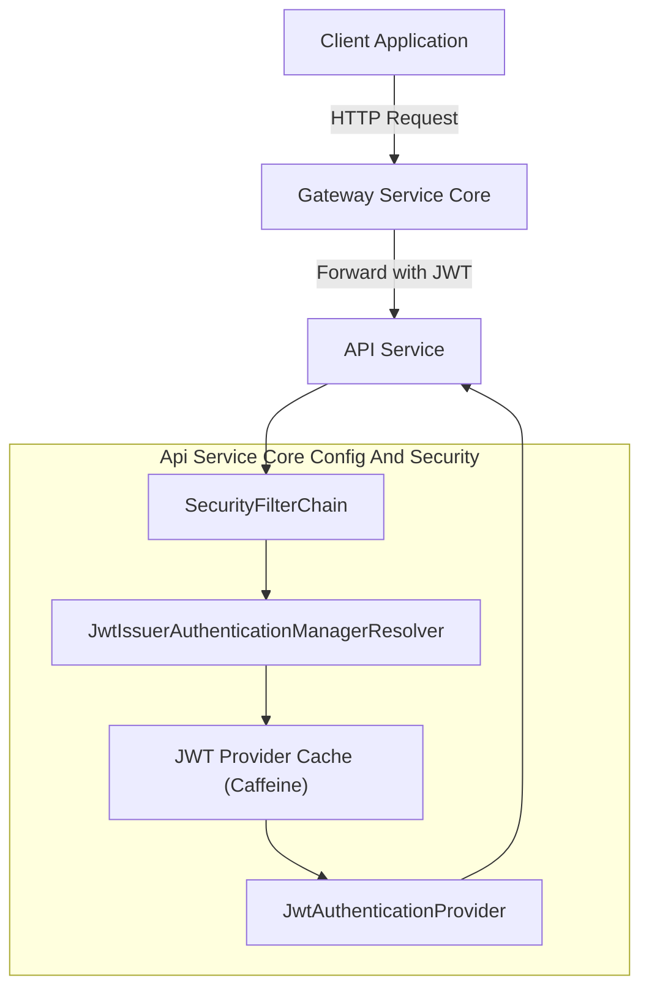
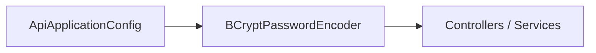
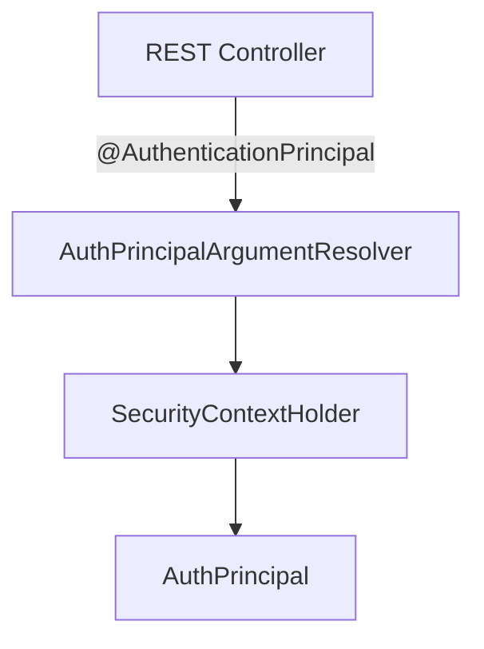
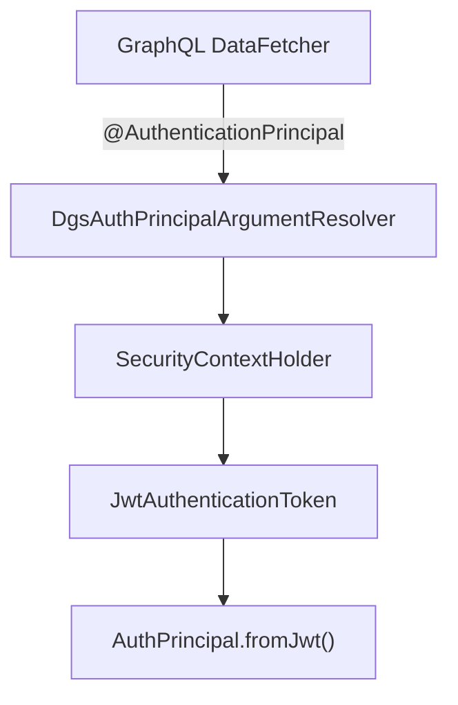
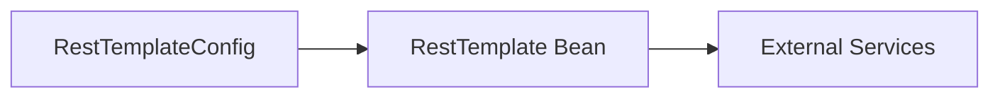
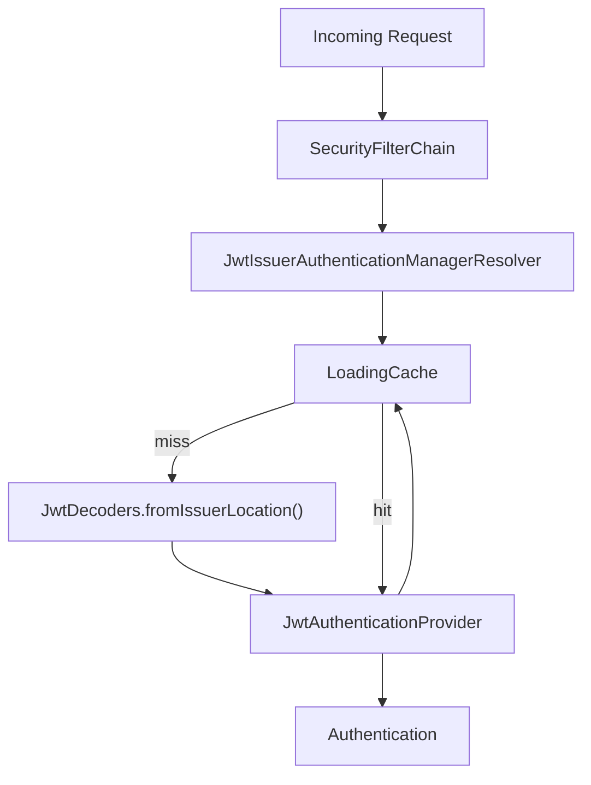
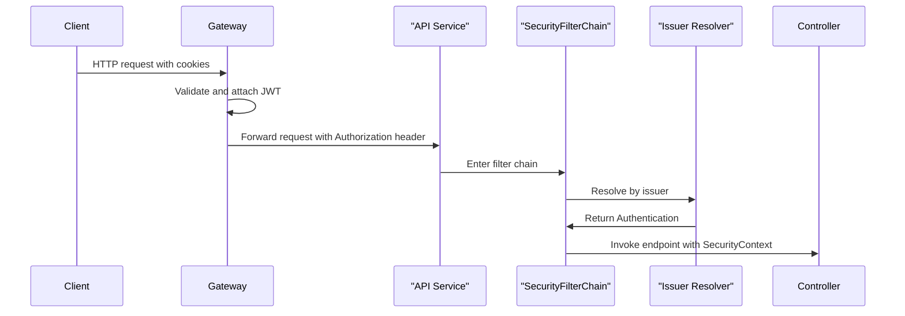

# Api Service Core Config And Security

## Overview

The **Api Service Core Config And Security** module provides the foundational Spring configuration for the OpenFrame API Service. It is responsible for:

- Core bean configuration (e.g., password encoding, HTTP clients)
- Spring MVC authentication argument resolution
- GraphQL (DGS) authentication principal resolution
- OAuth2 Resource Server setup for JWT validation
- Lightweight security enforcement behind the Gateway

This module does **not** implement business logic or endpoint handlers. Instead, it defines the infrastructure that enables REST controllers, GraphQL data fetchers, and downstream services to operate securely and consistently.

It acts as the security and configuration backbone for:

- REST controllers in the Api Service Core REST Controllers module
- GraphQL data fetchers in the Api Service Core GraphQL module
- Data loaders in the Api Service Core Dataloaders module

---

## Architectural Context

The OpenFrame architecture separates responsibilities across Gateway, API Service, Authorization Service, and downstream data layers.

The Api Service Core Config And Security module ensures the API Service can:

- Accept JWT tokens validated by trusted issuers
- Resolve authenticated principals for REST and GraphQL
- Interact with external services via RestTemplate
- Provide consistent password encoding

### High-Level Security Flow

```mermaid
flowchart TD
    Client["Client Application"] -->|"HTTP Request"| Gateway["Gateway Service Core"]
    Gateway -->|"Forward with JWT"| ApiService["API Service"]

    subgraph api_security["Api Service Core Config And Security"]
        SecurityFilter["SecurityFilterChain"]
        IssuerResolver["JwtIssuerAuthenticationManagerResolver"]
        JwtCache["JWT Provider Cache (Caffeine)"]
        JwtProvider["JwtAuthenticationProvider"]
    end

    ApiService --> SecurityFilter
    SecurityFilter --> IssuerResolver
    IssuerResolver --> JwtCache
    JwtCache --> JwtProvider
    JwtProvider --> ApiService
```

### Key Principles

1. **Gateway-First Security**  
   The Gateway Service Core performs primary authentication and filtering.

2. **Resource Server in API Service**  
   The API Service validates JWTs using OAuth2 Resource Server support to populate `SecurityContext`.

3. **Permit-All HTTP Layer**  
   Authorization decisions are delegated upstream or handled at business logic level. The filter chain permits all requests but still authenticates JWTs.

---

## Core Components

### 1. ApiApplicationConfig

**Component:**  
`openframe-oss-lib.openframe-api-service-core.src.main.java.com.openframe.api.config.ApiApplicationConfig.ApiApplicationConfig`

#### Responsibility

Provides base application-level bean configuration.

#### Defined Beans

- `PasswordEncoder` → `BCryptPasswordEncoder`

```mermaid
flowchart LR
    Config["ApiApplicationConfig"] --> Encoder["BCryptPasswordEncoder"]
    Encoder --> Consumers["Controllers / Services"]
```

#### Design Notes

- Uses BCrypt for secure password hashing.
- Ensures consistency with other modules such as Authorization Service Core and Client Agent Service Core.

---

### 2. AuthenticationConfig

**Component:**  
`openframe-oss-lib.openframe-api-service-core.src.main.java.com.openframe.api.config.AuthenticationConfig.AuthenticationConfig`

#### Responsibility

Registers a custom `HandlerMethodArgumentResolver` for Spring MVC.

Specifically:

- Enables `@AuthenticationPrincipal AuthPrincipal` injection in REST controllers.

```mermaid
flowchart TD
    Controller["REST Controller"] -->|"@AuthenticationPrincipal"| Resolver["AuthPrincipalArgumentResolver"]
    Resolver --> SecurityContext["SecurityContextHolder"]
    SecurityContext --> Principal["AuthPrincipal"]
```

#### Why This Exists

The default Spring Security principal resolution does not directly expose the custom `AuthPrincipal` abstraction used across OpenFrame. This configuration bridges that gap for REST endpoints.

---

### 3. DgsAuthPrincipalArgumentResolver

**Component:**  
`openframe-oss-lib.openframe-api-service-core.src.main.java.com.openframe.api.config.DgsAuthPrincipalArgumentResolver.DgsAuthPrincipalArgumentResolver`

#### Responsibility

Provides GraphQL (DGS) support for:

- `@AuthenticationPrincipal AuthPrincipal` in data fetchers.

This mirrors the behavior of the MVC resolver but for the DGS invocation path.

```mermaid
flowchart TD
    DataFetcher["GraphQL DataFetcher"] -->|"@AuthenticationPrincipal"| DgsResolver["DgsAuthPrincipalArgumentResolver"]
    DgsResolver --> Context["SecurityContextHolder"]
    Context --> JwtToken["JwtAuthenticationToken"]
    JwtToken --> AuthPrincipalNode["AuthPrincipal.fromJwt()"]
```

#### Behavior

- Checks the current `Authentication` from `SecurityContextHolder`.
- If it is a `JwtAuthenticationToken`, converts it into `AuthPrincipal`.
- Returns `null` for unauthenticated or non-JWT requests.

This ensures consistent authentication semantics between:

- REST controllers
- GraphQL data fetchers

---

### 4. RestTemplateConfig

**Component:**  
`openframe-oss-lib.openframe-api-service-core.src.main.java.com.openframe.api.config.RestTemplateConfig.RestTemplateConfig`

#### Responsibility

Defines a shared `RestTemplate` bean for outbound HTTP communication.

```mermaid
flowchart LR
    RestTemplateConfig["RestTemplateConfig"] --> RestTemplateBean["RestTemplate Bean"]
    RestTemplateBean --> ExternalServices["External Services"]
```

#### Usage Context

- Communication with other internal services.
- Integration with external APIs when required.

This centralizes HTTP client configuration and enables later extension (timeouts, interceptors, tracing).

---

### 5. SecurityConfig

**Component:**  
`openframe-oss-lib.openframe-api-service-core.src.main.java.com.openframe.api.config.SecurityConfig.SecurityConfig`

#### Responsibility

Configures Spring Security as an OAuth2 Resource Server.

Key features:

- Disables CSRF
- Permits all HTTP requests
- Enables JWT-based authentication
- Supports multi-issuer JWT validation
- Caches `JwtAuthenticationProvider` instances per issuer

---

## JWT Provider Cache Architecture

To support multiple JWT issuers dynamically, the module uses a Caffeine `LoadingCache`.

### Flow

```mermaid
flowchart TD
    Request["Incoming Request"] --> Filter["SecurityFilterChain"]
    Filter --> Resolver["JwtIssuerAuthenticationManagerResolver"]
    Resolver --> Cache["LoadingCache<String, JwtAuthenticationProvider>"]
    Cache -->|"miss"| Decoder["JwtDecoders.fromIssuerLocation()"]
    Decoder --> Provider["JwtAuthenticationProvider"]
    Provider --> Cache
    Cache -->|"hit"| Provider
    Provider --> AuthResult["Authentication"]
```

### Cache Configuration Properties

The following properties control cache behavior:

- `openframe.security.jwt.cache.expire-after`
- `openframe.security.jwt.cache.refresh-after`
- `openframe.security.jwt.cache.maximum-size`

These allow:

- Performance optimization
- Controlled issuer metadata refresh
- Safe multi-tenant scaling

---

## SecurityFilterChain Behavior

The `SecurityFilterChain` is intentionally minimal.

### Configuration Summary

- `csrf().disable()`
- `anyRequest().permitAll()`
- `oauth2ResourceServer().authenticationManagerResolver(...)`

### Why Permit All?

Authorization is handled by:

- Gateway Service Core (edge filtering)
- Business-level authorization logic
- Authorization Service Core (token issuance and policy)

The API Service focuses on:

- Token validation
- Principal extraction
- Context population

---

## End-to-End Request Lifecycle

```mermaid
sequenceDiagram
    participant Client
    participant Gateway
    participant ApiService as "API Service"
    participant Security as "SecurityFilterChain"
    participant Resolver as "Issuer Resolver"
    participant Controller

    Client->>Gateway: HTTP request with cookies
    Gateway->>Gateway: Validate and attach JWT
    Gateway->>ApiService: Forward request with Authorization header
    ApiService->>Security: Enter filter chain
    Security->>Resolver: Resolve by issuer
    Resolver->>Security: Return Authentication
    Security->>Controller: Invoke endpoint with SecurityContext
```

---

## Integration With Other Modules

Although this module contains no controllers or business logic, it directly supports:

- REST controllers (principal injection via MVC resolver)
- GraphQL data fetchers (principal injection via DGS resolver)
- Data access logic (security context propagation)
- Gateway-based authentication model

It also aligns with:

- Authorization Service Core for issuer-based JWT validation
- Gateway Service Core for upstream authentication and header management

---

## Design Considerations

### 1. Separation of Concerns

- Gateway → Edge authentication and filtering
- Authorization Service → Token issuance and tenant handling
- API Service → Resource server and principal resolution

### 2. Multi-Tenant JWT Support

Dynamic issuer resolution allows:

- Multiple tenant identity providers
- OIDC-based discovery
- Scalable validation without static configuration

### 3. Consistent Principal Model

Both REST and GraphQL layers expose the same `AuthPrincipal` abstraction.

This ensures:

- Uniform authorization checks
- Simplified service-layer security
- Reduced duplication

---

## Summary

The **Api Service Core Config And Security** module is the foundational security and configuration layer of the API Service.

It provides:

- Password encoding configuration
- REST and GraphQL principal resolution
- OAuth2 Resource Server support
- Multi-issuer JWT validation with caching
- Minimal but powerful security filter configuration

By keeping authentication infrastructure centralized and lightweight, this module enables the broader OpenFrame platform to scale securely while preserving clean separation between Gateway, Authorization, and API concerns.