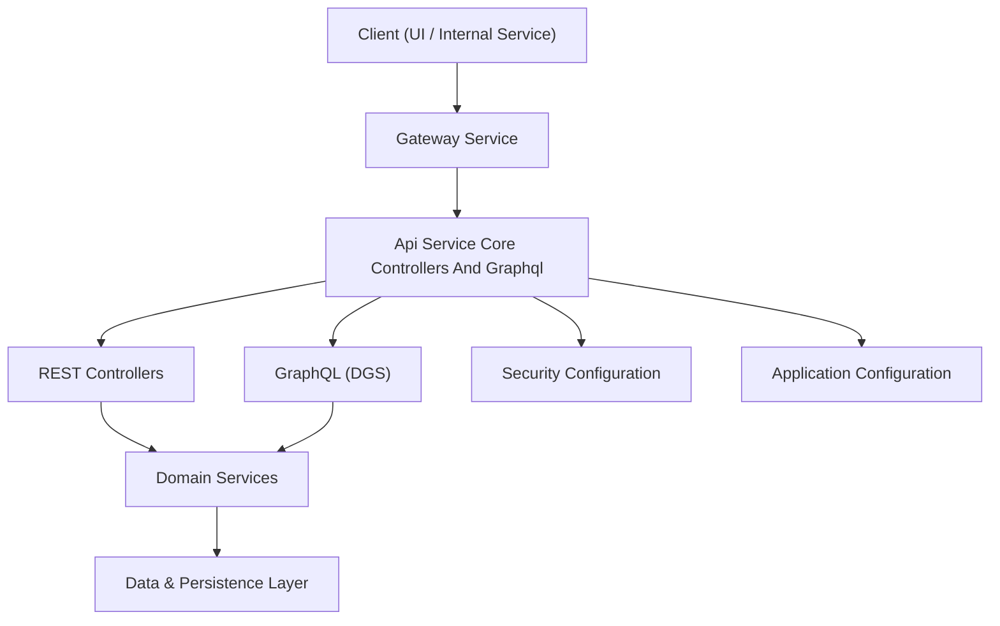
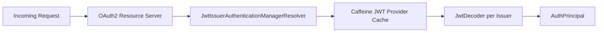
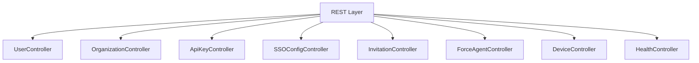
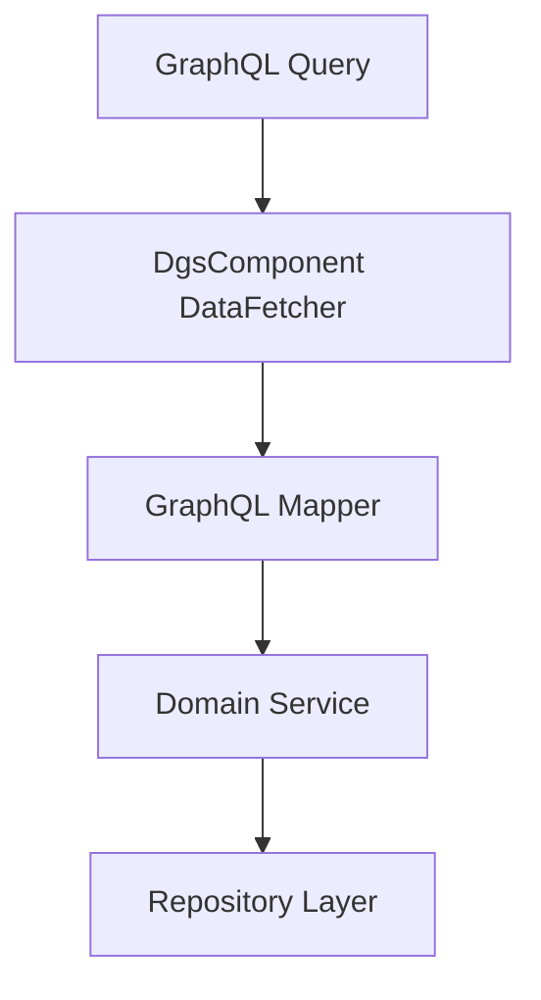
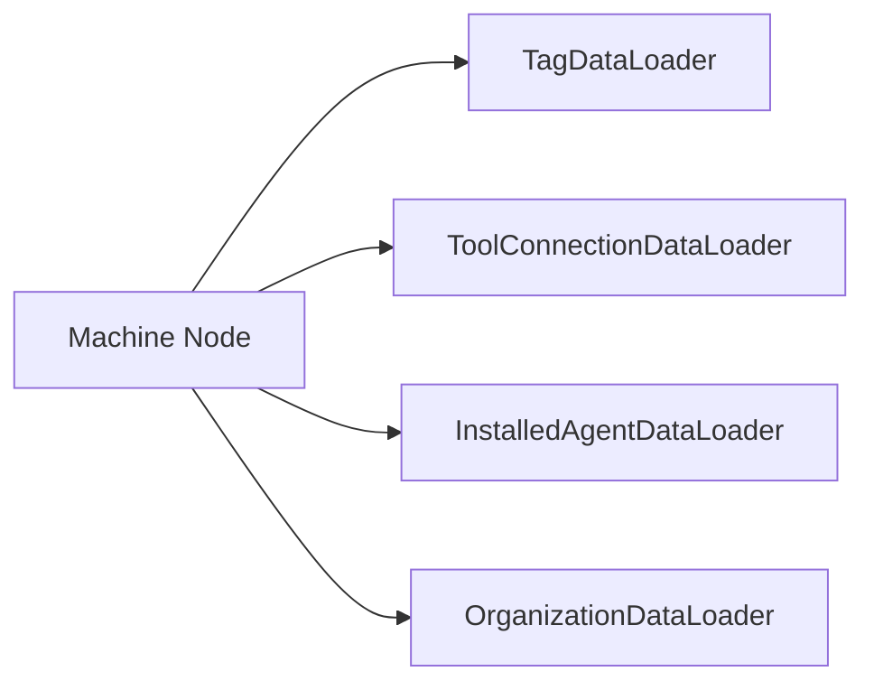
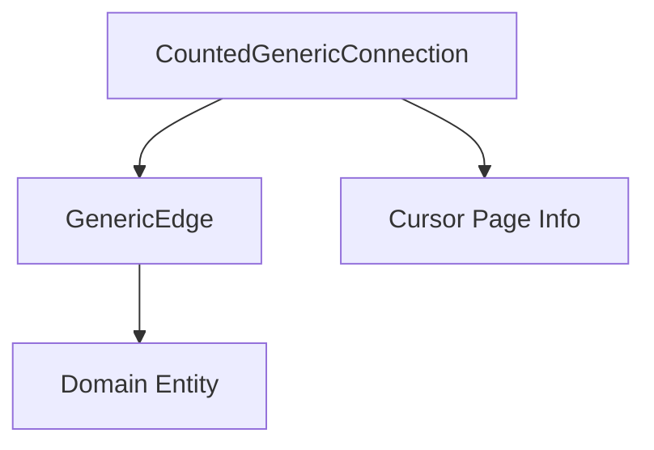

# Api Service Core Controllers And Graphql

## Overview

The **Api Service Core Controllers And Graphql** module is the primary application-layer entry point for the OpenFrame backend. It exposes:

- REST controllers for internal and administrative operations
- GraphQL queries and mutations using Netflix DGS
- Data loaders to prevent N+1 query issues
- Security configuration for JWT-based resource server support
- Application-level configuration and initialization

This module sits between the Gateway layer and the domain/data services. It orchestrates requests, enforces validation, maps DTOs, and delegates business logic to service-layer components.

---

## High-Level Responsibilities

1. Expose REST endpoints for internal operations (users, organizations, API keys, SSO, invitations, force operations, etc.)
2. Expose GraphQL queries and mutations for devices, events, logs, tools, and organizations
3. Configure JWT resource server support for `@AuthenticationPrincipal`
4. Provide GraphQL custom scalars (Date, Instant)
5. Initialize OAuth clients at application startup
6. Provide extension points via processor interfaces (SSO, invitations, users)

---

## Architecture Overview

### Position in the System

- **Gateway** handles authentication, JWT validation, and routing.
- This module enables OAuth2 Resource Server support mainly to allow `@AuthenticationPrincipal` injection.
- Business logic resides in service-layer modules and data access layers.

---

# Configuration Layer

## ApiApplicationConfig

Provides core application beans:

- `PasswordEncoder` using `BCryptPasswordEncoder`

This ensures consistent password hashing across services.

---

## SecurityConfig

Configures Spring Security as an OAuth2 Resource Server.

Key characteristics:

- Disables CSRF
- Permits all HTTP requests (authorization handled upstream in Gateway)
- Uses `JwtIssuerAuthenticationManagerResolver`
- Caches `JwtAuthenticationProvider` instances using Caffeine

This design supports multi-tenant issuer resolution and reduces JWT decoder re-instantiation overhead.

---

## AuthenticationConfig

Registers a custom `AuthPrincipalArgumentResolver` to allow:

- `@AuthenticationPrincipal AuthPrincipal` injection in controllers

This simplifies access to:

- User ID
- Email
- Roles
- Tenant ID

---

## DataInitializer

Runs at startup (`CommandLineRunner`) and ensures:

- A default OAuth client exists
- Client secret is synchronized with configuration properties

This guarantees that OAuth-based integrations are always initialized.

---

## GraphQL Scalar Configuration

### DateScalarConfig

Custom `Date` scalar:

- Format: `yyyy-MM-dd`
- Converts between `LocalDate` and String

### InstantScalarConfig

Custom `Instant` scalar:

- Uses ISO-8601 format
- Converts between `Instant` and String

These scalars ensure strong typing and consistent date handling in GraphQL.

---

# REST Controllers

The REST layer exposes internal and administrative APIs.

## Key Controllers

### UserController

- List users (paginated)
- Get by ID
- Update user
- Soft delete user

Implements protections:

- Prevent self-deletion
- Prevent deletion of OWNER users

Delegates to `UserService` and triggers `UserProcessor` hooks.

---

### OrganizationController

Handles:

- Create organization
- Update organization
- Delete organization

Enforces:

- Conflict if organization has machines
- Not found handling via exceptions

---

### ApiKeyController

Manages user-scoped API keys:

- Create
- Update
- Delete
- Regenerate
- Fetch statistics

Uses `AuthPrincipal` to scope keys to authenticated user.

---

### SSOConfigController

Manages SSO provider configurations:

- List enabled providers
- List available providers
- Get full config
- Upsert configuration
- Toggle enable/disable
- Delete configuration

Delegates to `SSOConfigService` which handles:

- Encryption of client secrets
- Domain validation
- Auto-provision validation
- Post-processing hooks

---

### InvitationController

Handles:

- Create invitation
- List invitations (paginated)
- Revoke
- Resend

Uses `DefaultInvitationProcessor` unless overridden.

---

### ForceAgentController

Triggers operational commands:

- Tool installation
- Tool update
- Client update
- Reinstallation flows

Acts as orchestration layer for operational services.

---

### DeviceController

Internal endpoint for updating device status.

---

### MeController

Returns authenticated user information based on `AuthPrincipal`.

---

### HealthController

Basic `/health` endpoint returning `OK`.

---

# GraphQL Layer (Netflix DGS)

The GraphQL API exposes query-driven, filterable, cursor-paginated data access.

## DataFetchers

### DeviceDataFetcher

Provides:

- `devices` (cursor-based, counted)
- `device`
- `deviceFilters`

Uses DataLoaders for:

- Tags
- Tool connections
- Installed agents
- Organization

---

### EventDataFetcher

Provides:

- `events` (cursor pagination)
- `eventById`
- `eventFilters`
- `createEvent`
- `updateEvent`

---

### LogDataFetcher

Provides:

- `logs`
- `logFilters`
- `logDetails`

Supports advanced filtering by:

- Date range
- Tool type
- Event type
- Organization
- Severity

---

### OrganizationDataFetcher

Provides:

- `organizations` (counted connection)
- `organization`
- `organizationByOrganizationId`

---

### ToolsDataFetcher

Provides:

- `integratedTools`
- `toolFilters`

---

# DataLoader Layer

Prevents N+1 query issues in GraphQL.

Each DataLoader:

- Batches keys
- Loads entities asynchronously
- Preserves order

Examples:

- `InstalledAgentDataLoader`
- `OrganizationDataLoader`
- `TagDataLoader`
- `ToolConnectionDataLoader`

---

# DTO and Pagination Model

The module implements a cursor-based pagination model:

- `GenericEdge<T>`
- `CountedGenericConnection<T>`
- `CursorPaginationInput`

This enables:

- Stable cursor-based pagination
- Filtered counts
- Relay-style GraphQL compatibility

---

# SSO and Domain Validation

`SSOConfigService` enforces:

- Domain normalization
- Public domain blocking
- Domain existence validation
- Microsoft tenant validation rules

Extension points:

- `DefaultSSOConfigProcessor`
- `DefaultDomainExistenceValidator`

These allow SaaS deployments to override validation and provisioning behavior.

---

# Extension Points

The module provides default processors that can be overridden:

- `DefaultInvitationProcessor`
- `DefaultSSOConfigProcessor`
- `DefaultUserProcessor`

These use `@ConditionalOnMissingBean` to allow custom implementations.

---

# Summary

The **Api Service Core Controllers And Graphql** module is the orchestration layer of the OpenFrame API system. It:

- Exposes REST and GraphQL endpoints
- Handles request validation and DTO mapping
- Integrates with security and JWT infrastructure
- Optimizes GraphQL performance via DataLoaders
- Provides extension hooks for SaaS and tenant-specific behavior

It forms the central API boundary between external clients (via Gateway) and the internal service and data layers.