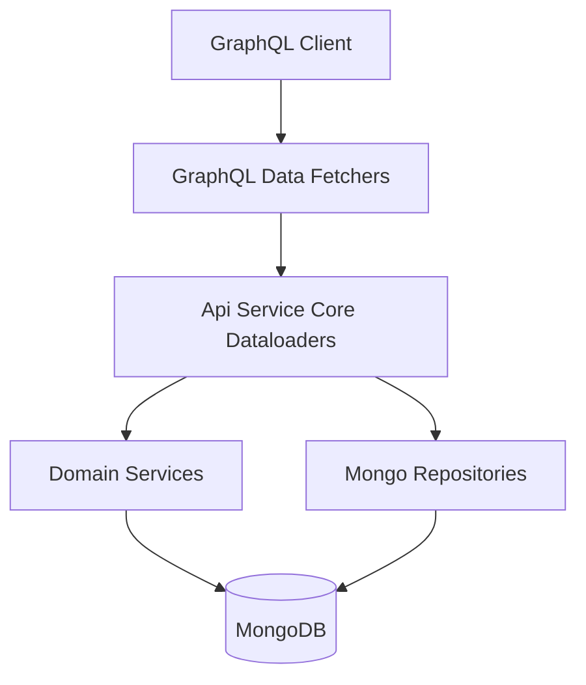
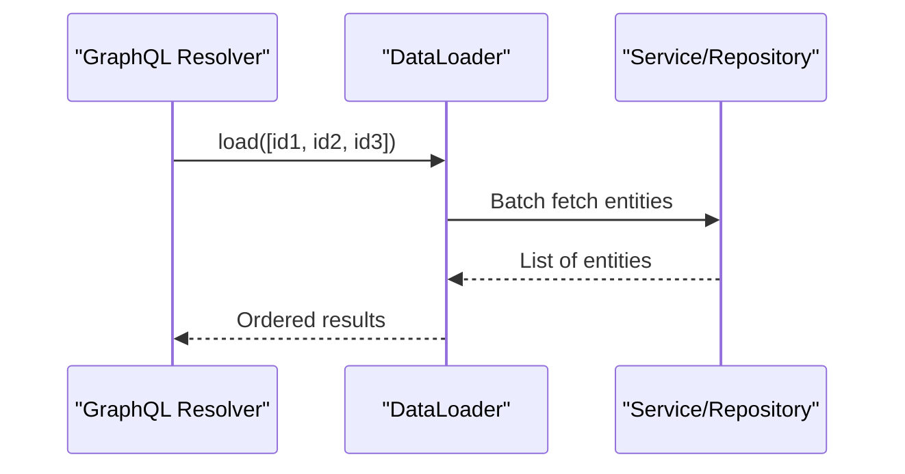
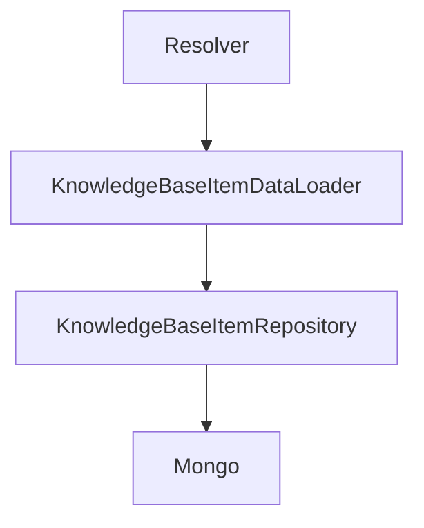
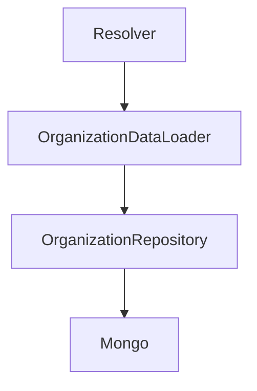
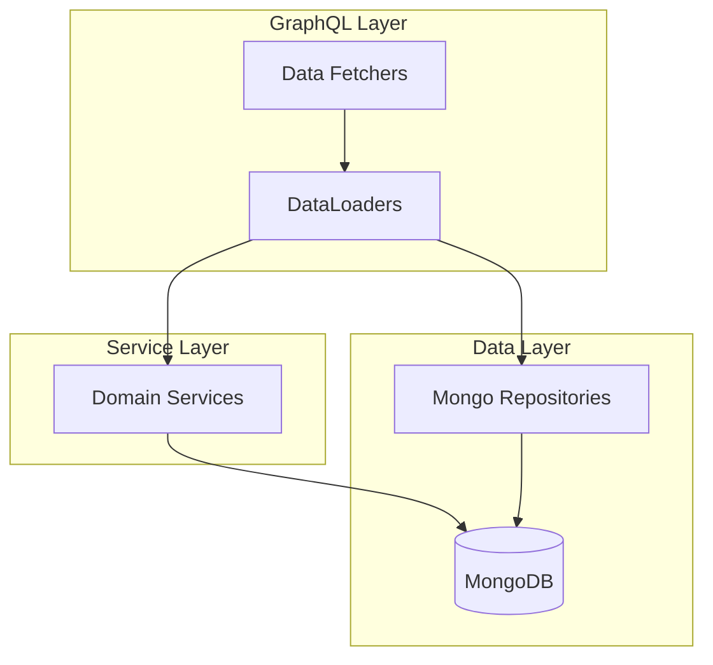

# Api Service Core Dataloaders

## Overview

The **Api Service Core Dataloaders** module provides batched, asynchronous data loading capabilities for the GraphQL layer of the OpenFrame API Service Core.

Built on top of **Netflix DGS** and the standard `org.dataloader` pattern, this module eliminates N+1 query problems by batching and caching entity lookups during a single GraphQL request lifecycle.

It acts as a bridge between:

- GraphQL Data Fetchers (resolvers)
- Domain Services
- Mongo repositories
- Underlying domain documents

This module is a critical performance layer in the API stack.

---

## Architectural Context

The Api Service Core Dataloaders module sits between the GraphQL Data Fetchers and the service/repository layer.



### Responsibilities

- Batch load related entities by IDs
- Preserve request ordering
- Avoid redundant queries within a request
- Delegate to appropriate service or repository
- Return results asynchronously via `CompletableFuture`

---

## Why DataLoaders Are Required

Without DataLoaders, a query such as:

```graphql
query {
  devices {
    id
    organization {
      name
    }
  }
}
```

would result in:

- 1 query to load devices
- N queries to load organizations

With DataLoaders:

- 1 query to load devices
- 1 batched query to load all required organizations

This dramatically improves performance and scalability.

---

## DataLoader Execution Model

All loaders implement:

```java
BatchLoader<K, V>
```

and are annotated with:

```java
@DgsDataLoader(name = "...")
```

Each loader:

1. Receives a list of keys
2. Removes nulls
3. Batch queries the database or service
4. Maps results by ID
5. Returns results in the same order as input
6. Executes asynchronously via `CompletableFuture.supplyAsync`



---

# Core DataLoaders

Below are the loaders provided by this module.

---

## InstalledAgentDataLoader

**Purpose:** Batch loads InstalledAgent objects grouped by machine ID.

**Delegates to:** `InstalledAgentService`


- Key: `machineId`
- Value: `List<InstalledAgent>`
- Use case: Resolving installed agents for multiple machines in one request

---

## KnowledgeBaseAttachmentDataLoader

**Purpose:** Batch loads attachments for knowledge base items.

**Delegates to:** `KnowledgeBaseAttachmentService`

- Key: `knowledgeBaseItemId`
- Value: `List<KnowledgeBaseItemAttachment>`
- Includes debug logging for batch size visibility

---

## KnowledgeBaseItemDataLoader

**Purpose:** Batch loads KnowledgeBaseItem by ID.

**Used for:** Polymorphic AssignableTarget resolution for KNOWLEDGE_ARTICLE target type.

**Delegates to:** `KnowledgeBaseItemRepository`

### Special Behavior

- Filters null IDs
- De-duplicates IDs
- Returns `null` for missing items
- Preserves request order



---

## KnowledgeBaseTagDataLoader

**Purpose:** Batch loads Tags associated with Knowledge Base items.

**Delegates to:** `KnowledgeBaseTagService`

- Key: `knowledgeBaseItemId`
- Value: `List<Tag>`

---

## MachineDataLoader

**Purpose:** Batch loads Machine entities by machine ID.

**Used for:** AssignableTarget resolution for DEVICE target type.

**Delegates to:** `MachineRepository`

### Behavior

- Filters null IDs
- Performs `findByMachineIdIn`
- Maps results by machineId
- Preserves input ordering

---

## OrganizationDataLoader

**Purpose:** Batch loads Organization entities by organization ID.

**Key Optimization:** Prevents N+1 queries when resolving organization for many machines.

**Delegates to:** `OrganizationRepository`

### Additional Logic

- Filters out soft-deleted organizations
- Only returns organizations with `ACTIVE` status



---

## TagDataLoader

**Purpose:** Batch loads Tags for machines.

**Delegates to:** `TagService`

- Key: `machineId`
- Value: `List<Tag>`

---

## TicketDataLoader

**Purpose:** Batch loads Ticket entities by ID.

**Used for:** AssignableTarget resolution for TICKET target type.

**Delegates to:** `TicketRepository`

### Behavior

- Filters null IDs
- Uses `findAllById`
- Preserves input order

---

## ToolConnectionDataLoader

**Purpose:** Batch loads ToolConnection entities for machines.

**Delegates to:** `ToolConnectionService`

- Key: `machineId`
- Value: `List<ToolConnection>`

---

## UserDataLoader

**Purpose:** Batch loads UserResponse DTOs by user ID.

**Delegates to:** `UserService`

### Important Detail

The loader goes through `UserService` rather than directly querying a repository. This ensures:

- Registered UserProcessor implementations enrich responses
- SaaS-specific user augmentation is applied
- Profile image and additional computed fields are included

**Used by:** KnowledgeBaseItem author resolver

---

# Cross-Module Relationships

The Api Service Core Dataloaders module works closely with:

- [Api Service Core GraphQL Datafetchers](../api-service-core-graphql-datafetchers/api-service-core-graphql-datafetchers.md)
- Domain services in the API layer
- Mongo repositories from the data layer



---

# Performance Characteristics

✅ Eliminates N+1 query issues  
✅ Reduces database round trips  
✅ Maintains deterministic ordering  
✅ Enables async non-blocking resolution  
✅ Scales efficiently with large GraphQL queries  

---

# Design Patterns Used

- **Batch Loading Pattern**
- **Repository Pattern**
- **Service Layer Abstraction**
- **Asynchronous Execution via CompletableFuture**
- **GraphQL DataLoader Pattern**

---

# Summary

The **Api Service Core Dataloaders** module is a performance-critical layer in the OpenFrame GraphQL architecture.

It ensures that complex nested queries:

- Execute efficiently
- Avoid excessive database calls
- Preserve domain encapsulation
- Maintain clean separation between GraphQL and persistence layers

Without this module, GraphQL queries across devices, organizations, tickets, knowledge base items, and users would not scale effectively.

This module enables high-performance, production-grade GraphQL execution within the Api Service Core.