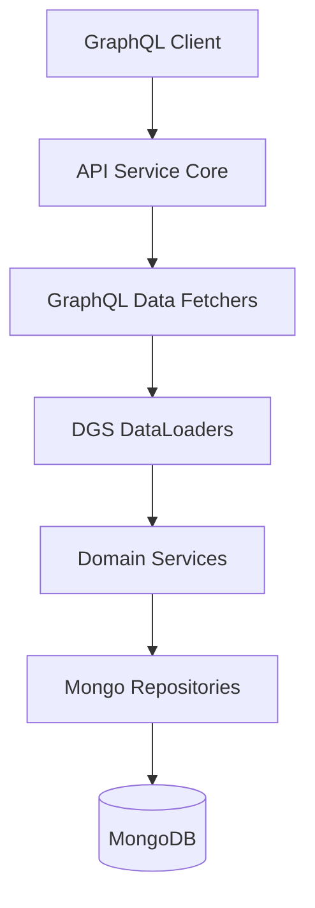
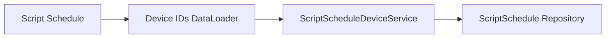
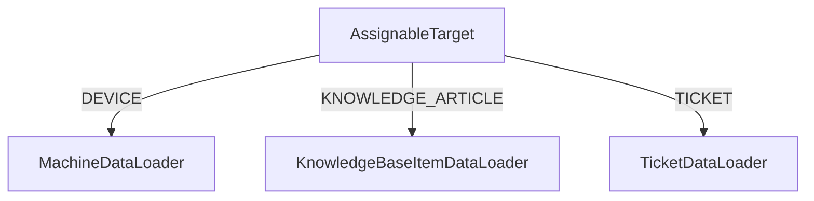

# Api Service Core Dataloaders

## Overview

The **Api Service Core Dataloaders** module provides batched, asynchronous data loading for the GraphQL layer of the OpenFrame platform. It is built on top of the Netflix DGS framework and the `org.dataloader` library to eliminate N+1 query problems and ensure efficient interaction with the MongoDB repositories and service layer.

This module acts as a performance and orchestration layer between:

- GraphQL Data Fetchers (Api Service Core GraphQL module)
- Domain Services (Api Service Core Services)
- MongoDB Repositories (Data Mongo Sync Repositories)
- Domain Documents (Data Mongo Domain Model)

It ensures that repeated field resolution across large GraphQL result sets is consolidated into optimized batch queries.

---

## Architectural Context

Within the overall OpenFrame architecture, DataLoaders sit inside the API service and are request-scoped by the DGS framework.


```mermaid
flowchart TD
    Client["GraphQL Client"] --> ApiService["API Service Core"]
    ApiService --> DataFetcher["GraphQL Data Fetchers"]
    DataFetcher --> DataLoader["DGS DataLoaders"]
    DataLoader --> ServiceLayer["Domain Services"]
    ServiceLayer --> RepositoryLayer["Mongo Repositories"]
    RepositoryLayer --> MongoDB[("MongoDB")]
```

### Execution Model

1. A GraphQL query requests nested fields (e.g., devices → organization → tags).
2. Data Fetchers delegate field resolution to a DataLoader.
3. The DataLoader batches all keys requested during the query execution tick.
4. A single service or repository call retrieves all required entities.
5. Results are mapped back in positional order.

This batching strategy prevents one query per row and drastically reduces database round-trips.

---

## Design Principles

All DataLoaders in this module follow consistent design rules:

- Annotated with `@DgsDataLoader`
- Implement `BatchLoader<K, V>`
- Preserve key order in returned results
- Filter null keys safely
- Delegate business logic to services (never embed business logic)
- Return `CompletableFuture` or `CompletionStage`

Two primary batching patterns are used:

### 1. One-to-One Mapping

Used when a single key resolves to a single object.

Examples:
- Organization by organizationId
- Machine by machineId
- Ticket by ticketId
- User by userId

These loaders:
- Collect unique non-null IDs
- Query repository/service with `findBy...In`
- Map results to a lookup map
- Reconstruct ordered output aligned to input keys

### 2. One-to-Many Mapping

Used when a single key resolves to a list.

Examples:
- Tags for machines
- Installed agents for machines
- Attachments for knowledge base items
- Tool connections for machines

These loaders:
- Accept a list of keys
- Delegate to a service returning `Map<Key, List<Value>>` or ordered lists
- Return results aligned with request order

---

## DataLoader Catalog

Below is a structured overview of all DataLoaders in this module.

### Device & Machine Related

#### MachineDataLoader
- Key: `machineId`
- Value: `Machine`
- Repository: `MachineRepository`
- Purpose: Batch resolves device targets for GraphQL polymorphic resolution.

#### InstalledAgentDataLoader
- Key: `machineId`
- Value: `List<InstalledAgent>`
- Service: `InstalledAgentService`
- Purpose: Loads installed agents for multiple machines in a single call.

#### TagDataLoader
- Key: `machineId`
- Value: `List<Tag>`
- Service: `TagService`
- Purpose: Resolves machine tags without N+1 queries.

#### ToolConnectionDataLoader
- Key: `machineId`
- Value: `List<ToolConnection>`
- Service: `ToolConnectionService`
- Purpose: Resolves integrated tool connections per machine.

---

### Organization & User

#### OrganizationDataLoader
- Key: `organizationId`
- Value: `Organization`
- Repository: `OrganizationRepository`
- Prevents N+1 queries when resolving organizations across many devices.

#### UserDataLoader
- Key: `userId`
- Value: `UserResponse`
- Service: `UserService`
- Used by Knowledge Base author resolution.
- Goes through service layer to ensure SaaS enrichment logic is applied.

---

### Knowledge Base

#### KnowledgeBaseItemDataLoader
- Key: `itemId`
- Value: `KnowledgeBaseItem`
- Repository: `KnowledgeBaseItemRepository`
- Used in polymorphic AssignableTarget resolution.

#### KnowledgeBaseAttachmentDataLoader
- Key: `itemId`
- Value: `List<KnowledgeBaseItemAttachment>`
- Service: `KnowledgeBaseAttachmentService`

#### KnowledgeBaseTagDataLoader
- Key: `itemId`
- Value: `List<Tag>`
- Service: `KnowledgeBaseTagService`

---

### RMM & Script Execution

#### ScriptDataLoader
- Key: `scriptId`
- Value: `ScriptResponse`
- Service: `ScriptService`
- Tenant-scoped lookup
- Includes soft-deleted scripts to preserve historical execution name resolution.

#### ScriptTagDataLoader
- Key: `scriptId`
- Value: `List<Tag>`
- Service: `ScriptTagService`

#### ScriptScheduleDeviceIdsDataLoader
- Key: `scheduleId`
- Value: `List<String>` (machineIds)
- Service: `ScriptScheduleDeviceService`
- Resolves synchronously to preserve tenant context on request thread.


```mermaid
flowchart LR
    Schedule["Script Schedule"] --> DeviceIds["Device IDs DataLoader"]
    DeviceIds --> DeviceService["ScriptScheduleDeviceService"]
    DeviceService --> Repository["ScriptSchedule Repository"]
```

---

### Ticketing

#### TicketDataLoader
- Key: `ticketId`
- Value: `Ticket`
- Repository: `TicketRepository`
- Used by AssignableTarget resolution for ticket references.

---

## Polymorphic Resolution Support

Several DataLoaders support polymorphic GraphQL node resolution patterns:

- MachineDataLoader → DEVICE target
- KnowledgeBaseItemDataLoader → KNOWLEDGE_ARTICLE target
- TicketDataLoader → TICKET target


```mermaid
flowchart TD
    AssignableTarget["AssignableTarget"] -->|"DEVICE"| MachineLoader["MachineDataLoader"]
    AssignableTarget -->|"KNOWLEDGE_ARTICLE"| KBLoader["KnowledgeBaseItemDataLoader"]
    AssignableTarget -->|"TICKET"| TicketLoader["TicketDataLoader"]
```

This ensures that heterogeneous node types can be resolved efficiently in a single GraphQL query.

---

## Threading and Tenant Context

Most DataLoaders use:

```java
CompletableFuture.supplyAsync(() -> serviceCall())
```

This offloads work to a thread pool for non-blocking execution.

However, `ScriptScheduleDeviceIdsDataLoader` executes synchronously using:

```java
CompletableFuture.completedFuture(result)
```

This preserves tenant context bound to the request thread.

This distinction is important in multi-tenant deployments where tenant resolution may rely on thread-local storage.

---

## Interaction with Other Modules

The Api Service Core Dataloaders module collaborates closely with:

- Api Service Core GraphQL (DataFetchers trigger loaders)
- Api Service Core Config and Security (tenant & auth context)
- Data Mongo Sync Repositories (batch queries)
- Data Mongo Domain Model (document representations)
- Authorization Service Core (security context for authenticated requests)

The module contains no business rules and no persistence logic. It is strictly a batching and orchestration layer.

---

## Performance Characteristics

### Without DataLoader
- 100 devices → 100 organization queries
- 100 devices → 100 tag queries
- 100 schedules → 100 assignment queries

### With DataLoader
- 100 devices → 1 organization query
- 100 devices → 1 tag query
- 100 schedules → 1 assignment query

This results in:
- Reduced database load
- Lower latency
- Improved horizontal scalability
- Cleaner separation of concerns

---

## Summary

The **Api Service Core Dataloaders** module is a critical performance optimization layer in the OpenFrame GraphQL stack. By batching and caching entity resolution per request, it:

- Eliminates N+1 query patterns
- Preserves tenant isolation
- Maintains strict separation between GraphQL, service, and repository layers
- Supports polymorphic node resolution
- Enables scalable GraphQL query execution

It is intentionally lightweight but architecturally essential for production-grade GraphQL performance in a multi-tenant SaaS environment.
