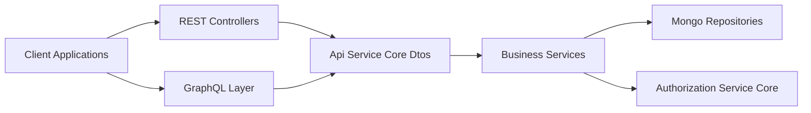
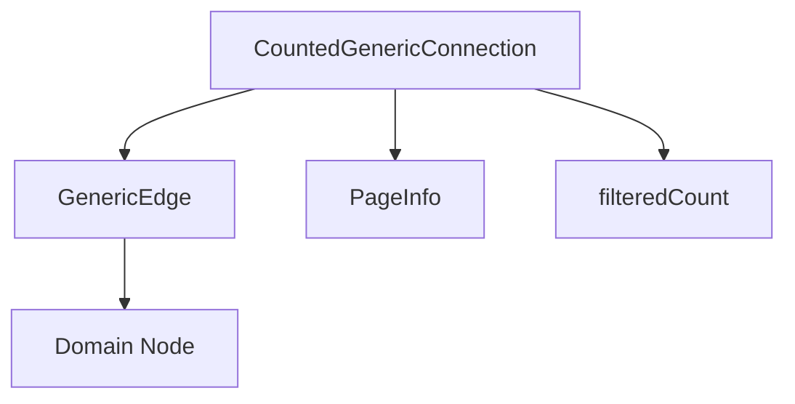
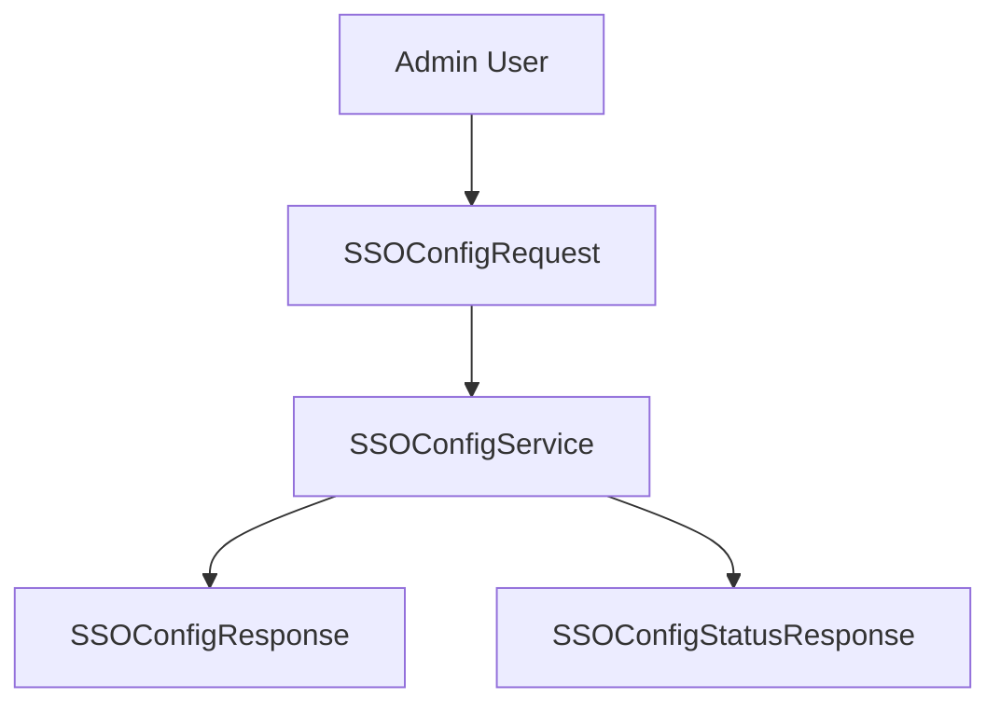
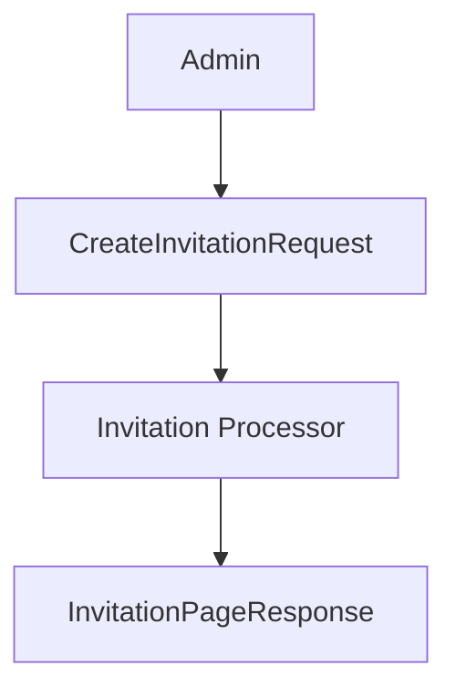
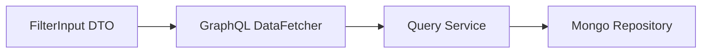
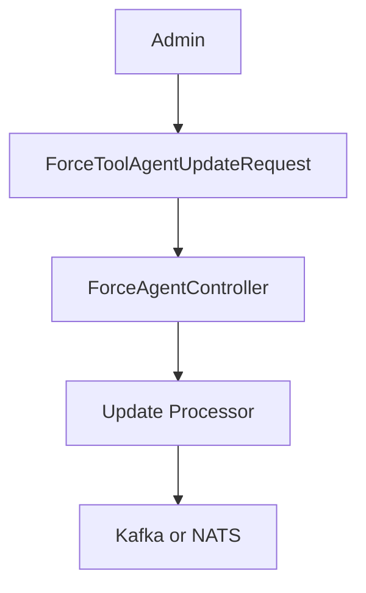
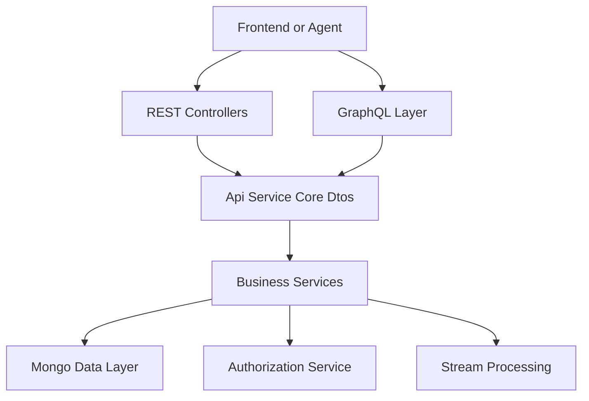

# Api Service Core Dtos

## Overview

The **Api Service Core Dtos** module defines the primary Data Transfer Objects (DTOs) used by the Api Service Core layer. These DTOs represent:

- REST request and response payloads
- GraphQL input and output types
- Pagination and Relay-style connection models
- OAuth, OIDC, and SSO interaction models
- Force update and remote action commands
- Knowledge base, invitation, notification, and user management payloads

This module acts as the **API contract layer** between:

- [Api Service Core Rest Controllers](../api-service-core-rest-controllers/api-service-core-rest-controllers.md)
- [Api Service Core GraphQL Layer](../api-service-core-graphql-layer/api-service-core-graphql-layer.md)
- [Api Service Core Business Services](../api-service-core-business-services/api-service-core-business-services.md)
- Data model and repository modules
- External authentication and authorization services

It ensures a strict separation between internal domain models (Mongo documents, services, stream models) and externally exposed API contracts.

---

## Architectural Role

The Api Service Core Dtos module sits at the boundary of the API layer.

### Responsibilities

1. Define stable API-facing models
2. Encapsulate validation constraints (Jakarta Validation)
3. Support GraphQL Relay pagination patterns
4. Decouple REST/GraphQL from persistence documents
5. Model OAuth, OIDC, and SSO communication payloads

---

## DTO Categories

The module can be logically grouped into the following domains.

---

## 1. Core API and Pagination Models

### GenericEdge

`GenericEdge<T>` models a Relay-style edge containing:

- `node` – the actual data object
- `cursor` – opaque pagination cursor

### CountedGenericConnection

Extends a generic connection model and adds:

- `filteredCount` – total count after filters are applied

This supports GraphQL cursor-based pagination.

These types are heavily used in the GraphQL data fetchers.

---

## 2. Authentication, OAuth, and SSO DTOs

This group models interactions with OAuth providers, OpenID Connect, and SSO configuration.

### SSO Configuration

- `SSOConfigRequest`
- `SSOConfigResponse`
- `SSOConfigStatusResponse`
- `SSOProviderInfo`

These DTOs support tenant-level SSO configuration and provider discovery.

### OAuth Flow DTOs

- `AuthorizationResponse`
- `GoogleTokenRequest`
- `SocialAuthRequest`
- `TokenResponse`

These model the authorization code and token exchange steps.

### OIDC Discovery and UserInfo

- `OpenIDConfiguration`
- `UserInfo`
- `UserInfoRequest`

They represent:

- OIDC discovery metadata
- Claims returned by identity providers
- Internal user mapping requests

This layer integrates with the Authorization Service Core module.

---

## 3. User and Invitation DTOs

### User Management

- `UserResponse`
- `UpdateUserRequest`

`UserResponse` encapsulates:

- Identity attributes
- Roles
- Status
- Profile image
- Audit timestamps

### Invitation Management

- `CreateInvitationRequest`
- `InvitationPageResponse`
- `UpdateInvitationStatusRequest`

These support user onboarding flows integrated with the authorization system.

---

## 4. Agent Registration and API Keys

### AgentRegistrationSecretResponse

Represents a registration secret for client agents:

- `id`
- `key`
- `createdAt`
- `active`

Used during agent onboarding and validated by client ingress services.

### ApiKeyResponse

Exposes metadata about API keys without revealing the secret:

- Request counters
- Usage statistics
- Expiration metadata

This ensures secure observability without secret leakage.

---

## 5. Device, Event, Log, and Tool Filters

GraphQL-specific input types designed for flexible querying.

### DeviceFilterInput
- Statuses
- Device types
- Organization filters
- Tag-based filtering

### EventFilterInput
- User-based filtering
- Date range filtering
- Event type filtering

### LogFilterInput
- Date ranges
- Tool types
- Severity filters
- Organization scope

### ToolFilterInput
- Enabled flag
- Type and category

These inputs map to repository-level query filters while keeping API concerns separate from Mongo query objects.

---

## 6. Knowledge Base DTOs

Supports article creation, updates, folder management, and attachment workflows.

### Article Management

- `CreateArticleInput`
- `UpdateArticleInput`
- `DeleteFolderInput`
- `KnowledgeBaseFilterInput`

### Attachment Flow

- `CreateKnowledgeBaseAttachmentInput`
- `CreateKnowledgeBaseTempAttachmentInput`
- `LinkKnowledgeBaseTempAttachmentsInput`

These DTOs enable multi-step upload flows:

1. Temporary upload
2. Linking to article
3. Final persistence

---

## 7. Notifications and Assignments

### NotificationFilterInput

Used to filter notifications by read/unread state.

### AssignedItemCount

Encapsulates assignment summary data:

- `targetType`
- `count`

Supports dashboards and aggregation endpoints.

---

## 8. Force Update and Remote Action DTOs

These DTOs trigger remote operations on agents or tool integrations.

### Client Update

- `ForceClientUpdateRequest` (force namespace)
- `ForceClientUpdateRequest` (update namespace)

### Tool Operations

- `ForceToolInstallationAllRequest`
- `ForceToolReinstallationRequest`
- `ForceToolUpdateRequest`
- `ForceToolAgentUpdateRequest`
- `ForceToolAgentUpdateAllRequest`
- `ForceToolAgentUpdateResponse`

These DTOs are typically translated into messages published to eventing systems.

---

## 9. Client Configuration DTO

### ClientConfigurationResponse

Exposes minimal configuration metadata such as client version.

This DTO is typically consumed by:

- Desktop agents
- Web UI clients

---

## Validation Strategy

Many DTOs use Jakarta Validation annotations such as:

- `@NotBlank`
- `@NotNull`
- `@Size`

This ensures:

- Early request validation at controller or GraphQL boundary
- Clear error reporting
- Reduced service-layer defensive logic

---

## Design Principles

### 1. Strict API Contract Isolation

DTOs do not expose:

- Mongo document internals
- Repository-specific fields
- Security-sensitive data

### 2. GraphQL and REST Parity

The module supports both paradigms:

- REST-specific responses (e.g., ApiKeyResponse)
- GraphQL-specific inputs (e.g., DeviceFilterInput)
- Relay-compatible pagination models

### 3. Multi-Tenant and Security Awareness

DTOs related to:

- SSO configuration
- OAuth token exchange
- Agent registration secrets

are designed to align with tenant-aware security policies.

---

## How This Module Fits in the System

The **Api Service Core Dtos** module forms the contract backbone of the API layer. It ensures:

- Stability of external interfaces
- Clean separation of concerns
- Reusable pagination and filtering patterns
- Secure handling of authentication-related data

It is intentionally lightweight, declarative, and validation-focused, allowing controllers and services to evolve independently while preserving API compatibility.
