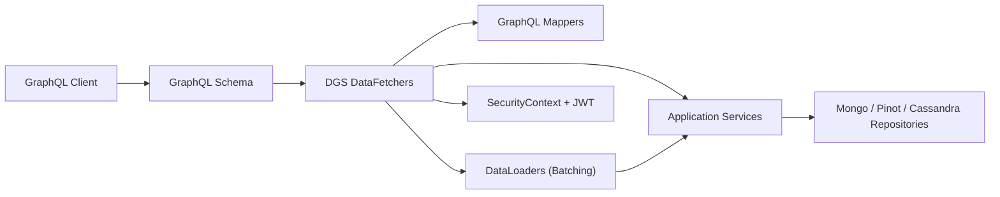
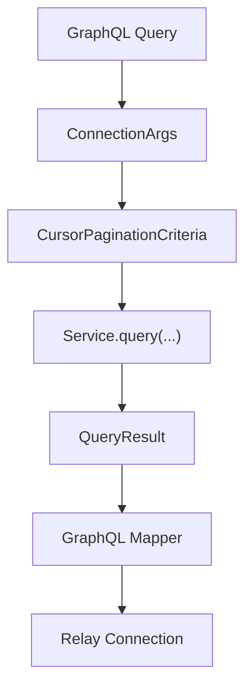
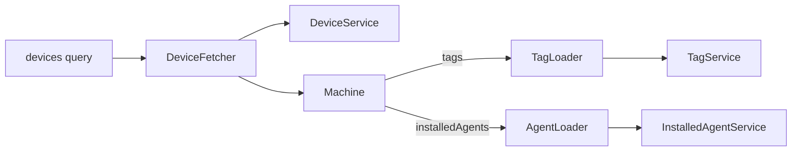
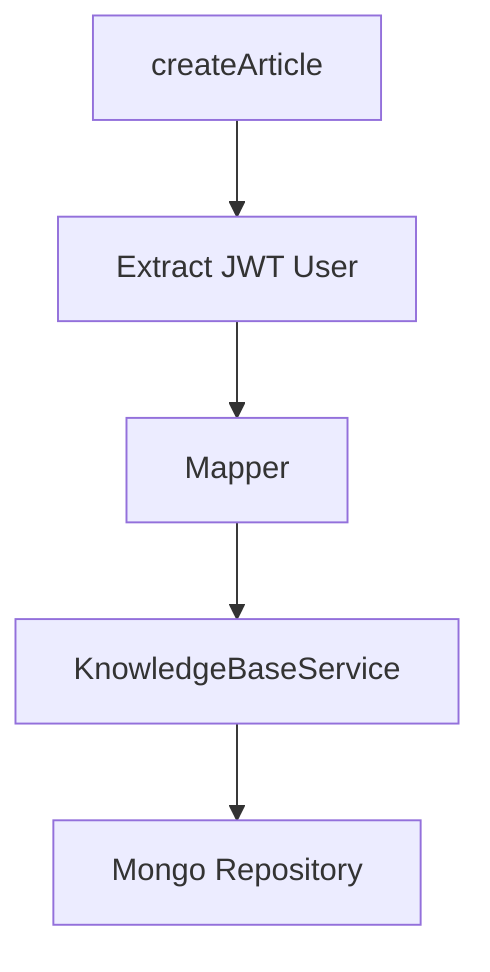
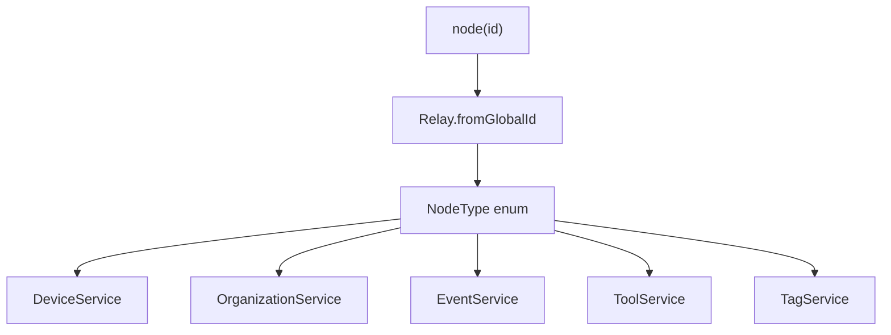
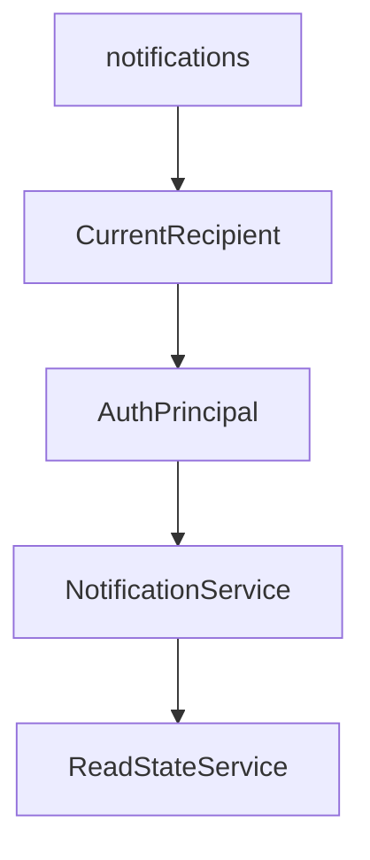
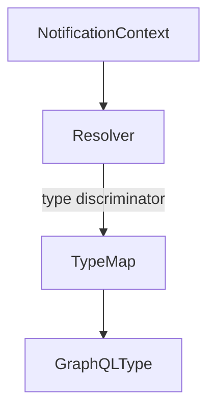
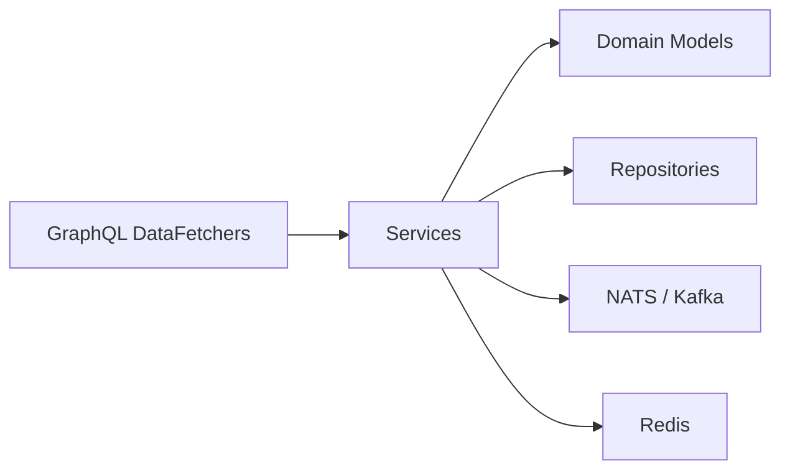

# Api Service Core Graphql Datafetchers

## Overview

The **Api Service Core Graphql Datafetchers** module is the GraphQL execution layer of the OpenFrame API Service Core. It exposes domain capabilities (devices, events, organizations, knowledge base, notifications, assignments, tools, logs, and tags) through Netflix DGS-based GraphQL data fetchers.

This module acts as the orchestration layer between:

- GraphQL schema and Relay node model
- Application services (DeviceService, EventService, KnowledgeBaseService, etc.)
- DataLoaders for batching and N+1 mitigation
- Security context (JWT-based principals)
- Cursor-based pagination and filter criteria

It does **not** implement business logic directly. Instead, it:

- Decodes Relay global IDs
- Maps GraphQL inputs into domain filter criteria
- Delegates to services
- Wraps results into Relay-compatible connection types
- Resolves nested fields using DataLoaders

---

## High-Level Architecture



### Responsibilities of This Module

- Implements `@DgsQuery`, `@DgsMutation`, and `@DgsData`
- Converts GraphQL inputs into service-layer DTOs
- Encodes and decodes Relay global IDs
- Builds cursor-based pagination criteria
- Returns Relay-compatible `Connection` and `Edge` types
- Resolves polymorphic types (NotificationContext, Node interface)

---

## Core Design Patterns

### 1. Relay Global ID Pattern

All node-based entities use Relay global IDs.

```text
Global ID = Base64(TypeName:RawId)
Example: "Machine:abc123" -> encoded
```

Pattern used everywhere:

- Decode input ID using `Relay.fromGlobalId()`
- Fetch entity using raw ID
- Encode output ID using `Relay.toGlobalId()`

This enables:

- Uniform `node(id: ID!)` resolution
- Type-safe global references
- Cross-entity linking

---

### 2. Cursor-Based Pagination

Pagination is built using:

- `ConnectionArgs`
- `CursorPaginationCriteria`
- `CountedGenericQueryResult` or `GenericQueryResult`
- `GenericEdge<T>`
- `CountedGenericConnection<T>` or `GenericConnection<T>`



This ensures consistent pagination behavior across:

- Devices
- Events
- Organizations
- Logs
- Knowledge base
- Assignments
- Notifications

---

### 3. DataLoader-Based N+1 Prevention

Nested fields are resolved asynchronously using DGS DataLoaders.

Example relationships:

- Machine → Tags
- Machine → InstalledAgents
- Machine → ToolConnections
- Machine → Organization
- KnowledgeBaseItem → Tags
- KnowledgeBaseItem → Attachments
- KnowledgeBaseItem → Author
- Assignment → Target entity



All DataLoader calls return `CompletableFuture<T>` to ensure batched execution.

---

## Data Fetcher Components

### AssignmentDataFetcher

Handles:

- Assignment queries
- Assign/unassign mutations
- Assignment counts by target type
- Target resolution using DataLoaders

Key patterns:

- Uses `AssignmentService`
- Maps results via `GraphQLAssignmentMapper`
- Resolves polymorphic assignment targets (Organization, Machine, Ticket, KnowledgeBaseItem)

---

### DeviceDataFetcher

Responsible for:

- Device listing with filtering and pagination
- Device filters
- Device lookup by ID
- Resolving nested relations (tags, agents, organization)

Key dependencies:

- `DeviceService`
- `DeviceFilterService`
- `TagService`
- `GraphQLDeviceMapper`

Implements full Relay connection pattern.

---

### EventDataFetcher

Provides:

- Event listing
- Event lookup
- Event creation and update
- Event filter retrieval

Features:

- Converts `EventFilterInput` into `EventFilterCriteria`
- Uses `GraphQLEventMapper`
- Returns `GenericConnection`

---

### KnowledgeBaseDataFetcher

One of the most feature-rich fetchers.

Supports:

- Folder and article queries
- Publishing/unpublishing
- Archiving/unarchiving
- Folder tree retrieval
- Tag management
- Attachment uploads (temp + permanent)
- Attachment linking

Security-aware behavior:

- Extracts user ID from JWT
- Uses `AuthPrincipal`
- Applies mutation wrapper pattern for success/error payloads



Also resolves nested fields:

- Tags
- Attachments
- Author
- Parent ID

---

### LogDataFetcher

Conditionally enabled via:

```text
spring.data.cassandra.enabled=true
```

Responsibilities:

- Log listing
- Log filters
- Log detail retrieval

Uses:

- `LogService`
- `GraphQLLogMapper`

Provides cursor-based pagination for log events.

---

### NodeDataFetcher

Implements Relay `node(id: ID!)` and `nodes(ids: [ID!])`.



Supports types such as:

- Machine
- Organization
- Event
- IntegratedTool
- Tag
- ToolConnection
- InstalledAgent
- Tenant

This enables universal entity lookup via a single GraphQL entry point.

---

### NotificationDataFetcher

Handles authenticated notification access.

Security rules:

- Requires `ADMIN` or `AGENT` authority
- Determines recipient type (USER or MACHINE)
- Extracts identity from JWT

Operations:

- List notifications
- Mark as read
- Mark all as read
- Delete
- Delete all read
- Unread counts by category



Also includes strict ID decoding validation for notification IDs.

---

### OrganizationDataFetcher

Provides:

- Organization listing (paginated)
- Organization lookup
- Filter options

Uses:

- `OrganizationService`
- `OrganizationQueryService`
- `GraphQLOrganizationMapper`

---

### TagDataFetcher

Supports:

- Tag listing
- Key/value suggestions
- Tag creation
- Tag updates
- Tag deletion

Converts Relay ID for mutation operations.

---

### ToolsDataFetcher

Provides:

- Integrated tool listing
- Tool filters

Uses:

- `ToolService`
- `GraphQLToolMapper`

---

### NotificationContextGraphQlTypeResolver

Resolves polymorphic GraphQL types for `NotificationContext`.



- Maps discriminator string → GraphQL type name
- Falls back to `GenericContext` if not found
- Enables GraphQL union/interface resolution

---

## Security Integration

The module integrates tightly with JWT-based security.

Key aspects:

- Uses `SecurityContextHolder`
- Extracts `AuthPrincipal` from JWT
- Determines `ActorType` (USER or AGENT)
- Applies `@PreAuthorize` annotations

Security is enforced at:

- Query level (Notification access)
- Mutation level
- User-aware operations (Knowledge base, notifications)

---

## Interaction with Other Layers



The Api Service Core Graphql Datafetchers module:

- Does not access repositories directly
- Does not contain domain logic
- Acts as translation + orchestration layer

---

## Key Architectural Benefits

1. Clear separation between API and business logic
2. Uniform Relay support across all entities
3. Consistent pagination model
4. Batch loading via DataLoaders
5. Centralized Node resolution
6. Strong JWT-based identity handling
7. Polymorphic type resolution for flexible schemas

---

## Summary

The **Api Service Core Graphql Datafetchers** module is the central GraphQL execution layer of the OpenFrame platform.

It:

- Bridges GraphQL schema to service layer
- Implements Relay global ID and connection patterns
- Uses DataLoaders to prevent N+1 issues
- Enforces JWT-based security
- Provides consistent pagination and filtering

By keeping business logic in services and focusing purely on API orchestration, this module ensures a clean, scalable, and maintainable GraphQL architecture for the OpenFrame ecosystem.
