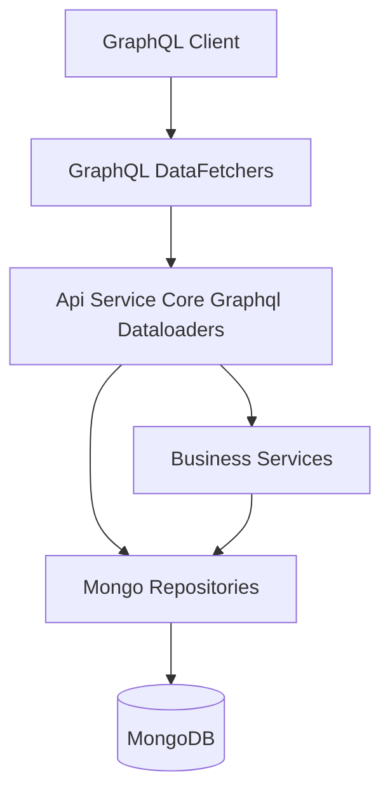
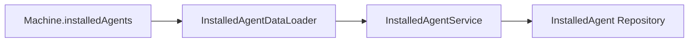
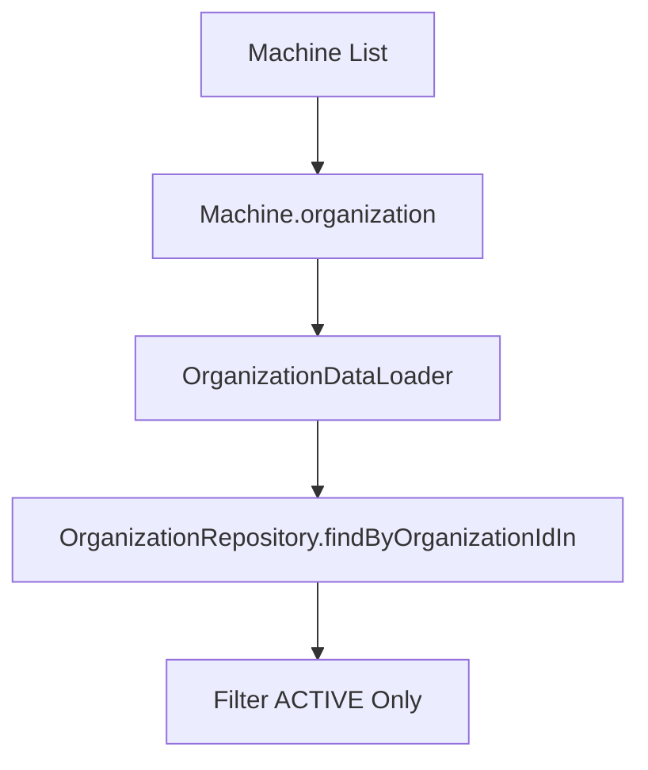
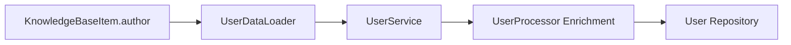
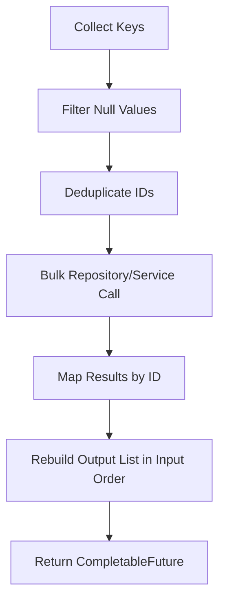

# Api Service Core Graphql Dataloaders

## Overview

The **Api Service Core Graphql Dataloaders** module provides batched and cached data access for the GraphQL layer using the Netflix DGS `@DgsDataLoader` abstraction and the `org.dataloader.BatchLoader` contract.

Its primary responsibility is to eliminate the **N+1 query problem** in GraphQL field resolution by:

- Batching multiple entity lookups into a single repository or service call
- Preserving request-level ordering
- Returning results aligned with input keys
- Delegating domain logic to services and repositories

This module acts as a performance optimization layer between:

- The **GraphQL DataFetchers** (api-service-core-graphql-layer)
- The **Business Services & Repositories** (api-service-core-business-services, data-access-mongo-sync)

It does not contain business logic. Instead, it orchestrates efficient bulk loading.

---

## Architectural Context

Within the overall OpenFrame backend architecture, the Api Service Core Graphql Dataloaders module sits between GraphQL field resolvers and domain/data layers.



### Key Characteristics

- **Request-scoped batching** via DGS DataLoader registry
- **Asynchronous resolution** using `CompletableFuture`
- **Order preservation** to match GraphQL execution semantics
- **Soft-delete awareness** (e.g., Organization status filtering)
- **Multi-entity polymorphic support** (used by AssignableTarget resolution)

---

## The N+1 Problem in GraphQL

Without DataLoaders:

```text
Query 100 machines
 └─ For each machine → load organization
      └─ 100 additional database queries
```

With DataLoaders:

```text
Query 100 machines
 └─ Collect 100 organizationIds
      └─ Single batched query: findByOrganizationIdIn(...)
```

This dramatically reduces database load and improves latency.

---

## Core DataLoaders

Each DataLoader implements:

- `BatchLoader<K, V>`
- `CompletionStage<List<V>>` or `CompletionStage<List<List<V>>>`
- Asynchronous batching via `CompletableFuture.supplyAsync`

Below is a breakdown of each loader and its responsibility.

---

### InstalledAgentDataLoader

**Purpose:** Batch loads installed agents for multiple machines.

- Key: `machineId`
- Value: `List<InstalledAgent>`
- Delegates to: `InstalledAgentService`



---

### KnowledgeBaseItemDataLoader

**Purpose:** Batch loads KnowledgeBaseItem by ID.

- Key: `itemId`
- Value: `KnowledgeBaseItem`
- Delegates to: `KnowledgeBaseItemRepository`
- Used by: AssignableTarget resolution (KNOWLEDGE_ARTICLE)

**Important Behavior:**

- Filters null IDs
- De-duplicates IDs
- Preserves input order
- Returns null for missing entries

---

### KnowledgeBaseAttachmentDataLoader

**Purpose:** Batch loads attachments for Knowledge Base articles.

- Key: `itemId`
- Value: `List<KnowledgeBaseItemAttachment>`
- Delegates to: `KnowledgeBaseAttachmentService`

Includes debug logging for batch size observability.

---

### KnowledgeBaseTagDataLoader

**Purpose:** Batch loads tags for Knowledge Base items.

- Key: `itemId`
- Value: `List<Tag>`
- Delegates to: `KnowledgeBaseTagService`

---

### MachineDataLoader

**Purpose:** Batch loads Machine entities by machineId.

- Key: `machineId`
- Value: `Machine`
- Delegates to: `MachineRepository`
- Used by: AssignableTarget resolution (DEVICE)

Implements:

- Null filtering
- ID de-duplication
- Map-based reordering

---

### OrganizationDataLoader

**Purpose:** Batch loads organizations while excluding soft-deleted entries.

- Key: `organizationId`
- Value: `Organization`
- Delegates to: `OrganizationRepository`

**Additional Logic:**

- Filters organizations where `OrganizationStatus != ACTIVE`
- Prevents N+1 lookups when resolving machines → organizations



---

### TagDataLoader

**Purpose:** Batch loads tags assigned to machines.

- Key: `machineId`
- Value: `List<Tag>`
- Delegates to: `TagService`

---

### TicketDataLoader

**Purpose:** Batch loads Ticket entities by ID.

- Key: `ticketId`
- Value: `Ticket`
- Delegates to: `TicketRepository`
- Used by: AssignableTarget resolution (TICKET)

Follows standard:

- Null filtering
- De-duplication
- Order preservation

---

### ToolConnectionDataLoader

**Purpose:** Batch loads tool connections for machines.

- Key: `machineId`
- Value: `List<ToolConnection>`
- Delegates to: `ToolConnectionService`

Used for resolving machine → tool integration relationships.

---

### UserDataLoader

**Purpose:** Batch loads enriched user responses by ID.

- Key: `userId`
- Value: `UserResponse`
- Delegates to: `UserService`

**Notable Behavior:**

- Uses `UserService` instead of direct repository access
- Ensures `UserProcessor` logic runs (e.g., SaaS image enrichment)
- Used by `KnowledgeBaseItem.author` resolver



---

## Batch Loading Pattern

All loaders follow a consistent pattern:



### Why Order Preservation Matters

GraphQL requires that results align with input keys. Therefore:

- Input list index `i` must match output index `i`
- Missing entities must return `null` at the correct index

Failure to preserve order leads to incorrect field resolution.

---

## Async Execution Model

Each DataLoader uses:

```java
CompletableFuture.supplyAsync(() -> serviceCall())
```

This ensures:

- Non-blocking GraphQL execution
- Parallel resolution of independent fields
- Efficient thread utilization

The DGS framework handles:

- Per-request DataLoader registry
- Caching within a request
- Dispatch timing during execution

---

## Polymorphic Resolution Support

Several DataLoaders are used by the AssignableTarget polymorphic resolver in the GraphQL layer:

| Target Type | DataLoader |
|-------------|------------|
| DEVICE | MachineDataLoader |
| TICKET | TicketDataLoader |
| KNOWLEDGE_ARTICLE | KnowledgeBaseItemDataLoader |

This enables dynamic type resolution without triggering N+1 repository calls.

---

## Performance Considerations

### Benefits

- Reduced database round trips
- Improved GraphQL response time
- Request-scoped caching
- Better throughput under load

### Potential Risks

- Large batch sizes may increase memory pressure
- Async thread pool saturation if misconfigured
- Over-fetching if DataLoader usage is not scoped properly

---

## Design Principles

The Api Service Core Graphql Dataloaders module follows these principles:

1. **No Business Logic** – Delegates to services/repositories
2. **Batch First** – Always prefer `findByIdIn` style queries
3. **Null Safe** – Defensive handling of null IDs
4. **Order Deterministic** – Output aligns with input
5. **Service-Aware** – Use service layer when enrichment is required

---

## Summary

The **Api Service Core Graphql Dataloaders** module is a critical performance optimization layer for the GraphQL API.

It ensures that:

- Complex nested GraphQL queries remain efficient
- Database access is minimized
- Polymorphic type resolution scales
- Business logic remains centralized in services

Without this module, the GraphQL layer would suffer from severe N+1 query amplification under realistic workloads.

It is a foundational component enabling scalable GraphQL operations in the OpenFrame backend ecosystem.