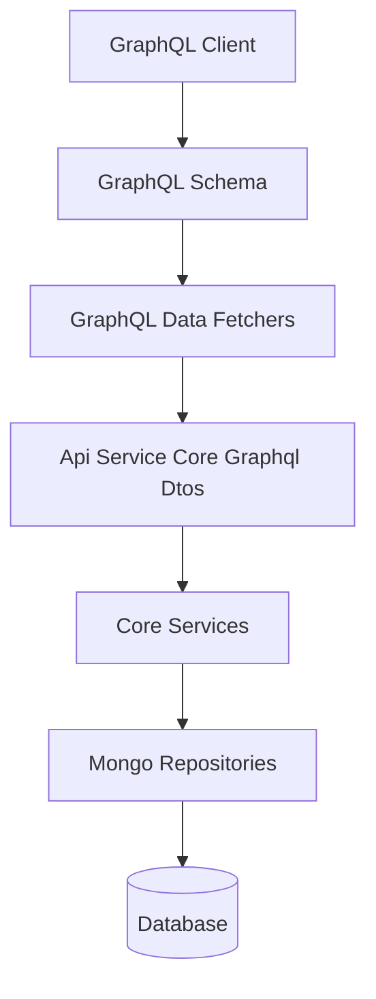
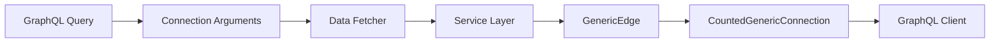
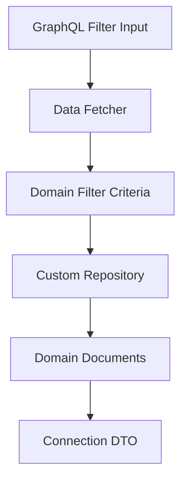
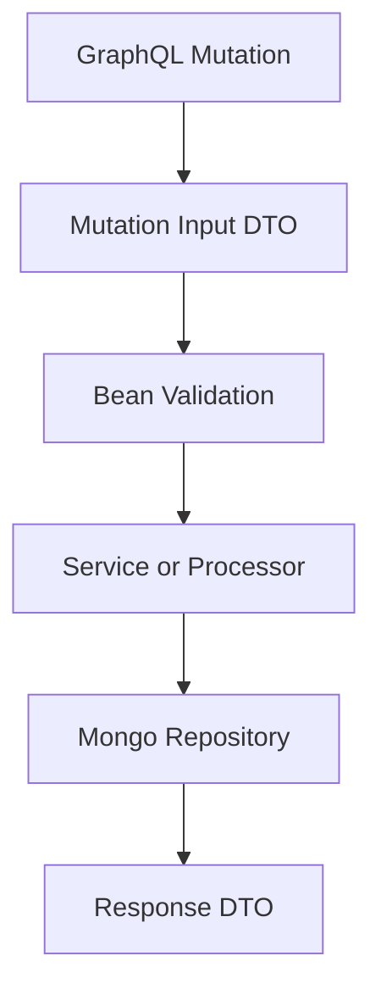
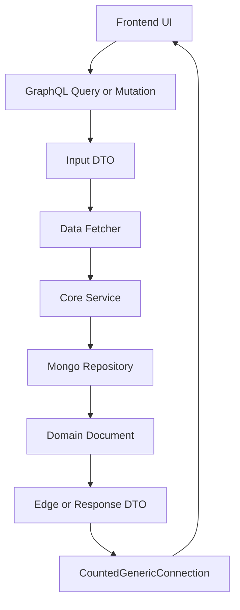

# Api Service Core Graphql Dtos

The **Api Service Core Graphql Dtos** module defines the GraphQL-facing Data Transfer Objects (DTOs) used by the Api Service Core. These DTOs represent:

- GraphQL connection and edge wrappers
- Query filter input types
- Mutation input types
- Structured response models
- Lightweight aggregation models

This module acts as the **schema contract layer** between GraphQL data fetchers and the underlying domain, service, and persistence layers.

It does not contain business logic. Instead, it formalizes how data flows into and out of the GraphQL API.

---

## Architectural Role

Within the overall Api Service Core architecture, this module sits between:

- GraphQL Data Fetchers (execution layer)
- Domain DTOs and persistence documents (data layer)
- Services and processors (business layer)

### High-Level Placement



The **Api Service Core Graphql Dtos** module defines the types used in:

- Query arguments
- Mutation inputs
- Relay-style connections
- Filter inputs
- Structured API responses

---

# Module Structure

The module can be logically grouped into the following categories:

1. Relay Connection Models
2. Filter Input DTOs
3. Mutation Input DTOs
4. Domain Response DTOs
5. Aggregation and Assignment DTOs

---

# 1. Relay Connection Models

GraphQL in Api Service Core follows the Relay-style pagination model. This module provides reusable generic wrappers.

## GenericEdge

```java
public class GenericEdge<T> {
    private T node;
    private String cursor;
}
```

Responsibilities:

- Wraps a single node
- Provides a cursor for pagination
- Forms part of a GraphQL Connection response

## CountedGenericConnection

```java
public class CountedGenericConnection<T extends GenericEdge>
        extends GenericConnection<T> {
    private int filteredCount;
}
```

Responsibilities:

- Extends the base connection model
- Adds `filteredCount` for total result size
- Supports filtered pagination use cases

### Relay Pagination Flow



This ensures:

- Stable cursor-based pagination
- Support for filtering
- Predictable total counts for UI rendering

---

# 2. Filter Input DTOs

These classes represent GraphQL input types for querying and filtering domain entities.

They are optimized for client-side flexibility and map to domain-level filter criteria.

## LogFilterInput

Supports filtering by:

- Date range (`startDate`, `endDate`)
- Event types
- Tool types
- Severities
- Organization IDs
- Device ID

Used in log and audit queries.

---

## DeviceFilterInput

Supports filtering by:

- Device status
- Device type
- Operating system types
- Organization IDs
- Tag keys and values

Enables complex device search and inventory queries.

---

## EventFilterInput

Supports filtering by:

- User IDs
- Event types
- Date range

Used by event-related GraphQL queries.

---

## KnowledgeBaseFilterInput

Supports filtering by:

- Parent folder
- Item type
- Tag IDs

Used to navigate and filter knowledge base structures.

---

## OrganizationFilterInput

Supports filtering by:

- Category
- Employee range
- Contract status
- Organization status

---

## ToolFilterInput

Supports filtering by:

- Enabled state
- Tool type
- Category
- Platform category

---

## NotificationFilterInput

Supports filtering by:

- Read/unread status

---

### Filter Mapping Flow



Filter inputs are intentionally:

- Client-oriented
- Flexible
- Decoupled from persistence implementation

---

# 3. Mutation Input DTOs

These DTOs define structured input contracts for GraphQL mutations.

They frequently include validation annotations such as:

- `@NotBlank`
- `@NotNull`
- `@Size`

## Event Mutations

### CreateEventInput

Fields:

- `userId` (required)
- `type` (required)
- `data`

Used for creating audit or system events.

---

## Knowledge Base Mutations

### CreateArticleInput

Supports:

- Article metadata
- Status
- Tag assignments
- Cross-entity assignments

### UpdateArticleInput

Supports partial updates of:

- Name
- Parent
- Content
- Summary

### DeleteFolderInput

Supports:

- Folder deletion
- Child handling strategy
- Optional move target

### CreateKnowledgeBaseAttachmentInput

Defines:

- Target article
- File metadata

### CreateKnowledgeBaseTempAttachmentInput

Defines temporary upload metadata before final linking.

### LinkKnowledgeBaseTempAttachmentsInput

Supports bulk linking of temporary attachments to an article.

---

## User Mutations

### UpdateUserRequest

Supports updating:

- First name
- Last name

Includes size validation constraints.

---

### Mutation Execution Flow



The DTO layer guarantees:

- Schema consistency
- Validation enforcement
- Clear mutation contracts

---

# 4. Domain Response DTOs

These classes represent structured GraphQL output types.

## UserResponse

Encapsulates:

- Identity fields
- Roles
- Status
- Profile image
- Audit timestamps

Designed to:

- Hide internal domain representation
- Expose only client-relevant fields
- Maintain immutability via builder pattern

---

# 5. Aggregation and Assignment DTOs

## AssignedItemCount

```java
public class AssignedItemCount {
    private AssignmentTargetType targetType;
    private int count;
}
```

Purpose:

- Represents assignment counts grouped by target type
- Used in dashboards and summary queries
- Bridges domain enum types into GraphQL responses

---

# Design Principles

The **Api Service Core Graphql Dtos** module follows several architectural principles:

## 1. Clear Separation of Concerns

- DTOs contain no business logic
- Services implement logic
- Repositories handle persistence

## 2. GraphQL-Optimized Models

- Designed for GraphQL schema shape
- Optimized for client flexibility
- Uses input-specific classes instead of reusing domain objects

## 3. Validation at the Boundary

Validation annotations ensure:

- Early error detection
- Strong input guarantees
- Reduced service-layer complexity

## 4. Relay Compliance

- Edge-based pagination
- Connection wrappers
- Cursor-based navigation

---

# End-to-End Data Flow Example



This module ensures the GraphQL API remains:

- Strongly typed
- Stable
- Decoupled from internal persistence structures
- Easy to evolve without breaking clients

---

# Summary

The **Api Service Core Graphql Dtos** module defines the GraphQL contract layer of the Api Service Core. It provides:

- Relay-compatible connection models
- Rich filter input types
- Structured mutation inputs
- Clean response DTOs
- Aggregation models for summary data

By isolating API-facing structures in a dedicated module, the system maintains:

- Strong separation between API and domain
- High schema clarity
- Safer refactoring of internal models
- Predictable GraphQL behavior
