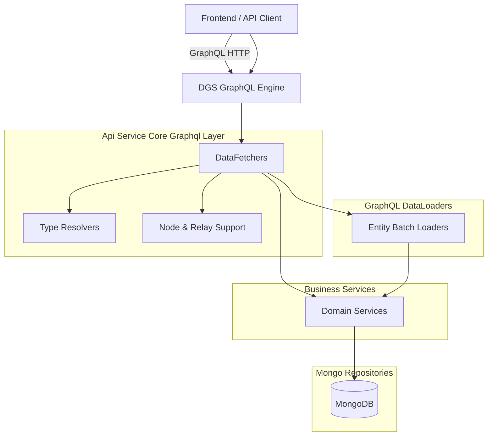
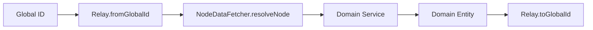
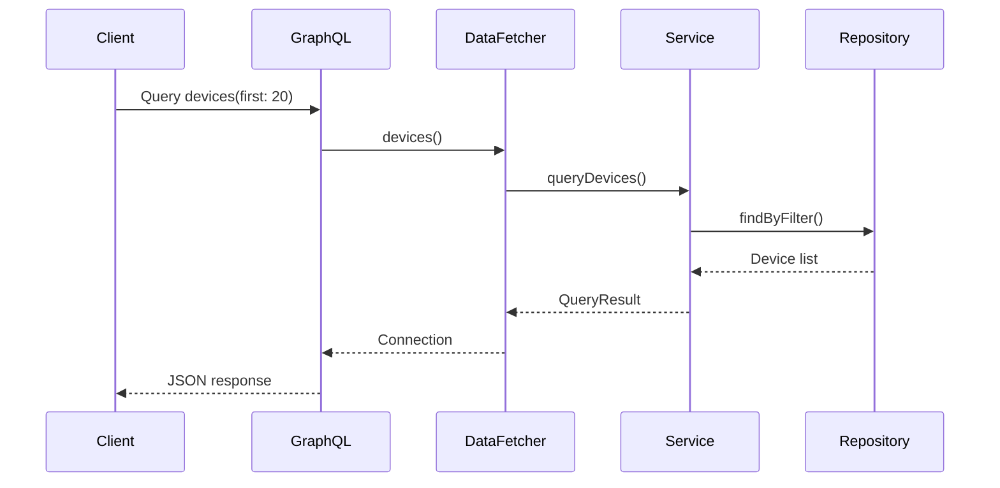

# Api Service Core Graphql Layer

## Overview

The **Api Service Core Graphql Layer** module is the primary GraphQL entry point for the OpenFrame platform. It exposes a unified, Relay-compliant API over core domain entities such as devices, organizations, events, knowledge base items, scripts, notifications, assignments, and integrated tools.

Built on the Netflix DGS framework, this layer:

- Translates GraphQL queries and mutations into domain service calls
- Implements Relay-style global node resolution and cursor-based pagination
- Coordinates DataLoader-based batching to prevent N+1 query problems
- Applies authentication and authorization at the GraphQL boundary
- Maps DTOs and domain models into GraphQL types

It sits between frontend clients (e.g., OpenFrame UI) and the underlying business services, repositories, and messaging infrastructure.

---

## Architectural Context

The Api Service Core Graphql Layer interacts with multiple adjacent modules:

- **API Service Core Business Services** – encapsulate domain logic
- **API Service Core GraphQL DataLoaders** – batch and cache related entity loading
- **API Service Core DTOs & DTO Contracts** – define API-facing data structures
- **Data Model & Repositories (Mongo)** – persistence layer
- **Security (OAuth & JWT)** – authentication and principal resolution
- **Eventing & Messaging (Kafka / NATS)** – async notifications and command dispatch

### High-Level Architecture

---

## Core Design Patterns

### 1. Netflix DGS-Based Resolvers

Each domain area is implemented as a `@DgsComponent` containing:

- `@DgsQuery` methods – GraphQL queries
- `@DgsMutation` methods – GraphQL mutations
- `@DgsData` methods – field resolvers for nested types
- `@DgsTypeResolver` – runtime type resolution for interfaces/unions

This enables strict separation between:

- Schema definitions (GraphQL SDL)
- Resolver logic (DataFetchers)
- Domain services

---

### 2. Relay Global ID Pattern

The module uses `graphql.relay.Relay` for global node handling.

Key characteristics:

- All entities expose an `id` field encoded as a global ID
- Incoming IDs are decoded using `RELAY.fromGlobalId()`
- Outgoing IDs are encoded using `RELAY.toGlobalId()`
- A unified `node(id: ID!)` query supports polymorphic fetching

### Relay Flow

---

### 3. Cursor-Based Pagination

Most list queries follow a consistent pattern:

- Accept `first`, `after`, `last`, `before`
- Convert to `ConnectionArgs`
- Map to `CursorPaginationCriteria`
- Return `GenericConnection` or `CountedGenericConnection`

This ensures:

- Stable pagination
- Forward/backward navigation
- Total count availability (when needed)

---

### 4. DataLoader for N+1 Prevention

Nested entity resolution (e.g., machine → tags, article → author) is performed using named DataLoaders.

Example usage pattern:

- Fetch parent entities via service
- Resolve related entities via `dfe.getDataLoader("...")`
- Batch load related IDs in a single repository call

This dramatically reduces database round-trips in complex queries.

---

## Module Responsibilities by Domain

Below is a breakdown of major DataFetcher components and their responsibilities.

---

### AssignmentDataFetcher

Handles assignment relationships between items and targets.

Responsibilities:

- Query assignment counts by target type
- Paginated retrieval of assigned items
- Assign / unassign items
- Resolve `AssignableTarget` polymorphically

Supports assignment between:

- Organizations
- Devices (Machines)
- Tickets
- Knowledge Base Articles

---

### CommandDataFetcher

Exposes RMM ad-hoc command dispatch operations.

Responsibilities:

- `runCommand` mutation
- `cancelExecution` mutation

Delegates to `CommandDispatchService`, which integrates with messaging infrastructure.

---

### DeviceDataFetcher

Provides device-centric GraphQL queries and nested resolvers.

Responsibilities:

- Device search and filtering
- Cursor-based device listing
- Device lookup by ID
- Nested resolution of:
  - Tags
  - ToolConnections
  - InstalledAgents
  - Organization

Relies heavily on DataLoaders for efficient nested resolution.

---

### EventDataFetcher

Manages event lifecycle and querying.

Responsibilities:

- Paginated event listing
- Event filtering
- Event creation and update
- Relay-compliant ID resolution

Events are stored in Mongo and may be enriched via stream-processing pipelines.

---

### KnowledgeBaseDataFetcher

Handles knowledge base content management.

Responsibilities:

- Folder & article tree queries
- Article CRUD lifecycle (create, update, publish, archive)
- Tag assignment
- Attachment upload URL generation
- Temp attachment lifecycle management
- Author resolution via DataLoader

Includes security-aware mutation execution using the authenticated principal.

---

### LogDataFetcher

Conditionally enabled audit log resolver.

Responsibilities:

- Log filtering
- Cursor-based log listing
- Detailed log lookup

Activated only when Cassandra-backed logging is enabled.

---

### NotificationDataFetcher

Provides user and agent notification querying and mutation operations.

Responsibilities:

- List notifications
- Mark as read / delete
- Unread counts by category
- Principal-aware recipient resolution

Supports multiple actor types:

- USER
- MACHINE (agent)

Applies `@PreAuthorize` guards at the GraphQL boundary.

---

### OrganizationDataFetcher

Exposes organization search and lookup operations.

Responsibilities:

- Paginated organization listing
- Organization filtering
- Lookup by global ID or raw organizationId

---

### ScriptDataFetcher

Provides RMM script CRUD operations.

Responsibilities:

- Script lookup
- Script search and filtering
- Create / update / delete

Tenant scoping is handled inside `ScriptService`.

---

### TagDataFetcher

Manages tag CRUD and suggestions.

Responsibilities:

- Tag listing
- Autocomplete for tag keys and values
- Tag creation, update, deletion

---

### ToolsDataFetcher

Handles integrated tool discovery and filtering.

Responsibilities:

- Integrated tool listing
- Tool filtering options

---

### NodeDataFetcher

Implements the Relay `node(id: ID!)` and `nodes(ids: [ID!]!)` queries.

Responsibilities:

- Decode global ID
- Map type name to `NodeType`
- Delegate to correct domain service

Supports polymorphic node resolution for:

- Machine
- Organization
- Event
- IntegratedTool
- Tenant
- ItemAssignment
- Ticket
- KnowledgeBaseItem
- User

---

## Type Resolvers

### NodeTypeResolver

Resolves GraphQL `Node` interface to concrete types at runtime.

### AssignableTargetTypeResolver

Resolves `AssignableTarget` union/interface for assignment targets.

### NotificationContextGraphQlTypeResolver

Maps `NotificationContext` discriminator values to concrete GraphQL types dynamically.

---

## End-to-End Query Flow Example

---

## Security Model

The Api Service Core Graphql Layer integrates with JWT-based authentication.

Security characteristics:

- Uses Spring Security context
- Extracts `AuthPrincipal` from JWT
- Applies `@PreAuthorize` on sensitive operations
- Supports USER and AGENT actor types
- Enforces type validation for global IDs

Mutations that modify state often:

- Resolve current user ID
- Validate actor type
- Delegate authorization checks to service layer

---

## Error Handling Strategy

The module uses:

- Validation annotations (`@Valid`, `@NotBlank`)
- Explicit `IllegalArgumentException` for invalid IDs
- Optional returns mapped to `null` where appropriate
- Controlled mutation wrappers (e.g., `executeMutation`) for safe error payload construction

---

## Why This Layer Matters

The Api Service Core Graphql Layer provides:

- A unified API surface across all OpenFrame domains
- Strict type safety and pagination consistency
- Relay compliance for modern frontend clients
- Efficient batching via DataLoader
- Centralized authentication enforcement
- Clear separation between API contract and domain logic

It acts as the orchestration boundary between user-facing GraphQL clients and the platform’s rich, multi-tenant backend ecosystem.

---

## Summary

The **Api Service Core Graphql Layer** is the orchestration and translation layer of the OpenFrame platform. It:

- Implements Relay-compliant GraphQL
- Encapsulates domain access through DataFetchers
- Prevents N+1 issues with DataLoaders
- Delegates business logic to services
- Enforces authentication and authorization
- Exposes a consistent, scalable API contract

This module is foundational to delivering a unified, extensible, and high-performance GraphQL API across the entire OpenFrame stack.
