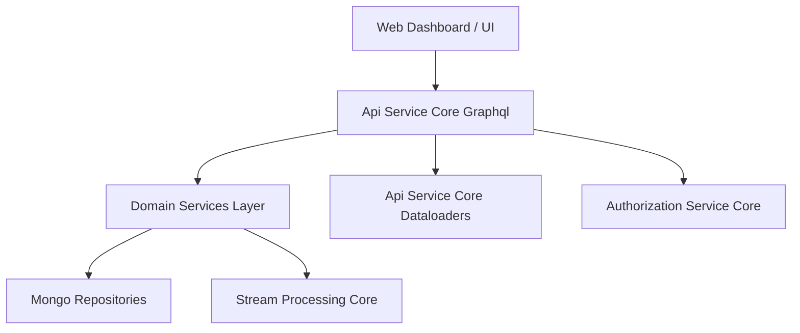
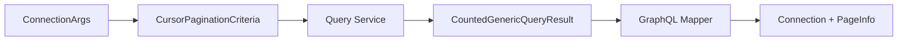
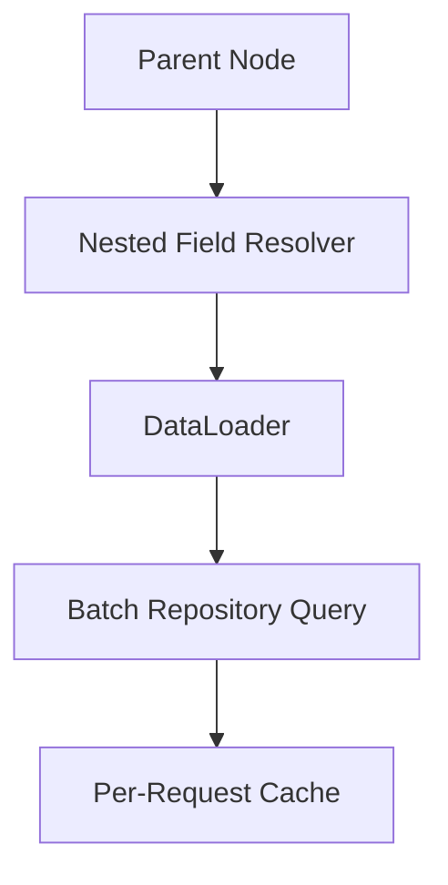
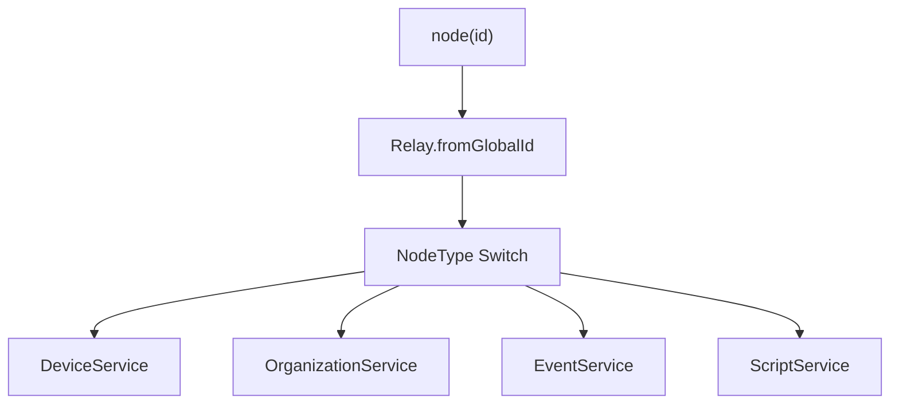
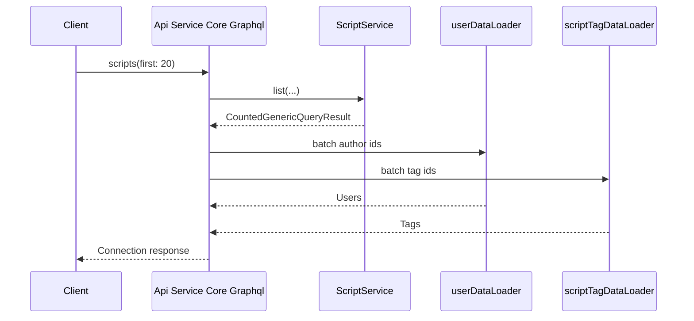

# Api Service Core Graphql

## Overview

The **Api Service Core Graphql** module is the primary GraphQL interface for the OpenFrame platform. Built on top of **Netflix DGS** and **Spring Boot**, it exposes a Relay-compliant, cursor-based API that aggregates domain services, enforces security boundaries, and optimizes data fetching using DataLoaders.

This module sits on top of:

- Domain services (devices, scripts, organizations, events, notifications, etc.)
- Mongo-based repositories and query services
- Security and tenant context infrastructure
- DataLoader infrastructure for batched resolution

It acts as the **orchestration layer** between client applications (dashboard, automation UI, integrations) and the underlying domain services.

---

## Architectural Positioning

The Api Service Core Graphql module is part of a layered architecture:

### Key Responsibilities

1. Expose GraphQL queries and mutations via DGS components.
2. Enforce Relay global ID semantics.
3. Translate GraphQL input/output DTOs to domain services.
4. Batch and cache nested field resolution using DataLoaders.
5. Provide polymorphic type resolution for interfaces and unions.
6. Respect tenant and security context from the authentication layer.

---

## Core Concepts

### 1. Relay Compliance

The module uses `graphql.relay.Relay` to:

- Encode global IDs (`TypeName:rawId` → Base64)
- Decode incoming IDs before service invocation
- Provide `node(id)` and `nodes(ids)` resolution

Implemented via:

- `NodeDataFetcher`
- `NodeTypeResolver`

This enables uniform object identification across the entire graph.

---

### 2. Cursor-Based Pagination

All major list queries use:

- `ConnectionArgs`
- `CursorPaginationCriteria`
- `CountedGenericConnection`
- `GenericEdge`

This guarantees:

- Stable pagination
- Relay-compliant connections
- Filtered counts where required

Pagination flow:

---

### 3. DataLoader Integration

Nested field resolution avoids N+1 problems using request-scoped DataLoaders from the sibling module:

- [Api Service Core Dataloaders](../api-service-core-dataloaders/api-service-core-dataloaders.md)

Examples:

- `Machine.organization`
- `Script.tags`
- `ScriptExecution.initiator`
- `KnowledgeBaseItem.author`
- `TimeEntry.user`

Resolution pattern:

---

## Data Fetcher Domains

Each domain area is implemented as a dedicated DGS component.

### Assignment

**Class:** `AssignmentDataFetcher`

- Query assigned items
- Count assignments by target type
- Assign/unassign operations
- Polymorphic target resolution via DataLoader

Uses `AssignableTargetTypeResolver` for union resolution.

---

### Device Management

**Class:** `DeviceDataFetcher`

- Filtered, searchable device listing
- Device filters
- Global ID resolution
- Nested resolution (tags, installed agents, tool connections, organization)

Depends on:

- Device services
- Tag service
- Organization service

---

### Events

**Class:** `EventDataFetcher`

- Query events with filtering and pagination
- Create and update events
- Relay ID encoding for Event nodes

---

### Knowledge Base

**Class:** `KnowledgeBaseDataFetcher`

Responsibilities:

- Folder and article tree queries
- CRUD for articles and folders
- Tag management
- Attachment upload URL generation
- Temp attachment lifecycle
- Author resolution via user DataLoader

Encapsulates complex content management logic while delegating storage and business rules to services.

---

### Scripts (RMM)

**Class:** `ScriptDataFetcher`

- CRUD for scripts
- Archive/unarchive
- Run and batch run
- Filter facets with global ID re-encoding
- Tag and author resolution

Closely integrates with:

- Script dispatch services
- Script filtering services

---

### Script Execution

**Class:** `ScriptExecutionDataFetcher`

- Execution history per script
- Filter facets (initiators)
- Nested resolution:
  - Initiator (User)
  - Machine
  - Script name via DataLoader

---

### Script Scheduling

**Class:** `ScriptScheduleDataFetcher`

- CRUD for schedules
- Device assignment management
- "Run now" support
- Assigned devices as paginated connection
- Device count via DataLoader

---

### Notifications

**Class:** `NotificationDataFetcher`

- List notifications per authenticated principal
- Unread counts
- Mark read / delete
- Actor-aware resolution (User vs Machine)

Includes:

- `NotificationContextGraphQlTypeResolver`
  - Resolves polymorphic notification context types

---

### Organizations

**Class:** `OrganizationDataFetcher`

- Paginated organization queries
- Sort by last activity
- Relay ID support

---

### Tags

**Class:** `TagDataFetcher`

- Tag CRUD
- Key/value suggestions
- Entity-type-based tag queries

---

### Tools

**Class:** `ToolsDataFetcher`

- Integrated tool listing
- Tool filtering
- Relay ID resolution

---

### Time Tracking

**Class:** `TimeEntryDataFetcher`

- Timer lifecycle (start, pause, resume, stop)
- Employee time queries
- Stats aggregation
- Organization and ticket linkage
- Cursor encoding via `CursorCodec`

---

### Logs (Conditional)

**Class:** `LogDataFetcher`

- Enabled when Cassandra is active
- Query audit logs
- Fetch log details

---

## Node Resolution

Two core resolvers provide interface-level polymorphism.

### NodeDataFetcher

Implements:

- `node(id)`
- `nodes(ids)`

Dispatches by `NodeType` to appropriate service.

### NodeTypeResolver

Maps runtime objects to GraphQL type names for the `Node` interface.

---

## Security Integration

The module integrates with:

- [Authorization Service Core](../authorization-service-core/authorization-service-core.md)

Security patterns include:

- JWT extraction via `AuthPrincipal`
- Role-based access using `@PreAuthorize`
- Actor-aware logic (USER vs AGENT)
- Tenant scoping enforced inside services

GraphQL layer responsibility:

- Decode identity
- Pass user ID to service layer
- Avoid embedding business authorization rules directly

---

## Cross-Module Relationships

| Module | Role |
|--------|------|
| Api Service Core Dataloaders | Batched nested resolution |
| Api Service Core Rest Controllers | Parallel REST interface |
| Data Mongo Domain Model | Underlying document models |
| Data Mongo Sync Repositories | Query implementations |
| Stream Processing Core | Event enrichment and async updates |
| Authorization Service Core | JWT and tenant context |

---

## Execution Flow Example

Example: Fetch paginated scripts with author and tags.

---

## Summary

The **Api Service Core Graphql** module is the central GraphQL orchestration layer of OpenFrame. It:

- Implements Relay-compliant global object identification
- Standardizes cursor-based pagination
- Leverages DataLoaders for performance
- Enforces security context propagation
- Delegates business rules to domain services

It provides a scalable, composable, and tenant-aware GraphQL API that unifies device management, RMM operations, knowledge base, notifications, organizations, time tracking, and more under a single contract-driven interface.