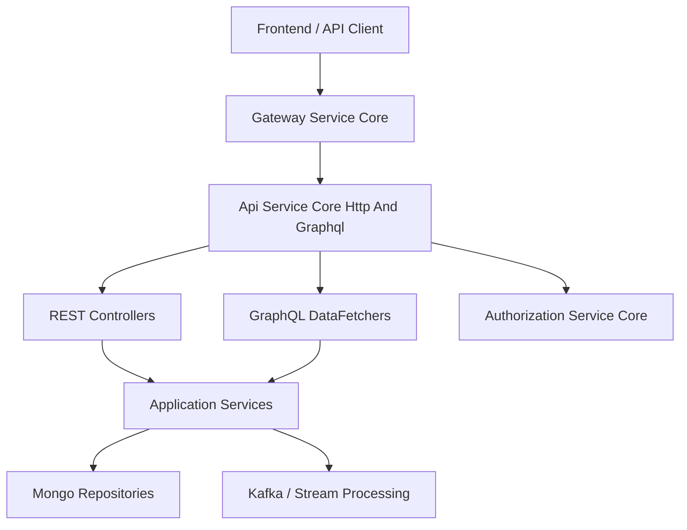
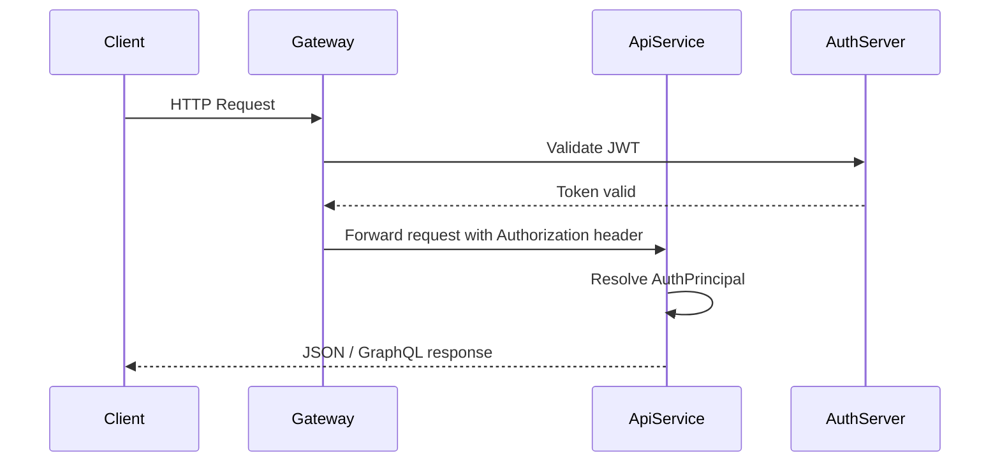
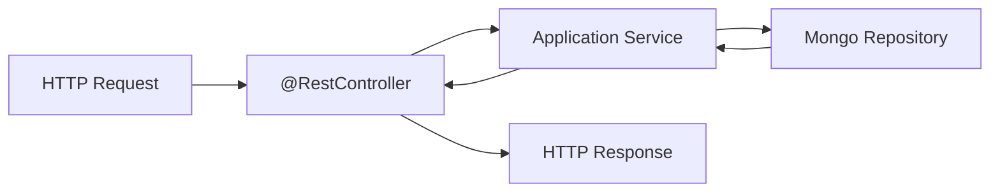
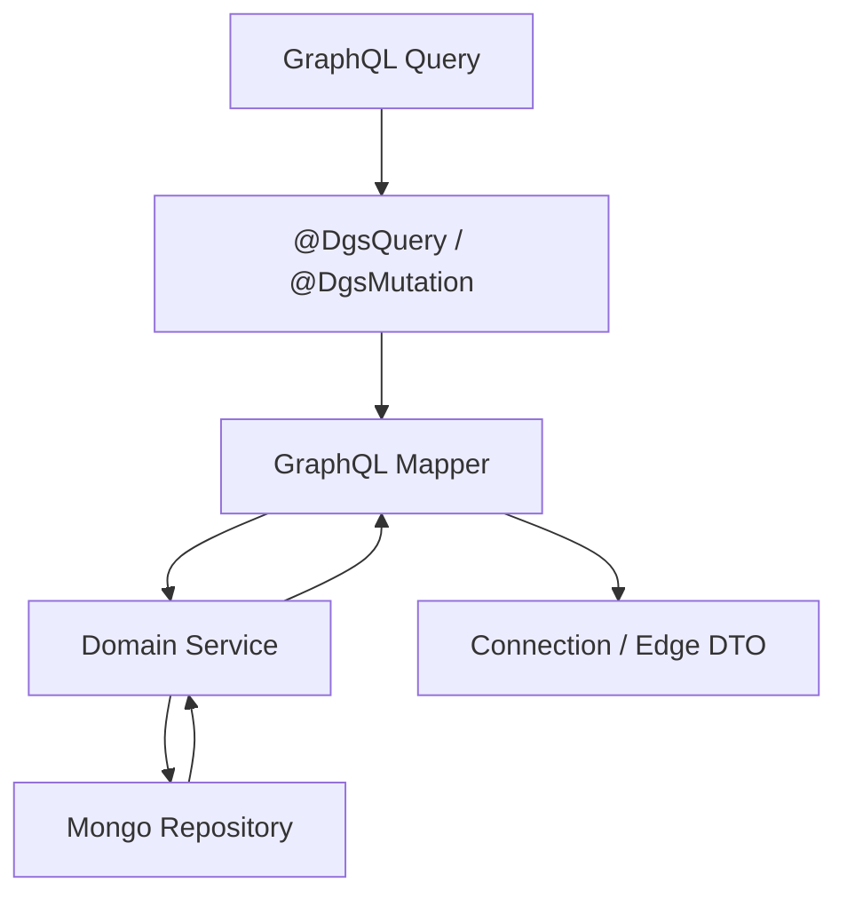
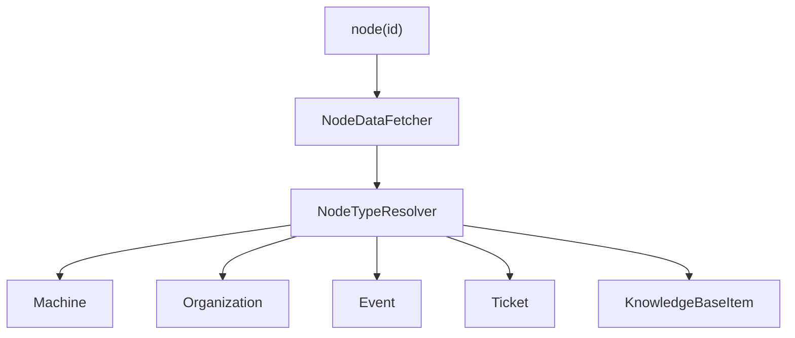
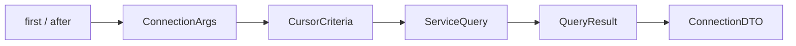
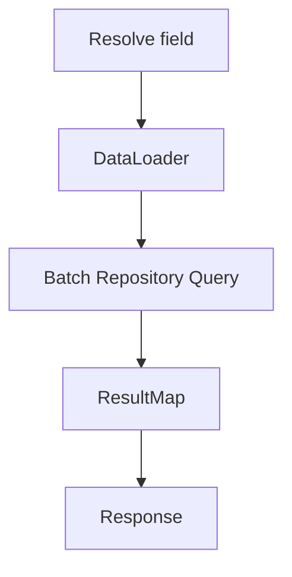

# Api Service Core Http And Graphql

## Overview

The **Api Service Core Http And Graphql** module is the central application layer of the OpenFrame backend. It exposes:

- REST endpoints for operational and administrative APIs
- GraphQL APIs (queries, mutations, Relay-style node resolution)
- Security integration as an OAuth2 Resource Server
- DataLoader-based batching to prevent N+1 query problems
- DTOs and connection models aligned with the `api-lib-contracts` module

This module acts as the orchestration layer between:

- Gateway (edge routing and JWT handling)
- Authorization Service (OAuth2 / OIDC)
- Mongo repositories and domain services
- Stream-processing and external integrations
- Frontend (GraphQL + REST consumers)

It does **not** contain core domain persistence logic. Instead, it delegates to services and repositories defined in other modules.

---

## High-Level Architecture

### Responsibilities

| Layer | Responsibility |
|--------|----------------|
| REST Controllers | HTTP endpoints for operational APIs |
| GraphQL DataFetchers | GraphQL queries & mutations via DGS |
| DataLoaders | Batch loading & N+1 prevention |
| DTOs | GraphQL and REST data contracts |
| SecurityConfig | OAuth2 Resource Server integration |
| Services | Business orchestration (delegated to domain services) |

---

## Security Architecture

Security is intentionally minimal in this module.

### Key Principle

The **Gateway Service Core** performs:

- JWT validation
- Cookie extraction
- Authorization header injection
- PermitAll path filtering

The Api Service Core Http And Graphql module:

- Acts as an OAuth2 Resource Server
- Supports `@AuthenticationPrincipal` resolution
- Caches JWT decoders by issuer

### Security Flow

### Core Security Components

- `SecurityConfig` – Configures OAuth2 Resource Server and issuer-based JWT resolution
- `AuthenticationConfig` – Registers `AuthPrincipalArgumentResolver`
- `ApiApplicationConfig` – Provides `PasswordEncoder`
- Caffeine cache for `JwtAuthenticationProvider`

---

## REST Layer

The REST controllers provide operational APIs and administrative endpoints.

### Key Controllers

| Controller | Responsibility |
|------------|----------------|
| `HealthController` | Health probe endpoint |
| `MeController` | Authenticated user info |
| `ApiKeyController` | API key lifecycle |
| `OrganizationController` | Organization mutations |
| `UserController` | User management |
| `InvitationController` | User invitation lifecycle |
| `SSOConfigController` | SSO provider configuration |
| `AgentRegistrationSecretController` | Agent bootstrap secrets |
| `ForceAgentController` | Forced tool / agent operations |
| `ReleaseVersionController` | Current release metadata |
| `OpenFrameClientConfigurationController` | Client config exposure |

### REST Processing Flow

Controllers are thin and delegate logic to service classes.

---

## GraphQL Layer (DGS)

The GraphQL API is implemented using Netflix DGS.

### Categories of DataFetchers

| Category | Examples |
|----------|----------|
| Core Entities | DeviceDataFetcher, OrganizationDataFetcher |
| Events & Logs | EventDataFetcher, LogDataFetcher |
| Knowledge Base | KnowledgeBaseDataFetcher |
| Assignments | AssignmentDataFetcher |
| Notifications | NotificationDataFetcher |
| Tools & Scripts | ToolsDataFetcher, ScriptDataFetcher |
| Relay Node | NodeDataFetcher |

### GraphQL Query Flow

---

## Relay and Global ID Model

This module implements Relay-style node resolution.

### Global ID Handling

- IDs are encoded using `Relay.toGlobalId(type, id)`
- Resolved using `Relay.fromGlobalId(id)`
- Centralized resolution via `NodeDataFetcher`

### Node Type Resolution

This ensures consistent object lookup across all GraphQL types.

---

## Pagination Model

The module implements cursor-based pagination.

### Core DTOs

- `GenericEdge<T>`
- `CountedGenericConnection<T>`
- `ConnectionArgs`
- `CursorPaginationCriteria`

### Pagination Flow

This model provides:

- Forward and backward pagination
- Filtered count tracking
- Stable cursors

---

## DataLoader Layer

To prevent N+1 query issues in GraphQL, the module defines multiple DataLoaders.

### Examples

- `MachineDataLoader`
- `OrganizationDataLoader`
- `UserDataLoader`
- `KnowledgeBaseAttachmentDataLoader`
- `TagDataLoader`
- `TicketDataLoader`

### N+1 Prevention Pattern

Each DataLoader:

- Accepts a list of IDs
- Performs a single batched query
- Returns results in original order

---

## Knowledge Base Subsystem

The Knowledge Base GraphQL implementation is one of the most complex subsystems.

Capabilities include:

- Folder and article tree structure
- Tag assignment
- Assignment to devices / tickets / organizations
- Archive and publish lifecycle
- Temporary attachment upload
- Permanent attachment linking

It demonstrates:

- Use of Relay global IDs
- DataLoader integration
- Mutation error wrapping
- Author resolution via `UserDataLoader`

---

## Notification Subsystem

The Notification GraphQL implementation supports:

- Cursor-based notification listing
- Category-based unread counters
- Actor-type resolution (USER vs AGENT)
- Bulk mark-as-read and delete operations

Security is enforced using method-level authorization:

- `@PreAuthorize("hasAnyAuthority('ADMIN', 'AGENT')")`

Recipient resolution depends on `AuthPrincipal` and JWT claims.

---

## SSO Configuration Management

The SSOConfigService manages:

- Provider enable/disable
- Client secret encryption
- Domain validation
- Microsoft-specific tenant validation
- Post-save processing hooks

The service integrates with:

- EncryptionService
- SSOConfigRepository
- SSOConfigProcessor

This allows OSS deployments to override behavior via conditional beans.

---

## Extensibility Model

Several extension points exist:

| Extension Type | Mechanism |
|----------------|-----------|
| Post-processing hooks | `@ConditionalOnMissingBean` processors |
| SSO provider strategies | Strategy pattern |
| User enrichment | `UserProcessor` |
| Agent secret lifecycle | `AgentRegistrationSecretProcessor` |

This enables SaaS or enterprise editions to inject custom behavior.

---

## Relationship to Other Modules

The Api Service Core Http And Graphql module depends on:

- Authorization Service Core (JWT issuance and OAuth2 flows)
- Gateway Service Core (edge authentication and routing)
- Data Models and Repositories Mongo (persistence layer)
- Stream Processing Kafka (event ingestion and enrichment)
- Api Lib Contracts (shared DTOs)

It serves as the primary application API surface consumed by the Frontend Core UI and Chat module.

---

## Summary

The **Api Service Core Http And Graphql** module is the application-layer backbone of OpenFrame.

It provides:

- REST APIs for operational management
- A fully Relay-compliant GraphQL API
- Cursor-based pagination
- DataLoader batching
- Minimal but robust OAuth2 Resource Server security
- Extensible processor-based hooks

It sits between the Gateway and domain services, translating transport-layer requests into structured domain interactions while maintaining consistent API contracts across the platform.
