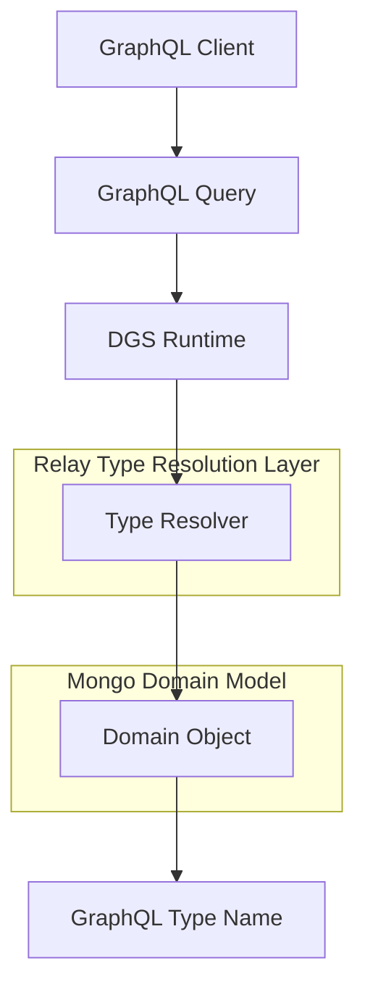
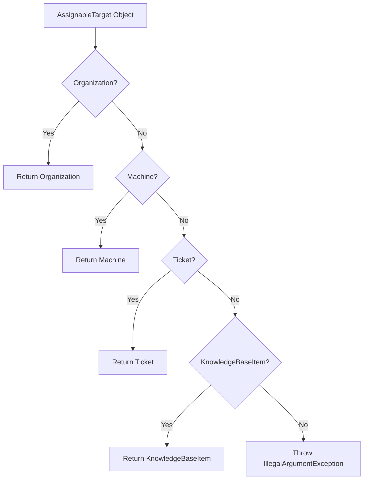
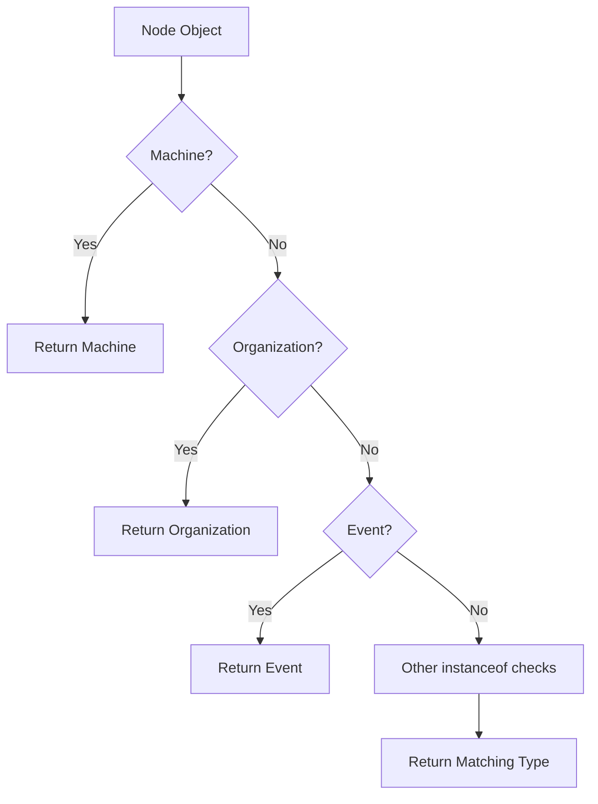
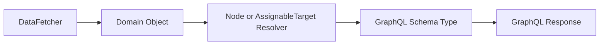
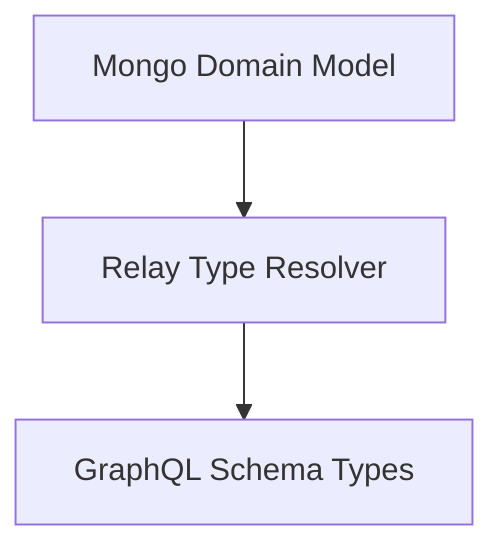

# Api Service Core Relay Type Resolution

## Overview

The **Api Service Core Relay Type Resolution** module is responsible for resolving polymorphic GraphQL types in the Api Service Core layer. It bridges:

- Mongo domain model objects (e.g., `Machine`, `Organization`, `Ticket`)
- GraphQL interfaces and unions (e.g., `Node`, `AssignableTarget`)
- The Netflix DGS runtime type resolution mechanism

In a Relay-compliant GraphQL architecture, interfaces such as `Node` and domain-specific unions such as `AssignableTarget` require runtime type resolution. This module provides that resolution logic via DGS `@DgsTypeResolver` components.

---

## Why This Module Exists

GraphQL interfaces and unions require a mechanism to determine the concrete GraphQL type for a returned object at runtime.

For example:

- A `Node` query may return a `Machine`, `User`, `Ticket`, or `Organization`.
- An `AssignableTarget` may represent an `Organization`, `Machine`, `Ticket`, or `KnowledgeBaseItem`.

The GraphQL engine must map Java domain objects to their corresponding GraphQL schema type names.

The **Api Service Core Relay Type Resolution** module provides that mapping in a centralized and explicit way.

---

## High-Level Architecture



### Flow Summary

1. A GraphQL query resolves a field returning an interface or union.
2. DGS invokes the registered `@DgsTypeResolver`.
3. The resolver inspects the Java object using `instanceof` checks.
4. It returns the GraphQL type name as a `String`.
5. The runtime binds the object to the correct schema type.

---

## Core Components

This module contains two DGS type resolvers:

- `AssignableTargetTypeResolver`
- `NodeTypeResolver`

Both are annotated with `@DgsComponent` and use `@DgsTypeResolver`.

---

## AssignableTargetTypeResolver

**Component:**  
`openframe-oss-lib.openframe-api-service-core.src.main.java.com.openframe.api.relay.AssignableTargetTypeResolver.AssignableTargetTypeResolver`

### Responsibility

Resolves the GraphQL union/interface `AssignableTarget` into a concrete schema type.

### Supported Domain Types

| Java Type | GraphQL Type Returned |
|------------|-----------------------|
| `Organization` | `Organization` |
| `Machine` | `Machine` |
| `Ticket` | `Ticket` |
| `KnowledgeBaseItem` | `KnowledgeBaseItem` |

If an unsupported object is passed, the resolver throws:

```text
IllegalArgumentException: Unknown AssignableTarget type
```

### Resolution Logic



### Architectural Role

This resolver enables:

- Polymorphic assignment targets
- Unified assignment models across multiple entity types
- Strong alignment between domain model and GraphQL schema

---

## NodeTypeResolver

**Component:**  
`openframe-oss-lib.openframe-api-service-core.src.main.java.com.openframe.api.relay.NodeTypeResolver.NodeTypeResolver`

### Responsibility

Resolves the Relay `Node` interface to a concrete GraphQL type.

This is central to:

- Global object identification
- Relay-style pagination
- Cross-entity querying

### Supported Domain Types

| Java Type | GraphQL Type Returned |
|------------|-----------------------|
| `Machine` | `Machine` |
| `Organization` | `Organization` |
| `Event` | `Event` |
| `IntegratedTool` | `IntegratedTool` |
| `Tenant` | `Tenant` |
| `ItemAssignment` | `ItemAssignment` |
| `Ticket` | `Ticket` |
| `KnowledgeBaseItem` | `KnowledgeBaseItem` |
| `User` | `User` |

If an unsupported object is encountered, an exception is thrown:

```text
IllegalArgumentException: Unknown Node type
```

### Resolution Flow



---

## Integration with GraphQL Layer

This module works closely with:

- [Api Service Core GraphQL Datafetchers](../api-service-core-graphql-datafetchers/api-service-core-graphql-datafetchers.md)
- [Api Service Core GraphQL Dtos](../api-service-core-graphql-dtos/api-service-core-graphql-dtos.md)

### Interaction Diagram



1. A DataFetcher returns a domain entity.
2. The entity implements or represents a `Node` or `AssignableTarget`.
3. DGS invokes the appropriate resolver.
4. The resolver returns the GraphQL type name.
5. The object is serialized correctly into the GraphQL response.

---

## Relationship to the Domain Model

This module depends directly on the Mongo domain model defined in:

- Device entities (`Machine`)
- Organization entities (`Organization`, `Tenant`)
- User entities (`User`)
- Event entities (`Event`)
- Ticket entities (`Ticket`)
- Knowledge base entities (`KnowledgeBaseItem`)
- Tool entities (`IntegratedTool`)
- Assignment entities (`ItemAssignment`)

These classes originate from the data layer and are not GraphQL-specific.

The resolvers form a clean boundary between:



This keeps domain objects independent from GraphQL schema annotations.

---

## Design Characteristics

### 1. Explicit Type Mapping

- No reflection-based resolution
- No schema name inference
- Explicit `instanceof` checks

This ensures:

- Predictable behavior
- Easy debugging
- Compile-time safety for supported types

### 2. Fail-Fast Strategy

Unknown types result in immediate `IllegalArgumentException`.

Benefits:

- Prevents silent schema mismatches
- Forces developers to update resolvers when introducing new Node types

### 3. Relay Compliance

By resolving the `Node` interface properly, the module enables:

- Global ID-based queries
- Cursor-based pagination
- Cross-type collections

---

## When to Update This Module

You must update **Api Service Core Relay Type Resolution** when:

- A new domain type implements the `Node` interface in the GraphQL schema
- A new entity becomes assignable under `AssignableTarget`
- A new Mongo document class is exposed through GraphQL

Failure to update this module will result in runtime exceptions.

---

## Summary

The **Api Service Core Relay Type Resolution** module is a critical but focused infrastructure component that:

- Implements GraphQL Relay runtime type resolution
- Maps Mongo domain entities to GraphQL schema types
- Enables polymorphic querying
- Enforces strict type safety and fail-fast behavior

Although small in size, it is foundational to the correctness of the GraphQL execution layer in Api Service Core.