# Api Service Core Rest Controllers

The **Api Service Core Rest Controllers** module exposes the primary internal REST endpoints of the OpenFrame API Service Core. It acts as the HTTP boundary layer between clients (UI, agents, internal services) and the underlying application services, command/query services, and domain logic.

This module is responsible for:

- Exposing secure REST endpoints for tenant-scoped operations
- Delegating business logic to dedicated service layers
- Translating HTTP semantics into domain/service calls
- Enforcing authentication context via `AuthPrincipal`
- Returning DTO-based responses for consistency and API stability

It complements the GraphQL data fetchers and external API controllers by providing internal and operational REST endpoints.

---

## Architectural Role in the Platform

Within the overall OpenFrame architecture, the Api Service Core Rest Controllers module sits at the edge of the API Service Core and depends on:

- Application services (command/query services)
- Domain services and processors
- Security context (`AuthPrincipal`)
- Mongo-backed persistence modules
- Tenant-aware authorization infrastructure

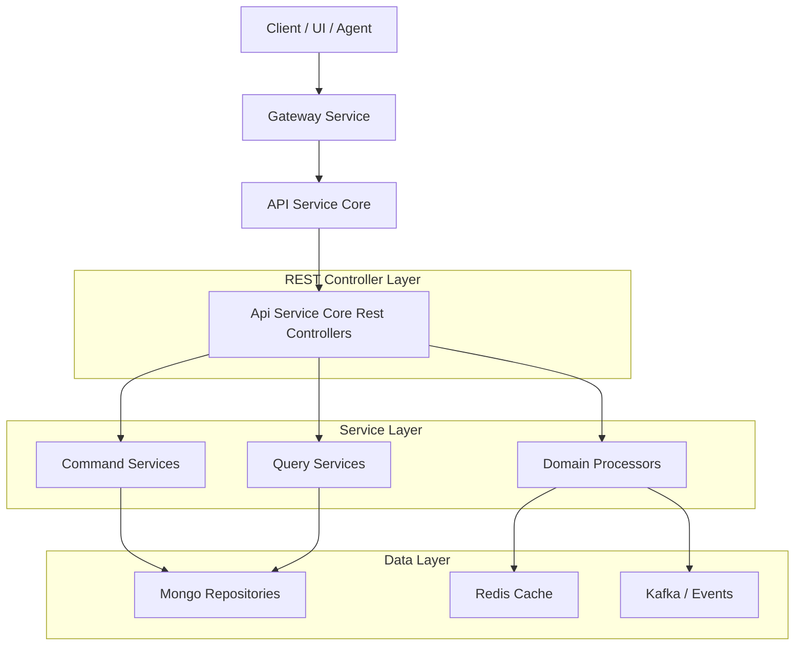

The controllers themselves contain minimal business logic and primarily orchestrate calls to services.

---

## Controller Overview

The module contains the following REST controllers:

- AgentRegistrationSecretController
- ApiKeyController
- DeviceController
- ForceAgentController
- HealthController
- InvitationController
- MeController
- OpenFrameClientConfigurationController
- OrganizationController
- ReleaseVersionController
- SSOConfigController
- UserController

Each controller is scoped to a specific functional domain.

---

# Endpoint Domains

## 1. Agent Registration Secret

**Base Path:** `/agent/registration-secret`

Controller: `AgentRegistrationSecretController`

Responsibilities:

- Retrieve active registration secret
- List all historical secrets
- Generate new registration secret

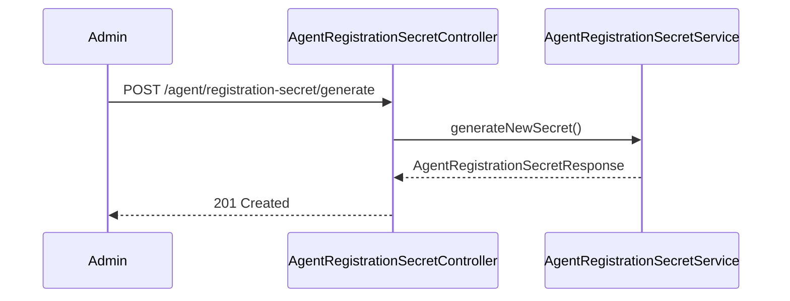

This endpoint is typically used during agent provisioning and secure enrollment flows.

---

## 2. API Key Management

**Base Path:** `/api-keys`

Controller: `ApiKeyController`

Key features:

- List user API keys
- Create new API key
- Update metadata
- Delete key
- Regenerate secret

Authentication is derived from `AuthPrincipal`, ensuring API keys are scoped to the authenticated user.

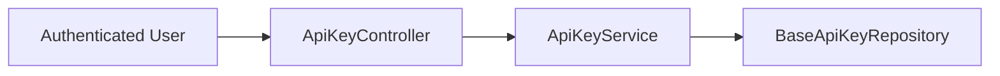

Security Characteristics:

- User-scoped access
- Regeneration rotates secret while preserving key identity
- Creation returns secret only once

---

## 3. Device Status Updates

**Base Path:** `/devices`

Controller: `DeviceController`

Primary responsibility:

- Update device status via `PATCH /devices/{machineId}`

This is typically invoked internally by agents or system processes to reflect device health or connectivity state.

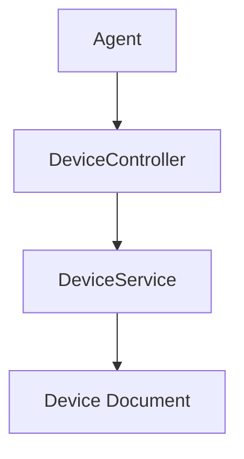

---

## 4. Force Agent Operations

**Base Path:** `/force`

Controller: `ForceAgentController`

Supports operational commands such as:

- Force tool installation
- Force tool reinstallation
- Force tool update
- Force client update
- Bulk operations ("all")

These endpoints delegate to:

- ForceToolInstallationService
- ForceClientUpdateService
- ForceToolAgentUpdateService

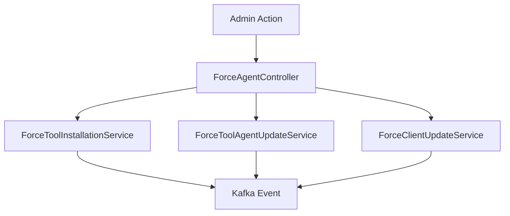

These operations are typically asynchronous and propagate through event pipelines.

---

## 5. Health Check

**Path:** `/health`

Controller: `HealthController`

- Lightweight liveness endpoint
- Returns `200 OK` with body `OK`
- Used by orchestrators and load balancers

---

## 6. Invitations

**Base Path:** `/invitations`

Controller: `InvitationController`

Supports:

- Create invitation
- Paginated listing
- Revoke invitation
- Resend invitation

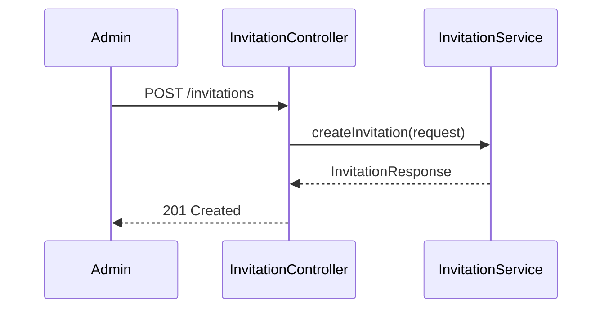

Invitation flows integrate with SSO and tenant onboarding subsystems.

---

## 7. Current User Context

**Path:** `/me`

Controller: `MeController`

Purpose:

- Exposes authenticated user context
- Returns identity, roles, tenant ID
- Returns 401 if no authenticated principal

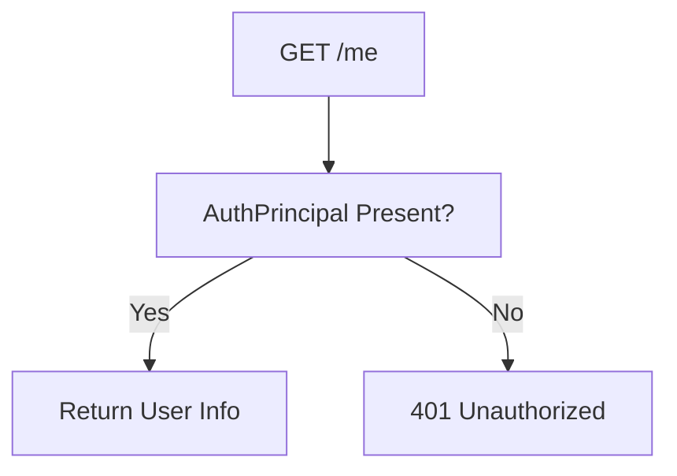

This endpoint is commonly used by frontend applications to bootstrap user state.

---

## 8. OpenFrame Client Configuration

**Base Path:** `/openframe-client/configuration`

Controller: `OpenFrameClientConfigurationController`

Provides configuration metadata used by the OpenFrame client application.

Delegates to:

- OpenFrameClientConfigurationQueryService

---

## 9. Organization Mutations

**Base Path:** `/organizations`

Controller: `OrganizationController`

Handles:

- Create organization
- Update organization
- Update status (ACTIVE / ARCHIVED)
- Check if archivable

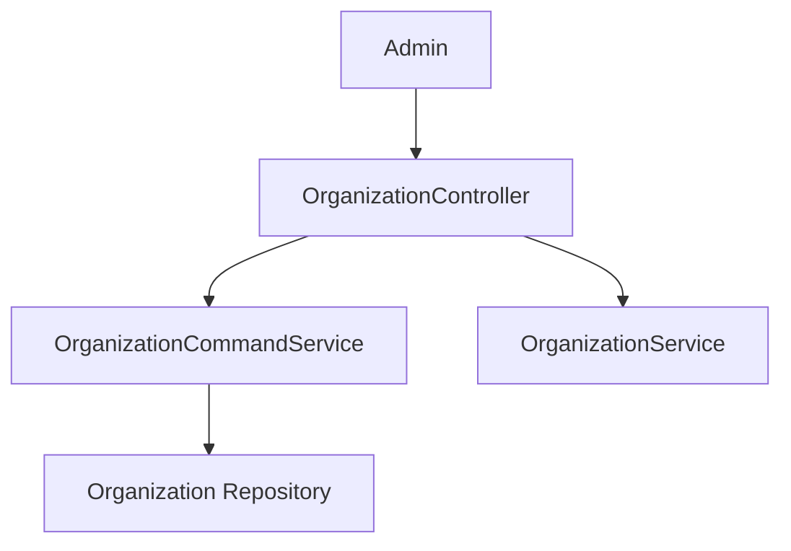

Archiving rules:

- Cannot archive if active devices exist
- May return `409 Conflict`

Read operations are intentionally separated into external-facing modules.

---

## 10. Release Version

**Base Path:** `/release-version`

Controller: `ReleaseVersionController`

Responsibilities:

- Return current platform release metadata
- Respond with 404 if not present

Used by:

- UI build metadata
- Agent compatibility checks
- Monitoring tools

---

## 11. SSO Configuration

**Base Path:** `/sso`

Controller: `SSOConfigController`

Supports:

- List enabled providers
- List available providers
- Retrieve configuration
- Create or update provider config
- Toggle enablement
- Delete configuration

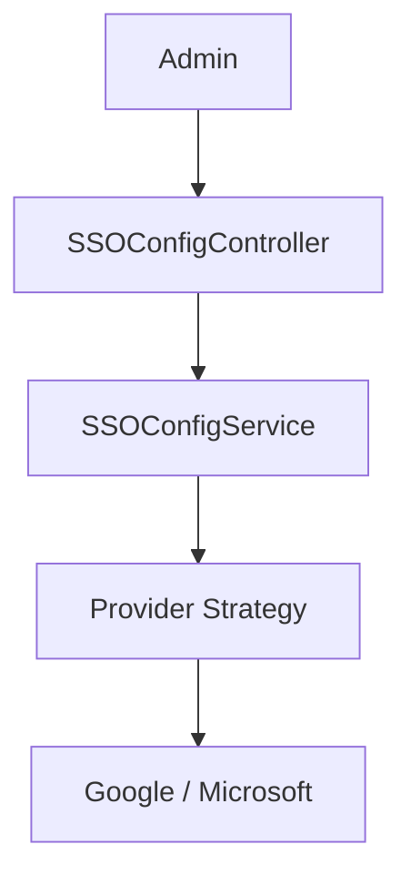

This integrates with the Authorization Service Core and OAuth infrastructure.

---

## 12. User Management

**Base Path:** `/users`

Controller: `UserController`

Supports:

- Paginated listing
- Get by ID
- Update user
- Soft delete user

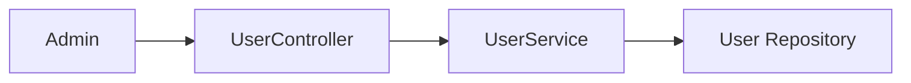

Soft deletion ensures audit integrity and traceability.

---

# Security Model

All controllers (except `/health`) rely on Spring Security and JWT-based authentication.

Authentication Flow:

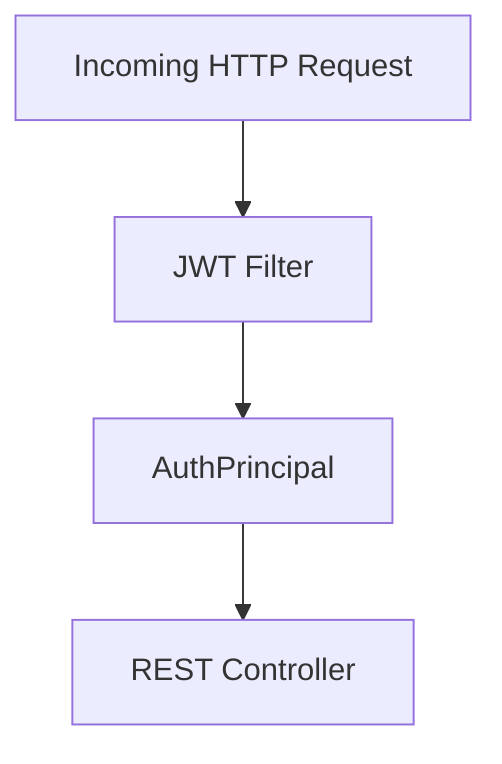

Key characteristics:

- Tenant-aware security context
- Role-based authorization
- Principal injection via `@AuthenticationPrincipal`
- Clear separation between authentication and business logic

---

# Design Principles

The Api Service Core Rest Controllers module follows these principles:

1. Thin controllers (no heavy business logic)
2. Explicit HTTP semantics (correct status codes)
3. DTO-based contract isolation
4. Clear separation of command vs query concerns
5. Tenant-aware multi-organization architecture

---

# Summary

The **Api Service Core Rest Controllers** module is the internal REST façade of the OpenFrame API Service Core. It orchestrates:

- Identity-scoped user operations
- Organization and tenant management
- API key lifecycle
- SSO configuration
- Agent lifecycle control
- Operational management endpoints

It serves as a critical integration layer between authenticated clients and the underlying domain, persistence, and event-driven infrastructure, ensuring a clean, secure, and maintainable API boundary.