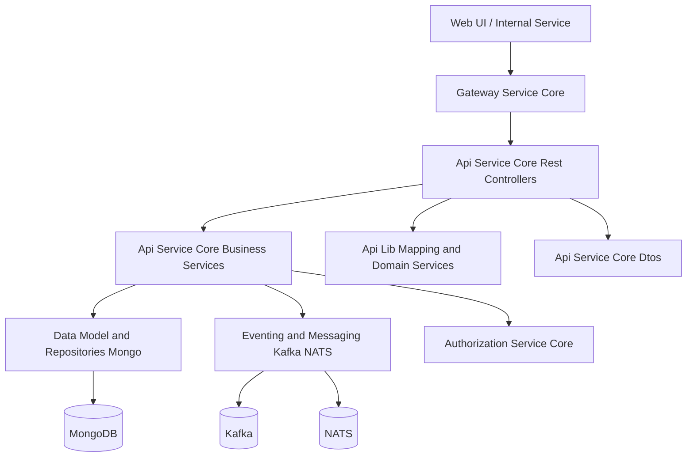
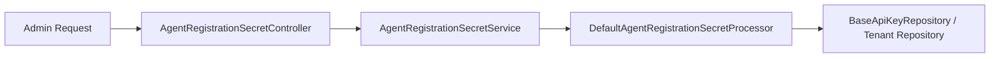
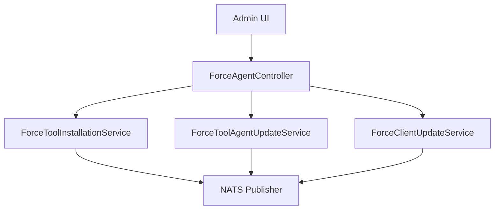
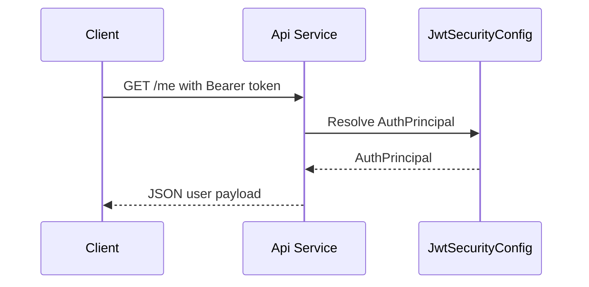
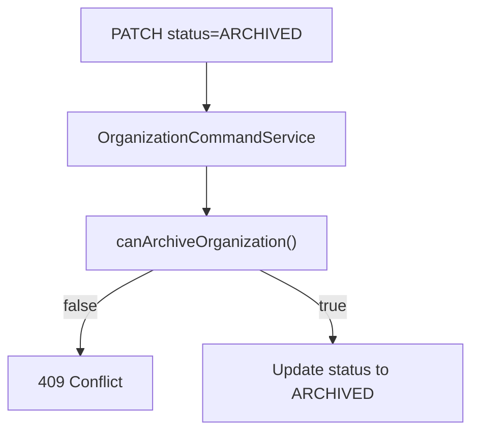

# Api Service Core Rest Controllers

## Overview

The **Api Service Core Rest Controllers** module exposes the primary internal REST endpoints of the OpenFrame API Service. It acts as the HTTP entry layer for administrative, operational, and internal platform interactions, delegating business logic to application services and returning structured DTO responses.

This module is responsible for:

- User and organization management (mutations)
- API key lifecycle management
- Agent registration secret management
- Device status updates
- Forced client and tool agent operations
- SSO configuration management
- Invitation workflows
- Release version and health endpoints
- Current user identity resolution
- OpenFrame client configuration retrieval

All controllers are implemented using Spring Web MVC and follow a thin-controller pattern: validation and HTTP concerns are handled at the edge, while business logic is delegated to services in the Api Service Core Business Services and related modules.

---

## Architectural Context

The Api Service Core Rest Controllers module sits between external callers (UI, internal services, gateway) and the domain/service layer.

### Responsibilities at This Layer

- HTTP routing via `@RestController`
- Request validation via `@Valid`
- Authentication context resolution via `@AuthenticationPrincipal`
- HTTP status mapping
- Translation of domain models into response DTOs
- Minimal exception-to-HTTP conversion

The controllers do **not**:

- Contain business rules
- Directly interact with repositories
- Perform cross-service orchestration

---

## Controller Groups and Responsibilities

### 1. Agent Registration Secret Management

**Controller:** `AgentRegistrationSecretController`  
**Base Path:** `/agent/registration-secret`

Handles lifecycle of agent registration secrets used during client or agent onboarding.

Endpoints:

- `GET /agent/registration-secret/active` → Get active secret
- `GET /agent/registration-secret` → List all secrets
- `POST /agent/registration-secret/generate` → Generate new secret (201 Created)

Delegates to `AgentRegistrationSecretService` and returns `AgentRegistrationSecretResponse` DTOs.

Typical flow:

---

### 2. API Key Management

**Controller:** `ApiKeyController`  
**Base Path:** `/api-keys`

Manages user-scoped API keys.

Authentication is resolved via `AuthPrincipal` using `@AuthenticationPrincipal`.

Endpoints:

- `GET /api-keys` → List keys for authenticated user
- `POST /api-keys` → Create key (201 Created)
- `GET /api-keys/{keyId}` → Fetch key
- `PUT /api-keys/{keyId}` → Update key metadata
- `DELETE /api-keys/{keyId}` → Delete key (204 No Content)
- `POST /api-keys/{keyId}/regenerate` → Regenerate secret

Key aspects:

- All operations are scoped to `principal.getId()`
- Service enforces ownership constraints
- Responses use `ApiKeyResponse` and `CreateApiKeyResponse`

---

### 3. Device Status Management

**Controller:** `DeviceController`  
**Base Path:** `/devices`

Provides internal status update capabilities for devices.

Endpoint:

- `PATCH /devices/{machineId}` → Update device status

Delegates to `DeviceService.updateStatusByMachineId`.

This endpoint is typically used by internal processes, stream processors, or system integrations.

---

### 4. Forced Client and Tool Agent Operations

**Controller:** `ForceAgentController`  
**Base Path:** `/force`

Supports administrative force operations for:

- Tool installation
- Tool reinstallation
- Tool updates
- Client updates
- Bulk operations across machines

Representative endpoints:

- `POST /force/tool-agent/install`
- `POST /force/tool-agent/update`
- `POST /force/client/update`
- `POST /force/tool-agent/install/all`
- `POST /force/tool-agent/reinstall`

These endpoints delegate to:

- `ForceToolInstallationService`
- `ForceClientUpdateService`
- `ForceToolAgentUpdateService`

High-level interaction:

These services often trigger asynchronous messaging via NATS to connected agents.

---

### 5. Health Endpoint

**Controller:** `HealthController`

Endpoint:

- `GET /health` → Returns `OK`

Used for:

- Kubernetes liveness/readiness probes
- Load balancer health checks
- Operational monitoring

---

### 6. Invitation Management

**Controller:** `InvitationController`  
**Base Path:** `/invitations`

Manages tenant-level user invitations.

Endpoints:

- `POST /invitations` → Create invitation
- `GET /invitations` → Paginated list
- `DELETE /invitations/{id}` → Revoke invitation
- `POST /invitations/{id}/resend` → Resend invitation

Delegates to `InvitationService` and returns:

- `InvitationResponse`
- `InvitationPageResponse`

Invitation registration flows are completed in the Authorization Service Core module.

---

### 7. Current User Identity

**Controller:** `MeController`

Endpoint:

- `GET /me`

Returns authenticated user details from `AuthPrincipal`:

- `id`
- `email`
- `displayName`
- `roles`
- `tenantId`

If no principal is resolved, returns HTTP 401 with structured error payload.

Sequence overview:

---

### 8. OpenFrame Client Configuration

**Controller:** `OpenFrameClientConfigurationController`  
**Base Path:** `/openframe-client/configuration`

Endpoint:

- `GET /openframe-client/configuration`

Returns `ClientConfigurationResponse` using `OpenFrameClientConfigurationQueryService`.

This is typically used by client installers or runtime agents to fetch configuration parameters.

---

### 9. Organization Mutations

**Controller:** `OrganizationController`  
**Base Path:** `/organizations`

Handles organization **mutations only**. Read operations are exposed in a different module for public access.

Endpoints:

- `POST /organizations` → Create organization
- `PUT /organizations/{id}` → Update organization
- `GET /organizations/{id}/can-archive` → Archive eligibility check
- `PATCH /organizations/{id}/status` → Update status (ACTIVE / ARCHIVED)

Key components involved:

- `OrganizationCommandService`
- `OrganizationService`
- `OrganizationMapper`

Archiving behavior:

---

### 10. Release Version

**Controller:** `ReleaseVersionController`  
**Base Path:** `/release-version`

Endpoint:

- `GET /release-version`

Returns `ReleaseVersionResponse` if a version exists, otherwise `404 Not Found`.

Used by:

- UI display
- Monitoring tools
- Deployment verification workflows

---

### 11. SSO Configuration Management

**Controller:** `SSOConfigController`  
**Base Path:** `/sso`

Manages per-tenant SSO configuration.

Endpoints include:

- `GET /sso/providers` → Enabled providers
- `GET /sso/providers/available` → All available provider strategies
- `GET /sso/{provider}` → Full config
- `POST /sso/{provider}` → Create config
- `PUT /sso/{provider}` → Update config
- `PATCH /sso/{provider}/toggle` → Enable/disable
- `DELETE /sso/{provider}` → Remove config

Delegates to `SSOConfigService` and uses:

- `SSOConfigRequest`
- `SSOConfigResponse`
- `SSOConfigStatusResponse`
- `SSOProviderInfo`

SSO integrates with the Authorization Service Core module for OAuth and OIDC flows.

---

### 12. User Management

**Controller:** `UserController`  
**Base Path:** `/users`

Manages tenant-scoped users.

Endpoints:

- `GET /users` → Paginated list
- `GET /users/{id}` → Get user
- `PUT /users/{id}` → Update user
- `DELETE /users/{id}` → Soft delete (audited by principal)

Delegates to `UserService` and uses:

- `UserResponse`
- `UserPageResponse`
- `UpdateUserRequest`

Exception handling:

- `IllegalArgumentException` is mapped to `404 Not Found`
- Deletions use soft-delete semantics

---

## Cross-Cutting Concerns

### Authentication and Authorization

- `AuthPrincipal` injected via `@AuthenticationPrincipal`
- JWT validation handled in security configuration layer
- Tenant isolation enforced in service and repository layers

### Validation

- `@Valid` ensures DTO-level validation before service invocation
- Constraint violations return HTTP 400 automatically

### Logging

- Controllers use SLF4J logging
- Sensitive data (e.g., secrets) are not logged

### Error Handling

- Explicit `ResponseStatusException` for controlled error mapping
- Standard Spring exception handling for validation and conversion

---

## Design Principles

The Api Service Core Rest Controllers module follows:

1. Thin Controller Pattern  
   Controllers only coordinate HTTP and delegate to services.

2. Clear Separation of Concerns  
   - REST: This module  
   - Business logic: Business Services module  
   - Data access: Mongo repositories  
   - Messaging: Kafka/NATS modules  
   - Authentication: Security and Authorization modules

3. Explicit HTTP Semantics  
   - 201 for create  
   - 204 for no-content mutations  
   - 404 for missing resources  
   - 409 for conflict scenarios

---

## Summary

The **Api Service Core Rest Controllers** module is the central REST entry point of the internal API service. It:

- Exposes secure, structured HTTP endpoints
- Bridges authentication context into business services
- Enforces validation and HTTP semantics
- Delegates all domain logic to specialized services

It plays a critical role in maintaining a clean boundary between transport-layer concerns and core business logic across the OpenFrame platform.