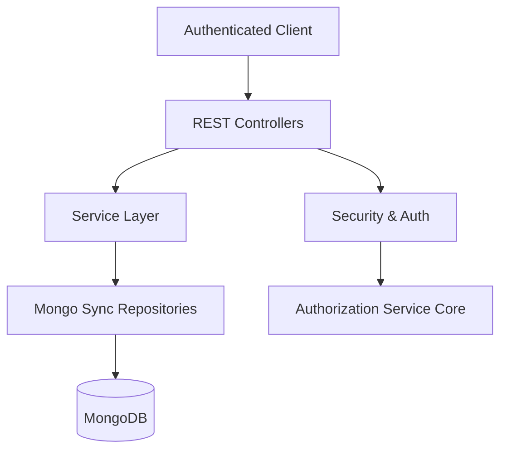
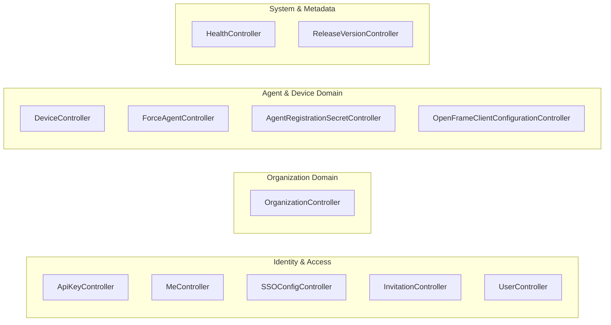
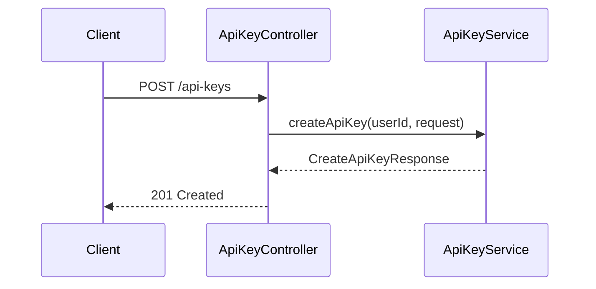
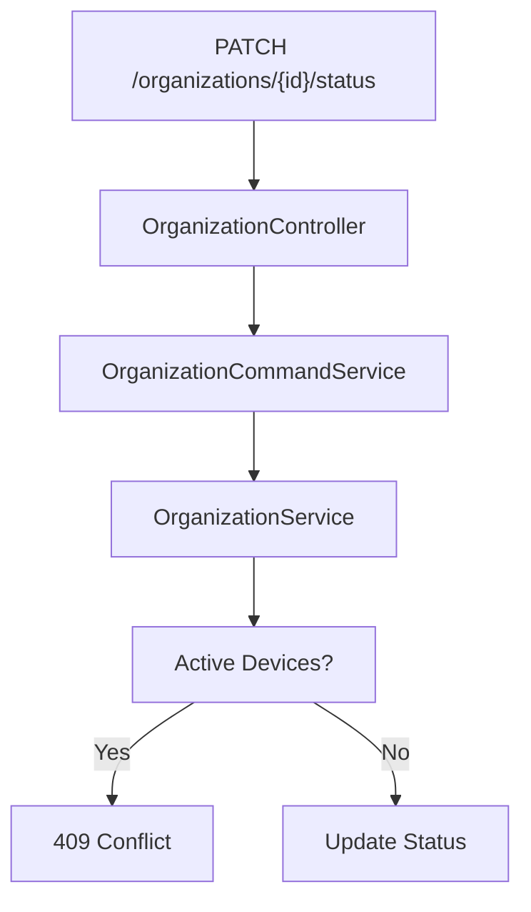
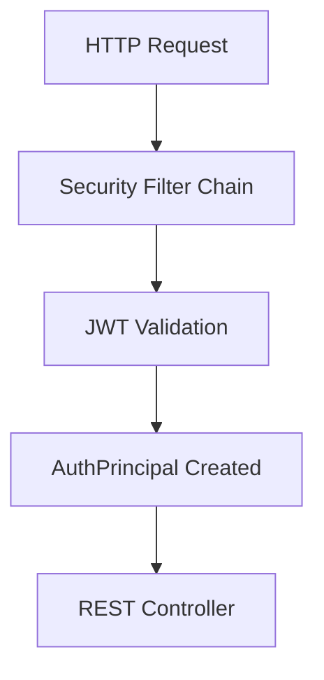

# Api Service Core Rest Controllers

## Overview

The **Api Service Core Rest Controllers** module exposes the internal REST API surface of the OpenFrame platform. It acts as the HTTP entry point for authenticated users, internal services, and administrative workflows.

This module is responsible for:

- Exposing REST endpoints using Spring Web (`@RestController`)
- Delegating business logic to service-layer components
- Enforcing authentication and authorization through Spring Security
- Translating service results into API DTO responses
- Handling HTTP status codes and error mapping

Unlike the public-facing API in the external REST API module, this module focuses on internal platform operations and authenticated administrative actions.

---

## Architectural Context

The Api Service Core Rest Controllers module sits between the security/configuration layer and the domain/service layer.


```mermaid
flowchart TD
    Client["Authenticated Client"] --> Controller["REST Controllers"]
    Controller --> ServiceLayer["Service Layer"]
    ServiceLayer --> RepositoryLayer["Mongo Sync Repositories"]
    RepositoryLayer --> Database[("MongoDB")]

    Controller --> SecurityLayer["Security & Auth"]
    SecurityLayer --> AuthService["Authorization Service Core"]
```

### Related Modules

- Security and configuration: [Api Service Core Config And Security](../api-service-core-config-and-security/api-service-core-config-and-security.md)
- GraphQL endpoints: [Api Service Core Graphql](../api-service-core-graphql/api-service-core-graphql.md)
- Data access layer: [Data Mongo Sync Repositories](../data-mongo-sync-repositories/data-mongo-sync-repositories.md)
- Authorization server: [Authorization Service Core](../authorization-service-core/authorization-service-core.md)

---

## Controller Landscape

The module contains the following controllers:

- AgentRegistrationSecretController
- ApiKeyController
- DeviceController
- ForceAgentController
- HealthController
- InvitationController
- MeController
- OpenFrameClientConfigurationController
- OrganizationController
- ReleaseVersionController
- SSOConfigController
- UserController

Each controller is focused on a specific domain boundary and delegates logic to corresponding service classes.

---

## High-Level Endpoint Grouping


```mermaid
flowchart LR
    subgraph Identity["Identity & Access"]
        ApiKeyCtrl["ApiKeyController"]
        MeCtrl["MeController"]
        SsoCtrl["SSOConfigController"]
        InvitationCtrl["InvitationController"]
        UserCtrl["UserController"]
    end

    subgraph OrganizationDomain["Organization Domain"]
        OrgCtrl["OrganizationController"]
    end

    subgraph AgentDomain["Agent & Device Domain"]
        DeviceCtrl["DeviceController"]
        ForceCtrl["ForceAgentController"]
        SecretCtrl["AgentRegistrationSecretController"]
        ClientConfigCtrl["OpenFrameClientConfigurationController"]
    end

    subgraph SystemDomain["System & Metadata"]
        HealthCtrl["HealthController"]
        ReleaseCtrl["ReleaseVersionController"]
    end
```

---

# Controller Details

## 1. AgentRegistrationSecretController

**Base Path:** `/agent/registration-secret`

Responsible for managing agent registration secrets used when onboarding new agents.

### Endpoints

- `GET /active` – Retrieve the currently active secret
- `GET /` – List all secrets
- `POST /generate` – Generate a new registration secret (201 Created)

### Responsibilities

- Delegates to `AgentRegistrationSecretService`
- Provides rotation mechanism for agent bootstrap security
- Logs secret generation events

---

## 2. ApiKeyController

**Base Path:** `/api-keys`

Manages API keys scoped to the authenticated user.

### Security Model

- Uses `@AuthenticationPrincipal AuthPrincipal`
- All operations are user-scoped
- Prevents cross-user key access

### Endpoints

- `GET /` – List API keys for current user
- `POST /` – Create new API key (201 Created)
- `GET /{keyId}` – Retrieve single key
- `PUT /{keyId}` – Update key metadata
- `DELETE /{keyId}` – Delete key (204 No Content)
- `POST /{keyId}/regenerate` – Regenerate secret value

### Interaction Flow


```mermaid
sequenceDiagram
    participant Client
    participant ApiKeyController
    participant ApiKeyService

    Client->>ApiKeyController: POST /api-keys
    ApiKeyController->>ApiKeyService: createApiKey(userId, request)
    ApiKeyService-->>ApiKeyController: CreateApiKeyResponse
    ApiKeyController-->>Client: 201 Created
```

---

## 3. DeviceController

**Base Path:** `/devices`

Provides internal endpoints for device state management.

### Endpoint

- `PATCH /{machineId}` – Update device status

### Responsibilities

- Delegates to `DeviceService`
- Designed for internal system integration
- Used by agents or internal workflows to update lifecycle status

---

## 4. ForceAgentController

**Base Path:** `/force`

Handles forced installation, update, and reinstallation of agents and tool agents.

### Functional Areas

- Tool agent installation
- Tool agent update
- Client update
- Bulk operations
- Reinstallation flows

### Example Operations

- `POST /tool-agent/install`
- `POST /client/update`
- `POST /tool-agent/update`
- `POST /tool-agent/install/all`
- `POST /tool-agent/reinstall`

### Delegated Services

- `ForceToolInstallationService`
- `ForceClientUpdateService`
- `ForceToolAgentUpdateService`

These operations often result in asynchronous downstream effects handled by stream processing or agent services.

---

## 5. HealthController

**Path:** `/health`

Provides a simple liveness endpoint.

### Behavior

- Logs health check invocation
- Returns HTTP 200 with body `OK`

Used by:

- Load balancers
- Kubernetes liveness/readiness probes
- Monitoring systems

---

## 6. InvitationController

**Base Path:** `/invitations`

Manages user invitations within a tenant.

### Endpoints

- `POST /` – Create invitation
- `GET /` – Paginated list
- `DELETE /{id}` – Revoke invitation
- `POST /{id}/resend` – Resend invitation

### Responsibilities

- Delegates to `InvitationService`
- Supports paging via `page` and `size` parameters
- Returns structured page response DTO

Closely related to registration flows in the Authorization Service Core.

---

## 7. MeController

**Path:** `/me`

Returns information about the currently authenticated user.

### Behavior

- Extracts `AuthPrincipal`
- Returns 401 if unauthenticated
- Provides user identity, roles, and tenant context

### Example Response Structure

```text
{
  "authenticated": true,
  "user": {
    "id": "userId",
    "email": "user@example.com",
    "displayName": "User Name",
    "roles": ["ADMIN"],
    "tenantId": "tenant-123"
  }
}
```

---

## 8. OpenFrameClientConfigurationController

**Base Path:** `/openframe-client/configuration`

Exposes client configuration settings required by OpenFrame agents or UI clients.

### Endpoint

- `GET /` – Retrieve client configuration

Delegates to `OpenFrameClientConfigurationQueryService`.

---

## 9. OrganizationController

**Base Path:** `/organizations`

Handles mutation operations for organizations.

> Read operations are handled by the external API module.

### Endpoints

- `POST /` – Create organization
- `PUT /{id}` – Update organization
- `GET /{id}/can-archive` – Check archive eligibility
- `PATCH /{id}/status` – Update status

### Design Characteristics

- Uses `OrganizationCommandService` for mutations
- Uses `OrganizationService` for domain validation
- Maps domain entities to DTOs via `OrganizationMapper`
- Converts `IllegalArgumentException` to HTTP 404

### Archive Validation Flow


```mermaid
flowchart TD
    Request["PATCH /organizations/{id}/status"] --> Controller["OrganizationController"]
    Controller --> CommandService["OrganizationCommandService"]
    CommandService --> DomainService["OrganizationService"]
    DomainService --> Check["Active Devices?"]
    Check -->|"Yes"| Conflict["409 Conflict"]
    Check -->|"No"| Update["Update Status"]
```

---

## 10. ReleaseVersionController

**Base Path:** `/release-version`

Provides metadata about the current release version.

### Endpoint

- `GET /` – Retrieve current release version

### Behavior

- Delegates to `ReleaseVersionQueryService`
- Returns 404 if no version is available
- Wraps response in `ResponseEntity`

---

## 11. SSOConfigController

**Base Path:** `/sso`

Manages Single Sign-On provider configurations.

### Endpoint Categories

**Provider Discovery**
- `GET /providers` – Enabled providers
- `GET /providers/available` – All supported providers

**Configuration Management**
- `GET /{provider}` – Retrieve configuration
- `POST /{provider}` – Create configuration
- `PUT /{provider}` – Update configuration
- `PATCH /{provider}/toggle` – Enable/disable
- `DELETE /{provider}` – Remove configuration

### Responsibilities

- Delegates to `SSOConfigService`
- Supports strategy-based provider abstraction
- Used by login UI and administrative dashboards

---

## 12. UserController

**Base Path:** `/users`

Manages tenant-scoped user operations.

### Endpoints

- `GET /` – Paginated list
- `GET /{id}` – Retrieve user
- `PUT /{id}` – Update user
- `DELETE /{id}` – Soft delete user

### Characteristics

- Delegates to `UserService`
- Converts domain exceptions into HTTP 404
- Requires `AuthPrincipal` for delete auditing

---

# Security Integration

Controllers rely on Spring Security configuration defined in the configuration module. Authentication is enforced before controller execution.


```mermaid
flowchart TD
    Request["HTTP Request"] --> FilterChain["Security Filter Chain"]
    FilterChain --> JwtValidation["JWT Validation"]
    JwtValidation --> Principal["AuthPrincipal Created"]
    Principal --> Controller["REST Controller"]
```

The `AuthPrincipal` object provides:

- User ID
- Email
- Display name
- Roles
- Tenant ID

---

# Error Handling Strategy

Common patterns used across controllers:

- `@ResponseStatus` for explicit status mapping
- `ResponseStatusException` for domain error translation
- Automatic validation via `@Valid`
- 404 mapping for missing entities
- 409 conflict for invalid state transitions

---

# Design Principles

1. Thin Controllers – Business logic delegated to services
2. Clear Domain Separation – Each controller maps to a bounded context
3. Tenant-Aware – All operations respect tenant isolation
4. Explicit HTTP Semantics – Correct use of 200, 201, 204, 404, 409
5. DTO-Based API Contracts – No direct exposure of domain entities

---

# Summary

The **Api Service Core Rest Controllers** module defines the internal REST API surface for OpenFrame. It bridges authenticated HTTP requests to the underlying service and domain layers while enforcing security, tenant isolation, and consistent HTTP semantics.

It works closely with:

- Security configuration and authentication modules
- Domain services and repositories
- GraphQL and external REST modules
- Authorization server for identity workflows

This module is a foundational part of the platform’s internal API architecture and serves as the operational backbone for administrative and agent-related workflows.
