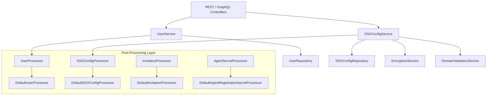
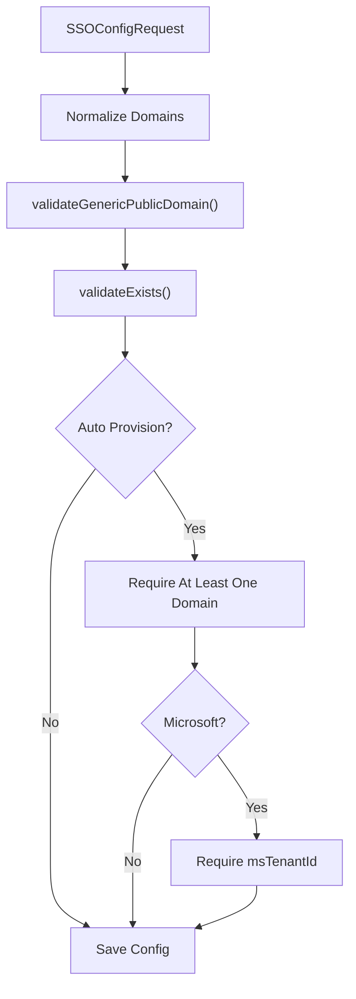
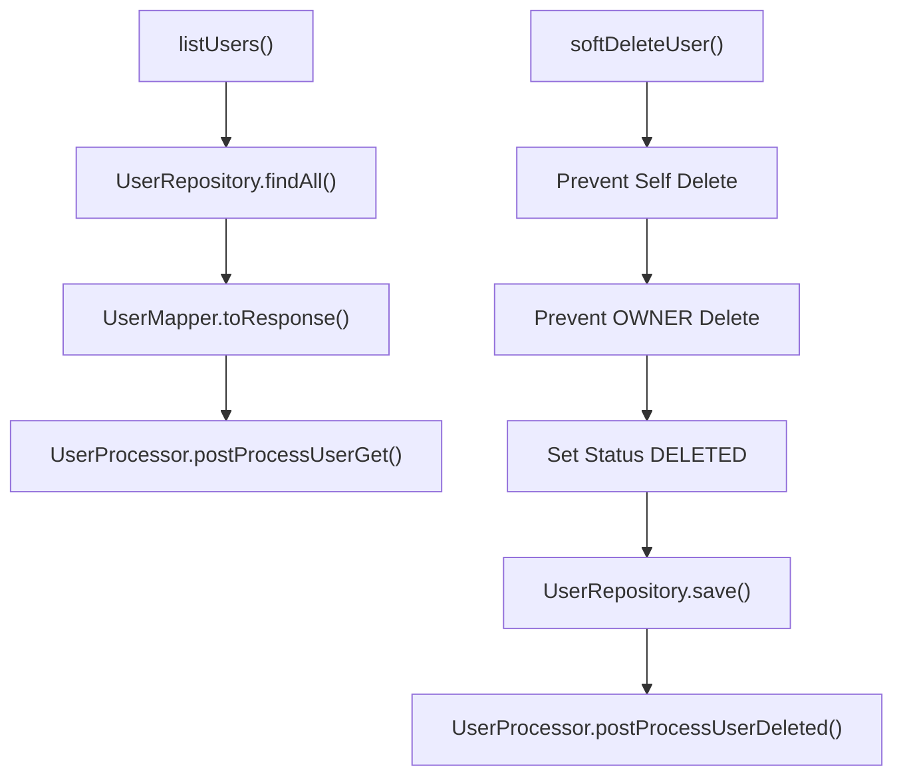
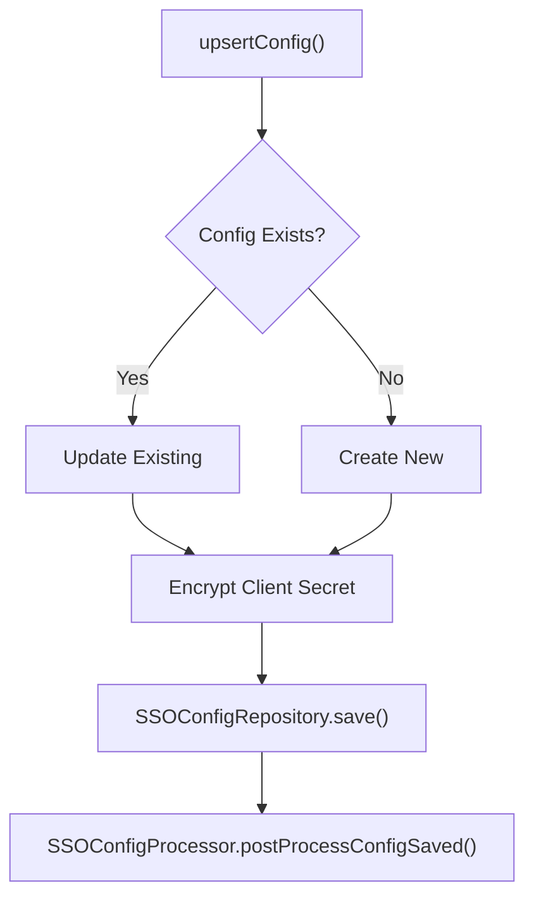

# Api Service Core User Sso Services And Processors

## Overview

The **Api Service Core User Sso Services And Processors** module encapsulates user management, Single Sign-On (SSO) configuration, domain validation, and extensible post-processing hooks for user- and identity-related workflows inside the API Service Core.

It acts as the orchestration layer between:

- REST and GraphQL controllers in Api Service Core
- Mongo persistence (User, Invitation, SSOConfig, AgentRegistrationSecret)
- Encryption and domain validation services
- External Authorization Service Core (SSO, tenant, OAuth flows)

This module is designed for **extensibility**. All major lifecycle events (user updates, SSO config changes, invitation creation, agent secret generation) are delegated to pluggable processor interfaces with default no-op implementations.

---

## High-Level Architecture

### Key Responsibilities

- Manage users (query, update, soft delete)
- Manage SSO provider configuration (CRUD + enable/disable)
- Enforce domain validation rules for auto-provisioned SSO
- Provide extension points for SaaS or enterprise overrides

---

## Sub-Modules

To keep responsibilities clean and extensible, this module can be logically divided into two sub-modules:

### 1. Services

Core business services handling user and SSO logic.

👉 See: [Services](api-service-core-user-sso-services-and-processors/services/services.md)

### 2. Processors

Lifecycle hooks triggered after core operations (update, delete, toggle, create).

👉 See: [Processors](api-service-core-user-sso-services-and-processors/processors/processors.md)

---

## Domain Validation Strategy

Domain validation plays a critical role in SSO auto-provisioning.

### DefaultDomainExistenceValidator

The default implementation always returns `false`, meaning:

- OSS deployments do not block SSO domain configuration
- SaaS deployments can override with a stricter validator

This is implemented using `@ConditionalOnMissingBean`, ensuring easy replacement.

---

## User Lifecycle

### Soft Delete Rules

- Users cannot delete themselves
- OWNER role accounts cannot be deleted
- Deletion sets status to `DELETED` instead of removing the record

This preserves referential integrity and audit consistency.

---

## SSO Configuration Lifecycle

### Important Behaviors

- Client secrets are encrypted before persistence
- Decryption occurs only when returning editable admin configuration
- Enabling/disabling triggers processor hooks
- Deletion triggers processor hooks

---

## Extensibility Model

All processors use:

- `@Component`
- `@ConditionalOnMissingBean`

This allows:

- OSS default no-op behavior
- SaaS override with custom implementations
- Multi-tenant side effects (auditing, events, provisioning, sync)

This pattern ensures the module is both **framework-level stable** and **deployment-level customizable**.

---

## Integration With Other Modules

This module integrates closely with:

- Authorization Service Core (SSO flows, tenant registration, OAuth)
- Data Mongo Domain Model (User, Invitation, SSOConfig documents)
- Api Service Core REST Controllers (UserController, SSOConfigController)

It does not implement OAuth flows directly — it manages configuration and lifecycle hooks that support those flows.

---

## Summary

The **Api Service Core User Sso Services And Processors** module is the identity orchestration layer of the API service. It:

- Centralizes user management
- Governs SSO provider configuration
- Enforces domain safety rules
- Provides structured extension hooks
- Enables SaaS override without modifying core logic

Its clean separation between services and processors makes it highly maintainable and enterprise-ready.