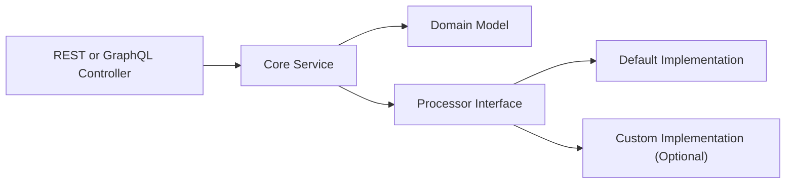
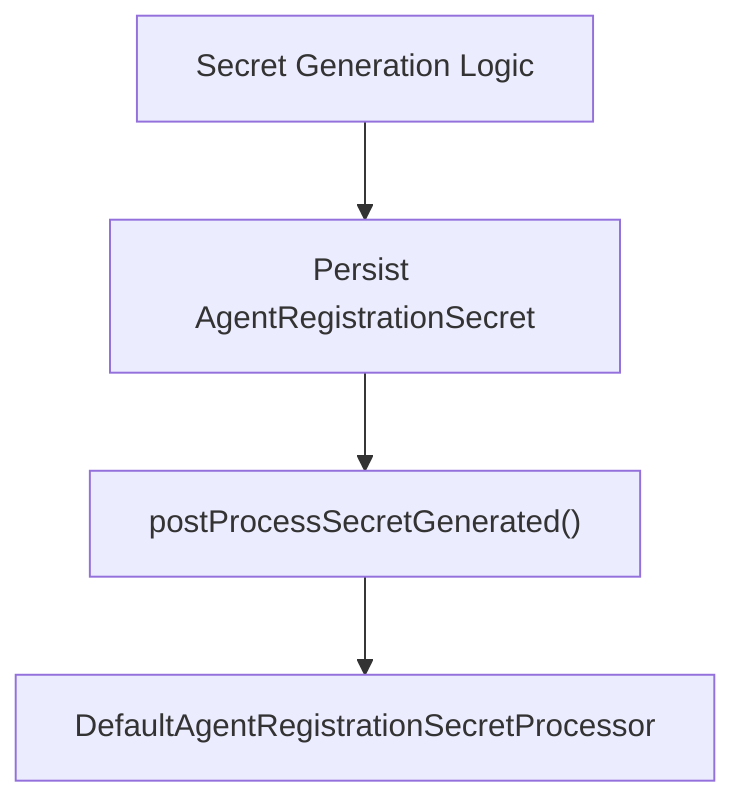
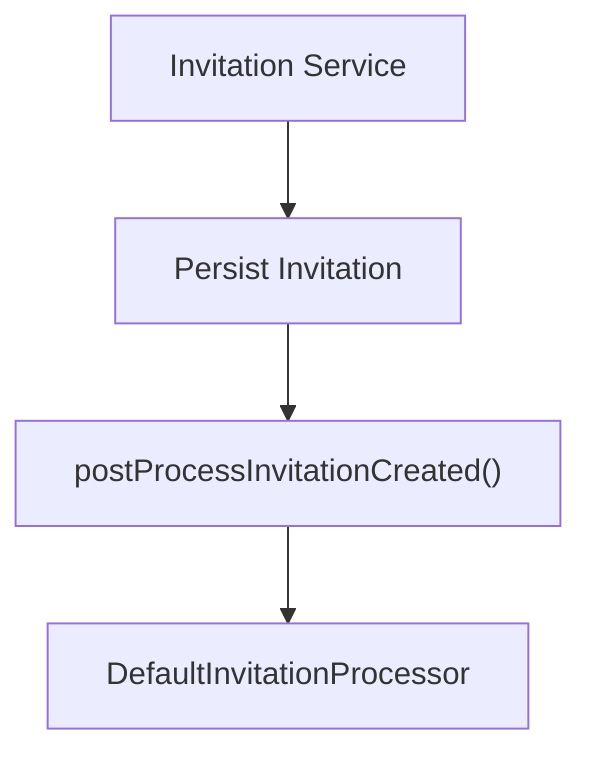
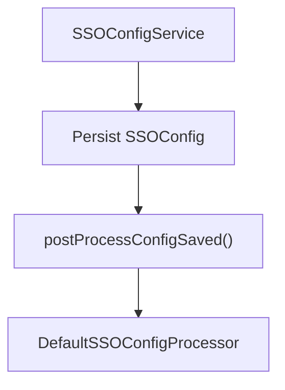
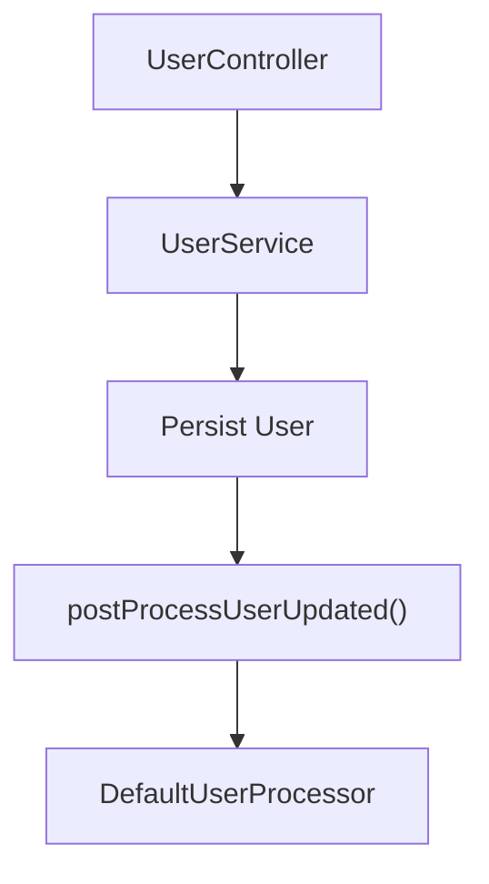
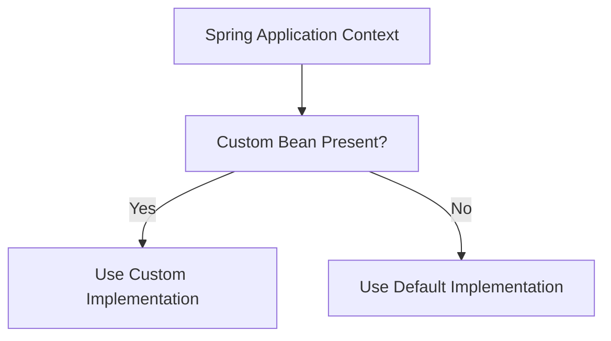
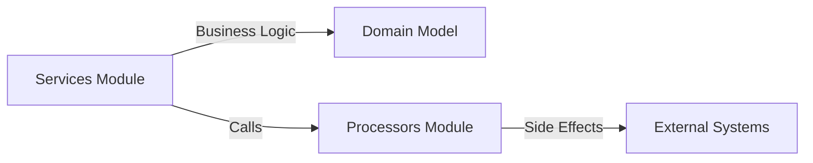
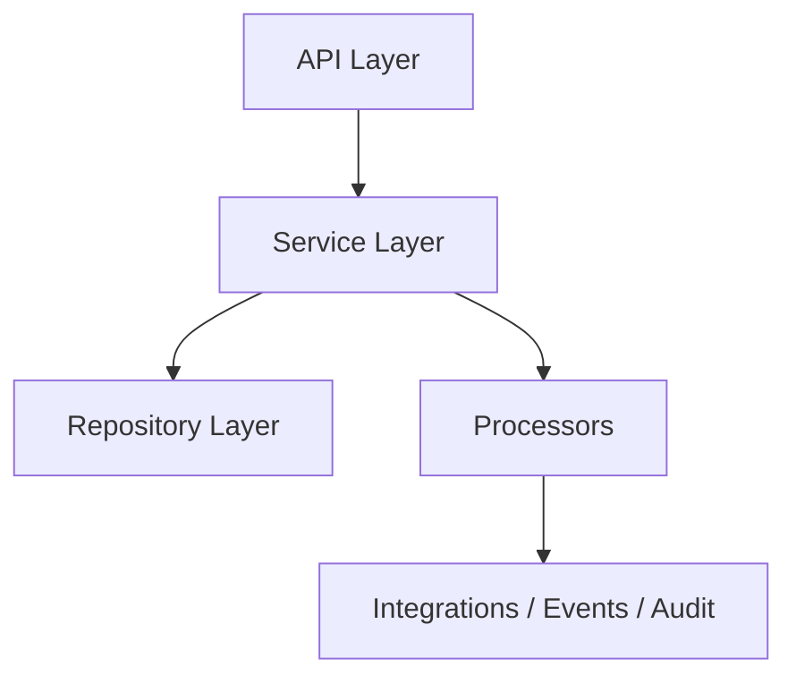

# Processors

The **Processors** module provides extension points for domain-specific post-processing logic within the API Service Core, specifically around user management, invitations, SSO configuration, and agent registration secrets.

In OpenFrame’s modular architecture, Processors act as **hooks** that execute after core service operations complete. By default, they provide no-op (logging-only) implementations, but they are designed to be overridden in custom or enterprise deployments.

This module lives under the *API Service Core – User, SSO Services and Processors* domain and works closely with the sibling Services module.

---

## 1. Purpose and Design Philosophy

The Processors module exists to:

- Provide **post-operation hooks** for core domain actions
- Enable **custom business logic injection** without modifying core services
- Maintain **clean separation of concerns** between service logic and side effects
- Support OSS deployments with safe default behavior

All default implementations are annotated with:

- `@Component`
- `@ConditionalOnMissingBean`

This ensures:

- The default implementation is used in OSS environments
- Custom implementations can transparently override the default behavior

---

## 2. High-Level Architecture

The Processors module sits between:

- Core domain services (UserService, SSOConfigService, etc.)
- Downstream side effects (notifications, audit, integrations, etc.)

### Key Characteristics

- Services remain pure and focused on business rules
- Processors encapsulate side effects
- Spring’s conditional bean loading determines the active implementation

---

## 3. Core Components

The Processors module includes four default implementations:

- DefaultAgentRegistrationSecretProcessor  
- DefaultInvitationProcessor  
- DefaultSSOConfigProcessor  
- DefaultUserProcessor

Each implements its respective processor interface and logs events by default.

---

## 4. Agent Registration Secret Processing

### Class

`DefaultAgentRegistrationSecretProcessor`

### Responsibilities

- Post-process generated agent registration secrets
- Post-process deactivated secrets
- Provide safe logging in OSS mode

### Interaction Flow

### Extension Use Cases

A custom implementation may:

- Push secrets to an external vault
- Emit audit events
- Trigger management workflows
- Notify external systems

By default, only debug logging is performed.

---

## 5. Invitation Processing

### Class

`DefaultInvitationProcessor`

### Responsibilities

- Post-process invitation creation
- Post-process invitation revocation

### Flow

### Typical Customization Scenarios

A custom processor may:

- Send email notifications
- Publish events to Kafka or NATS
- Integrate with external identity providers
- Trigger onboarding workflows

The default implementation logs metadata such as invitation ID and email.

---

## 6. SSO Configuration Processing

### Class

`DefaultSSOConfigProcessor`

### Responsibilities

- Post-process SSO config save
- Post-process SSO config deletion
- Post-process SSO config toggle (enable/disable)

### Flow

### Integration Context

SSO configuration impacts:

- OAuth/OIDC flows
- Tenant authentication
- Authorization Server behavior

A custom processor could:

- Register dynamic OAuth clients
- Synchronize configuration with external IdPs
- Invalidate authentication caches

The default implementation performs debug logging only.

---

## 7. User Processing

### Class

`DefaultUserProcessor`

### Responsibilities

- Post-process user deletion
- Post-process user updates
- Post-process user fetch (single)
- Post-process user fetch (paged)

### Flow Example: User Update

### Data Types Involved

- User (Mongo domain model)
- UserResponse (API DTO)
- UserPageResponse (paginated DTO)

### Customization Scenarios

A custom implementation might:

- Emit audit logs
- Synchronize user state with external systems
- Trigger deprovisioning in downstream tools
- Enforce domain-level policies

The default behavior is debug-level logging.

---

## 8. Conditional Bean Strategy

All default processors use:

- `@ConditionalOnMissingBean(value = Interface.class, ignored = DefaultImpl.class)`

This enables the following resolution model:

This pattern ensures:

- Clean override without modifying core modules
- Backward compatibility
- Pluggable architecture for enterprise extensions

---

## 9. Relationship to Services Module

The Processors module complements the Services module located at:

- [Services](../services/services.md)

### Responsibility Split

- Services handle validation, persistence, and domain rules
- Processors handle post-operation side effects

This clear boundary keeps the architecture maintainable and extensible.

---

## 10. How Processors Fit Into the Overall System

Within the broader OpenFrame platform:

- Controllers (REST / GraphQL) invoke Services
- Services mutate domain entities
- Processors execute post-commit logic
- External systems (notifications, auth server, integrations) react

This modular layering:

- Prevents service bloat
- Encourages testability
- Enables OSS and enterprise feature differentiation

---

## 11. Summary

The **Processors** module provides structured extension points for:

- Agent registration secrets
- Invitations
- SSO configuration
- User lifecycle operations

By default, implementations are safe and logging-only. In advanced deployments, these processors become powerful integration points that allow OpenFrame to plug into broader ecosystems without altering core service logic.

The design promotes:

- Clean architecture
- Pluggability
- Multi-tenant extensibility
- Enterprise customization without forking core modules
