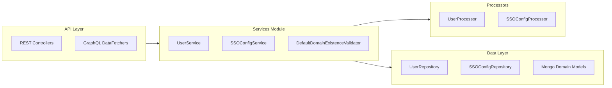
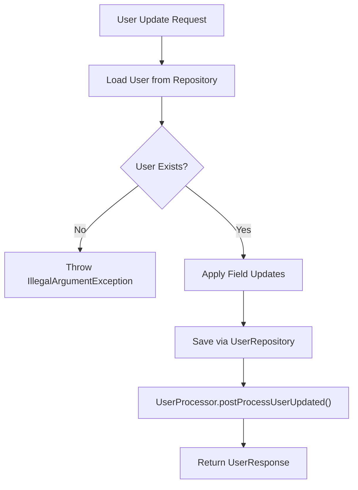
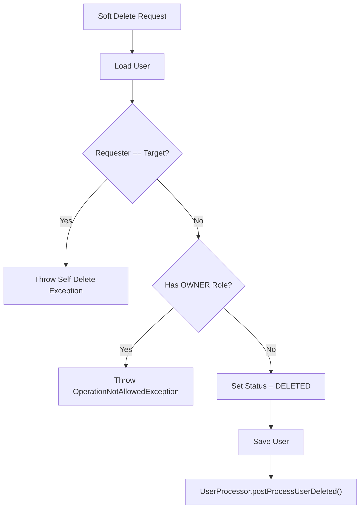
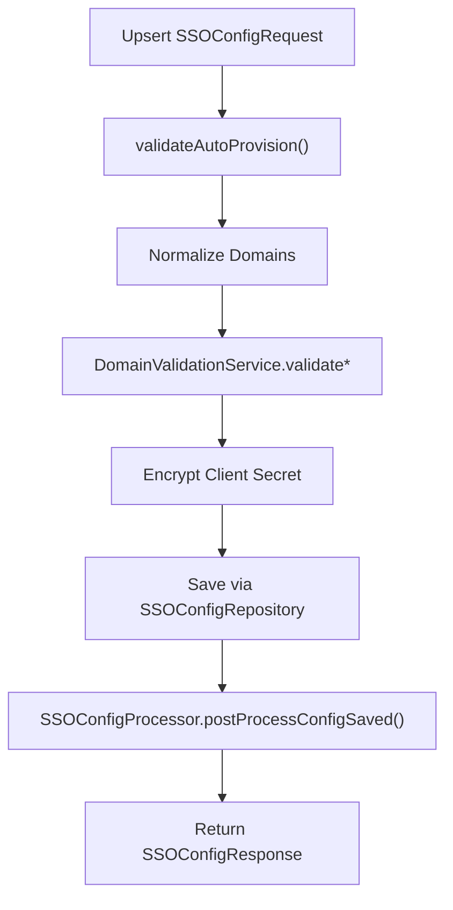
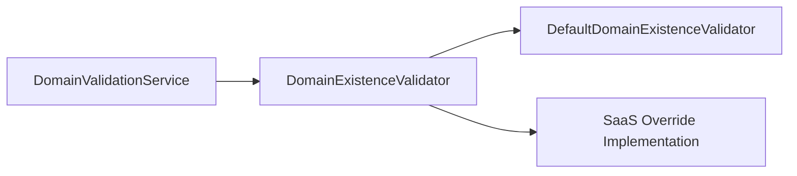
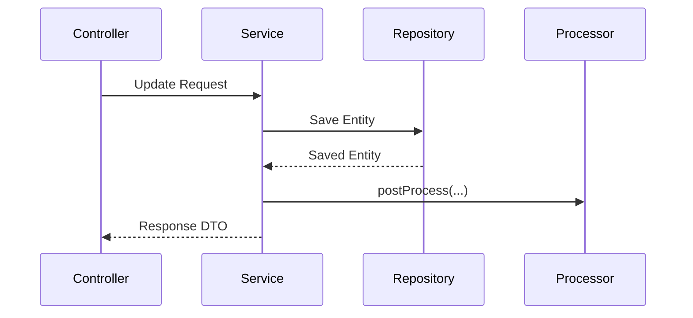
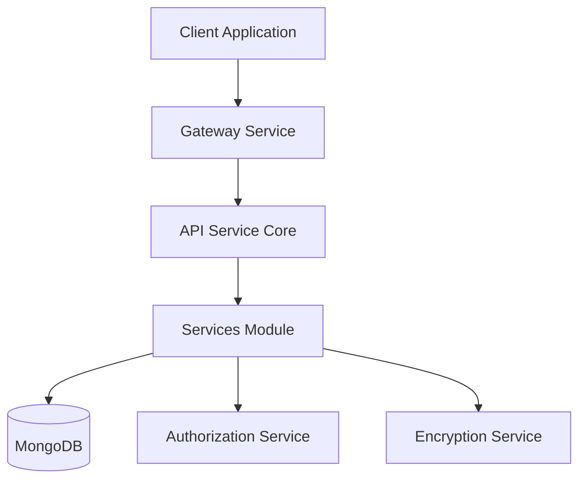

# Services

The **Services** module contains the core application services responsible for user management, Single Sign-On (SSO) configuration, and domain validation within the OpenFrame API Service Core.

These services sit between controllers (REST and GraphQL) and the data layer, encapsulating business logic, validation, orchestration, and post-processing hooks. They integrate with repositories, processors, mappers, encryption utilities, and tenant/domain validation infrastructure.

---

## 1. Module Responsibilities

The Services module provides:

- ✅ User lifecycle management (read, update, soft delete)
- ✅ SSO configuration management (CRUD, toggle, validation)
- ✅ Domain validation extension point (SaaS overrides)
- ✅ Post-processing hooks via processors
- ✅ Secure handling of secrets (via encryption service)

Core components:

- `DefaultDomainExistenceValidator`
- `SSOConfigService`
- `UserService`

---

## 2. Architectural Position

The Services module operates inside the API Service Core and collaborates with multiple surrounding modules.



### Key Relationships

- Controllers invoke Services for business operations.
- Services delegate side-effects to Processors.
- Services persist and query through repositories.
- Domain validation is pluggable and environment-aware.

---

## 3. UserService

`UserService` encapsulates all user-related domain logic for the API layer.

### 3.1 Responsibilities

- Retrieve users by ID or email
- Paginated listing
- Bulk fetch by IDs
- Update profile fields
- Soft delete users with safety checks
- Trigger lifecycle processors

### 3.2 Core Dependencies

- `UserRepository`
- `UserMapper`
- `UserProcessor`
- Mongo `User` document

### 3.3 User Lifecycle Flow



### 3.4 Soft Delete Safety Rules

Soft deletion includes strict business constraints:

- A user **cannot delete themselves** → `UserSelfDeleteNotAllowedException`
- A user with `OWNER` role cannot be deleted → `OperationNotAllowedException`
- Deletion sets status to `DELETED` instead of removing the document



This ensures organizational integrity and prevents accidental tenant lockout.

---

## 4. SSOConfigService

`SSOConfigService` manages Single Sign-On provider configuration for the tenant.

### 4.1 Responsibilities

- List enabled providers
- Return editable configuration (including decrypted secret)
- Create or update provider config (upsert)
- Toggle provider enabled state
- Delete provider configuration
- Validate domain and provisioning constraints
- Trigger SSO lifecycle processors

### 4.2 Core Dependencies

- `SSOConfigRepository`
- `EncryptionService`
- `SSOProperties`
- `SSOConfigProcessor`
- `SSOConfigMapper`
- `DomainValidationService`

### 4.3 SSO Configuration Flow



### 4.4 Domain Validation Logic

When `autoProvisionUsers` is enabled:

- ✅ `allowedDomains` must not be empty
- ✅ Domains are normalized (trimmed, lowercased, deduplicated)
- ✅ Public/generic domains are rejected
- ✅ Domains must exist (pluggable validator)
- ✅ Microsoft provider requires `msTenantId` when auto-provisioning

This ensures secure enterprise SSO onboarding.

### 4.5 Secure Secret Handling

- Client secrets are encrypted before persistence.
- Decryption occurs only when returning editable configuration.
- Encryption is delegated to `EncryptionService`.

---

## 5. DefaultDomainExistenceValidator

`DefaultDomainExistenceValidator` provides the baseline implementation for domain existence checks.

### 5.1 Behavior

```java
public boolean anyExists(List<String> domains) {
    return false;
}
```

### 5.2 Design Purpose

- Acts as a **non-blocking default** implementation.
- Enabled via `@ConditionalOnMissingBean`.
- Allows SaaS or enterprise deployments to override with a stricter validator.



This pattern supports multi-tenant SaaS deployments where domain ownership must be verified.

---

## 6. Cross-Cutting Patterns

### 6.1 Processor Hook Pattern

Services delegate side effects to processors after core operations:

- `postProcessUserGet`
- `postProcessUserUpdated`
- `postProcessUserDeleted`
- `postProcessConfigSaved`
- `postProcessConfigDeleted`
- `postProcessConfigToggled`

This keeps services focused on:

- Validation
- Persistence
- Mapping

While processors handle:

- Audit logging
- External sync
- Notifications
- Policy enforcement



---

## 7. Integration with Other Modules

The Services module integrates with:

- API Service Core Controllers (REST & GraphQL)
- Mongo domain and repository modules
- Security and OAuth infrastructure
- Authorization Service for SSO flows
- Encryption and crypto services

High-level integration view:



---

## 8. Design Principles

The Services module follows these architectural principles:

- ✅ Clear separation of concerns
- ✅ Stateless service layer
- ✅ Repository-driven persistence
- ✅ DTO ↔ Entity mapping abstraction
- ✅ Post-operation extension hooks
- ✅ Pluggable domain validation
- ✅ Secure secret handling
- ✅ Defensive business rule enforcement

---

# Summary

The **Services** module forms the business logic core of user and SSO management within OpenFrame’s API Service Core. It ensures:

- Secure and validated SSO onboarding
- Safe user lifecycle operations
- Tenant-aware domain validation
- Extensible post-processing
- Clean separation between API, business logic, and persistence layers

It acts as the orchestration layer that binds controllers, repositories, processors, and security infrastructure into a cohesive, enterprise-ready service architecture.