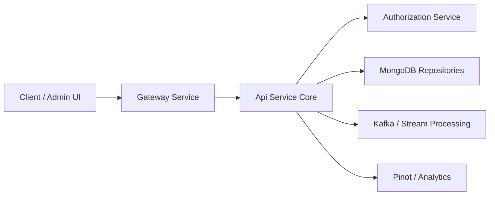
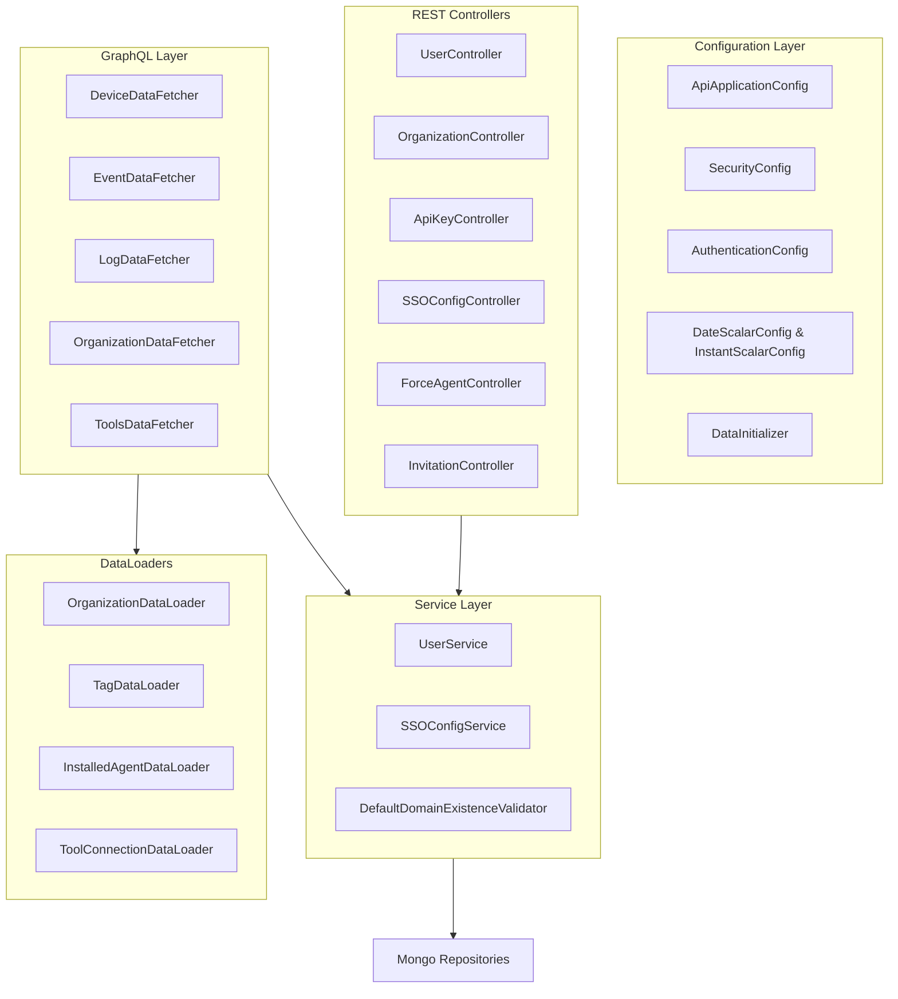
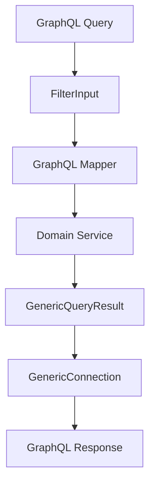
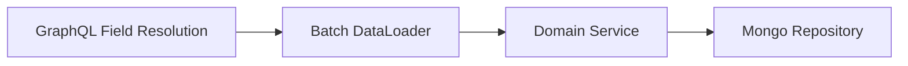

# Api Service Core

## Overview

The **Api Service Core** module is the central application layer of the OpenFrame platform. It exposes internal REST endpoints and a GraphQL API for managing users, organizations, devices, tools, audit logs, SSO configuration, invitations, API keys, and force-update operations.

This module acts as:

- The primary business API for internal services and administrative clients
- The GraphQL aggregation layer over MongoDB-backed domain models
- The integration point between security (JWT/OAuth2), data access (MongoDB, Kafka, Pinot), and platform services
- The command/query orchestration layer for user, organization, device, and tool lifecycle operations

Authentication is delegated to the Gateway and Authorization services. Api Service Core operates as a **JWT Resource Server** and focuses on business logic and domain orchestration.

---

## High-Level Responsibilities

Api Service Core is responsible for:

1. Exposing REST endpoints for mutations and operational workflows
2. Providing a GraphQL API with cursor-based pagination
3. Managing SSO provider configuration per tenant
4. Managing API keys for programmatic access
5. Orchestrating device and tool update workflows
6. Managing users and invitations
7. Providing audit log and event querying capabilities
8. Bootstrapping default OAuth clients on startup

---

## Architectural Position

The module sits between the Gateway layer and the Data layer.

### Key Characteristics

- Stateless application layer
- OAuth2 Resource Server (JWT-based)
- GraphQL (Netflix DGS) for read-heavy domains
- REST for commands and operational endpoints
- DataLoader usage to prevent N+1 query issues
- Extensible post-processors for domain hooks

---

# Internal Architecture

The internal structure of Api Service Core can be grouped into the following layers:

---

# Configuration Layer

## ApiApplicationConfig

Provides shared beans such as `PasswordEncoder` using BCrypt. Ensures consistent password hashing across services.

## SecurityConfig

Configures the module as a minimal OAuth2 Resource Server.

Key points:

- Uses `JwtIssuerAuthenticationManagerResolver`
- Caches `JwtAuthenticationProvider` instances via Caffeine
- Disables CSRF
- Permits all requests (authorization handled upstream)

JWT decoders are dynamically resolved by issuer and cached using configurable TTL and size.

## AuthenticationConfig

Registers a custom `AuthPrincipalArgumentResolver` so controllers can inject:

- `@AuthenticationPrincipal AuthPrincipal`

This enables access to:

- User ID
- Email
- Roles
- Tenant ID

## GraphQL Scalar Configuration

- `DateScalarConfig` supports `yyyy-MM-dd`
- `InstantScalarConfig` supports ISO-8601 timestamps

These scalars ensure consistent input parsing and serialization in GraphQL.

## DataInitializer

Runs at startup via `CommandLineRunner`:

- Reads default OAuth client credentials from environment
- Creates or updates the default OAuth client
- Ensures grant types: `password`, `refresh_token`

This guarantees consistent bootstrap behavior across deployments.

---

# REST Controllers

REST controllers handle command-style operations and administrative endpoints.

## UserController

Supports:

- List users (paginated)
- Get by ID
- Update user
- Soft delete user

Business rules:

- Cannot self-delete
- Cannot delete OWNER role
- Uses `UserProcessor` hooks for post-processing

## OrganizationController

Handles:

- Create organization
- Update organization
- Delete organization (409 if linked machines exist)

Read operations are intentionally separated into external-facing modules.

## ApiKeyController

Manages API keys for authenticated users:

- Create
- Regenerate
- Delete
- Update
- Usage statistics exposure

Uses `AuthPrincipal` to enforce ownership scoping.

## SSOConfigController

Provides tenant-level SSO management:

- List enabled providers
- List available providers
- Create/update config
- Toggle enabled
- Delete configuration

Delegates to `SSOConfigService` for validation, encryption, and post-processing.

## ForceAgentController

Handles operational workflows:

- Force tool installation
- Force client update
- Force tool update
- Reinstall operations

These commands typically trigger downstream processing in agent or stream modules.

## InvitationController

Manages:

- Create invitation
- List invitations (paged)
- Revoke invitation
- Resend invitation

Post-processing is extensible via `InvitationProcessor`.

## HealthController

Exposes `/health` endpoint for readiness/liveness probes.

---

# GraphQL Layer

Api Service Core uses Netflix DGS for GraphQL query handling.

## Query Pattern

Each domain follows this pattern:

1. Accept `FilterInput`
2. Convert to internal filter options
3. Apply `CursorPaginationInput`
4. Apply `SortInput`
5. Return `GenericConnection` or `CountedGenericConnection`

### Example Data Flow

## DeviceDataFetcher

Provides:

- Device filtering
- Cursor-based pagination
- Device lookup by machineId
- Field-level resolution via DataLoaders

Resolves:

- Tags
- Tool connections
- Installed agents
- Organization

## EventDataFetcher

Supports:

- Event listing
- Event filtering
- Create event
- Update event

Uses `GenericConnection` for paginated results.

## LogDataFetcher

Provides audit log querying:

- Filtered log listing
- Log details lookup

Works with filter options and pagination criteria.

## OrganizationDataFetcher

Handles organization queries via:

- OrganizationService
- OrganizationQueryService

Returns `CountedGenericConnection` for enriched metadata.

## ToolsDataFetcher

Provides:

- Integrated tool listing
- Tool filter metadata

---

# DataLoader Layer

To prevent N+1 query issues in GraphQL:

- `OrganizationDataLoader`
- `TagDataLoader`
- `InstalledAgentDataLoader`
- `ToolConnectionDataLoader`

These batch-load related entities using repository or service calls.

---

# Service Layer

## UserService

Responsibilities:

- Pagination via Spring Data
- Mapping entities to DTOs
- Soft deletion rules
- Role enforcement
- Post-processing via `UserProcessor`

## SSOConfigService

Core SSO configuration orchestration:

- Encrypt/decrypt client secrets
- Validate allowed domains
- Validate auto-provision rules
- Enforce Microsoft tenant requirements
- Trigger post-processing hooks

Domain validation ensures:

- No generic public domains
- Domains exist (customizable)
- Allowed domains required when auto-provisioning

## DefaultDomainExistenceValidator

Provides default behavior that does not block by domain existence.

Can be overridden in SaaS or enterprise deployments.

---

# Pagination & Connection Model

GraphQL uses connection-based pagination:

- `GenericEdge<T>`
- `GenericConnection<T>`
- `CountedGenericConnection<T>`

Supports:

- Cursor-based pagination
- Total filtered count
- Sorting
- Search

This design supports scalable querying over large datasets.

---

# Security Model

Api Service Core operates as a **resource server only**.

Security responsibilities:

- Accept JWT from Gateway
- Resolve authentication manager by issuer
- Provide `AuthPrincipal` to controllers
- Do not enforce authorization rules internally

Upstream responsibilities (Gateway/Authorization):

- JWT validation
- PermitAll handling
- Token exchange
- Login and SSO flows

---

# Extensibility Points

The module is designed for extensibility:

- `UserProcessor`
- `InvitationProcessor`
- `SSOConfigProcessor`
- `DomainExistenceValidator`

Each has a default implementation and can be overridden via Spring bean replacement.

---

# Operational Concerns

## Startup Initialization

- Default OAuth client creation
- Configuration logging

## Health

- `/health` endpoint
- Integrates with infrastructure probes

## Caching

- JWT provider cache via Caffeine
- Configurable expiration and refresh

---

# Summary

The **Api Service Core** module is the primary internal API engine of OpenFrame. It:

- Exposes REST and GraphQL endpoints
- Coordinates domain services and repositories
- Integrates with security and authorization layers
- Implements cursor-based pagination
- Supports SSO and API key management
- Provides extensible post-processing hooks

It serves as the operational and administrative backbone of the platform, bridging Gateway authentication with persistent domain services and stream-driven infrastructure components.