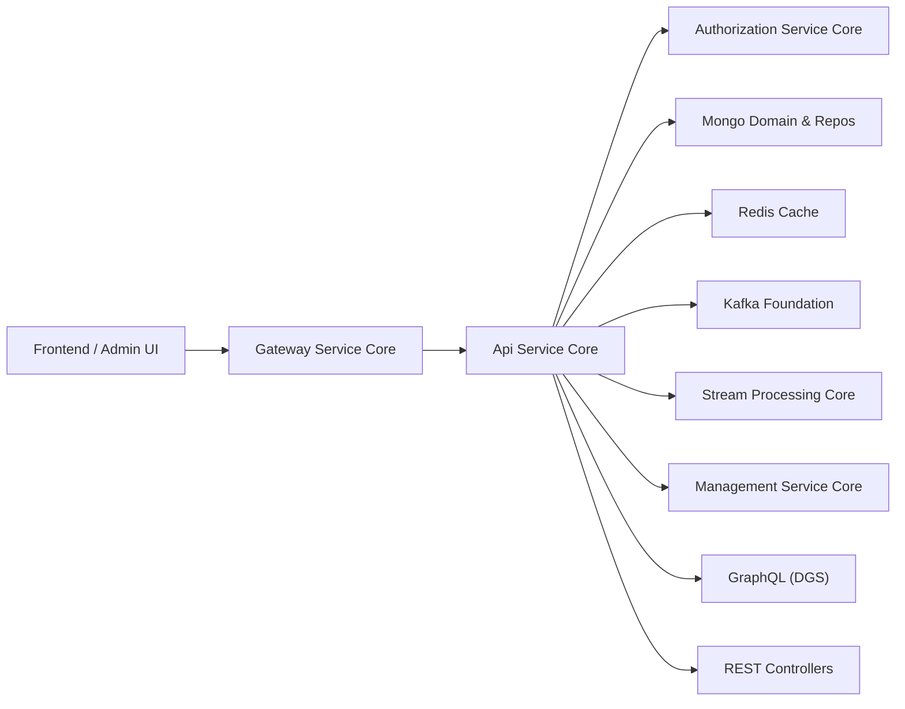
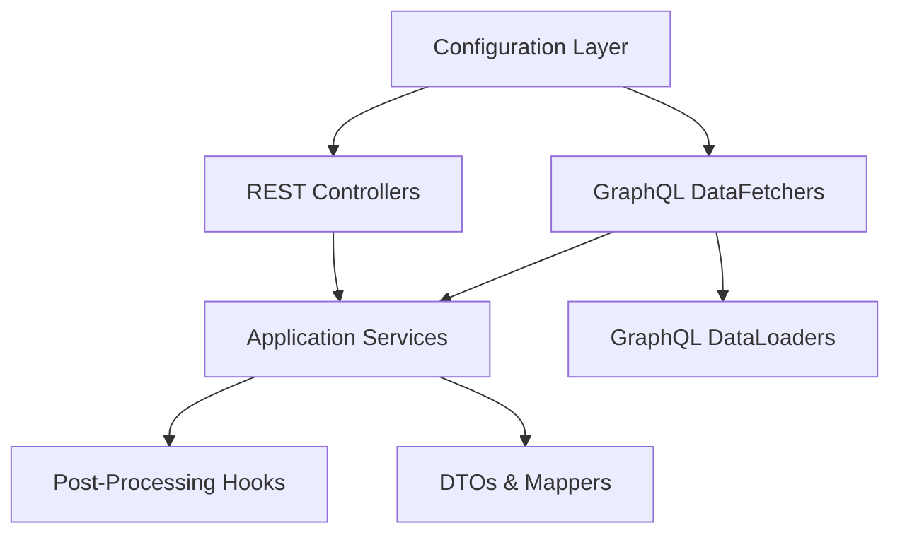
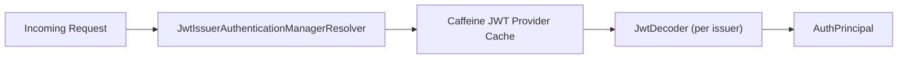
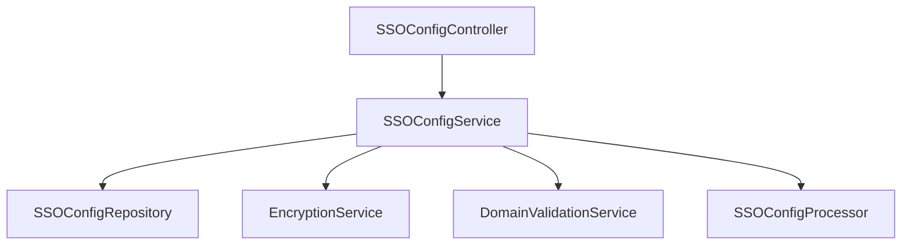
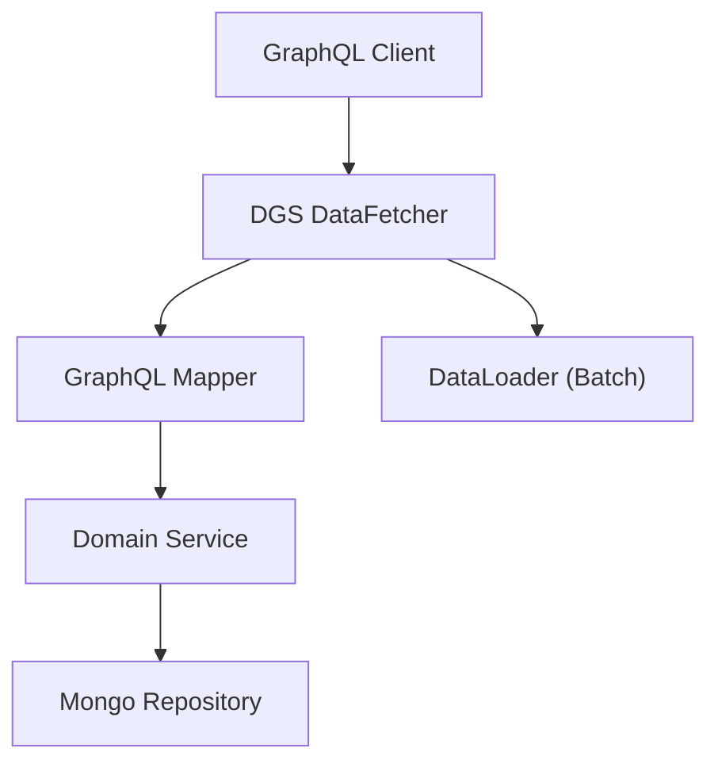
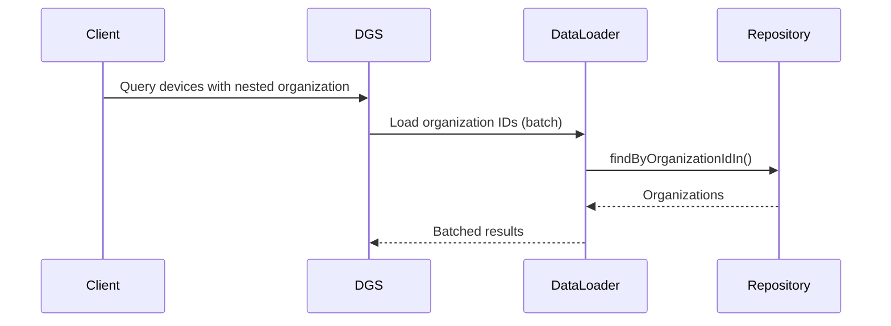
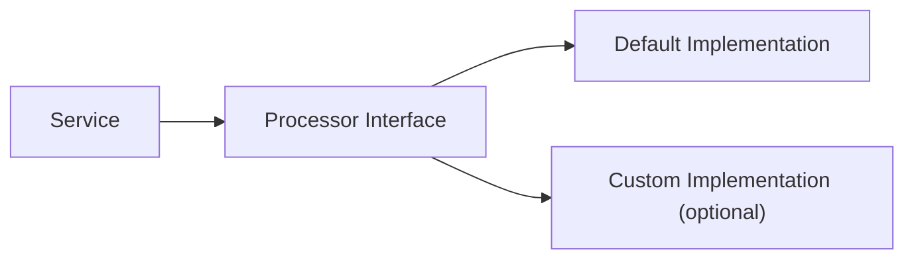

# Api Service Core

## Overview

The **Api Service Core** module is the primary internal API layer of the OpenFrame platform. It exposes REST and GraphQL endpoints for managing:

- Users and invitations
- Organizations
- Devices and installed agents
- Integrated tools and tool connections
- Audit logs and events
- API keys
- SSO configuration
- Client and release metadata

This module acts as the orchestration layer between:

- Presentation (REST + GraphQL via DGS)
- Business services and processors
- Persistence (MongoDB repositories)
- Security (JWT Resource Server)
- Supporting infrastructure (Redis, Kafka, Cassandra/Pinot via other modules)

It is intentionally lightweight in security enforcement because authentication and edge authorization are handled by the Gateway Service Core.

---

## Architectural Position in the Platform

### Responsibilities

- Expose internal REST APIs for mutations and management operations
- Expose GraphQL queries and mutations for complex querying
- Perform DTO mapping and pagination handling
- Coordinate domain services
- Support SSO configuration and validation
- Provide API key management
- Publish force-update and tool-agent operations

---

## High-Level Module Structure

The Api Service Core is organized into the following layers:

---

# 1. Configuration Layer

The configuration package defines the runtime behavior of the service.

## ApiApplicationConfig

- Registers `PasswordEncoder` (BCrypt)
- Used by services that require password hashing

## SecurityConfig

Enables the service as an **OAuth2 Resource Server**.

Key characteristics:

- CSRF disabled
- All requests permitted at filter level
- JWT validation enabled
- Issuer-based JWT resolver with Caffeine cache

The Gateway already handles authentication enforcement. This layer enables:

- `@AuthenticationPrincipal`
- JWT decoding for internal use

## AuthenticationConfig

Registers:

- `AuthPrincipalArgumentResolver`

This enables direct injection of authenticated user context in controllers.

## GraphQL Scalars

### DateScalarConfig

- Custom GraphQL scalar `Date`
- Format: `yyyy-MM-dd`
- Maps to `LocalDate`

### InstantScalarConfig

- Custom GraphQL scalar `Instant`
- ISO-8601 format
- Maps to `Instant`

## DataInitializer

Runs at startup to:

- Ensure default OAuth client exists
- Sync client secret if configuration changes

This prevents drift between environment config and persisted OAuth clients.

---

# 2. REST API Layer

REST controllers expose mutation-heavy or internal APIs.

## Core Controllers

### HealthController
- `/health`
- Used for liveness checks

### MeController
- `/me`
- Returns authenticated user information

### ApiKeyController
- CRUD operations for API keys
- Regeneration support
- Scoped per authenticated user

### AgentRegistrationSecretController
- Manage agent registration secrets
- Retrieve active secret
- Generate new secret

### OpenFrameClientConfigurationController
- Returns client configuration metadata

### ReleaseVersionController
- Returns current release version

---

## Domain Controllers

### OrganizationController
Handles organization mutations:

- Create
- Update
- Delete (with conflict handling if machines exist)

### UserController
Handles user lifecycle:

- List (paginated)
- Update
- Soft delete

Includes:

- Self-delete protection
- Owner role protection

### InvitationController
Manages user invitations:

- Create invitation
- List invitations
- Revoke
- Resend

### DeviceController
Internal API for updating device status.

---

## SSO and Identity

### SSOConfigController
Admin APIs for:

- Listing enabled providers
- Listing available providers
- Creating/updating provider config
- Toggling enablement
- Deleting configuration

Backed by `SSOConfigService`, which:

- Encrypts secrets
- Validates allowed domains
- Validates Microsoft tenant constraints
- Executes post-processing hooks

---

## Force Operations

### ForceAgentController
Provides operational commands:

- Force tool installation
- Force tool reinstallation
- Force tool updates
- Force client updates
- Bulk operations

These commands coordinate with tool-agent services and background infrastructure.

---

# 3. GraphQL Layer (Netflix DGS)

GraphQL is used for query-heavy use cases.

## DataFetchers

### DeviceDataFetcher
- Query devices with cursor pagination
- Fetch filters
- Fetch single device
- Resolve nested fields (tags, toolConnections, installedAgents, organization)

### EventDataFetcher
- Query events
- Create event
- Update event

### LogDataFetcher
- Query logs
- Retrieve audit details

### OrganizationDataFetcher
- Query organizations
- Fetch organization by ID

### ToolsDataFetcher
- Query integrated tools
- Fetch tool filters

---

## GraphQL Data Flow

---

# 4. DataLoader Layer

To prevent N+1 query issues, the module defines DGS DataLoaders:

- InstalledAgentDataLoader
- OrganizationDataLoader
- TagDataLoader
- ToolConnectionDataLoader

These batch-load related data efficiently.

Example:

---

# 5. Service Layer

The service layer coordinates:

- Repository access
- Validation
- Mapping
- Post-processing hooks

## UserService

Handles:

- Pagination
- Update logic
- Soft delete logic
- Owner and self-delete constraints
- Processor hook execution

## SSOConfigService

Handles:

- Encryption/decryption of client secrets
- Domain normalization
- Domain validation
- Auto-provision constraints
- Microsoft-specific logic

---

# 6. Processor Extension Points

The module defines conditional default processors:

- DefaultInvitationProcessor
- DefaultSSOConfigProcessor
- DefaultUserProcessor

These are activated when no custom implementation is provided.

This design allows SaaS or tenant-specific overrides without modifying core logic.

---

# 7. DTO & Pagination Model

The module uses:

- Cursor-based pagination for GraphQL
- Page-based pagination for REST

Key abstractions:

- GenericEdge
- GenericConnection
- CountedGenericConnection
- CursorPaginationInput

This enables efficient infinite scrolling and filtering.

---

# Security Model

The Api Service Core:

- Trusts Gateway for request filtering
- Validates JWT for principal extraction
- Does not enforce path-level authorization
- Uses AuthPrincipal injection for user context

Separation of concerns:

- Gateway: edge auth, CORS, header handling
- Authorization Service Core: OAuth server
- Api Service Core: application logic

---

# Error Handling Strategy

Common patterns:

- Throw `IllegalArgumentException` → mapped to 404
- Throw domain-specific exceptions → mapped to 409 or 400
- Return `null` in GraphQL to comply with schema

---

# Extensibility Model

The module is designed to be:

- Tenant-aware
- Replaceable via conditional beans
- Integration-friendly
- Processor-extensible

Developers can:

- Override processors
- Override domain validators
- Add custom DataFetchers
- Extend REST controllers

---

# Summary

The **Api Service Core** module is the central orchestration layer of OpenFrame.

It:

- Exposes internal REST APIs
- Exposes GraphQL queries and mutations
- Coordinates domain services
- Integrates with security and identity
- Provides extensibility via processors
- Enables scalable querying with DataLoaders

It sits between the Gateway and the domain/data modules, forming the backbone of application-level API behavior.