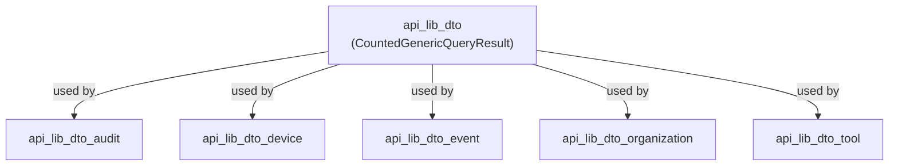
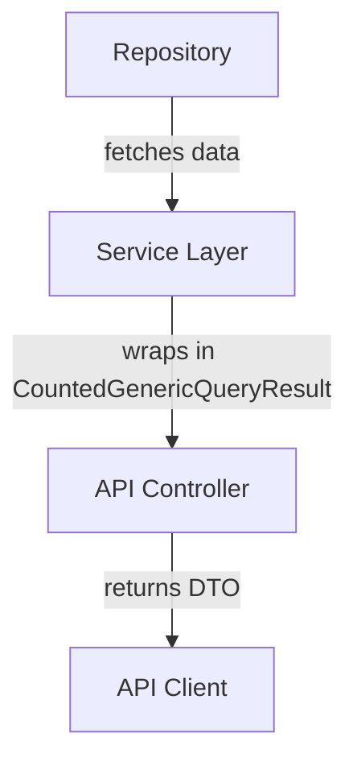

# api_lib_dto Module Documentation

## Introduction

The `api_lib_dto` module provides a core data transfer object (DTO) used for representing generic query results with associated counts. This module is designed to facilitate the transfer of paginated or counted query results between different layers of the application, especially in API responses. It is a foundational building block for modules that require standardized result structures, such as device, event, audit, tool, and organization DTO modules.

## Core Component

### CountedGenericQueryResult

The `CountedGenericQueryResult` is the primary DTO in this module. It encapsulates a collection of results along with a count, typically representing the total number of items matching a query, regardless of pagination. This structure is essential for implementing efficient pagination and for providing clients with metadata about the result set.

#### Typical Structure

```python
class CountedGenericQueryResult(Generic[T]):
    count: int
    results: List[T]
```

- `count`: The total number of items matching the query (not just the number in the current page).
- `results`: The list of items (of generic type `T`) returned by the query.

## Architecture and Relationships

The `api_lib_dto` module is designed to be generic and reusable. It is commonly used as a base or utility DTO by other API DTO modules, such as:

- [api_lib_dto_audit.md](api_lib_dto_audit.md)
- [api_lib_dto_device.md](api_lib_dto_device.md)
- [api_lib_dto_event.md](api_lib_dto_event.md)
- [api_lib_dto_organization.md](api_lib_dto_organization.md)
- [api_lib_dto_tool.md](api_lib_dto_tool.md)

These modules define domain-specific filter options and result DTOs, often wrapping their result lists in a `CountedGenericQueryResult` for consistency and ease of pagination.

### Module Dependency Diagram



## Data Flow Example

The following diagram illustrates a typical data flow where a service queries a repository, wraps the results in a `CountedGenericQueryResult`, and returns it via a controller:



## Usage in the System

The `CountedGenericQueryResult` is used throughout the API and service layers to standardize the structure of paginated or counted result sets. It is especially useful in:

- List endpoints (e.g., listing devices, events, logs, tools, organizations)
- Search and filter operations
- Any API response where the client needs to know both the current page of results and the total available count

For more information on how this DTO is used in specific domains, refer to the following documentation:

- [api_lib_dto_audit.md](api_lib_dto_audit.md)
- [api_lib_dto_device.md](api_lib_dto_device.md)
- [api_lib_dto_event.md](api_lib_dto_event.md)
- [api_lib_dto_organization.md](api_lib_dto_organization.md)
- [api_lib_dto_tool.md](api_lib_dto_tool.md)

## Related Modules

- [api_lib_dto_shared.md](api_lib_dto_shared.md): Provides shared DTOs such as pagination input structures.
- [core_dto.md](core_dto.md): Defines common DTOs like `PageResponse` for paginated responses.

## Summary

The `api_lib_dto` module is a foundational utility for representing counted query results in a consistent manner across the API. Its generic design allows it to be reused in multiple domains, promoting code reuse and standardization of API responses.