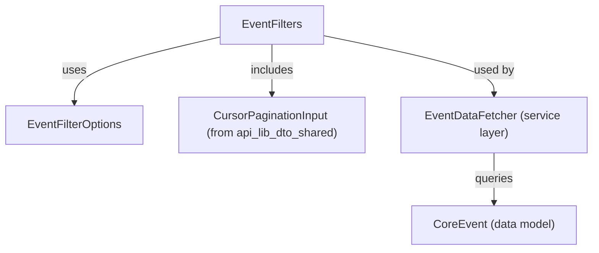
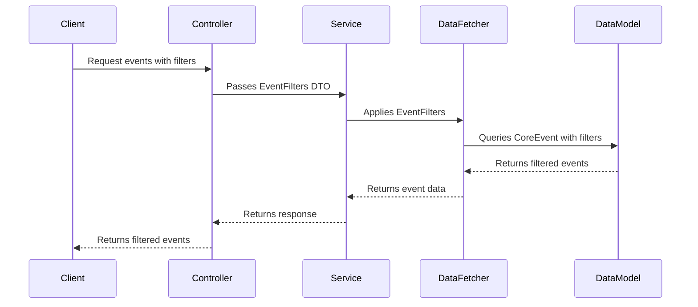

# api_lib_dto_event Module Documentation

## Introduction

The `api_lib_dto_event` module provides core data transfer objects (DTOs) for filtering and querying event data within the system. These DTOs are essential for defining how event-related data can be requested, filtered, and paginated in API operations. The module is designed to be used by service and controller layers that need to interact with event data, supporting flexible and efficient event queries.

## Core Components

- **EventFilterOptions**: Defines the available options for filtering events, such as by type, date range, or associated entities.
- **EventFilters**: Represents a set of filters to be applied when querying for events, encapsulating the criteria defined in `EventFilterOptions`.

> **Note:** The actual class definitions are not available, but their purpose and relationships can be inferred from the module structure and naming conventions.

## Architecture and Relationships

The `api_lib_dto_event` module is part of a broader DTO layer that standardizes data exchange between the API and service layers. It interacts closely with:

- [`api_lib_dto_shared`](api_lib_dto_shared.md): For pagination support via `CursorPaginationInput`.
- [`api_service_core_dto_event`](api_service_core_dto_event.md): For input DTOs used in event creation and filtering.
- [`data_mongo_document_event`](data_mongo_document_event.md): For the underlying event data models.

### Component Interaction Diagram

### Data Flow Overview

## Usage in the System

The DTOs in `api_lib_dto_event` are typically used in API endpoints that allow clients to retrieve lists of events with various filtering and pagination options. They are consumed by service and data fetcher layers to translate API-level filter requests into database queries.

- **Controllers**: Accept filter DTOs as part of API requests.
- **Services**: Use filter DTOs to construct queries and fetch data.
- **Data Fetchers**: Apply the filters to the underlying data models.

## Related Modules

- [api_lib_dto_shared.md](api_lib_dto_shared.md): For shared DTOs like pagination inputs.
- [api_service_core_dto_event.md](api_service_core_dto_event.md): For event-specific input DTOs.
- [data_mongo_document_event.md](data_mongo_document_event.md): For event data model definitions.

## Extensibility

The design of `EventFilterOptions` and `EventFilters` allows for easy extension to support new filtering criteria as the event model evolves. By centralizing filter logic in DTOs, the system ensures consistency and reusability across different API endpoints and services.

## Summary

The `api_lib_dto_event` module is a foundational part of the event querying infrastructure, providing standardized filter DTOs that enable flexible, efficient, and consistent event data retrieval throughout the system.
