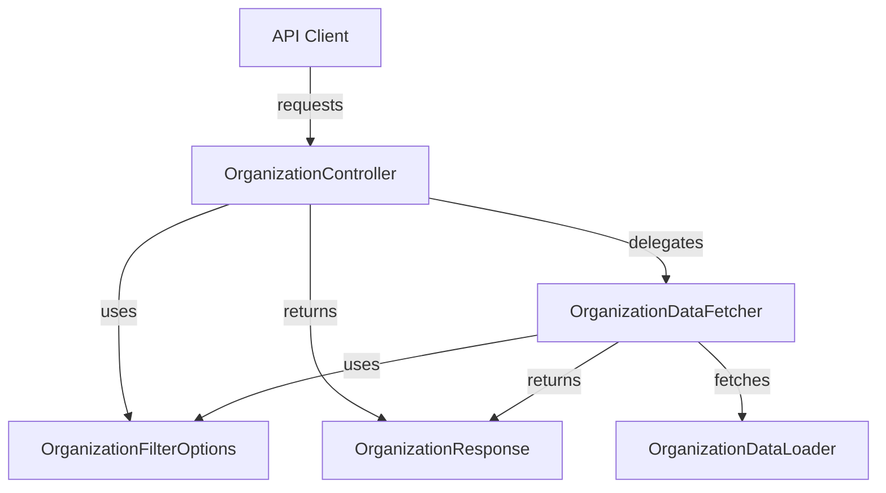
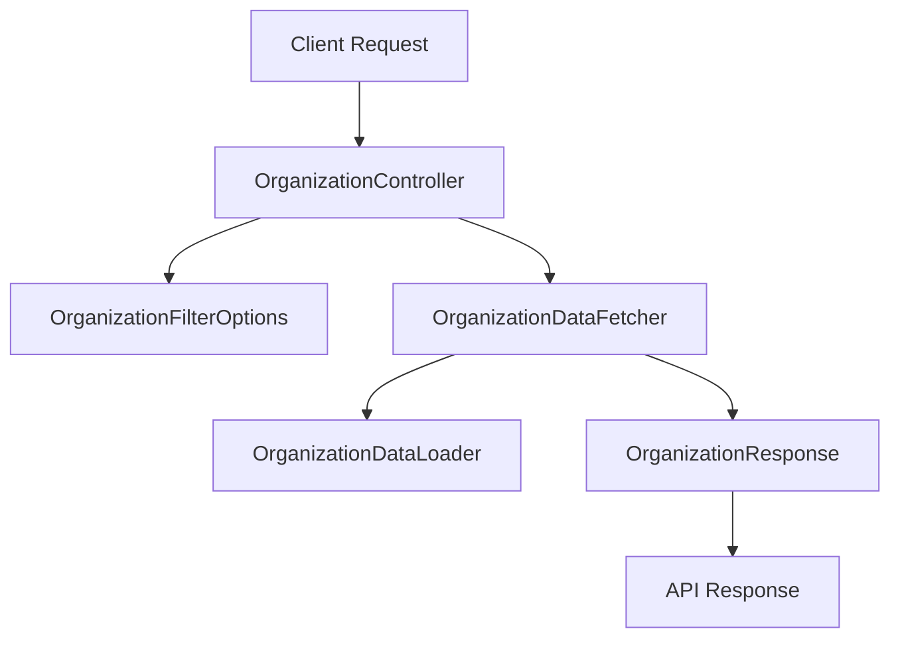

# api_lib_dto_organization Module Documentation

## Introduction

The `api_lib_dto_organization` module provides core Data Transfer Objects (DTOs) for representing and filtering organization data within the system's API layer. These DTOs are essential for structuring organization-related requests and responses, enabling consistent data exchange between the backend services and API consumers.

This module is a foundational part of the API's organization management capabilities, supporting filtering, pagination, and standardized organization response formats. It is designed to work in conjunction with other DTO modules (such as device, event, and tool DTOs) and is consumed by higher-level service and controller layers.

## Core Components

- **OrganizationFilterOptions**: Defines the available options for filtering organizations in API queries.
- **OrganizationResponse**: Represents the structure of organization data returned by the API.

## Module Architecture and Relationships

The `api_lib_dto_organization` module is part of a broader DTO layer that standardizes data exchange across the API. It interacts with:

- **api_service_core_controller**: Especially the `OrganizationController`, which uses these DTOs to handle organization-related API endpoints.
- **api_service_core_datafetcher**: The `OrganizationDataFetcher` utilizes these DTOs to fetch and return organization data.
- **api_service_core_dataloader**: The `OrganizationDataLoader` may use these DTOs for efficient data loading and batching.
- **api_lib_dto_shared**: For shared DTOs such as pagination inputs.
- **Other DTO modules**: For cross-entity filtering and response composition.

### High-Level Architecture

### Component Interaction

- **API Client** sends a request to the `OrganizationController`, optionally including filter options.
- **OrganizationController** parses the request, constructs an `OrganizationFilterOptions` object, and delegates data fetching to the `OrganizationDataFetcher`.
- **OrganizationDataFetcher** uses the filter options to query the data layer, possibly leveraging the `OrganizationDataLoader` for optimized access.
- The result is mapped to an `OrganizationResponse` and returned to the client.

## Data Flow Diagram

## Dependencies and Integration

- **api_service_core_controller** ([api_service_core_controller.md]): Uses these DTOs in the `OrganizationController` for API endpoint definitions.
- **api_service_core_datafetcher** ([api_service_core_datafetcher.md]): Fetches and processes organization data using these DTOs.
- **api_service_core_dataloader** ([api_service_core_dataloader.md]): May use these DTOs for efficient data loading.
- **api_lib_dto_shared** ([api_lib_dto_shared.md]): Provides shared DTOs such as pagination inputs that are used in filtering options.

For details on related DTOs and their usage, see:
- [api_lib_dto_audit.md]
- [api_lib_dto_device.md]
- [api_lib_dto_event.md]
- [api_lib_dto_tool.md]

## Component Reference

### OrganizationFilterOptions
Defines the available filtering options for querying organizations. Typically includes fields such as organization name, status, creation date, and supports pagination via shared DTOs (see [api_lib_dto_shared.md]).

### OrganizationResponse
Represents the structure of organization data returned by the API. This may include organization identifiers, names, contact information, status, and other metadata.

## How This Module Fits Into the System

The `api_lib_dto_organization` module is a key part of the DTO layer, ensuring that organization-related data is consistently structured and easily consumable by both backend services and API clients. It enables:

- Standardized filtering and querying of organizations
- Consistent response formats for organization data
- Integration with pagination and cross-entity filtering
- Seamless interaction with controllers, data fetchers, and loaders

For implementation details and usage examples, refer to the [api_service_core_controller.md] and [api_service_core_datafetcher.md] documentation files.

---

**See also:**
- [api_lib_dto_shared.md] for shared DTOs (e.g., pagination)
- [api_service_core_controller.md] for controller integration
- [api_service_core_datafetcher.md] for data fetching logic
- [api_service_core_dataloader.md] for data loading patterns
